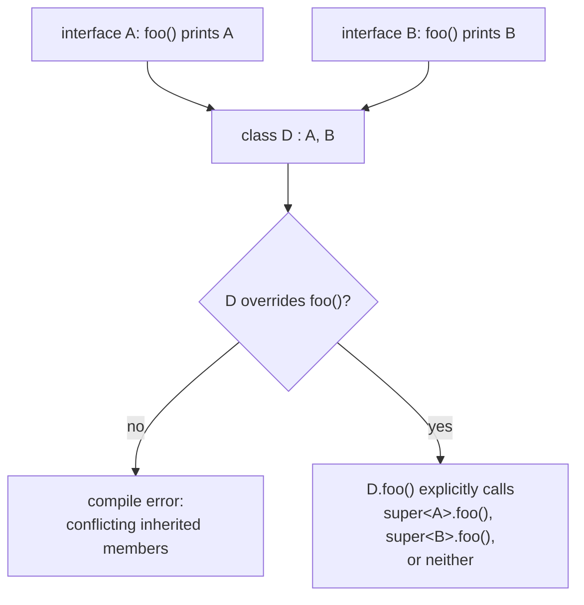

# Lesson 12. Interfaces with Default Methods

**Mission link:** This is stage 2's capstone. Every construct so far (classes, data classes, sealed classes, enums, objects) modelled a single type's shape or identity; this lesson is how shared behavior crosses unrelated types without inheritance, closing the stage's "models a domain without reaching for a class-per-thing hierarchy first."
**Primary source:** [Docs: "Interfaces", Kotlin](https://kotlinlang.org/docs/interfaces.html)
**Prerequisites:** [Lesson 11](0011-object-declarations-and-companion-objects.md), [Platform type](../GLOSSARY.md)

## Warm-up

1. ▢ What does an `object` declaration do in one step, and what guarantee does Kotlin provide about its initialization?

Check

It defines a class and creates its single instance simultaneously; Kotlin guarantees the initialization is thread-safe and happens lazily, on first access, without needing to implement that correctness by hand.

2. ▢ Why does being a real object matter for a companion object, compared to a Java static member?

Check

A companion object, being a real object rather than merely a namespace for members, can implement interfaces, have its own supertype, and be passed around as a value, none of which is possible with Java's static members.

## Know this

### An interface can implement behavior, but never hold state

A Kotlin interface can contain both abstract method declarations and methods with real bodies (`fun foo() { /* implementation */ }`, called by default on the JVM); this is what makes "interfaces with default methods" a real, useful modelling tool rather than a pure contract with no behavior. The one thing an interface categorically cannot do is store state: interface properties can be abstract (no value, just a required declaration) or provide an accessor implementation (`val propertyWithImplementation: String get() = "foo"`), but they can never have a backing field. This is the precise line between an interface and an abstract class: an abstract class can hold real state (a `val`/`var` with a backing field); an interface, no matter how much default behavior it implements, never can.

### Interfaces can extend other interfaces, adding both behavior and new requirements

An interface can derive from another interface, both inheriting (and optionally overriding) its default implementations and adding new abstract or implemented members of its own: `interface Person : Named { val firstName: String; val lastName: String; override val name: String get() = "$firstName $lastName" }` builds on `Named`'s abstract `name` requirement, providing a computed implementation from two new properties, so anything implementing `Person` gets `name` for free and only has to supply `firstName`/`lastName`.

### The diamond problem, and Kotlin's explicit resolution

When a class implements two interfaces that each provide their own default implementation of the same method, Kotlin doesn't pick one automatically or complain vaguely; it forces the implementing class to resolve the conflict explicitly. `class D : A, B { override fun foo() { super<A>.foo(); super<B>.foo() } }` uses `super<Type>.method()` to call a specific interface's implementation by name, and the class is required to provide its own `override` deciding what actually happens, whether that means calling one, both, or neither of the inherited implementations. This is a deliberate design choice: silently picking one parent's implementation over another (a common ambiguity in languages with multiple inheritance) is exactly the kind of "compiles but hides a real decision" trap this mission's Java-habit vocabulary keeps naming, so Kotlin makes the conflict a compile error demanding an explicit answer instead.

### Why this is the stage's actual capstone: modelling without reaching for class inheritance first

An interface with default methods lets unrelated types share behavior without needing a common base class, or a class-per-thing hierarchy where every shared capability forces a new supertype into the inheritance chain. Combined with lessons 7-11 (a plain class only when real behavior beyond storing data is needed; a data class for holding data; a sealed class for closed, differently-shaped variants; an enum for a closed set of same-shape constants; an object for a singleton), an interface is the tool for "these otherwise-unrelated types all need to do this one thing," resolved by composition (implementing an interface) rather than by inheritance (extending a shared, possibly ill-fitting base class).

## Practice

1. ▢ Why can't a Kotlin interface declare a property with a backing field, the way a class can?

Check

Interfaces can't store state at all; a property declared in an interface must either be abstract (just a required declaration, no value) or provide an accessor implementation computed from other values, since there's no backing field for an interface's own accessor to read from or write to.

2. ▢ `interface A { fun foo() { print("A") } }` and `interface B { fun foo() { print("B") } }`. A class `class D : A, B { }` with no override of `foo()`. What happens, and why?

Hint

Consider whether Kotlin picks one implementation automatically or requires something from the class.

Check

This fails to compile: since both `A` and `B` provide their own default implementation of `foo()`, Kotlin doesn't pick one automatically. `D` is required to override `foo()` itself and explicitly decide what happens, typically by calling `super<A>.foo()` and/or `super<B>.foo()` inside the override.

3. ▢ Why does Kotlin force an explicit resolution for the diamond conflict instead of silently choosing one parent interface's implementation?

Check

Silently picking one implementation over another would hide a real design decision (which behavior actually happens when two interfaces disagree) inside code that merely compiles, exactly the kind of "compiles but reads badly, or hides a decision" trap this mission's vocabulary keeps naming for other constructs. Forcing an explicit `override` with `super<Type>.method()` calls makes the decision visible and deliberate instead.

4. ▢ A codebase has three unrelated classes (`Logger`, `EmailSender`, `FileWriter`) that all need a `retry(times: Int, action: () -> Unit)` capability. Why does an interface with a default `retry` implementation fit better than making all three extend a shared abstract base class?

Check

The three classes aren't otherwise related by identity or shared state, just by needing one common capability; forcing them into a shared abstract base class ties them into an inheritance relationship (and a single-inheritance slot each of them can only use once) for the sake of one unrelated behavior. An interface with a default `retry()` implementation lets each class implement just that one capability via composition, without constraining or complicating whatever other class hierarchy each one might already need to participate in.

5. ▢ Which claim correctly describes Kotlin interfaces with default methods?

    - a) An interface can hold a `var` property with a real backing field, the same as a class
    - b) An interface can implement method bodies and provide computed property accessors, but can never hold backing-field state; a diamond conflict between two default implementations must be resolved explicitly via `super<Type>.method()`
    - c) When two interfaces provide conflicting default implementations, Kotlin automatically prefers the first one listed in the supertype list
    - d) Interfaces can't extend other interfaces; only classes can extend interfaces

Check

**b)** That's the precise capability and the precise conflict-resolution rule this lesson covers. (a) is false: no interface property can have a backing field, regardless of `val` or `var`. (c) is false: Kotlin requires an explicit override resolving the conflict rather than silently picking either interface's default. (d) is false: interfaces can derive from other interfaces, inheriting and extending their members, exactly as the `Person : Named` example shows.

## Real-world reps

- [ ] Find an interface with a default method implementation in a codebase you've written or have access to. Confirm it doesn't attempt to hold any state, and check whether any implementing class overrides the default for a reason worth understanding.
- [ ] Find (or construct) a case where a class implements two interfaces that could plausibly conflict on a shared method name. If no real conflict exists yet, sketch what a `super<Type>.method()` resolution would look like if one were introduced.
- [ ] Tomorrow: read the primary source's section on interface inheritance in full, and design (on paper) an interface hierarchy for one domain concept from your own work, deciding which interface should hold which abstract requirement versus which default implementation.

## Going further

- [Docs: "Interfaces", Kotlin](https://kotlinlang.org/docs/interfaces.html)
- [Docs: "Classes", Kotlin](https://kotlinlang.org/docs/classes.html)
- [Resources](../RESOURCES.md)

---

Not landing? Reread the primary source at the top, since this lesson compresses it and compression is where understanding leaks. Check the [glossary](../GLOSSARY.md) for any term that felt slippery.

If the lesson itself is unclear rather than the material, that is a defect: [open an issue](https://github.com/TokenCemetery/teach/issues).
