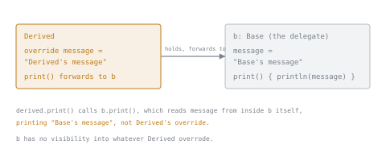

# Lesson 17. Delegation

**Mission link:** Lesson 12 named composition over inheritance as the fit for shared behavior across unrelated types; class delegation is Kotlin's native syntax for the specific composition pattern of "implement this interface by forwarding to an object I hold," with zero hand-written forwarding methods.
**Primary source:** [Docs: "Delegation", Kotlin](https://kotlinlang.org/docs/delegation.html)
**Prerequisites:** [Lesson 16](0016-inline-functions-and-reified-generics.md), [Platform type](../GLOSSARY.md)

## Warm-up

1. ▢ Why is a bare `return` inside a lambda normally a compile error, and what makes it legal inside an inline function's lambda?

Check

Normally the lambda is its own separate function object, so a bare `return` has no enclosing function to exit at that point. If the function the lambda is passed to is inlined, the lambda's code is pasted directly into the calling function's body, so the `return` genuinely exits that enclosing function, a legal non-local return.

2. ▢ Why is `reified` only legal on an inline function's type parameter?

Check

Ordinary generic type parameters are erased at runtime; inlining removes this erasure by pasting the function's body directly at each call site, where the concrete type is known at compile time, which is exactly what lets a `reified` type parameter be used almost like a normal class inside the function.

## Know this

### Class delegation implements an interface by forwarding, with the compiler writing the forwarding code

`class Derived(b: Base) : Base by b` implements the `Base` interface entirely by forwarding every one of its members to `b`, an object `Derived` holds internally. The `by`-clause tells the compiler to generate every forwarding method itself, zero boilerplate hand-written by you. This is the direct, language-native version of the classic Delegation design pattern (an alternative to inheritance where an object holds another and forwards calls to it), without needing to write out a forwarding method for every single interface member by hand.

### Overriding a delegated member works exactly as expected, from the outside

`class Derived(b: Base) : Base by b { override fun printMessage() { print("abc") } }` overrides just `printMessage()`; calling it on a `Derived` instance runs the override, not the delegate's version, while any other `Base` member not overridden still forwards to `b` as usual. This composes cleanly: delegation handles the default case, and specific overrides handle the exceptions, without needing to override every member just to change one.

### The subtlety worth knowing precisely: the delegate can't see the derived class's overrides

If `Base`'s own `print()` method internally calls `message` (another member of the same interface), and `Derived` overrides `message`, calling `derived.print()` still uses the delegate's *own* `message`, not `Derived`'s override, because the delegate object (`b`) only ever sees its own implementation of the interface's members when calling between them internally; it has no visibility into whatever `Derived` overrode. This is worth internalizing precisely rather than assuming delegation behaves like inheritance (where an overridden method actually gets picked up by other methods calling it polymorphically, virtually, from within the base type); delegation is forwarding to a separate object, not extending one.

### Delegated properties reuse property behavior the same way class delegation reuses interface implementation

`val/var <name>: <Type> by <expression>` delegates a property's `get()` (and `set()`, for `var`) to the expression's own `getValue()`/`setValue()` operator functions, rather than writing custom accessor logic (lesson 7) by hand on every property that needs the same pattern. `by lazy { ... }`, the most common built-in delegate, computes and caches a value on first access, then returns the cached value on every subsequent access, without needing to write that caching logic yourself. A custom delegate (implementing `getValue()`/`setValue()` directly) is how a pattern like "log every read and write to this property" or "store this property's value in a shared map instead of its own field" gets written once and reused across every property that needs it, rather than duplicated by hand.

## Practice

1. ▢ What does `class Derived(b: Base) : Base by b` actually generate, and what would the equivalent hand-written code look like without `by`?

Check

It generates a forwarding method for every member of `Base`, each one calling the corresponding method on `b`. Without `by`, `Derived` would need to manually write out every one of those forwarding methods itself, one per interface member, each simply calling through to `b`.

2. ▢ `interface Base { val message: String; fun print() }`, where `BaseImpl.print()` internally reads `message`. `class Derived(b: Base) : Base by b { override val message = "Derived's message" }`. What does `derived.print()` actually print, and why might that be surprising?

Hint

Consider whose implementation of `message` the delegate object's own `print()` method actually has access to when it runs.

Check

It prints the delegate object's (`b`'s) own `message`, not `Derived`'s overridden one, since `b.print()` only ever sees `b`'s own implementation of `message` when it runs internally; it has no way to see that `Derived` overrode `message` elsewhere. This can be surprising if delegation is assumed to behave like inheritance, where an overridden member is genuinely picked up by other methods calling it virtually from within the base type.

3. ▢ What does `val name: String by lazy { computeExpensiveName() }` actually do, and when does `computeExpensiveName()` run?

Check

It delegates `name`'s `get()` to the `lazy` delegate's `getValue()`, which computes the value (running `computeExpensiveName()`) only the first time `name` is actually read, then caches that result and returns it directly on every subsequent read without recomputing.

4. ▢ What must a custom property delegate provide to support a `var` property, and what's required for a `val` property?

Check

A `val` property's delegate only needs a `getValue()` operator function (matching the property owner's type and returning the property's type). A `var` property's delegate additionally needs a `setValue()` operator function, accepting the new value alongside the same `thisRef` and `property` parameters, since a mutable property needs both a read and a write path delegated.

5. ▢ Which claim correctly describes delegation in Kotlin?

    - a) Class delegation via `by` behaves identically to inheritance: a method on the delegate calling another interface member always sees the derived class's overrides
    - b) Class delegation forwards every interface member to a held object with compiler-generated code, but the delegate's own internal calls only see its own implementations, not the derived class's overrides; property delegation reuses accessor logic the same way, via `getValue()`/`setValue()`
    - c) `by lazy { ... }` recomputes its value on every read, never caching the result
    - d) A read-only (`val`) property delegate must implement both `getValue()` and `setValue()`

Check

**b)** That's the precise mechanism and the precise subtlety this lesson covers. (a) is false, exactly the misconception this lesson warns against: delegation is forwarding to a separate object, so the delegate's internal calls can't see the derived class's overrides the way genuine inheritance would. (c) is false: `lazy` computes once, on first access, then returns the cached result on every later read. (d) is false: a `val` delegate only needs `getValue()`; `setValue()` is only required for a mutable `var` property.

## Real-world reps

- [ ] Find a use of class delegation (`by`) in a codebase you've written or have access to, or construct a small example implementing an interface by delegating to a held object. Check whether the delegate's own internal method calls could ever be affected by an override in the delegating class, and confirm your understanding of why or why not.
- [ ] Find a `by lazy { ... }` property. Confirm you can explain exactly when its initializer block runs, and check whether it's actually being read more than once elsewhere in the code (making the caching worthwhile).
- [ ] Tomorrow: read the primary source's section on property delegate requirements in full, and sketch (on paper) a small custom delegate that logs every read and write to a property.

## Going further

- [Docs: "Delegation", Kotlin](https://kotlinlang.org/docs/delegation.html)
- [Docs: "Delegated properties", Kotlin](https://kotlinlang.org/docs/delegated-properties.html)
- [Resources](../RESOURCES.md)

---

Not landing? Reread the primary source at the top, since this lesson compresses it and compression is where understanding leaks. Check the [glossary](../GLOSSARY.md) for any term that felt slippery.

If the lesson itself is unclear rather than the material, that is a defect: [open an issue](https://github.com/TokenCemetery/teach/issues).
