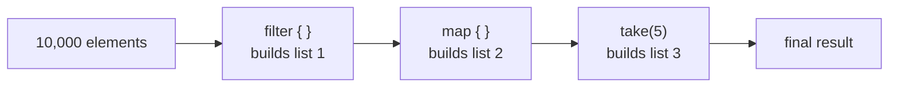

# Lesson 19. Collection Operators

**Mission link:** Stage 4 asks you to choose between a collection pipeline and a sequence and defend the cost of each; this lesson is the pipeline half, including the Java habit that gets its cost wrong.
**Primary source:** [Docs: "Collection operations overview", Kotlin](https://kotlinlang.org/docs/collection-operations.html)
**Prerequisites:** [Lesson 18](0018-operator-overloading.md), [Lesson 13](0013-extension-functions.md), [Lesson 5](0005-collections-basics.md)

## Warm-up

1. ▢ A type has a member function `fun describe(): String`, and someone also declares an extension `fun MyType.describe(): String`. A call to `x.describe()` compiles. Which body runs?

Check

The member. An extension is resolved statically against the declared type and never actually adds anything to the class, so when a member and an extension share a name, a receiver type, and applicable arguments, the member always wins. That is also why an extension can never be an override.

2. ▢ `val names = mutableListOf("ada")`, then `names.add("grace")`. Does that compile, and what did `val` actually promise?

Check

It compiles. `val` freezes the reference, not the object behind it: `names` will always point at that same list, and the list's contents are free to change. Read-only is a property of the interface you hold, `List` rather than `MutableList`, not of `val`.

3. ▢ Why does a generic function that needs its type argument at runtime, such as one testing `x is T`, have to be `inline` with a `reified` type parameter?

Check

Type arguments are erased, so an ordinary generic function has no `T` at runtime to test against. `inline` copies the body into each call site, where the concrete type is known, and `reified` is what tells the compiler to substitute it there. Without the inlining there is nowhere for the real type to come from.

## Know this

The standard library gives you the collection operators as extension functions, not as members of `List`, `Set`, or `Map`. The docs are explicit about the split: member functions define what is essential to a collection type, such as `isEmpty()` on `Collection` or `get()` on `List`, and everything else arrives as an extension ([Collection operations overview](https://kotlinlang.org/docs/collection-operations.html)). So `map` is not something `List` implements, it is a function over `Iterable`, and everything lesson 13 taught applies unchanged. One consequence you get for free: a Java collection arriving through interop is an `Iterable`, so it has the whole operator set too.

Every one of these operators returns its result and leaves the receiver alone. The docs' own example is the trap worth memorising: `numbers.filter { it.length > 3 }` on a line by itself compiles, runs the predicate over every element, builds a list, and throws it away, while `numbers` is untouched. If your instinct comes from Java's Stream API, that instinct misleads you twice here. There, a pipeline with no terminal operation does no work at all, so a dropped result costs nothing; and there, `.stream()` and `.collect(...)` bracket the chain, so forgetting to keep the result is hard to do by accident.

The result type is not the receiver's type. `filter` on a `List` and on a `Set` both hand back a `List`; only on a `Map` does it hand back a `Map` ([Filtering collections](https://kotlinlang.org/docs/collection-filtering.html)). `map` always hands back a `List`, so `setOf(1, 2, 3).map { it % 2 }` is `[1, 0, 1]`, duplicate included. When you want a different container, use the `...To(destination)` variant and supply it yourself: `numbers.mapTo(HashSet()) { it.length }` collects straight into a set and drops the duplicates on the way. Filtering, association, grouping and flattening all have such a twin, `filterTo` and `associateTo` among them.

The set worth holding in memory:

|Group|Operators|What to remember|
|---|---|---|
|Transform|`map`, `mapIndexed`, `mapNotNull`|`mapNotNull` transforms and drops the elements whose result was `null`, in one step|
|Flatten|`flatten`, `flatMap`|`flatMap` is `map` followed by `flatten`, for a transform that itself returns a collection|
|Narrow|`filter`, `filterNot`, `filterIndexed`, `filterIsInstance`|`filterIsInstance` is inline with a reified parameter, which is why its type test survives erasure|
|Split|`partition`|One traversal, returning a `Pair` of lists: the matches first, everything else second|
|Test|`any`, `none`, `all`|Called with no predicate at all, `any()` and `none()` just test emptiness|

`all` has an edge case worth predicting rather than discovering in production: on an empty collection it returns `true` for any valid predicate, which logic calls vacuous truth ([Filtering collections](https://kotlinlang.org/docs/collection-filtering.html)). A guard written as `if (items.all { it.isValid })` therefore waves an empty batch straight through. `any` is the mirror image and returns `false` there.

Because each operator builds a complete new collection before the next one sees it ([Collection transformation operations](https://kotlinlang.org/docs/collection-transformations.html)), a chain of three operators over ten thousand elements builds three lists, two of which exist only to be discarded. Java's lazy streams do not have that cost, which is why a Java-shaped habit of chaining freely carries over a cost model that does not hold. Lesson 20 is where you buy the fused single pass back with `asSequence()`, and deciding when it is worth buying is what closes this stage.

## Practice

1. ▢ Given `val numbers = listOf("one", "two", "three", "four")`, the next line is `numbers.filter { it.length > 3 }` and nothing holds the result. What runs, and what does `numbers` contain afterwards?

Check

The predicate runs against all four elements, a new list holding `["three", "four"]` is built, and it is immediately unreachable because nothing holds it. `numbers` is unchanged: no operator on this page mutates its receiver. The Java Stream instinct, that a pipeline without a terminal operation is a no-op, is wrong here. The work happened; only the result was lost.

2. ▢ What is the static type, and the value, of `setOf(1, 2, 3).map { it % 2 }`?

Hint

Ask what `map` is declared to return, not what it was called on.

Check

`List<Int>`, with the value `[1, 0, 1]`. `map` returns a `List` whatever `Iterable` it was called on, so the duplicate `1` stays. Expecting a `Set` back, and therefore `[1, 0]`, is the wrong instinct, and reaching for `filter` instead would not have preserved one either: on a `List` or a `Set` it also returns a `List`. `Map` is the only receiver a filtering operation preserves.

3. ▢ Predict both results: `emptyList<Int>().all { it > 5 }`, and `emptyList<Int>().any { it > 5 }`.

Check

`true`, then `false`. `all` is vacuously true on an empty collection: there is no element that fails the predicate, so nothing makes it false. `any` needs one element as a witness and has none. The practical consequence is that a validation guard written with `all` accepts an empty batch, so test for emptiness separately wherever an empty input is not automatically valid.

4. ▢ Some code needs both the elements matching a predicate and the ones failing it, and currently reads `val valid = xs.filter(::isValid)` followed by `val invalid = xs.filterNot(::isValid)`. Name the one operator that replaces both, say exactly what it returns, and say what the two-call version costs.

Hint

One filtering function in the standard library exists precisely to keep what the predicate rejected, instead of discarding it.

Check

`partition`: `val (valid, invalid) = xs.partition(::isValid)`. It returns a `Pair<List<T>, List<T>>`, matches first and the rest second, which destructures as above. The two-call version traverses `xs` twice and evaluates the predicate twice per element, builds the same two lists for that doubled work, and leaves two call sites that a later edit can quietly let drift apart.

5. ▢ Which claim correctly describes Kotlin's collection operators?

    - a) They are member functions, so a chain of them shares one backing array
    - b) They are extension functions, so each step of a chain allocates a list
    - c) They are lazy operations, so a chain of them fuses into one traversal
    - d) They are mutating operations, so a chain of them rewrites the receiver

Check

**b)** is right, and it is the whole cost model of this stage in one line. (a) is false twice: they are extensions rather than members, and no backing array is shared, since each step produces its own new collection. (c) describes Java's streams, and a Kotlin `Sequence`, which is exactly what lesson 20 introduces; the operators on this page are eager. (d) is false: every operator here leaves its receiver alone, which is why an unassigned result is simply lost.

## Real-world reps

- [ ] Find a chain of three or more collection operators in Kotlin you have written or have access to. Count the collections it builds for an input of N elements, and say which of them exist only to feed the next step.
- [ ] Find a place in your own work where a check runs over a collection that can legitimately be empty. Decide, before running anything, whether an empty input should pass, and whether the code as written agrees with you.
- [ ] Tomorrow: read the primary source's list of common operation groups, and pick the one group you have never used. Name a problem in your current work that it would have solved more directly than what you wrote.

## Going further

- [Docs: "Collection operations overview", Kotlin](https://kotlinlang.org/docs/collection-operations.html)
- [Docs: "Collection transformation operations", Kotlin](https://kotlinlang.org/docs/collection-transformations.html)
- [Docs: "Filtering collections", Kotlin](https://kotlinlang.org/docs/collection-filtering.html)
- [Resources](../RESOURCES.md)

---

Not landing? Reread the primary source at the top, since this lesson compresses it and compression is where understanding leaks. Check the [glossary](../GLOSSARY.md) for any term that felt slippery.

If the lesson itself is unclear rather than the material, that is a defect: [open an issue](https://github.com/TokenCemetery/teach/issues).
