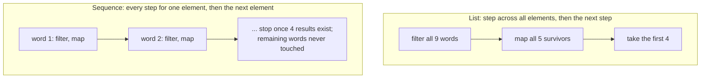

# Lesson 20. Sequences and Laziness

**Mission link:** This is the half of stage 4 that lets you defend a cost: same operators, a different execution model, and a judgement call about which one a given chain deserves.
**Primary source:** [Docs: "Sequences", Kotlin](https://kotlinlang.org/docs/sequences.html)
**Prerequisites:** [Lesson 19](0019-collection-operators.md), [Lesson 15](0015-higher-order-functions-and-lambdas.md), [Lesson 9](0009-sealed-classes-and-exhaustive-when.md)

## Warm-up

1. ▢ `numbers.filter { it.length > 3 }` sits on a line by itself and nothing holds the result. What ran, and what does `numbers` contain afterwards?

Check

The predicate ran over every element, a new list was built, and it was discarded because nothing held it. `numbers` is unchanged. The work happened; only the result was lost. Remember this one, because this lesson is about to change the answer.

2. ▢ What does `emptyList<Int>().all { it > 5 }` return, and why?

Check

`true`. There is no element that fails the predicate, so nothing can make it false, which logic calls vacuous truth. The practical version: a validation guard written with `all` waves an empty batch straight through.

3. ▢ What does sealing a hierarchy give a `when` expression over it, that an open hierarchy cannot?

Check

Compiler-checked exhaustiveness. Every direct subclass of a sealed type is known at compile time, so the compiler can tell whether the branches cover all of them and reject the `when` if they do not, with no `else` branch standing in as a catch-all. On an open hierarchy the compiler cannot know the subclasses, so covering them is a promise you make by hand.

## Know this

`Sequence<T>` is the standard library's other processing type, and the difference from a collection is the whole lesson: a sequence does not contain elements, it produces them while iterating. It offers the same functions `Iterable` does, over a different execution model ([Sequences](https://kotlinlang.org/docs/sequences.html)).

Two things change, and they are worth stating separately because people collapse them into "sequences are faster".

**When the work happens.** A multistep chain over an `Iterable` is eager: each step completes and returns an intermediate collection, and the next step runs on that. A chain over a `Sequence` is lazy where it can be: the computation happens only when the result of the whole chain is requested. That request is a **terminal operation**. An operation that returns another lazily-produced sequence is **intermediate**; anything else, `toList()` and `sum()` among them, is terminal, and elements can only be retrieved through one. So the lesson 19 trap inverts here: a list chain whose result nobody keeps does all the work and throws it away, while a sequence chain with no terminal operation does nothing whatsoever.

**The order the work happens in.** `Iterable` finishes each step for the whole collection before it starts the next one. `Sequence` runs every step for one element, then moves to the next element. That ordering is what lets a bound like `take(4)` stop the whole chain early: once four results exist, the elements after them are never touched at all. The docs' own example filters and maps nine words; the list version filters all nine, then maps the five survivors, while the sequence version stops mid-list and never looks at the last three words.

So a sequence avoids building the intermediate results, which is the performance case for it. The docs are equally clear about the other side: laziness adds overhead of its own, and that overhead can be significant on smaller collections or simpler computations, so you are expected to consider both and decide. Two more things push the decision back toward a plain list: a single-step chain has no intermediate collection to avoid, so there is nothing to win; and an operation that must see every element before it can emit one, sorting being the obvious case, has to accumulate the lot anyway. The docs classify operations by exactly this: **stateless** ones process each element independently (`map`, `filter`, and, with a small constant amount of state, `take` and `drop`), while **stateful** ones need state usually proportional to the element count.

Four ways to get a sequence:

|Construct|Use it for|
|---|---|
|`numbers.asSequence()`|A collection you already hold, when the chain over it is worth streaming|
|`sequenceOf("a", "b")`|A sequence written out literally, the counterpart of `listOf`|
|`generateSequence(1) { it + 2 }`|Elements computed from the previous one; the sequence ends when the lambda returns `null`, and is otherwise infinite|
|`sequence { yield(1); yieldAll(rest) }`|Producing elements one by one or in chunks, suspending between them until the consumer asks for more|

The Java comparison runs the opposite way from lesson 19. A `Sequence` is the near-analogue of a Java `Stream`: lazy, built from intermediate operations, and inert until a terminal one. So the Stream instinct is right here and wrong there, and the useful habit is to notice which of the two types you are holding before predicting anything. One difference to keep: a sequence can generally be iterated more than once, though a given implementation may document itself as single-use.

## Practice

1. ▢ A nine-word list is filtered to the words longer than three characters, mapped to their lengths, then cut to the first four, with a print inside each lambda. Predict how the two versions differ in what gets printed: the plain list chain, and the same chain after `asSequence()`.

Hint

One version finishes a step across the whole input before starting the next step. The other finishes the whole chain for one element before starting the next element.

Check

Same result, different work. The list version prints every `filter` line first, all nine, then a `length` line for each of the five survivors, because each step completes across the whole collection before the next begins. The sequence version prints them interleaved, a `filter` line and then, for a word that passed, its `length` line, and it stops as soon as four results exist, so the last three words are never filtered at all. `take(4)` can only cut work short in the version that processes element by element.

2. ▢ `val lengths = words.asSequence().filter { it.length > 3 }.map { it.length }` runs, and nothing else. What work has been done?

Check

None. `filter` and `map` are both intermediate: each returns another lazily-produced sequence, and sequence elements can be retrieved only through a terminal operation. Without a `toList()`, a `sum()`, or an iteration, no predicate and no transform has run. This is the exact opposite of the warm-up's list version, where the same two calls did all the work and discarded the result, and it is why the type you are holding has to be part of your prediction.

3. ▢ `generateSequence(1) { it + 2 }` gives you the odd numbers. Why does `.take(5).toList()` on it work while `.count()` cannot?

Check

The lambda never returns `null`, so the sequence never ends. `take(5)` is intermediate and bounds the chain, so the terminal `toList()` only ever asks for five elements. `count()` is terminal with no bound: it has to consume every element to produce a number, so on an infinite sequence it can never return, and the docs flag that call as an error. A finite `generateSequence` is a lambda that returns `null` after the last element you want.

4. ▢ Name two situations where converting a chain to a sequence is not worth it, and say what makes each one a bad trade.

Check

Any two of these. A small collection, or a chain whose per-element work is trivial: laziness has its own overhead, and there is not enough intermediate work for the saving to cover it. A single-step chain: there is no intermediate collection being built, so nothing to avoid. A chain containing a stateful step like sorting: that step has to accumulate every element before it can emit one, so the streaming benefit is gone at that point regardless. And the plain readability case, that a list chain's execution order is the order it is written in, which is one less thing for a reader to reconstruct.

5. ▢ Which claim correctly describes how a sequence chain executes?

    - a) A sequence chain runs each step over every element before the next step
    - b) A sequence chain runs every step for one element before the next element
    - c) A sequence chain runs its steps as soon as each intermediate operation appears
    - d) A sequence chain runs its steps eagerly but avoids building any intermediate lists

Check

**b)** is right, and it is what makes an early bound like `take(4)` able to cut the work short. (a) is the `Iterable` model, which is lesson 19's material and the thing a sequence changes. (c) has it backwards: an intermediate operation adds a step and runs nothing, and only a terminal operation starts the work. (d) keeps the benefit but drops the mechanism, and the mechanism is the point: the intermediate lists are avoided precisely because nothing is computed until a result is requested.

## Real-world reps

- [ ] Take the operator chain you counted collections for in lesson 19. Decide, and write down in one sentence, whether it deserves `asSequence()`, naming the input size and the per-element work your answer rests on.
- [ ] Find a chain in your own work whose last step bounds the result, a `first`, a `take`, or a `find`. Work out how much of the input the eager version touches that a lazy one would not.
- [ ] Tomorrow: run the primary source's own two examples, the `Iterable` one and the `Sequence` one, and read the printed order rather than the result. Predict both orders before you run them, and note anything the prediction got wrong.

## Going further

- [Docs: "Sequences", Kotlin](https://kotlinlang.org/docs/sequences.html)
- [Docs: "Collection operations overview", Kotlin](https://kotlinlang.org/docs/collection-operations.html)
- [Resources](../RESOURCES.md)

---

Not landing? Reread the primary source at the top, since this lesson compresses it and compression is where understanding leaks. Check the [glossary](../GLOSSARY.md) for any term that felt slippery.

If the lesson itself is unclear rather than the material, that is a defect: [open an issue](https://github.com/TokenCemetery/teach/issues).
