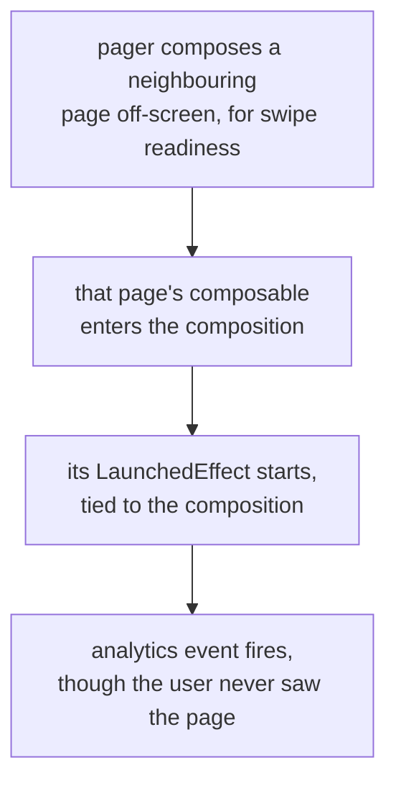

# Lesson 32. Android Divergences

**Mission link:** The mission covers a backend service or an Android component. Android does not change the language, so this lesson is the platform's answers to questions earlier stages already asked, plus the two places where the answers differ from a server's.
**Primary source:** [Docs: "Kotlin coroutines on Android", Android Developers](https://developer.android.com/kotlin/coroutines)
**Prerequisites:** [Lesson 31](0031-structuring-a-service.md), [Lesson 26](0026-flows.md), [Lesson 24](0024-structured-concurrency.md)

## Warm-up

1. ▢ In a pure Kotlin project whose root package is `com.acme.app`, where does a file in `com.acme.app.sync.retry` belong?

Check

At `sync/retry/` under the source root. The recommended structure follows the package structure with the common root package omitted, so no `com/acme/app` directories appear. The full Java-style path is the rule for a project that also contains Java.

2. ▢ What is the difference between a cold flow and a hot one, in terms of what each collector gets?

Check

A cold flow runs its builder again for each collector, so every collector gets its own independent execution. A hot flow emits whether or not anyone is collecting, and all its subscribers share the same emissions from the one active stream. `StateFlow` is the hot one that always holds the latest value.

3. ▢ You hold a `CoroutineScope` as a field on a component. What is the one obligation that comes with it?

Check

Cancelling it at the end of that component's lifetime, with `scope.cancel()`, which cancels everything still running on its behalf. A scope you own is a scope you must cancel, and forgetting the call is a leak that reports nothing.

## Know this

**The platform does not change the language. It owns scopes for you, and it adds one hard threading rule.** Almost every Android coroutine idiom in this lesson is an earlier lesson's question with the platform's answer already filled in, which is the useful way to learn them.

|What the arc taught|Android's answer|
|---|---|
|A scope you own is a scope you must cancel (lesson 24)|`viewModelScope`: one per `ViewModel`, and any coroutine launched in it is **automatically cancelled when the `ViewModel` is cleared** ([Lifecycle-aware coroutine scopes](https://developer.android.com/topic/libraries/architecture/coroutines))|
|The same, at a finer grain|`LaunchedEffect` in Compose: a scope tied to the composable's place in the composition. The coroutine starts when the composable enters, is cancelled when it leaves, and is relaunched if a key changes|
|Which dispatcher runs this (lesson 25)|`Dispatchers.Main` is real here, and it is where UI work has to happen. The platform's word for not blocking it is **main-safety**|
|Who collects a flow, and when (lesson 26)|`StateFlow` for UI state, collected with `collectAsStateWithLifecycle`, which turns a `Flow` into a Compose `State` and manages the subscription: by default it starts collecting at `STARTED` and stops at `STOPPED`, with `minActiveState` to change that|
|A dispatcher should be a parameter (lesson 28)|Android's own guide says the same thing for the same reason: inject `Dispatchers` into the repository layer for easier testing|
|A test needs to own the scope (lesson 28)|Pass a custom `CoroutineScope` into the `ViewModel`'s constructor in place of `viewModelScope`, so a test can inject a `TestScope`, or so the scope can carry a specific dispatcher or exception handler|

**Main-safety is a contract the callee keeps, and that is the real divergence from server habits.** A function is main-safe when it does not block UI updates on the main thread ([Kotlin coroutines on Android](https://developer.android.com/kotlin/coroutines)). The guide's shape is deliberate: the repository's own `suspend fun` wraps its blocking work in `withContext(Dispatchers.IO)`, so the function is main-safe by construction and **no caller has to remember to move off the main thread**. The alternative, leaving each caller to wrap the call, is named in the guide as the problem with the earlier version of its example.

On a server nobody cares which thread a handler runs on, so the wrapping tends to live wherever it is convenient. Here it belongs at the bottom, in the function that does the blocking, because the cost of forgetting is a frozen interface rather than a slower one.

**Composition lifetime is not lifecycle lifetime.** `LaunchedEffect` is tied to the composition, not to the host `Activity`'s `Lifecycle`, and the consequence is easy to miss: it can run while the composable is not visible to the user. The documentation's own example is a pager composing neighbouring pages off-screen to prepare for a swipe. So a side effect that depends on the user actually seeing the screen, an analytics event being the obvious one, does not belong in a `LaunchedEffect`; a lifecycle-aware API such as `LifecycleEventEffect` is what that needs.

That is the shape of the two Android traps together. Both are about a lifetime: one about which lifetime a scope follows, and one about whether "on screen" and "in the composition" mean the same thing. Neither is a language question, which is why nothing in stages 1 to 6 could have warned you.

**One naming note.** Android KTX is the collection of extensions that make the platform APIs read idiomatically, by leveraging Kotlin's own language features, and the `ViewModel` coroutine extensions used above come from `lifecycle-viewmodel-ktx`. When Android documentation says an API is "KTX", it means an extension layer over an existing Java API rather than a new API, which is lesson 13 applied at platform scale.

## Practice

1. ▢ A `ViewModel` launches a five-second network call in `viewModelScope`, and the user navigates away after one second. Predict what happens, and what would have happened with `GlobalScope.launch`.

Check

The `ViewModel` is cleared, `viewModelScope` is cancelled, and the call is cancelled with it at its next suspension point, so nothing keeps running and nothing tries to update a screen that is gone. With `GlobalScope.launch` the request would continue to completion, spend the network and CPU on a result nobody wants, and then attempt whatever it was going to do with it. That is lesson 24's argument, except that here you did not have to build or cancel the scope yourself: the platform owns it and ties it to the `ViewModel`'s lifetime.

2. ▢ Two designs for a repository's network call: the caller writes `withContext(Dispatchers.IO) { repo.makeRequest() }`, or `repo.makeRequest()` is itself a `suspend fun` that wraps its own blocking work in `withContext(Dispatchers.IO)`. Which does the Android guide recommend, and what is the argument?

Check

The second. A function is main-safe when it does not block UI updates on the main thread, and putting the `withContext` inside the repository function makes it main-safe by construction. The guide names the problem with the first design explicitly: everything calling that function has to remember to move execution off the main thread, and the failure mode for forgetting is a frozen UI. Pushing the responsibility down to the function that actually blocks means there is one place to get it right instead of one per call site.

3. ▢ An analytics event is sent from a `LaunchedEffect` in a composable that is one page of a pager. The metrics show views for pages the user never looked at. Why?

Hint

Ask what event actually started that coroutine, and whether the user was involved in it.

Check

Because `LaunchedEffect` is tied to the composition, not to the host `Activity`'s `Lifecycle`, so it starts when the composable enters the composition, and a pager composes neighbouring pages off-screen to be ready for a swipe. Those pages entered the composition without ever being seen, and the effect ran. The fix is not a flag but a different API: a side effect that depends on the user actually viewing something belongs on a lifecycle-aware API such as `LifecycleEventEffect`. Worth generalising: "the composable exists" and "the user is looking at it" are two different facts, and only one of them is what an analytics event means.

4. ▢ A composable collects a `ViewModel`'s `StateFlow`. What does `collectAsStateWithLifecycle` do that a plain collection does not, and what are its defaults?

Check

It converts the `Flow` into a Compose `State` object and manages the lifecycle subscription for you, so collection begins when the lifecycle is `STARTED` and stops when it is `STOPPED`. Without that, collection continues while the UI is not on screen, which keeps upstream work alive and produces updates nobody is going to see. `minActiveState` overrides the default when `STARTED` is the wrong threshold, `RESUMED` being the usual alternative. Multiple flows collected this way run in parallel without any extra scope management, because each call manages its own.

5. ▢ Which claim about `viewModelScope` is correct?

    - a) viewModelScope must be cancelled by hand in onCleared, exactly like any owned scope
    - b) viewModelScope cancels its coroutines automatically when the ViewModel it belongs to is cleared
    - c) viewModelScope survives the ViewModel, so long work can finish after the screen closes
    - d) viewModelScope is tied to the Composition, so it ends when the composable exits

Check

**b)** One scope exists per `ViewModel`, and anything launched in it is cancelled automatically when that `ViewModel` is cleared. (a) describes the hand-rolled scope from lesson 24, which is exactly the work the platform is doing for you here. (c) is what `GlobalScope` would give you, and it is the leak this scope exists to prevent. (d) describes `LaunchedEffect`, and confusing the two is the subtler mistake: one follows the `ViewModel`'s lifetime, the other the composition's, and those diverge whenever a composable leaves the screen while its `ViewModel` lives on.

## Real-world reps

- [ ] In any Android codebase you can reach, including a sample app, find every coroutine launch and name which scope it uses. Note any that use a scope constructed by hand and ask why the platform's own was not enough.
- [ ] Find a repository or data-source function that performs blocking work. Decide whether it is main-safe by construction, or whether it relies on its callers remembering.
- [ ] Tomorrow: find a side effect in a composable and decide which lifetime it should follow, the composition's or the lifecycle's. Write the one sentence that justifies your answer, in terms of what the effect means to a user.

## Going further

- [Docs: "Kotlin coroutines on Android", Android Developers](https://developer.android.com/kotlin/coroutines)
- [Docs: "Use Kotlin coroutines with lifecycle-aware components", Android Developers](https://developer.android.com/topic/libraries/architecture/coroutines)
- [Site: "Kotlin on Android", Android Developers](https://developer.android.com/kotlin)
- [Resources](../RESOURCES.md)

---

Not landing? Reread the primary source at the top, since this lesson compresses it and compression is where understanding leaks. Check the [glossary](../GLOSSARY.md) for any term that felt slippery.

If the lesson itself is unclear rather than the material, that is a defect: [open an issue](https://github.com/TokenCemetery/teach/issues).
