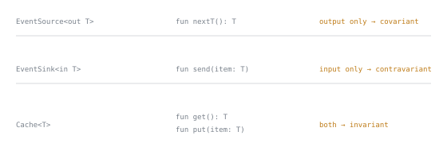

# Lesson 33. Generics and Variance

**Mission link:** Stage 7 closes here. Shipping something typed means writing signatures other people rely on, and variance is the part of a signature that says what a caller may and may not do with it.
**Primary source:** [Docs: "Generics: in, out, where", Kotlin](https://kotlinlang.org/docs/generics.html)
**Prerequisites:** [Lesson 32](0032-android-divergences.md), [Lesson 16](0016-inline-functions-and-reified-generics.md), [Lesson 5](0005-collections-basics.md)

## Warm-up

1. ▢ `viewModelScope` and `LaunchedEffect` both give you a scope that cancels itself. What is the difference?

Check

Which lifetime each follows. `viewModelScope` is cancelled when the `ViewModel` is cleared. `LaunchedEffect` is tied to the composition: it starts when the composable enters, is cancelled when it leaves, and relaunches when a key changes. The two diverge whenever a composable leaves the screen while its `ViewModel` lives on, and the composition can also hold a composable the user cannot see.

2. ▢ Why does a function that checks `x is T` have to be `inline` with a `reified` type parameter?

Check

Type arguments are erased, so an ordinary generic function has no `T` at runtime to test against. `inline` copies the body into the call site, where the concrete type is known, and `reified` tells the compiler to substitute it there. Erasure is the constraint the whole feature exists to work around, and it is about to matter again.

3. ▢ What is the difference between `List` and `MutableList`, in terms of what each lets a holder do?

Check

`List` is the read-only interface: you can get elements and ask its size, but there is no `add` or `set` on it. `MutableList` adds those. Read-only is a property of the interface you hold rather than of the object, so a `MutableList` handed out as a `List` is still mutable by whoever kept the other reference.

## Know this

**Kotlin has no wildcards.** The documentation is direct about it: the wildcard types are one of the trickiest parts of Java's type system, Kotlin does not have them, and what it has instead is **declaration-site variance** and **type projections** ([Generics](https://kotlinlang.org/docs/generics.html)).

Start with why Java needed them. Java's generic types are invariant, so `List<String>` is not a subtype of `List<Object>`, and that invariance is protecting you: if the assignment were allowed you could add an `Integer` to a list of strings and get a `ClassCastException` on the way out. The cost is that a perfectly safe operation stops compiling, which is why `Collection.addAll` is not declared to take a `Collection<E>` but a collection with an `extends`-bound instead. The fix works, and it has to be written **at every use site** that wants the flexibility.

**Declaration-site variance states the fact once, where the type is declared.** If a type parameter is only ever produced by a class's members and never consumed, say so with `out`, and the compiler will both enforce it and reward it. The rule, as the docs put it: when a type parameter `T` of a class `C` is declared `out`, it may occur only in the out-position in the members of `C`, but in return `C<Base>` can safely be a supertype of `C<Derived>`.

So `interface Source<out T> { fun nextT(): T }` makes `val objects: Source<Any> = strs` legal for a `Source<String>`, with no annotation at the use site and nothing for the caller to remember. `in` is the mirror image, for a parameter that is only consumed: the standard library's `Comparable<in T>` is why a `Comparable<Number>` can be used where a `Comparable<Double>` is wanted.

The Java mnemonic still applies, and the docs quote it from Effective Java: Bloch names read-only objects **Producers** and write-only ones **Consumers**, and offers **PECS**, Producer-Extends Consumer-Super. Kotlin's version needs no mnemonic because the words are the keywords. A producer is `out`. A consumer is `in`.

This is also the answer to warm-up 3. Kotlin's `List` is declared with an `out` element type, which is why `List<String>` simply is a `List<Any>`, while `MutableList` has an `add` and therefore cannot be, so it stays invariant. The variance you have been relying on since lesson 5 was declared for you.

**Type projections are the use-site tool, for when declaration-site is impossible.** Some classes genuinely both produce and consume: `Array<T>` has a `get` and a `set`, so it can be neither co- nor contravariant, and consequently `Array<Int>` is not a subtype of `Array<Any>`. To pass one anyway, project the parameter at the point of use: `fun copy(from: Array<out Any>, to: Array<Any>)`. `from` is now a restricted array on which only the methods returning `T` can be called, which corresponds to Java's `extends`-bounded wildcard while being, in the docs' words, slightly simpler. `in` projects the same way for the write-only direction.

**Star projections, for when you know nothing about the argument.** `Foo<*>` gives a projection that every concrete instantiation is a subtype of, and what it means depends on how the parameter was declared:

|Declaration|`Foo<*>` means|Which lets you|
|---|---|---|
|`Foo<out T : TUpper>`|`Foo<out TUpper>`|Read values of `TUpper`|
|`Foo<in T>`|`Foo<in Nothing>`|Write nothing safely|
|`Foo<T : TUpper>` (invariant)|`Foo<out TUpper>` for reads, `Foo<in Nothing>` for writes|Read, but not write|

Each parameter projects independently, so for `interface Function<in T, out U>`, `Function<*, String>` means `Function<in Nothing, String>` and `Function<Int, *>` means `Function<Int, out Any?>`. The docs' own summary is the one to remember: star projections are very much like Java's raw types, but safe.

**How to read the error message.** When you use a projection, the compiler represents the unknown concrete type as a **captured type**, which you cannot write down yourself and will only meet in diagnostics as something like `CapturedType(out X)`. Reads use the captured type's upper bound and writes use its lower bound, which is exactly why `Array<out CharSequence>` lets you call `get` and rejects `set`: the lower bound is `Nothing`, so no value is safe to write. Recognising that phrase in an error message turns a confusing diagnostic into a statement of what you asked for.

**Constraints, briefly.** An upper bound is the common one, `fun <T : Comparable<T>> sort(list: List<T>)`, corresponding to Java's `extends`. The default upper bound is `Any?`, only one may sit inside the angle brackets, and further bounds need a `where` clause whose conditions must all hold at once.

## Practice

1. ▢ `interface Repository<out T> { suspend fun findAll(): List<T> }`. Say what the `out` promises, what it buys the caller, and what happens if someone adds `suspend fun save(item: T)`.

Check

It promises that `T` appears only in out-positions: the interface produces `T` values and never accepts one. What it buys is subtyping, so a `Repository<Dog>` can be passed where a `Repository<Animal>` is expected, with nothing written at the call site. Adding `save(item: T)` puts `T` in an in-position and the declaration stops compiling, which is the useful part: the variance annotation is a constraint the compiler holds you to, so the day someone tries to turn a producer into a consumer, the build tells them what they are breaking rather than leaving every caller to find out.

2. ▢ `List<String>` can be passed where a `List<Any>` is expected. `MutableList<String>` cannot be passed where a `MutableList<Any>` is expected. Why the difference?

Hint

Ask which of the two interfaces has a method that takes an element as a parameter.

Check

`List` declares its element type `out`, because it only ever produces elements: `get` returns one and nothing accepts one. That declaration makes `List<String>` a subtype of `List<Any>`. `MutableList` has `add`, which consumes an element, so its parameter cannot be `out` and the interface is invariant. The consequence is worth seeing concretely: if `MutableList<String>` were assignable to `MutableList<Any>`, you could `add(1)` through the second reference and then read an `Int` out of a list of strings. The read-only and mutable split from lesson 5 is not just about who may mutate; it is what makes one of the two safely covariant.

3. ▢ `val array: Array<out CharSequence> = arrayOf("Kotlin")`. Predict what happens for `array.get(0)` and for `array.set(0, "New value")`, and explain both with one rule.

Check

`get(0)` compiles and gives you a `CharSequence`. `set(0, "New value")` does not compile: the receiver's type carries an `out` projection, which prohibits the member that takes `T` as a parameter. One rule covers both: the compiler represents the projected argument as a captured type and uses its **upper bound for reads** and its **lower bound for writes**. Here the upper bound is `CharSequence`, so reading gives you one, and the lower bound is `Nothing`, so no value at all is safe to write. Projecting with `out` is precisely a promise not to write, so the error is the promise being kept.

4. ▢ For `interface Function<in T, out U>`, what do `Function<*, String>`, `Function<Int, *>` and `Function<*, *>` each mean?

Check

`Function<in Nothing, String>`, `Function<Int, out Any?>`, and `Function<in Nothing, out Any?>`. Each parameter projects independently and each one projects according to how it was declared: a contravariant parameter becomes `in Nothing`, since with the type unknown there is nothing safe to pass in, and a covariant one becomes `out` its upper bound, since reading the most general type is always safe. That is what makes a star projection unlike a Java raw type despite the resemblance: the unknown is replaced by the safest bound rather than by a hole in the type system.

5. ▢ Which claim about declaring `out` on a type parameter is correct?

    - a) Declaring out on a type parameter lets the class produce and consume it
    - b) Declaring out restricts the parameter to out-positions, and buys the subtyping in return
    - c) Declaring out is Kotlin's spelling of a wildcard, written at each use site
    - d) Declaring out has no effect on subtyping, and only documents the author's intent

Check

**b)** is the bargain exactly: accept the restriction and the compiler grants that `C<Base>` may be a supertype of `C<Derived>`. (a) inverts the restriction, which is the thing being given up. (c) confuses the two mechanisms: the use-site tool is a type projection, and the point of declaration-site variance is that it is stated once at the declaration instead. (d) demotes a checked constraint to a comment; the compiler both enforces it and rewards it, which is why adding a consuming method to an `out` parameter is a compile error rather than a style problem.

6. ▢ **Stage capstone.** You are reviewing three types in a service. `EventSource<T>` only returns events. `EventSink<T>` only accepts them. `Cache<T>` both stores and returns them. For each, decide between declaration-site variance, a use-site projection, or staying invariant, and say what your choice promises the callers.

Check

`EventSource<out T>`. It only produces, so declare it once at the declaration: callers get `EventSource<OrderEvent>` usable wherever an `EventSource<DomainEvent>` is wanted, and the compiler stops anyone later adding a method that takes a `T`.

`EventSink<in T>`. It only consumes, so the mirror applies: a sink that accepts any `DomainEvent` is usable where a sink of `OrderEvent` is required, because anything you would hand it is already acceptable.

`Cache<T>`, invariant, with projections at the use site where a particular function needs one. It has both a `get` and a `put`, so it is `Array` all over again and neither annotation is available. A function that only reads takes `Cache<out T>`, a function that only writes takes `Cache<in T>`, and each of those signatures then documents which half of the cache it touches.

The general shape of the answer: variance is not a property you add for flexibility, it is a **statement about direction**, and the direction is decided by whether the type parameter appears in returns, in parameters, or in both. Get that question right and the annotation follows. Reach for a projection first and you end up writing the same wildcard at every call site, which is the Java situation the language was designed to avoid.

An answer worth challenging is one that makes `Cache` covariant "because we only read from it today". That is a promise about the current call sites, not about the type, and the first `put` will either break it or force it to be quietly removed.

## Real-world reps

- [ ] Look up how `List`, `MutableList`, `Comparable` and `Function1` declare their type parameters in the standard library. For each, predict the annotation from what the interface does before you check.
- [ ] Find a generic type in code you have access to whose parameter is used in only one direction. Decide whether adding `out` or `in` would break any existing call site, and what it would buy.
- [ ] Tomorrow: find a compiler diagnostic in your own work that mentions a projection or a captured type. Rewrite the error in your own words as a statement about reads and writes, then check whether the fix follows from it.

## Going further

- [Docs: "Generics: in, out, where", Kotlin](https://kotlinlang.org/docs/generics.html)
- [Docs: "Collections overview", Kotlin](https://kotlinlang.org/docs/collections-overview.html)
- [Resources](../RESOURCES.md)

---

Not landing? Reread the primary source at the top, since this lesson compresses it and compression is where understanding leaks. Check the [glossary](../GLOSSARY.md) for any term that felt slippery.

If the lesson itself is unclear rather than the material, that is a defect: [open an issue](https://github.com/TokenCemetery/teach/issues).
