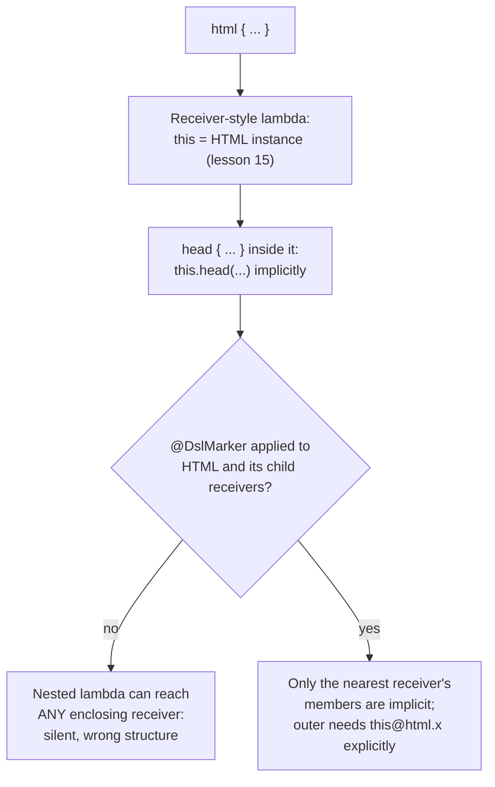

# Lesson 36. Type-Safe Builders and DSLs

**Mission link:** Lesson 15 explained the mechanism behind `run` and `apply`'s `this`: a receiver-style function type, `T.() -> R`. A **type-safe builder** is that same mechanism, nested recursively, which is the construct receivers actually exist for and one of the clearest places Kotlin does something Java's type system has no equivalent for at all.
**Primary source:** [Docs: "Type-safe builders", Kotlin](https://kotlinlang.org/docs/type-safe-builders.html)
**Prerequisites:** [Lesson 15](0015-higher-order-functions-and-lambdas.md), [Lesson 13](0013-extension-functions.md)

## Warm-up

1. ▢ Per lesson 15, what does a receiver-style function type like `HTML.() -> Unit` make available, without qualification, inside a lambda of that type?

Check

The receiver (an `HTML` instance) becomes an implicit `this` inside the lambda body, the same mechanism extension functions use to expose their receiver, letting the lambda call the receiver's members as if it were written as a method on that receiver.

## Know this

### A builder function is just a function that takes a receiver-style lambda

`fun html(init: HTML.() -> Unit): HTML { val html = HTML(); html.init(); return html }` is an ordinary function. Calling `html { head { ... } }` works entirely because of lesson 15's mechanism: inside the lambda passed to `html`, `this` is the `HTML` instance being built, so `head { ... }` is really `this.head { ... }`, a method call on that receiver written without needing to name it. Nothing here is a special DSL feature the compiler treats differently; it's the identical receiver-style function type `run` and `apply` use, just written by a library author instead of the standard library, and called with the same trailing-lambda syntax lesson 15 already covered.

### Nesting receivers is where the real risk shows up

A lambda is a closure: it carries access to everything in its enclosing scope, including every enclosing receiver, not just the nearest one. Nest a builder inside another builder, `html { head { head { } } }`, and without anything stopping it, the innermost lambda can call members of *any* enclosing receiver it likes, not only the one it's actually meant to be building. The Kotlin documentation's own example: calling `head()` again from inside a `head { }` block would reach the outer `html` receiver's `head` member, producing a `head` nested inside another `head`, structurally wrong output that still compiles cleanly, because nothing about the receiver mechanism itself limits which enclosing receiver a call resolves against.

### `@DslMarker` restricts implicit access to only the nearest receiver

Annotating every receiver type used in a DSL with the same custom marker annotation (Kotlin's own example: `@HtmlTagMarker`) turns on a compiler restriction: only the *nearest* enclosing receiver's members are callable without qualification. Reaching an outer receiver from a nested lambda still remains possible, but only by naming it explicitly with a labeled receiver, `this@html.head { }`, which is exactly what turns an easy, silent mistake into something that has to be written on purpose, visibly, in the code.

### Each DSL should mark its own receivers, not share a marker with another DSL

`@DslMarker` can be applied directly to a function type, since a marker only needs `AnnotationTarget.TYPE` among its targets to do so, most commonly for a lambda-with-receiver parameter. The documented reason to define a dedicated marker per DSL, rather than reusing one across unrelated builders, is that it lets multiple DSLs coexist and nest inside each other (an HTML builder used somewhere inside a completely different DSL, say) without one DSL's scope restriction interfering with the other's.

### This is what makes a Kotlin builder read like a language feature, without being one

Nothing about a type-safe builder requires new syntax, a parser change, or compiler support beyond the receiver-style function type lesson 15 already introduced and the scope restriction `@DslMarker` adds on top of it. Java has neither an implicit receiver mechanism nor a function type that can carry one, which is exactly why the equivalent structure in Java needs an explicit, named builder object passed around and mutated step by step, rather than a nested block of code that reads like its own small, structured language.

## Practice

1. ▢ A builder function `fun table(init: TABLE.() -> Unit): TABLE` is called as `table { row { } }`. What is `this` inside the lambda passed to `row`, and why does that let `row`'s own members be called without qualification inside it?

Hint

Think about which receiver-style lambda is actually running at that point.

Check

`this` is the `ROW` instance (whatever type `row`'s own receiver-style parameter declares), the same lesson 15 mechanism as any other receiver-style lambda. Its own members can be called without qualification for exactly the same reason `head`'s members can inside `head { }`: the nearest enclosing lambda's receiver is implicitly `this`.

2. ▢ Without `@DslMarker`, what stops (or fails to stop) code inside a deeply nested builder lambda from calling a member of an ancestor receiver several levels up, rather than the nearest one?

Check

Nothing stops it. A lambda is a closure carrying access to every enclosing scope, including every enclosing receiver, not only the nearest one, so without a restriction, a call inside the innermost lambda can resolve against any ancestor receiver's members just as easily as the nearest one, silently.

3. ▢ After annotating a DSL's receiver types with `@HtmlTagMarker`, can code inside a nested lambda still reach an outer receiver's members at all?

Check

Yes, but not implicitly: it has to name the outer receiver explicitly with a labeled `this`, such as `this@html.head { }`, rather than calling it unqualified. `@DslMarker` restricts *implicit* access to the nearest receiver; it doesn't make an outer receiver unreachable, it makes reaching it a deliberate, visible choice instead of an accident.

4. ▢ Two unrelated DSLs, an HTML builder and a separate query builder, both define their receiver types. Why does the documentation recommend each DSL use its own dedicated marker annotation rather than sharing one?

Check

A dedicated marker per DSL lets the two coexist and even nest inside each other without one DSL's scope restriction interfering with the other's; sharing a single marker across both would conflate two genuinely separate receiver hierarchies under one restriction rule.

5. ▢ Which claim correctly describes what a type-safe builder actually is, mechanically?

    - a) A distinct Kotlin language feature, unrelated to ordinary function types, requiring its own compiler support
    - b) An ordinary function taking a receiver-style lambda parameter (lesson 15's `T.() -> R`), nested recursively, with `@DslMarker` restricting implicit member access to the nearest receiver to prevent silent cross-receiver mistakes
    - c) A builder pattern implemented the same way it would be in Java, just with different syntax
    - d) `@DslMarker` is required before any receiver-style lambda will compile at all

Check

**b)** That's the precise mechanism this lesson traces, from lesson 15's receiver-style function type to the specific problem `@DslMarker` solves. (a) is false: no new compiler feature is involved beyond the function type mechanism lesson 15 already covered. (c) is false: Java has no implicit-receiver or receiver-carrying function type mechanism, which is exactly why an equivalent Java builder needs an explicit, named, step-by-step object instead. (d) is false: receiver-style lambdas and nested builders compile fine without `@DslMarker`; the annotation only adds the scope restriction, it isn't a prerequisite for the mechanism to work at all.

## Real-world reps

- [ ] Find a Kotlin DSL you have access to (Gradle's Kotlin DSL, a UI framework's builder, or a testing library's assertion builder), and identify the receiver-style function type behind at least one nested block.
- [ ] Write a small two-level builder of your own (even something trivial, like a builder for a simple settings object), and deliberately try calling an outer receiver's member unqualified from inside the inner lambda before and after adding `@DslMarker`, to see the restriction take effect.
- [ ] Tomorrow: read the primary source's section on the `@DslMarker` restriction rules in full, and note what happens when a receiver type has no annotation at all versus when two levels share the exact same marker.

## Going further

- [Docs: "Type-safe builders", Kotlin](https://kotlinlang.org/docs/type-safe-builders.html)
- [Docs: "Higher-order functions and lambdas", Kotlin](https://kotlinlang.org/docs/lambdas.html)
- [Resources](../RESOURCES.md)

---

Not landing? Reread the primary source at the top, since this lesson compresses it and compression is where understanding leaks. Check the [glossary](../GLOSSARY.md) for any term that felt slippery.

If the lesson itself is unclear rather than the material, that is a defect: [open an issue](https://github.com/TokenCemetery/teach/issues).
