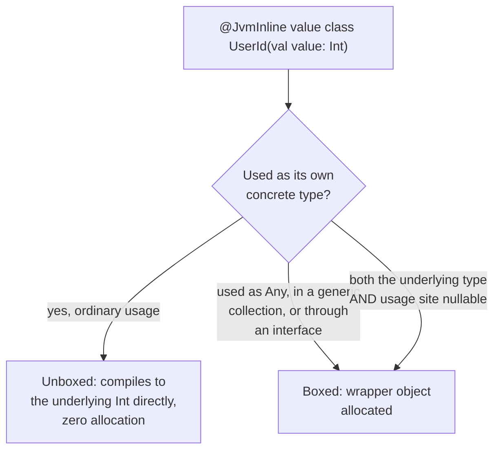

# Lesson 37. value class and @JvmInline

**Mission link:** Wrapping a raw `Int` or `String` in an ordinary class for type safety (a `UserId`, an `Email`) is a habit worth having, but on the JVM it usually means a real heap allocation every single time, the same allocation cost lesson 1's Java-habit warnings have been naming since the arc's foundations. `value class` with `@JvmInline` is Kotlin's answer: the type safety, without the allocation, except in the specific cases this lesson names precisely.
**Primary source:** [Docs: "Inline value classes", Kotlin](https://kotlinlang.org/docs/inline-classes.html)
**Prerequisites:** [Lesson 8](0008-data-classes.md)

## Warm-up

1. ▢ Per lesson 8, what does a `data class` generate automatically, and what's the rule about which properties participate?

Check

`equals()`/`hashCode()`, `toString()`, `componentN()` and `copy()`, generated from only the properties declared in the primary constructor; properties declared inside the class body don't participate in any of it.

## Know this

### A value class wraps exactly one value, and has no identity of its own

`@JvmInline value class UserId(val value: Int)` declares a value class: a single property, initialized in the primary constructor, is all it's allowed to hold. Unlike an ordinary class, a value class instance has no identity distinct from the value it wraps, there's no meaningful sense in which two `UserId` instances holding the same `Int` are "different objects" the way two ordinary class instances could be, even with identical contents.

### At runtime, it's represented as its own value, not a wrapper, whenever the compiler can manage it

The compiler generates a wrapper class for every value class (the same way `Int` has a corresponding `Integer` wrapper on the JVM), but a value class instance can be represented at runtime either as that wrapper or as the underlying type directly, unboxed. The compiler's own preference is the underlying, unboxed representation whenever it can use one, which is what makes a `UserId` compile down to, in the ordinary case, nothing more than a plain `Int` moving through the code, with none of an ordinary wrapper class's allocation cost.

### The rule of thumb: boxed whenever it's used as another type

The documented rule is precise: a value class is boxed whenever it's used as another type. Concretely, this includes passing it where `Any` is expected, storing it in a generic collection (`List<UserId>`, since generics are erased to reference types on the JVM, and an unboxed `Int` can't occupy that erased slot), or referencing it through an interface it implements. None of these are edge cases to memorize in isolation; they're all the same rule, being used as something other than its own concrete type forces a box, applied to whichever specific situation triggers it.

### The one subtle case: two independently nullable spots at once

A value class instance is boxed when both its underlying type and its own usage site are nullable at the same time, for instance a `UserId?` wrapping a nullable `String?`. This happens because there are then two distinct things that could independently be null, the wrapper itself or the value inside it, and representing that distinction correctly needs different code paths for each case, which is exactly what forces a box even in a situation that otherwise looks like ordinary, ought-to-be-unboxed usage.

### The zero-cost promise is real, but "usually" is the word to keep

A value class fixes primitive obsession's real cost: instead of an ordinary wrapper class allocating a heap object on every single use, a value class usually compiles away entirely, leaving only the underlying primitive or reference value moving through the code. But assuming that's true unconditionally, inside a generic collection, behind an interface, or in the doubly-nullable case, is itself exactly the kind of unverified assumption this arc has been warning against since lesson 1: the zero-cost promise holds precisely where the documented rule says it does, and nowhere else automatically.

## Practice

1. ▢ A function takes a `UserId` parameter and simply returns `userId.value * 2`. Is this `UserId` instance boxed or unboxed at the call site, per the documented rule of thumb?

Hint

Ask whether the value is being used as anything other than its own concrete type here.

Check

Unboxed. It's used as its own concrete type the whole way through, never passed as `Any`, stored generically, or referenced through an interface, so the compiler can represent it as the plain underlying `Int` with no wrapper allocation.

2. ▢ A `List<UserId>` is built up and iterated over. Are the `UserId` values inside it boxed?

Check

Yes. Generics are erased to reference types on the JVM, and an unboxed `Int` can't occupy that erased generic slot, so each `UserId` stored in the list is used as another type (the generic type parameter's erased representation), which is exactly the documented condition that forces boxing.

3. ▢ A value class `Email(val value: String)` is used as `Email?` at a call site, and `String` itself is non-null in the primary constructor. Is this boxed?

Check

No, not by the doubly-nullable rule specifically: only one thing here can be null (the `Email?` wrapper itself), not two independent nullable spots at once, since the underlying `String` isn't itself nullable. Boxing from nullability specifically requires both the underlying type and the usage site to be nullable simultaneously; a single nullable layer doesn't trigger it on its own.

4. ▢ Why does the documentation call boxing "whenever used as another type" a single rule, rather than several unrelated special cases (generics, interfaces, `Any`)?

Check

Because generics, interfaces, and `Any` are all, mechanically, the same underlying situation: each one requires the value to be represented as something other than its own concrete type (an erased generic slot, an interface reference, `Any` itself), and that's the one condition the rule actually names. They aren't separate rules to memorize; they're the same rule triggered by different specific situations.

5. ▢ Which claim correctly describes when a `@JvmInline value class` gets boxed?

    - a) It is always boxed, exactly like an ordinary wrapper class, since the JVM has no other way to represent it
    - b) It's boxed whenever it's used as another type (passed as `Any`, stored generically, referenced through an interface), or when both its underlying type and its usage site are nullable at once; otherwise the compiler represents it as the plain underlying value with no allocation
    - c) Boxing only ever happens with nullable value classes, never with non-nullable ones
    - d) A value class can hold any number of properties, as long as they're all declared in the primary constructor

Check

**b)** That's the precise, documented condition this lesson traces from the general rule to its specific triggers. (a) is false: the entire point of a value class is that it usually compiles to the plain underlying value, with no wrapper allocation, unlike an ordinary class. (c) is false: the generic-collection and interface-reference cases box a value class with no nullability involved at all. (d) is false: a value class holds exactly one property, initialized in the primary constructor; that single-property constraint is what makes the unboxed representation possible in the first place.

## Real-world reps

- [ ] Find a class in code you have access to that wraps a single primitive or `String` purely for type safety (an ID type, a validated string). Check whether it's an ordinary class or a `value class`, and estimate how often it's used in a way (generics, `Any`, an interface) that would box it anyway.
- [ ] Write a small `@JvmInline value class` of your own, then deliberately store an instance of it in a `List<T>` and check (via the primary source's guidance, or a bytecode inspection tool if you have one) that it's boxed there even though ordinary usage wouldn't be.
- [ ] Tomorrow: read the primary source's section on inline classes implementing an interface, and note what specifically about implementing one forces boxing even for calls that otherwise look like they'd stay unboxed.

## Going further

- [Docs: "Inline value classes", Kotlin](https://kotlinlang.org/docs/inline-classes.html)
- [Docs: "Data classes", Kotlin](https://kotlinlang.org/docs/data-classes.html)
- [Resources](../RESOURCES.md)

---

Not landing? Reread the primary source at the top, since this lesson compresses it and compression is where understanding leaks. Check the [glossary](../GLOSSARY.md) for any term that felt slippery.

If the lesson itself is unclear rather than the material, that is a defect: [open an issue](https://github.com/TokenCemetery/teach/issues).
