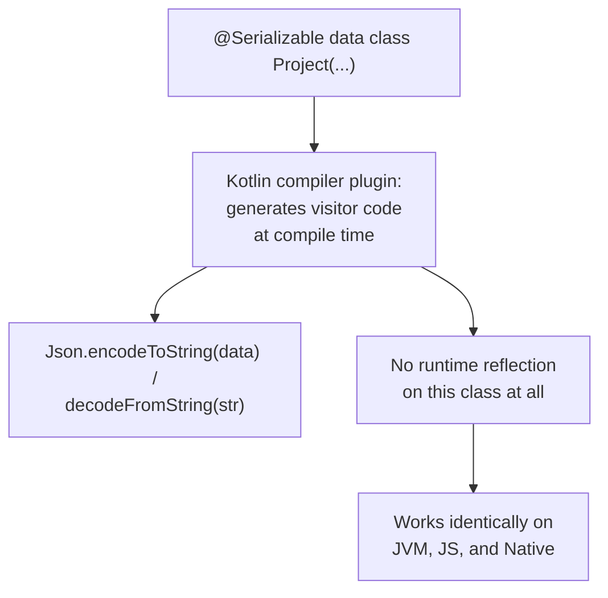

# Lesson 38. kotlinx.serialization

**Mission link:** Lesson 8's data classes are the natural candidate for serialization, and a Java habit reaches for a library (Jackson, Gson) that inspects a class's fields through reflection to do it. `kotlinx.serialization` is a genuinely different model: a compiler plugin generates the actual serialization logic for a class at compile time, which is exactly what lets it reach Kotlin targets that have no equivalent runtime reflection API at all.
**Primary source:** [Repo: kotlinx.serialization, Kotlin](https://github.com/Kotlin/kotlinx.serialization)
**Prerequisites:** [Lesson 8](0008-data-classes.md)

## Warm-up

1. ▢ Per lesson 8, what does `data class` generate automatically for a type like `Project(val name: String, val language: String)`?

Check

`equals()`/`hashCode()`, `toString()`, `componentN()` functions and `copy()`, derived from its primary-constructor properties.

## Know this

### A compiler plugin generates the serialization code; nothing inspects the class at runtime

`kotlinx.serialization` is built from a compiler plugin that generates visitor code for every class annotated `@Serializable`, a runtime library carrying the core serialization API, and separate format libraries (JSON, Protobuf, CBOR, and others) built on top of that core. The compiler plugin's generated code is the actual serialization logic for that specific class, produced once, at compile time; nothing about serializing a `@Serializable` instance later inspects its fields through reflection at runtime the way a library like Jackson or Gson does.

### Reflectionless isn't just a performance detail, it's what makes multiplatform reach possible at all

The library supports full multiplatform targets: JVM, JS, and Native. A purely reflection-based approach depends on a runtime reflection API that JVM-specific libraries assume is available; Kotlin/JS and Kotlin/Native don't have the same reflection surface a JVM does, so a reflection-based serializer simply has nowhere to stand on those targets. Because `kotlinx.serialization`'s actual logic is generated at compile time by the compiler plugin itself, rather than resolved through a JVM-specific reflection API at runtime, the same `@Serializable` class serializes correctly on every one of those targets, not merely fast on the one where reflection happens to exist.

### Setup is two pieces, and forgetting either one produces silence, not an error

Using the library requires both the compiler plugin (`kotlin("plugin.serialization")`, added alongside the Kotlin Gradle plugin) and the runtime library dependency, and the plugin's own version is released in lockstep with each Kotlin compiler version. Adding only the runtime library dependency, without the compiler plugin, doesn't produce a build error: `@Serializable` still compiles as an ordinary annotation, since annotations always compile regardless of whether anything processes them, but no actual serialization visitor code is ever generated for the annotated class. This is exactly the class of trap this arc has named before: something that compiles cleanly and looks configured, while quietly doing nothing.

### There is no global serializer configuration, on purpose

Where a reflective Java library often gets a shared, globally configured instance (an `ObjectMapper`, a `Gson` builder) that applies its rules broadly across many types, `kotlinx.serialization`'s own philosophy is explicitness: a custom serialization strategy is declared directly on the type it applies to, through the `@Serializable` annotation itself, rather than registered somewhere central and applied implicitly. The one documented exception is a context serializer for genuinely external cases; everything else is meant to be visible at the type it affects, not discovered by reading a separate configuration file.

### Even a custom type avoids reflection, by delegating to a generated serializer

A type needing custom serialization logic (the documented example: a `Color` converted to an `IntArray`) doesn't fall back to reflection either. It delegates the actual encoding and decoding to an already-generated serializer for the related type (`IntArraySerializer`, via `encodeSerializableValue`/`decodeSerializableValue`), reusing compile-time-generated code rather than reaching for a reflective fallback the moment a type needs anything beyond the default, automatic case.

## Practice

1. ▢ A team adds `kotlinx-serialization-json` as a runtime dependency but forgets to add the `kotlin("plugin.serialization")` compiler plugin. They mark a class `@Serializable` and the project builds successfully. What actually happens when they try to serialize an instance of that class?

Hint

Think about what an annotation does on its own, without something that actually processes it.

Check

The annotation compiles fine on its own, since annotations always compile regardless of whether anything processes them, but without the compiler plugin, no serialization visitor code was ever generated for the class. Attempting to serialize it fails, or behaves as if the class were never actually marked serializable at all, even though the build itself reported no problem.

2. ▢ Why can't a purely reflection-based JVM serialization library be used unmodified on a Kotlin/Native target?

Check

A reflection-based library depends on a runtime reflection API that assumes a JVM-like environment; Kotlin/Native doesn't have the same reflection surface a JVM does, so there's nothing for a reflection-based approach to inspect a class through at runtime on that target. `kotlinx.serialization` avoids this entirely by generating its serialization logic at compile time instead.

3. ▢ A developer used to Jackson's `ObjectMapper` looks for a similarly central place to register a custom serialization rule that applies broadly across many types in a `kotlinx.serialization` project. What will they find instead?

Check

No equivalent global configuration point (aside from the documented context-serializer exception). `kotlinx.serialization`'s own philosophy declares a custom serialization strategy directly on the type it affects, through the `@Serializable` annotation itself, rather than registering it somewhere central that applies implicitly across types.

4. ▢ A custom type needs non-default serialization logic. Does `kotlinx.serialization` fall back to reflection to handle it?

Check

No. The documented pattern delegates to an already-generated serializer for a related type (converting the custom type to something with existing compile-time-generated serialization support, like converting a `Color` to an `IntArray` and using `IntArraySerializer`), reusing compile-time-generated code rather than reaching for reflection the moment a type needs anything beyond the automatic case.

5. ▢ Which claim correctly describes why `kotlinx.serialization` is reflectionless?

    - a) Reflection is simply slower, so the library avoids it purely for a performance benefit with no other consequence
    - b) A compiler plugin generates each `@Serializable` class's actual serialization logic at compile time, which is what lets the same code work on Kotlin/JVM, Kotlin/JS, and Kotlin/Native, targets that don't share a common runtime reflection API
    - c) Reflectionless only applies to data classes; ordinary classes always fall back to reflection
    - d) The compiler plugin and the runtime library dependency are interchangeable; either one alone is sufficient

Check

**b)** That's the precise reason this lesson traces, from the compiler-plugin mechanism to its multiplatform consequence. (a) is false: being reflectionless is what makes multiplatform support possible at all, not merely a speed optimization on one platform. (c) is false: the compiler plugin generates code for any `@Serializable`-annotated class, not only data classes. (d) is false: both the compiler plugin and the runtime dependency are required together; omitting the plugin leaves the annotation with no generated code behind it at all.

## Real-world reps

- [ ] Check a Kotlin project you have access to for both the `kotlin("plugin.serialization")` Gradle plugin and the matching `kotlinx-serialization-json` (or other format) runtime dependency, and confirm the plugin version matches the Kotlin compiler version in use.
- [ ] Find a `@Serializable` class in code you have access to, and check whether it relies on the default, automatic serialization or declares a custom serializer explicitly on the type.
- [ ] Tomorrow: read the primary source's `docs/serializers.md` guide in full, and write a small custom serializer of your own that delegates to an existing generated serializer rather than implementing encoding from scratch.

## Going further

- [Repo: kotlinx.serialization, Kotlin](https://github.com/Kotlin/kotlinx.serialization)
- [Docs: "Data classes", Kotlin](https://kotlinlang.org/docs/data-classes.html)
- [Resources](../RESOURCES.md)

---

Not landing? Reread the primary source at the top, since this lesson compresses it and compression is where understanding leaks. Check the [glossary](../GLOSSARY.md) for any term that felt slippery.

If the lesson itself is unclear rather than the material, that is a defect: [open an issue](https://github.com/TokenCemetery/teach/issues).
