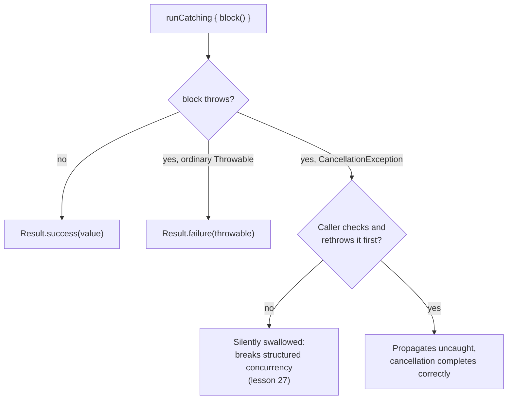

# Lesson 39. Result and Error-Handling Idioms

**Mission link:** Lesson 27 established that cancellation is cooperative and that a `CancellationException` is not a failure, it has to propagate uncaught through a suspension point for structured concurrency to actually work. `runCatching`'s own stdlib definition catches any `Throwable` at all, `CancellationException` included, which is exactly where this stage's own idiom collides with lesson 27's model if it's reached for without knowing that.
**Primary source:** [API: "runCatching", Kotlin](https://kotlinlang.org/api/core/kotlin-stdlib/kotlin/-run-catching.html), [Docs: "Coroutine exceptions handling", Kotlin](https://kotlinlang.org/docs/exception-handling.html)
**Prerequisites:** [Lesson 27](0027-cancellation-and-exception-handling.md), [Lesson 9](0009-sealed-classes-and-exhaustive-when.md)

## Warm-up

1. ▢ Per lesson 27, why is a `CancellationException` "not a failure," and what does the coroutine machinery do with it?

Check

It's the mechanism cancellation itself is built on: a cancelled coroutine throws it at a suspension point, and it's meant to propagate up uncaught so the coroutine (and its parent, per structured concurrency) actually completes as cancelled, rather than being treated as an ordinary error.

2. ▢ Per lesson 9, what does sealing a class hierarchy give a `when` expression over it?

Check

Compiler-checked exhaustiveness: since every direct subclass is known at compile time, a `when` over a sealed type needs no `else` branch, and the compiler flags it if a case is missing.

## Know this

### `runCatching` wraps a block's outcome, success or failure, into one value

`runCatching { block() }` runs `block`, returning a `Result<T>` holding either the successful value or whatever `Throwable` the block threw, instead of letting the exception propagate to the caller. `.onSuccess { }`, `.onFailure { }`, `.getOrNull()`, and `.getOrElse { }` are the idiomatic ways to act on that `Result` afterward, replacing a `try`/`catch` block written at the call site with a value that can be passed around, chained, and inspected later.

### `runCatching` catches `Throwable`, and that includes `CancellationException`

The stdlib's own definition of `runCatching` catches any `Throwable` the block throws that isn't otherwise handled. `CancellationException` is a `Throwable`. Kotlin's own coroutine documentation is explicit that cancellation exceptions are meant to be ignored by ordinary handlers and propagate through the coroutine machinery uncaught; wrapping one in a `Result.failure` instead does the opposite of what cancellation needs; the coroutine's parent, per lesson 27's structured-concurrency tree, never actually sees the cancellation complete, and can go on believing a cancelled child coroutine is still alive.

### There is no stdlib variant that does this safely by default

As of the current standard library, `runCatching` has no coroutine-aware counterpart that automatically re-throws a `CancellationException` before wrapping anything else. The documented, still-manual fix is to check for it explicitly and re-throw before treating anything else as an ordinary failure: `runCatching { block() }.onFailure { if (it is CancellationException) throw it }`. This is exactly the discipline lesson 27 already established for any exception-handling code running inside a coroutine, applied specifically to `runCatching`'s own blind spot: check what you caught before deciding it's actually a failure worth wrapping.

### A sealed hierarchy is the better tool once "failure" needs more than one shape

`Result<T>`'s failure case is a single, undifferentiated `Throwable`; a domain with several genuinely distinct failure kinds a caller needs to distinguish and handle differently (a payment failure versus an out-of-stock error versus a validation failure) is better modelled as a sealed hierarchy of its own, giving lesson 9's compiler-checked exhaustive `when` over the specific kinds of failure that can actually happen, rather than one generic `Throwable` a caller has to inspect and re-classify by hand. It's common, and reasonable, to build such a hierarchy internally using `runCatching` for the mechanical try/catch work, while exposing the richer sealed type as the actual public return type.

### Not every failure belongs in a `Result` at all

A failure that represents a genuine bug, an invariant the code assumed and got wrong, isn't a case a caller is meant to recover from gracefully; it's the kind of failure an uncaught exception, crashing loudly, is still the right answer for. Reflexively wrapping every function in `runCatching` "to be safe" turns a real programming error into a quietly swallowed `Result.failure` that some caller might not even check, the same silent-failure trap this arc keeps naming under different names. `Result` and sealed error hierarchies are for expected, recoverable failure modes; an unexpected, unrecoverable one is still better left to propagate and be seen.

## Practice

1. ▢ A suspending function wraps its entire body in `runCatching { ... }` and returns the resulting `Result<T>`. The coroutine it's running in gets cancelled while this function is suspended inside the block. What happens to the `CancellationException`, and why is that a problem?

Hint

Think about what `runCatching` catches, and what lesson 27 said cancellation needs to do to actually complete.

Check

`runCatching` catches the `CancellationException` along with any other `Throwable` and wraps it in a `Result.failure`, rather than letting it propagate. This breaks structured concurrency: the coroutine's parent never sees the cancellation actually complete, so it can behave as if a cancelled child coroutine is still alive and running.

2. ▢ Does the Kotlin standard library provide a built-in `runCatching` variant that automatically re-throws a `CancellationException` instead of wrapping it?

Check

No. As of the current standard library, this remains a manual responsibility: the documented pattern is to check the caught exception explicitly and re-throw it if it's a `CancellationException`, before treating anything else as an ordinary `Result.failure`.

3. ▢ A domain has three genuinely distinct failure modes a caller needs to handle differently (a validation error, a not-found error, a conflict error). Why might `Result<T>` alone be a worse fit here than a sealed hierarchy?

Check

`Result<T>`'s failure case is one undifferentiated `Throwable`; a caller would have to inspect and re-classify it by hand to tell the three failure modes apart. A sealed hierarchy of the three specific error types gives a caller compiler-checked exhaustive `when` handling over exactly those kinds, per lesson 9, rather than one generic failure value standing in for three different situations.

4. ▢ A function detects that an internal invariant it relies on has been violated, a genuine bug rather than an expected, recoverable condition. Should this be wrapped in a `Result.failure` the same way an expected failure would be?

Check

Not necessarily, and often not: a `Result` (or a sealed error hierarchy) is meant for expected, recoverable failure modes a caller is supposed to handle. An invariant violation is a bug, and letting it propagate as an uncaught exception, crashing loudly, is often the more honest response than quietly wrapping it in a `Result.failure` a caller might not even check.

5. ▢ Which claim correctly describes the interaction between `runCatching` and coroutine cancellation?

    - a) `runCatching` is coroutine-aware by default and automatically re-throws `CancellationException` without wrapping it
    - b) `runCatching` catches any `Throwable`, including `CancellationException`; using it inside a coroutine without explicitly re-throwing a caught `CancellationException` first can silently break structured concurrency's cancellation propagation
    - c) `CancellationException` is not a subtype of `Throwable`, so `runCatching` can never catch it
    - d) Sealed error hierarchies eliminate the need to ever think about `CancellationException`

Check

**b)** That's the precise, documented interaction this lesson traces from `runCatching`'s own definition to lesson 27's cancellation model. (a) is false: no stdlib variant does this automatically; it has to be done explicitly. (c) is false: `CancellationException` is a `Throwable`, which is exactly why `runCatching` catches it in the first place. (d) is false: a sealed hierarchy built internally with `runCatching` still needs the same explicit re-throw guard; the sealed type only changes what a *caller* sees, not what `runCatching` itself catches.

## Real-world reps

- [ ] Find a use of `runCatching` inside a `suspend` function or coroutine builder in code you have access to. Check whether it guards against swallowing `CancellationException`, and fix it if it doesn't.
- [ ] Find a function returning `Result<T>` where the failure case actually represents several genuinely distinct situations a caller has to tell apart. Consider whether a sealed hierarchy would serve callers better than the single `Throwable` failure case.
- [ ] Tomorrow: find (or write) a function that currently wraps everything in `runCatching` reflexively, and decide whether any of its caught failures are actually bugs that should be left to crash loudly instead.

## Going further

- [API: "runCatching", Kotlin](https://kotlinlang.org/api/core/kotlin-stdlib/kotlin/-run-catching.html)
- [Docs: "Coroutine exceptions handling", Kotlin](https://kotlinlang.org/docs/exception-handling.html)
- [Docs: "Sealed classes and interfaces", Kotlin](https://kotlinlang.org/docs/sealed-classes.html)
- [Resources](../RESOURCES.md)

---

Not landing? Reread the primary source at the top, since this lesson compresses it and compression is where understanding leaks. Check the [glossary](../GLOSSARY.md) for any term that felt slippery.

If the lesson itself is unclear rather than the material, that is a defect: [open an issue](https://github.com/TokenCemetery/teach/issues).
