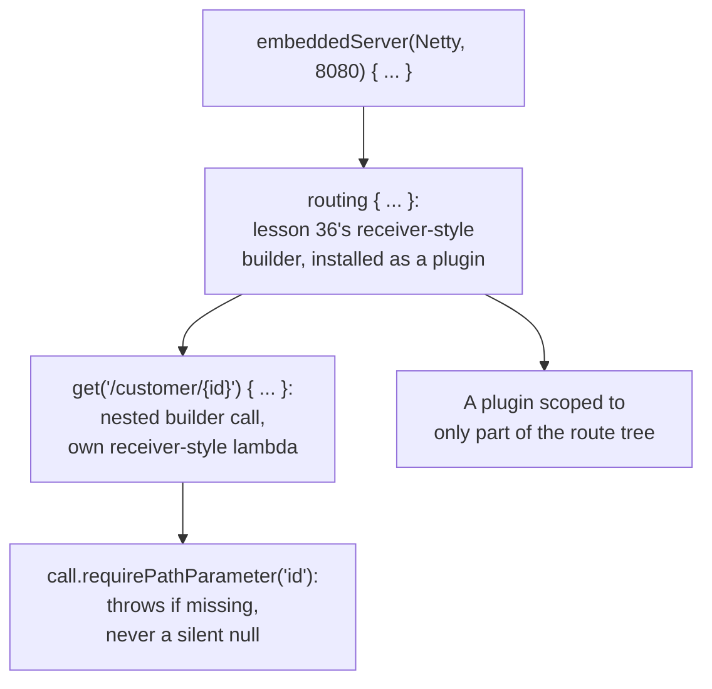

# Lesson 40. HTTP Layer

**Mission link:** Lesson 31 named exactly what it wasn't covering: "routing, serialization and server startup belong to whichever framework you chose." This lesson picks up routing with Ktor, and the first thing worth noticing is that its routing block isn't bespoke web-framework magic at all, it's lesson 36's type-safe builder DSL, applied to HTTP, the same receiver-style mechanism this workspace already taught for its own sake.
**Primary source:** [Docs: "Routing", Ktor](https://ktor.io/docs/server-routing.html), [Docs: "Server plugins", Ktor](https://ktor.io/docs/server-plugins.html)
**Prerequisites:** [Lesson 36](0036-type-safe-builders-and-dsls.md), [Lesson 31](0031-structuring-a-service.md)

## Warm-up

1. ▢ Per lesson 36, what makes `html { head { } }` work mechanically, without any special compiler support beyond one existing mechanism?

Check

`html` is an ordinary function taking a receiver-style lambda (`HTML.() -> Unit`); inside it, `this` is the `HTML` instance, so `head { }` is really `this.head { }`, an ordinary method call on that receiver written without naming it.

2. ▢ Per lesson 31, what does the "nullability lives at the edge" principle say a service should do with an incoming request?

Check

Parse the request into non-nullable domain types once, at the boundary, rather than letting a nullable form travel inward and turn into a defensive null check at every layer that touches it.

## Know this

### Routing is a plugin, not something Ktor turns on for you

Ktor activates no plugins by default at all; routing itself is implemented as a plugin, installed explicitly like any other capability the application needs. This is a deliberate design choice, not an oversight: an application only carries the behavior it actually asked for, the same explicit-over-implicit bias lesson 38 already established for `kotlinx.serialization`'s lack of ambient global configuration.

### The routing block is lesson 36's builder, not a new mechanism

`routing { get("/hello") { call.respondText("Hello") } }` is, mechanically, exactly the type-safe builder pattern lesson 36 covered: `routing` takes a receiver-style lambda, and `get` (along with `post`, `put`, `patch`, `delete`, `head`, and `options`, one dedicated function per HTTP verb rather than one generic function taking a verb argument) is itself a further nested builder call inside that receiver, each taking its own receiver-style lambda for handling a matched request. Nothing here required new compiler support beyond what lesson 36 already explained; a web framework's routing DSL is one of the clearest real applications of the exact mechanism this arc already taught for its own sake.

### A path pattern can carry a parameter, or be a full regular expression

A route's path pattern can be a literal (`/hello`), a segment with a named parameter (`/customer/{id}`), or, since regular expressions are supported by every route-defining function, a full `Regex` matched against the request path. `route(...)` groups several handlers under a shared path prefix and lets routes nest, the same recursive nesting lesson 36's builders already demonstrated for an entirely different domain.

### Extracting a request parameter fails loudly when it's actually missing

Pulling a value out of an incoming request, a path parameter, a query parameter, a cookie, uses a function that either returns the value or throws (`requirePathParameter`, for instance, throws `MissingRequestParameterException` if the parameter genuinely isn't present). This is lesson 31's own "nullability lives at the edge" principle in concrete form: the boundary code either produces a real, non-nullable value or fails immediately and loudly, rather than quietly returning something null or wrong that a deeper layer would have to defensively re-check.

### A plugin's configuration can be scoped to part of the route tree, not just applied globally

A plugin isn't limited to one, application-wide installation; it can be installed separately, with a different configuration, on a specific subset of routes, letting different resources in the same application get genuinely different behavior without one global configuration trying to cover every case. This mirrors the same discipline lesson 38 already named for serialization: a capability declared explicitly where it applies, rather than one setting reaching implicitly across the whole application.

## Practice

1. ▢ A new Ktor application is started with no plugins installed at all. Does it handle any HTTP routes?

Hint

Think about what routing actually is, mechanically, in Ktor.

Check

No. Ktor activates no plugins by default, and routing itself is implemented as a plugin, so without installing it explicitly, there's no routing capability present at all, nothing to match a request against.

2. ▢ Why does calling `routing { get("/hello") { ... } }` not require any web-framework-specific compiler feature beyond what lesson 36 already covered?

Check

`routing` is an ordinary function taking a receiver-style lambda, and `get` inside it is a further nested call taking its own receiver-style lambda, the identical mechanism lesson 36 traced from `run`/`apply` through a type-safe builder like `html { head { } }`. Nothing about routing needed new compiler support; it's the same receiver-style function type mechanism, applied to a different domain.

3. ▢ A handler calls `call.requirePathParameter("cartId")` and the request's actual path has no `cartId` segment matched at all. What happens?

Check

It throws `MissingRequestParameterException` rather than returning `null` or an empty string. This fails loudly and immediately at the boundary, exactly lesson 31's "nullability lives at the edge" principle: the boundary code either produces a real value or fails visibly, instead of letting an absent value travel inward as something a later layer has to defensively check.

4. ▢ An application needs one authentication configuration for its public API routes and a different one for its admin routes. Does Ktor require one global plugin configuration that somehow covers both cases?

Check

No. A plugin can be installed separately, with a different configuration, scoped to just part of the route tree, so the public and admin routes can each get their own configuration rather than sharing one global setting that has to account for both.

5. ▢ Which claim correctly describes Ktor's routing DSL?

    - a) Routing is a built-in language feature that Ktor turns on automatically for every application
    - b) The routing block is lesson 36's type-safe builder mechanism (a receiver-style lambda, nested recursively for each HTTP verb), installed explicitly as a plugin rather than enabled by default
    - c) A path pattern can only be a literal string; parameters and regular expressions aren't supported
    - d) A plugin, once installed, must apply identically to every route in the application

Check

**b)** That's the precise mechanism and installation model this lesson traces. (a) is false: Ktor activates no plugins by default, routing included. (c) is false: named path parameters (`{id}`) and full `Regex` patterns are both documented, supported forms. (d) is false: a plugin can be scoped to a specific subset of routes with its own configuration, not only applied globally.

## Real-world reps

- [ ] Find a Ktor service you have access to, and list which plugins it explicitly installs. Confirm none of its routing or serialization behavior is happening "by default."
- [ ] Find a route handler that extracts a path or query parameter, and check whether it uses a throwing extraction function (matching lesson 31's boundary principle) or a nullable one that's checked defensively further inside the handler.
- [ ] Tomorrow: read the primary source's section on scoping a plugin to specific routes in full, and sketch how you'd configure two different authentication requirements for two different parts of one application's route tree.

## Going further

- [Docs: "Routing", Ktor](https://ktor.io/docs/server-routing.html)
- [Docs: "Server plugins", Ktor](https://ktor.io/docs/server-plugins.html)
- [Docs: "Handling requests", Ktor](https://ktor.io/docs/server-requests.html)
- [Resources](../RESOURCES.md)

---

Not landing? Reread the primary source at the top, since this lesson compresses it and compression is where understanding leaks. Check the [glossary](../GLOSSARY.md) for any term that felt slippery.

If the lesson itself is unclear rather than the material, that is a defect: [open an issue](https://github.com/TokenCemetery/teach/issues).
