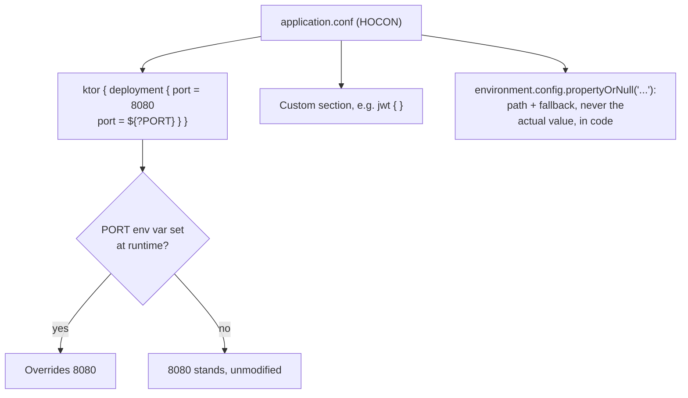

# Lesson 41. Configuration

**Mission link:** Lesson 40 stood up routing; a service that only works with values baked into the compiled code isn't deployable anywhere but the machine it was built on. Ktor's own configuration file model is how a port, a database URL, or a secret changes across environments without recompiling, and one specific substitution idiom is the difference between a config that has a safe default and one that silently breaks the moment an environment variable isn't set.
**Primary source:** [Docs: "Configuration in a file", Ktor](https://ktor.io/docs/server-configuration-file.html)
**Prerequisites:** [Lesson 40](0040-http-layer.md)

## Warm-up

1. ▢ Per lesson 40, what does Ktor activate by default, before anything is explicitly installed?

<details markdown="1"><summary>Check</summary>

Nothing. Ktor activates no plugins by default at all; every capability, routing included, has to be installed explicitly.

</details>

## Know this

### A configuration file is loaded automatically, separate from compiled code entirely

When a server is started with `EngineMain`, Ktor loads its configuration from a file named `application.conf` (HOCON) or `application.yaml` (YAML, which needs an extra dependency and isn't supported for Maven-based projects), found automatically in the resources directory. A configuration file needs, at minimum, a `ktor.application.modules` property naming which modules to load. This is what lets a service's actual runtime behavior change across environments without touching, or recompiling, a single line of the application's own code.

### Environment variable substitution is how the same file serves every environment

A configuration value can be substituted with an environment variable using `${ENV}` syntax in HOCON (or either `${ENV}` or `$ENV` in YAML). This is the mechanism for both per-environment values (a different port in development versus production) and for keeping something sensitive out of a file that might sit in source control: the file references an environment variable by name, and the actual value is supplied only where the service actually runs.

### The one idiom worth getting exactly right: a default plus an optional override

Writing `port = 8080` alone hardcodes the value; writing `port = ${PORT}` alone fails outright if `PORT` isn't set at runtime. The documented idiom for "a safe default, overridable by an environment variable if one happens to be present" is two lines together: `port = 8080` followed by `port = ${?PORT}`. The `?` inside the substitution marks it optional: if `PORT` exists in the environment, its value overrides the default already assigned on the line above; if it doesn't, the prior assignment simply stands, unmodified. Missing the `?`, or omitting the earlier default line, are the two ways to turn this idiom into a service that only starts correctly on whichever machine happens to already have every referenced variable set.

### Reading a value in code names its path and a fallback, never the real value itself

Application code retrieves a configuration value with something like `environment.config.propertyOrNull("some.path")`, supplying an explicit fallback at the call site rather than assuming the property is always present. The code that reads a configuration value never hardcodes what that value actually is in any given environment, only the property's path and what to do if it's absent, the same separation the file-based substitution idiom already established one level up.

### Custom sections live in the same file, alongside Ktor's own reserved block

Ktor's own settings live under a reserved `ktor { }` block (`deployment`, `application`, `security`, and similar groups), but a configuration file isn't limited to that block: an application can define its own custom sections directly alongside it, a `jwt { }` block for token settings, or any other application-specific group, using exactly the same file, the same substitution syntax, and the same lookup mechanism, rather than inventing a second configuration system for anything Ktor itself doesn't already define a slot for.



## Practice

1. ▢ A configuration file has only the line `port = ${PORT}`, with no prior default assigned. What happens if the service starts on a machine where `PORT` isn't set in the environment?

<details markdown="1"><summary>Hint</summary>

Think about what a required (non-optional) substitution needs to actually resolve to a value.

</details>

<details markdown="1"><summary>Check</summary>

It fails: a plain `${PORT}` substitution with no prior default requires the environment variable to actually be present, and with nothing set, there's no value to resolve to. This is exactly why the documented idiom pairs an ordinary default assignment with a separate, optional (`${?PORT}`) override line instead of relying on a single required substitution.

</details>

2. ▢ Rewrite `port = ${PORT}` (with no other line) so that it defaults to `8080` when `PORT` isn't set, but still honors `PORT` when it is.

<details markdown="1"><summary>Check</summary>

```text
port = 8080
port = ${?PORT}
```

The first line assigns the default. The second, using the optional `?` substitution, only overrides that default if `PORT` actually exists in the environment; if it doesn't, the first line's value stands.

</details>

3. ▢ Why does keeping a secret out of a checked-in `application.conf` file rely on the same mechanism as an ordinary per-environment value like a port number?

<details markdown="1"><summary>Check</summary>

Both use environment variable substitution: the file references the value by variable name rather than containing it directly, and the actual value, whether a port number or a secret, is supplied only in the environment the service actually runs in. There's no separate secrets mechanism; it's the identical substitution syntax doing two different jobs.

</details>

4. ▢ An application needs its own JWT issuer setting, something Ktor's own configuration properties don't define a slot for. Does this require a second configuration file or mechanism?

<details markdown="1"><summary>Check</summary>

No. A custom section (a `jwt { }` block, for instance) can live directly alongside Ktor's own reserved `ktor { }` block in the same `application.conf` file, using the identical substitution syntax and lookup mechanism, rather than requiring a separate configuration system for application-specific settings.

</details>

5. ▢ Which claim correctly describes the documented idiom for a configuration value with a safe default and an optional environment override?

    - a) A single required substitution, `value = ${ENV}`, is sufficient and always safe
    - b) A default assignment followed by an optional substitution on the next line, `value = default` then `value = ${?ENV}`, so the environment variable overrides the default only when it's actually present
    - c) Optional substitution (`${?ENV}`) and a prior default can never be combined in the same file
    - d) Custom, application-specific configuration sections require a completely separate file from Ktor's own settings

<details markdown="1"><summary>Check</summary>

**b)** That's the precise, documented idiom this lesson traces. (a) is false: a required substitution with no default fails outright if the environment variable is absent. (c) is false: combining the two is exactly the documented pattern for a safe, overridable default. (d) is false: a custom section lives in the same file, alongside Ktor's reserved block, not in a separate one.

</details>

## Real-world reps

- [ ] Find a Ktor service's `application.conf` (or `.yaml`) you have access to, and check whether its port, database URL, or any secret uses the default-plus-optional-override idiom, a bare required substitution, or a hardcoded value.
- [ ] Check whether that same file defines any custom, application-specific sections alongside Ktor's own `ktor { }` block, and whether the application code reading them supplies an explicit fallback at each call site.
- [ ] Tomorrow: read the primary source's section on command-line configuration overrides (`-config=anotherfile.conf`) in full, and note when you'd reach for a separate config file versus environment variable substitution in the same one.

## Going further

- [Docs: "Configuration in a file", Ktor](https://ktor.io/docs/server-configuration-file.html)
- [Resources](../RESOURCES.md)

---

Not landing? Reread the primary source at the top, since this lesson compresses it and compression is where understanding leaks. Check the [glossary](../GLOSSARY.md) for any term that felt slippery.

If the lesson itself is unclear rather than the material, that is a defect: [open an issue](https://github.com/TokenCemetery/teach/issues).
