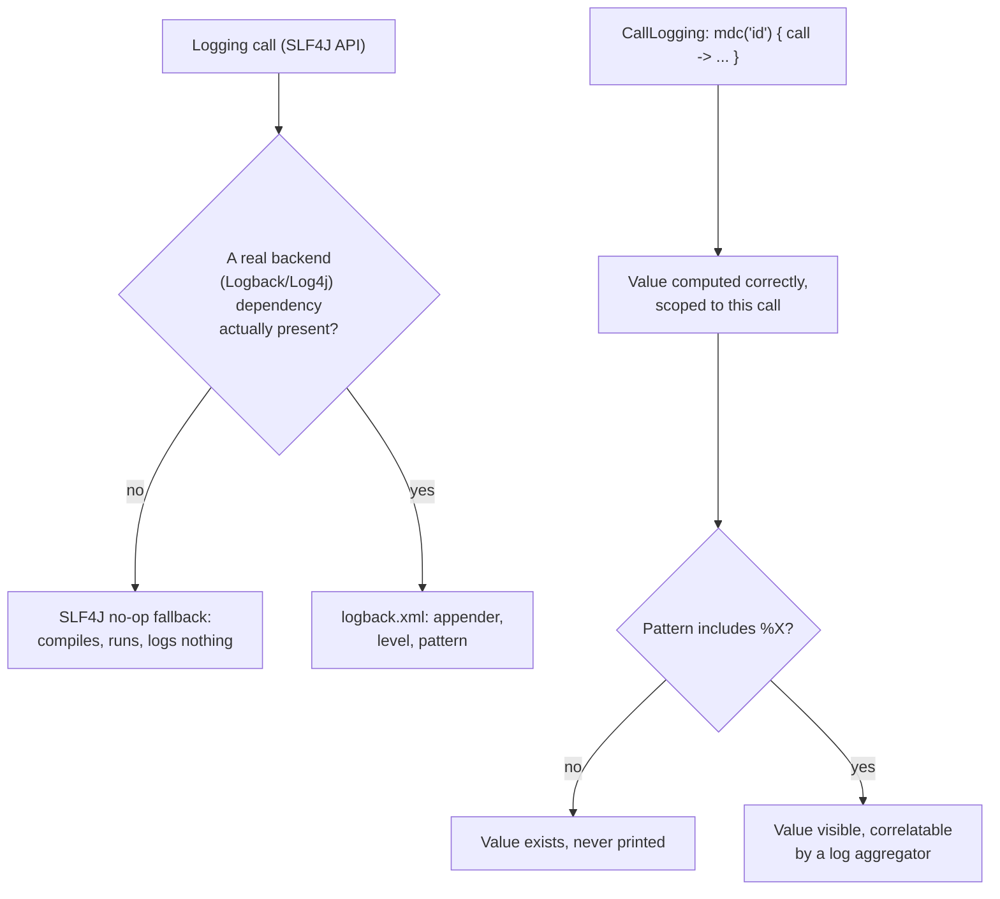

# Lesson 42. Logging

**Mission link:** Lesson 41 externalized a service's configuration; logging is what a service says about what actually happened while it ran, using those configured values. The two things most worth knowing here share the same shape: something that looks fully configured and produces no error, while silently doing nothing at all, until one more, easy-to-forget piece is also in place.
**Primary source:** [Docs: "Logging in Ktor Server", Ktor](https://ktor.io/docs/server-logging.html), [Docs: "Call logging", Ktor](https://ktor.io/docs/server-call-logging.html)
**Prerequisites:** [Lesson 41](0041-configuration.md), [Lesson 40](0040-http-layer.md)

## Warm-up

1. ▢ Per lesson 40, what does Ktor activate by default, and what does that mean for any given capability?

Check

Nothing. Ktor activates no plugins by default at all, so any capability, logging included, has to be installed explicitly before it does anything.

## Know this

### SLF4J is an API with no implementation of its own, and its silent fallback matters

On the JVM, Ktor uses SLF4J (the Simple Logging Facade for Java) as its logging abstraction: an API decoupled from any specific logging framework, letting an application swap in whichever concrete implementation (Logback, Log4j) fits. If no such framework is actually provided as a dependency, SLF4J defaults to a no-operation implementation, which effectively disables logging entirely. This is the first trap worth naming precisely: adding SLF4J-based logging calls throughout a codebase, with no Logback or Log4j dependency actually present, compiles and runs without a single error, and produces no logged output at all.

### A real backend needs its own configuration file, separate from the API calls that use it

Configuring Logback specifically means placing a `logback.xml` on the classpath, typically `src/main/resources`, defining an appender (an `STDOUT` appender is the common starting point), a root logging level, and a pattern describing what each line prints (timestamp, thread, level, logger name, message). Nothing about the application's own logging calls changes based on this file; the file is entirely what decides whether, and how, those calls actually produce visible output.

### `CallLogging` is installed explicitly, like anything else in Ktor, and can be filtered

The `CallLogging` plugin logs incoming requests, at `Level.INFO` by default, configurable via its `level` property, and installed the same explicit way lesson 40 already established for every other Ktor capability. Its `filter { }` block narrows what actually gets logged, for instance `filter { call -> call.request.path().startsWith("/api/v1") }` to log only requests under one specific path, rather than every request a busy service receives.

### MDC values are computed per request, and invisible until the log pattern is updated too

`CallLogging` supports adding request-specific values to the **MDC** (Mapped Diagnostic Context) with `mdc("name") { call -> ... }`, a provider function computing the value from the current call. That value exists in the MDC only for the lifetime of the specific `ApplicationCall` it was computed for, and is removed automatically once that call finishes processing. This is the second version of the same trap the lesson opened with: adding an `mdc(...)` block produces nothing visible in the actual log output unless the Logback pattern itself is separately updated to include `%X`, the token that prints MDC content; the value is genuinely being computed and stored, correctly, the entire time, it's simply never printed until the pattern says to.

### Why MDC is worth the extra step: it's what a log aggregator actually correlates on

A request ID (or any other per-request value) placed in the MDC and printed via `%X` is exactly the field a log aggregator like Graylog or Datadog indexes on, letting every log line a single request produced, across every layer it passed through, be found together by querying that one value. This is the actual payoff that makes the second configuration step worth remembering: without it, an MDC value that was computed correctly the whole time never becomes the thing that makes an incident easy to trace.

## Practice

1. ▢ A codebase has SLF4J logging calls throughout, including several `logger.info(...)` calls in request handlers, but no Logback or Log4j dependency was ever added to the build. What happens when those calls run?

Hint

Think about what SLF4J actually is, versus what does the actual writing.

Check

Nothing visible: SLF4J is only an API, and with no concrete logging framework present, it falls back to a no-operation implementation. The calls compile and execute without error, but no output is ever actually produced, since there's no real backend behind the API to do the writing.

2. ▢ Does changing a `logback.xml` file's pattern or level require touching any of the application's own `logger.info(...)` calls?

Check

No. The application's logging calls stay exactly as written; `logback.xml` is entirely separate configuration deciding whether, and how, those calls actually produce visible output (which appender, what level, what each line's format looks like).

3. ▢ A service installs `CallLogging` with `mdc("requestId") { call -> call.request.headers["X-Request-Id"] }`, expecting to see the request ID in every log line. Nothing shows up. What's the most likely reason?

Check

The Logback pattern itself hasn't been updated to include `%X`, the token that prints MDC content. The `mdc(...)` block is computing and storing the value correctly, scoped to each call, but nothing about adding it to the MDC makes it appear in the actual log line unless the pattern is separately told to print MDC content at all.

4. ▢ Why is an MDC value's lifetime tied to the specific `ApplicationCall` it was computed for, rather than lasting for the whole application's runtime?

Check

Because it's meant to correlate log lines from one specific request, not describe something true of the whole application; being scoped to that call's lifetime and removed automatically afterward is what keeps one request's diagnostic value from leaking into a completely unrelated request's log lines.

5. ▢ Which claim correctly describes the two traps this lesson names?

    - a) Both are compile errors that fail the build immediately if either piece is missing
    - b) SLF4J silently produces no output at all without a real backend dependency, and an MDC value is silently invisible in the log output without a pattern update to print it; neither missing piece causes any error, only silent absence of the expected result
    - c) Adding a Logback dependency automatically adds `%X` to every log pattern, so MDC values are always visible once logging itself works
    - d) `CallLogging`'s `filter` block and its `mdc` block do the same job, filtering which requests get logged

Check

**b)** That's the precise, shared shape of both traps this lesson traces. (a) is false: both are silent, producing no error at all, which is exactly what makes them worth naming explicitly rather than assuming a mistake here would announce itself. (c) is false: a Logback dependency being present says nothing about what its own pattern actually prints; `%X` has to be added deliberately. (d) is false: `filter` decides which requests are logged at all, while `mdc` adds extra, per-request diagnostic values to whatever does get logged, two different jobs.

## Real-world reps

- [ ] Check a Ktor service you have access to for an actual logging backend dependency (Logback or Log4j), not just SLF4J calls, and confirm log output is genuinely being produced somewhere, not silently swallowed by the no-op fallback.
- [ ] Find (or add) an `mdc(...)` block in a `CallLogging` installation you have access to, and confirm the corresponding `logback.xml` pattern actually includes `%X` so the value is visible in real output.
- [ ] Tomorrow: pick one field worth correlating across a request's full log trail (a request ID, a user ID), add it to the MDC if it isn't already there, and confirm it shows up correctly in a real log line.

## Going further

- [Docs: "Logging in Ktor Server", Ktor](https://ktor.io/docs/server-logging.html)
- [Docs: "Call logging", Ktor](https://ktor.io/docs/server-call-logging.html)
- [Resources](../RESOURCES.md)

---

Not landing? Reread the primary source at the top, since this lesson compresses it and compression is where understanding leaks. Check the [glossary](../GLOSSARY.md) for any term that felt slippery.

If the lesson itself is unclear rather than the material, that is a defect: [open an issue](https://github.com/TokenCemetery/teach/issues).
