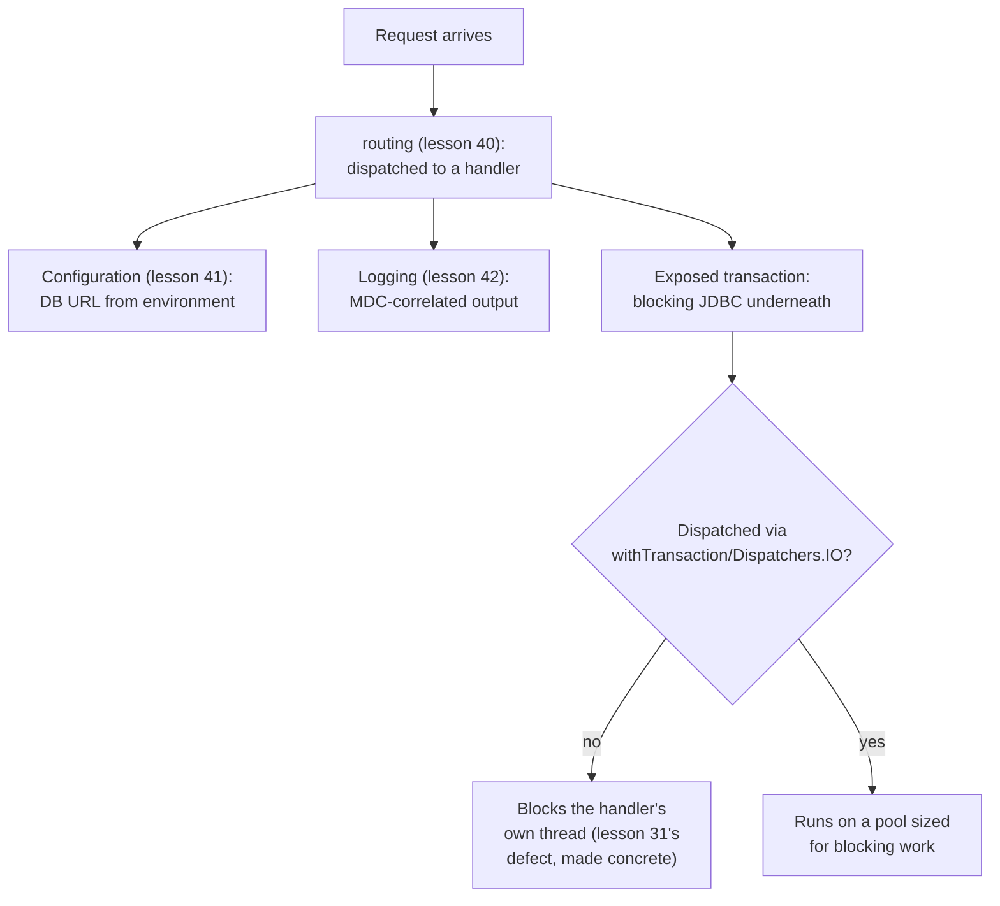

# Lesson 43. Persistence

**Mission link:** This is stage 10's capstone. Lesson 40 routed a request, lesson 41 gave it configuration to read, lesson 42 gave it something to say about what happened; persistence is where that request actually reads or writes data, and Exposed is mostly blocking underneath, which means this lesson closes the loop lesson 31 opened when it named "blocking calls" as the fifth decision that decides whether a service is testable and correct.
**Primary source:** [Docs: "Working with Transactions", Exposed](https://www.jetbrains.com/help/exposed/transactions.html), [Docs: "Integrate a database with Kotlin, Ktor, and Exposed", Ktor](https://ktor.io/docs/server-integrate-database.html)
**Prerequisites:** [Lesson 42](0042-logging.md), [Lesson 36](0036-type-safe-builders-and-dsls.md), [Lesson 31](0031-structuring-a-service.md)

## Warm-up

1. ▢ Per lesson 31, what's the fix for a blocking call made directly inside a request handler, and why does it matter which dispatcher runs it?

Check

Wrap it in `withContext(Dispatchers.IO)` (or a `limitedParallelism` view of it), rather than letting it run on whatever dispatcher the handler is already on. A blocking call occupies its thread for as long as it blocks, and `Dispatchers.IO` is sized and intended for exactly this kind of work, unlike the default dispatcher a coroutine builder falls back to.

2. ▢ Per lesson 36, what makes `routing { get(...) { } }` a type-safe builder rather than bespoke framework syntax?

Check

It's an ordinary function taking a receiver-style lambda, nested recursively, the same mechanism lesson 15 introduced for `run` and `apply`, applied here to HTTP routing instead of anything web-framework-specific.

## Know this

### Exposed offers two abstraction levels, and its DSL is another type-safe builder

Exposed, JetBrains' own Kotlin SQL library on top of JDBC, offers two ways to work with a database: a type-safe DSL that catches query errors at compile time, and a lighter DAO layer with Kotlin-native object mapping. The DSL is worth recognizing for what it actually is: another concrete instance of lesson 36's type-safe builder mechanism, now applied to constructing SQL, the identical receiver-style pattern behind an HTML builder or a routing block, doing real work a third time in this arc.

### Exposed is mostly blocking, because JDBC itself is

Exposed interacts with a database through JDBC, an API designed in an era of blocking calls, so an ordinary Exposed transaction executes synchronously on the current thread. This is exactly the collision point lesson 31 already named in the abstract, as its fifth testability decision, "blocking calls," now made completely concrete: an ordinary `transaction { }` block called directly inside a suspending request handler blocks whatever thread is running that handler for as long as the query takes.

### Coroutine-friendly transactions exist, and Ktor's own pattern dispatches them correctly

For JDBC-based Exposed, `newSuspendedTransaction` and `suspendedTransactionAsync` are the coroutine-friendly entry points; for a genuinely non-blocking reactive driver, `exposed-r2dbc` offers a `suspendTransaction()` instead. Ktor's own documented integration pattern wraps this in a `withTransaction()` function that runs the suspending block inside a new top-level transaction while switching the coroutine context to `Dispatchers.IO`, so the blocking JDBC work underneath actually lands on a thread pool sized and intended for blocking I/O, exactly the fix lesson 31 already prescribed for a blocking call in general, now shown as this specific library's own documented answer.

### Suspend transactions always start fresh, which changes what nesting them means

`newSuspendedTransaction` and `suspendedTransactionAsync` are documented to always execute in a new transaction, specifically to prevent the concurrency issues a `CoroutineDispatcher` could otherwise introduce by reordering query execution across threads. This means nesting these suspend-aware functions doesn't behave the way Exposed's ordinary nested transactions do; an exception inside an *ordinary* nested transaction block only rolls back that inner block, via a SQL `SAVEPOINT` marked at the block's start and released on exit, without touching the outer transaction at all, but a suspend transaction nested inside another isn't automatically the same kind of inner block, since it started fresh rather than joining the transaction already in progress.

### The stage 10 capstone: one request, four decisions, working together

A single request now runs through all of stage 10's material at once: routing (lesson 40) dispatches it to a handler, the handler reads whatever configuration it needs (lesson 41, a database URL substituted from the environment rather than hardcoded), logs what it's doing with a request-correlated MDC value that will actually show up in the output (lesson 42), and persists or reads data through a transaction dispatched onto `Dispatchers.IO` rather than blocking the handler's own thread (this lesson). Stage 7's own "Has shipped a typed, tested Kotlin backend service" is satisfied by that combination, not by structure alone: lesson 31 gave the service its shape, and stage 10 is what makes that shape actually route requests, read real configuration, say what happened, and touch a real database, the service stage 7 structured and this stage completed, together.

## Practice

1. ▢ A request handler calls `transaction { Users.selectAll() }` directly, with no suspend-aware wrapper, inside a suspending function. What happens to the thread running that handler while the query executes?

Hint

Think about what "executes synchronously on the current thread" actually costs.

Check

It blocks: an ordinary Exposed transaction runs synchronously on the calling thread, so the thread running the handler is occupied for the entire duration of the query, unable to do anything else, exactly the blocking-call defect lesson 31 already named as a testability and correctness problem.

2. ▢ Why does Ktor's documented `withTransaction()` pattern switch the coroutine context to `Dispatchers.IO` specifically, rather than leaving the transaction running on whatever dispatcher the handler already had?

Check

Because Exposed's transaction is still fundamentally blocking JDBC work underneath, even when called through a suspend-aware wrapper, and `Dispatchers.IO` is the dispatcher sized and intended for exactly this kind of blocking work, unlike a general-purpose dispatcher a coroutine builder would otherwise fall back to.

3. ▢ An exception is thrown inside an ordinary nested transaction block (not a suspend-aware one). What actually gets rolled back?

Check

Only that inner block, via a SQL `SAVEPOINT` marked at its start and released on exit; the outer transaction it's nested inside is unaffected by the inner block's rollback.

4. ▢ Why doesn't nesting a `newSuspendedTransaction` inside another transaction behave the same way as nesting an ordinary ("plain") Exposed transaction?

Check

`newSuspendedTransaction` always starts a brand-new transaction rather than joining the one already in progress, specifically to avoid concurrency issues a `CoroutineDispatcher` could introduce by reordering query execution across threads. Since it isn't actually an inner block of the outer transaction the way an ordinary nested transaction is, the SAVEPOINT-based, inner-only rollback behavior that applies to ordinary nesting doesn't apply here the same way.

5. ▢ Which claim correctly describes Exposed's relationship to blocking and coroutines?

    - a) Exposed is fully non-blocking and coroutine-native by default, requiring no special handling inside a suspending function
    - b) Exposed is mostly blocking because it wraps JDBC; coroutine-friendly entry points (`newSuspendedTransaction`, or `suspendTransaction()` with R2DBC) exist, and Ktor's own pattern additionally dispatches the work onto `Dispatchers.IO` so it doesn't block whatever thread is running the handler
    - c) Nesting a `newSuspendedTransaction` inside another transaction behaves identically to nesting an ordinary transaction, with the same SAVEPOINT-based rollback scoping
    - d) The DSL and DAO layers are two names for the exact same API with no difference in abstraction level

Check

**b)** That's the precise relationship this lesson traces, from JDBC's blocking nature to the specific, documented fixes. (a) is false: JDBC's blocking nature is exactly why coroutine-friendly wrappers and explicit dispatching exist in the first place. (c) is false: a suspend transaction always starts fresh rather than joining the outer one, which is precisely why its nesting behavior differs from an ordinary nested transaction's SAVEPOINT scoping. (d) is false: the DSL is type-safe, compile-time-checked query building, while the DAO layer is a lighter, Kotlin-native object-mapping abstraction, genuinely different levels.

6. ▢ **Stage capstone.** A request arrives at a Ktor service for `GET /orders/{id}`. Walk through, naming the specific stage 10 lesson each step draws on, how this single request should be routed, configured, logged, and persisted, and name the one mistake at each step that would make the request work by accident rather than by design.

Check

**Routing (lesson 40):** the handler is reached through an installed `routing { get("/orders/{id}") { ... } }` block, extracting `id` with a throwing parameter accessor like `requirePathParameter`, not a nullable one silently defaulting to something wrong if the path segment were ever missing. **Configuration (lesson 41):** the database connection string comes from `environment.config.propertyOrNull(...)`, itself substituted from an environment variable with a safe default (`${?DB_URL}` pattern), never a value hardcoded into the compiled service. **Logging (lesson 42):** the handler logs that it received the request with an `mdc("requestId") { ... }` value, and the Logback pattern actually includes `%X`, otherwise the value is computed correctly but never appears in the output. **Persistence (this lesson):** the actual database read runs through a suspend-aware transaction dispatched onto `Dispatchers.IO`, such as Ktor's `withTransaction()` pattern, rather than a plain `transaction { }` block blocking the handler's own thread for the query's duration. Each step's "works by accident" version compiles and often even functions correctly under light load; what stage 10 as a whole asks for is the version that's actually correct, not merely the version that happens not to have broken yet.

## Real-world reps

- [ ] Find a database call in a Kotlin service you have access to (Exposed or otherwise), and confirm whether it's dispatched onto a dispatcher suited for blocking work, or running directly on whatever dispatcher called it.
- [ ] Find a nested transaction (ordinary or suspend-aware) in code you have access to, and work out, using this lesson's distinction, what actually gets rolled back if the inner block throws.
- [ ] Tomorrow: reread stage 7's own "Done when," and for a service you've built across this arc's lessons, confirm it actually satisfies routing, configuration, logging, and persistence together, not just the structural shape lesson 31 described.

## Going further

- [Docs: "Working with Transactions", Exposed](https://www.jetbrains.com/help/exposed/transactions.html)
- [Docs: "Integrate a database with Kotlin, Ktor, and Exposed", Ktor](https://ktor.io/docs/server-integrate-database.html)
- [Resources](../RESOURCES.md)

---

Not landing? Reread the primary source at the top, since this lesson compresses it and compression is where understanding leaks. Check the [glossary](../GLOSSARY.md) for any term that felt slippery.

If the lesson itself is unclear rather than the material, that is a defect: [open an issue](https://github.com/TokenCemetery/teach/issues).
