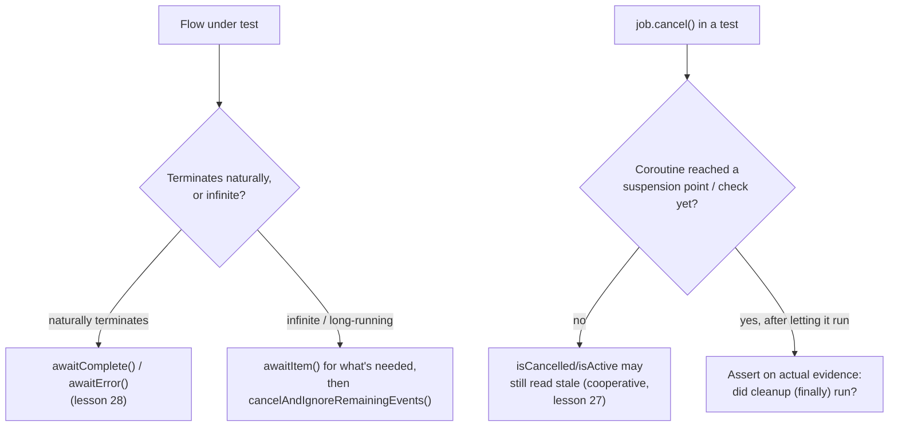

# Lesson 44. Testing Coroutines Beyond runTest

**Mission link:** Lesson 28 gave Turbine's basics and named the hang its cleanup footgun causes. Two things are still missing: the specific tool for a flow that never terminates on its own, rather than one that eventually does, and what actually counts as evidence that a coroutine responded to cancellation, given lesson 27's own point that cancellation is cooperative and doesn't update everything the instant `cancel()` is called.
**Primary source:** [Turbine, Cash App](https://github.com/cashapp/turbine), [Docs: "Cancellation and timeouts", Kotlin](https://kotlinlang.org/docs/cancellation-and-timeouts.html)
**Prerequisites:** [Lesson 28](0028-test-frameworks.md), [Lesson 27](0027-cancellation-and-exception-handling.md)

## Warm-up

1. ▢ Per lesson 28, what's the actual cause of a Turbine test that hangs forever instead of failing, and what are the two documented fixes?

Check

`testIn` cannot clean up the coroutine it started, so a flow that never terminates keeps the test waiting forever. The two fixes are passing `runTest`'s `backgroundScope` to `testIn` (which handles cleanup automatically), or terminating the turbine explicitly with `cancel()`, `awaitComplete()`, or `awaitError()` before the scope ends.

2. ▢ Per lesson 27, why is cancellation described as cooperative rather than immediate?

Check

A coroutine only actually responds to a cancellation request at a suspension point, or when it explicitly checks (`isActive`, `ensureActive()`). Requesting cancellation doesn't stop code already running between checks; it's the coroutine's own next check or suspension that turns the request into an actual stop.

## Know this

### An infinite flow needs a specific tool, not just "call cancel eventually"

A flow that emits continuously and never completes on its own (a live sensor reading, a repeated poll) can still be tested by collecting a bounded number of items and stopping deliberately. Turbine's `cancelAndIgnoreRemainingEvents()` is the specific, documented tool for exactly this: assert on however many items with `awaitItem()` the test actually needs, then call it to cleanly stop collecting without the flow ever needing to terminate naturally, and without leaving a dangling coroutine behind the way an unterminated `testIn` would. This is a more specific answer than lesson 28's general mention of `cancel()`, purpose-built for the infinite-flow case specifically.

### Two more assertions worth knowing: consumed everything, and skip to the latest

`ensureAllEventsConsumed()` asserts that every event a flow actually emitted was accounted for by the test, catching the case where a test's assertions quietly stopped short of everything that happened. `expectMostRecentItem()` does the opposite of waiting for the very next emission: it skips ahead and returns whatever the most recently emitted value is, useful against a flow that emits faster than a test cares to assert on every single value one at a time.

### Turbine's own documented dependency risk, worth knowing rather than assuming

Turbine's own documentation states plainly that, while Turbine's public API is stable, it currently depends on an unstable API from the coroutines test artifact (`UnconfinedTestDispatcher` internals) specifically to integrate with `runTest`. Without that dependency, Turbine's integration with `runTest` would break, and a future coroutines library update could still alter that unstable API's behavior. This is the library's own honest statement of a real risk, not a criticism to hold against it; it's worth knowing before blaming Turbine itself for a break that actually originates one dependency layer down.

### A cancellation test's real evidence is that cleanup ran, not just that a flag flipped

The documented guarantee behind cancellation is that a `finally` block (or an `invokeOnCompletion` handler) still runs once a coroutine is cancelled. This is what a test verifying cancellation should actually assert: that whatever cleanup the cancelled code was supposed to perform actually happened, not merely that a `Job`'s `isActive` or `isCancelled` property changed value, which is a weaker, more incidental fact about the coroutine's bookkeeping rather than about anything the cancelled code was actually responsible for doing.

### Calling `cancel()` in a test doesn't instantly update everything, because cancellation is cooperative

A documented, real gotcha: calling `job.cancel()` inside a test and immediately reading `job.isCancelled` or `job.isActive` can show stale values, since lesson 27 already established that a coroutine only actually processes a cancellation request at its next suspension point or check, not the instant `cancel()` is called. A test that asserts state right after calling `cancel()`, with nothing in between letting the coroutine actually run, is checking before the coroutine has had any chance to respond at all. The fix mirrors lesson 28's own dispatcher discipline: let the coroutine actually get a turn, whether that means advancing the test scheduler or otherwise giving the cancelled coroutine a chance to reach a check, before asserting on what cancellation was supposed to produce.

## Practice

1. ▢ A test needs to verify the first three values a continuously-emitting flow produces, then stop, without waiting for the flow to ever complete on its own (it never will). What's the specific Turbine call for ending the test cleanly here?

Hint

Think about what a flow that never completes actually needs, as opposed to one that eventually does.

Check

`cancelAndIgnoreRemainingEvents()`, called after asserting on the three items with `awaitItem()`. It's purpose-built for exactly this case: stopping collection cleanly on a flow that was never going to terminate on its own, without leaving a dangling coroutine the way an unterminated collection would.

2. ▢ A test asserts on the first two items a flow emits, then ends without calling `ensureAllEventsConsumed()`. The flow actually emitted a third item the test never checked. What does `ensureAllEventsConsumed()` catch, and why didn't the two-item test already catch it?

Check

`ensureAllEventsConsumed()` asserts that every event a flow actually emitted was accounted for; without it, a test that only checks the first two items has no way to notice a third, unasserted emission happened, since nothing forced it to look. Adding the call would have caught the discrepancy the original test silently missed.

3. ▢ A test calls `job.cancel()` and then immediately checks `job.isCancelled`, expecting `true`, but sees `false`. Is this necessarily a bug in the coroutine being tested?

Check

Not necessarily. Cancellation is cooperative: the coroutine only actually processes the cancellation request at its next suspension point or check, so reading `isCancelled` immediately after calling `cancel()`, with nothing letting the coroutine actually run in between, can see a stale value rather than a wrong one. The fix is giving the coroutine an actual chance to reach a check before asserting, not assuming the coroutine itself is broken.

4. ▢ A test verifies that a cancelled coroutine's `Job.isActive` becomes `false`. Is this sufficient evidence that the coroutine's cancellation-time cleanup actually ran?

Check

No. `isActive` becoming `false` is bookkeeping about the job's own state, not evidence that whatever cleanup code (a `finally` block, an `invokeOnCompletion` handler) was supposed to run on cancellation actually did. The stronger, more relevant assertion is checking that the cleanup itself happened, since that's the guarantee cancellation actually makes and the thing a real cancellation test should verify.

5. ▢ Which claim correctly describes testing an infinite flow and testing cancellation together?

    - a) `cancelAndIgnoreRemainingEvents()` and checking `Job.isActive` immediately after `cancel()` are both fully reliable, synchronous checks with no timing considerations
    - b) `cancelAndIgnoreRemainingEvents()` is the specific tool for ending a Turbine collection on a flow that never completes naturally, while a cancellation test should assert on cleanup actually running (not just a `Job` flag) and give the coroutine a chance to reach a suspension point before checking, since cancellation is cooperative
    - c) Turbine has no documented dependency on any unstable API and is entirely independent of `kotlinx-coroutines-test`'s internals
    - d) `expectMostRecentItem()` and `awaitItem()` do the same thing: both wait for and return the very next emitted value

Check

**b)** That's the precise pair of lessons this stage's final lesson draws from Turbine and from lesson 27's cooperative cancellation model. (a) is false: `job.isCancelled`/`isActive` can read stale immediately after `cancel()`, precisely because cancellation is cooperative, not instantaneous. (c) is false: Turbine's own documentation states it depends on an unstable `kotlinx-coroutines-test` API (`UnconfinedTestDispatcher` internals) to work with `runTest`. (d) is false: `awaitItem()` waits for the next emission specifically, while `expectMostRecentItem()` skips ahead to whatever the latest one already was.

## Real-world reps

- [ ] Find (or write) a test for a flow that never completes on its own, and confirm it uses `cancelAndIgnoreRemainingEvents()` (or an equivalent deliberate termination) rather than letting the test hang or terminate ambiguously.
- [ ] Find a test asserting a coroutine's cancellation behavior, and check whether it verifies actual cleanup (a `finally` block's effect) or only a `Job`'s `isActive`/`isCancelled` flag. Strengthen it if it's only checking the flag.
- [ ] Tomorrow: write a small test that calls `cancel()` on a job and immediately checks its state, without letting it run first. Confirm for yourself whether the check reads what you expected, and if not, add whatever's needed to let the coroutine actually process the cancellation before asserting.

## Going further

- [Turbine, Cash App](https://github.com/cashapp/turbine)
- [Docs: "Cancellation and timeouts", Kotlin](https://kotlinlang.org/docs/cancellation-and-timeouts.html)
- [Resources](../RESOURCES.md)

---

Not landing? Reread the primary source at the top, since this lesson compresses it and compression is where understanding leaks. Check the [glossary](../GLOSSARY.md) for any term that felt slippery.

If the lesson itself is unclear rather than the material, that is a defect: [open an issue](https://github.com/TokenCemetery/teach/issues).
