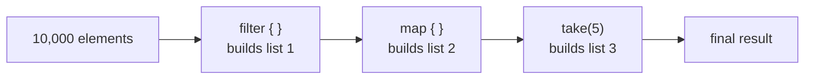
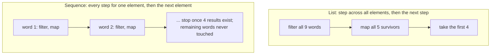
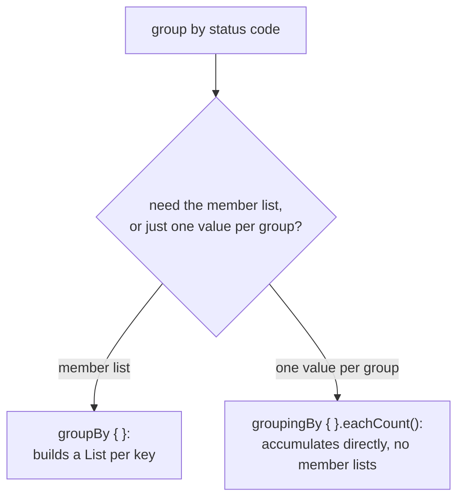

# Collections and Sequences

Choosing between a collection pipeline and a sequence, and defending the cost of each.

## Collection operators are extension functions, eager, and leave the receiver alone

Collection operators (`map`, `filter`, ...) are extension functions over `Iterable`, not members: a Java `Iterable` arriving through interop gets the whole operator set too. **Every operator returns a new result and never mutates the receiver.** `numbers.filter { it.length > 3 }` on a line by itself runs the predicate over every element, builds a list, and discards it; `numbers` is unchanged. Unlike Java's `Stream`, where a pipeline with no terminal operation does *no* work at all, here the work already happened, only the result was lost.

**The result type is not the receiver's type.** `filter` on a `List` or a `Set` both return a `List`; only on a `Map` does it return a `Map`. `map` always returns a `List`, so `setOf(1, 2, 3).map { it % 2 }` is `[1, 0, 1]`, duplicate included. Use the `...To(destination)` variants (`mapTo`, `filterTo`, `associateTo`, ...) to collect into a specific container instead.

| Group | Operators | Remember |
|---|---|---|
| Transform | `map`, `mapIndexed`, `mapNotNull` | `mapNotNull` transforms and drops `null` results in one step |
| Flatten | `flatten`, `flatMap` | `flatMap` is `map` then `flatten` |
| Narrow | `filter`, `filterNot`, `filterIsInstance` | `filterIsInstance` is inline + reified, so its type test survives erasure |
| Split | `partition` | One traversal, returns a `Pair` of lists: matches first, rest second |
| Test | `any`, `none`, `all` | See vacuous truth below |

**`all` is vacuously true on an empty collection** (no element fails the predicate, so nothing makes it false); `any` is the mirror and returns `false` there. A validation guard written with `all` waves an empty batch straight through.

**Each operator builds a complete new collection before the next sees it.** A three-operator chain over 10,000 elements builds three lists, two of which exist only to be discarded, unlike Java's lazy streams.



## Sequences: lazy where a collection chain is eager

`Sequence<T>` offers the same operations as `Iterable`, over a different execution model: it doesn't hold elements, it produces them while iterating. Two things change, worth stating separately (they are not both "sequences are faster"):

**When the work happens.** A `Sequence` chain is lazy: nothing runs until a **terminal operation** (`toList()`, `sum()`, iteration) requests the whole chain's result. An operation returning another lazy sequence is **intermediate** and runs nothing. So the trap inverts from the eager case: a sequence chain with no terminal operation does *nothing at all*, where a list chain with no held result still did all the work.

**The order the work happens in.** `Iterable` finishes each step across the whole collection before starting the next step. `Sequence` runs every step for one element, then moves to the next element:



This is what lets `take(4)` cut a sequence chain short: elements past the fourth result are never touched at all.

**Ways to get a sequence:**

| Construct | For |
|---|---|
| `numbers.asSequence()` | A collection you already hold, when the chain over it is worth streaming |
| `sequenceOf(...)` | A sequence written literally |
| `generateSequence(seed) { it + 1 }` | Computed from the previous element; ends when the lambda returns `null`, otherwise infinite |
| `sequence { yield(1); yieldAll(rest) }` | Produced one at a time or in chunks |

**When a sequence is not worth it**: a small collection or trivial per-element work (laziness has its own overhead); a single-step chain (no intermediate collection to avoid); a **stateful** step like sorting, which must accumulate every element before emitting one anyway, erasing the streaming benefit from that point on. (Kotlin's `Sequence` is the near-analogue of Java's `Stream`; the Java-habit instinct that misled you on eager collection operators is *correct* here.)

## `fold` vs `reduce`: the doubled-first-element trap

Both walk the elements in order, applying `(accumulator, element) -> newAccumulator`. The only difference is the start: `fold` seeds with an explicit initial value; `reduce` seeds with the first two elements.

```text
numbers.fold(0) { sum, e -> sum + e * 2 }     // every element doubled: correct
numbers.reduce { sum, e -> sum + e * 2 }      // first element never doubled: silent bug
```

Both compile, both look reasonable; the gap is exactly the undoubled first element. Consequences: `reduce`'s accumulator is stuck at the element type (no initial value to seed a different type with); `fold` can accumulate into anything (`Map`, `StringBuilder`, a domain object). `reduce` on an empty collection **throws** (nothing to return); `fold` returns the initial value with no special case; `reduceOrNull()` returns `null` instead of throwing.

| Variant | Note |
|---|---|
| `foldRight`/`reduceRight` | Same accumulation from the last element backwards; **lambda parameters swap**: element first, accumulator second |
| `runningFold`/`scan` | Keeps every intermediate accumulator, returns the list of them |
| `runningReduce` | Same, seeded the way `reduce` seeds |

## `groupBy` vs `groupingBy`

`groupBy { }` returns a `Map<K, List<T>>`: every member list is fully built. Right tool when you need the members. Wrong tool when you only need one value per group: `groupBy { it.status }.mapValues { it.value.size }` builds every member list, then throws each one away for its size.

`groupingBy { }` returns a `Grouping`, not a `Map`; operations on it (`eachCount()`, or its own `fold`/`reduce`/`aggregate`) accumulate one value per key **without ever materializing the member lists**.



Grouping is inherently **stateful**: it must hold a slot for every key seen, so its own result is always materialized regardless of `asSequence()`. What laziness still buys in front of a grouping step is everything upstream of it (the filters/maps that would otherwise each build a full intermediate list).

## Defending a pipeline's cost

```text
lines.asSequence().filter { it.isToday() }.groupingBy { it.status }.eachCount()
```

For 10 million lines: `asSequence()` avoids building a full filtered list and a full status-code list before counting anything; `groupingBy` avoids one member list per status code. What's materialized regardless: the result map, one entry per distinct status code, small and bounded, unlike the line count. For 20 lines, the eager version is the better call: laziness's own overhead isn't worth paying. "Use a sequence, sequences are faster" is not a defense; naming what a specific choice avoids building, for a stated input size, is.

## Related

- [Lesson 19](../lessons/0019-collection-operators.md), [Lesson 20](../lessons/0020-sequences-and-laziness.md), [Lesson 21](../lessons/0021-grouping-and-folding.md)
- [Idiom](idiom.md): extension functions, the mechanism collection operators are built from
