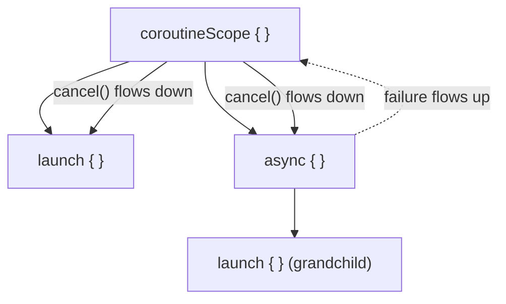
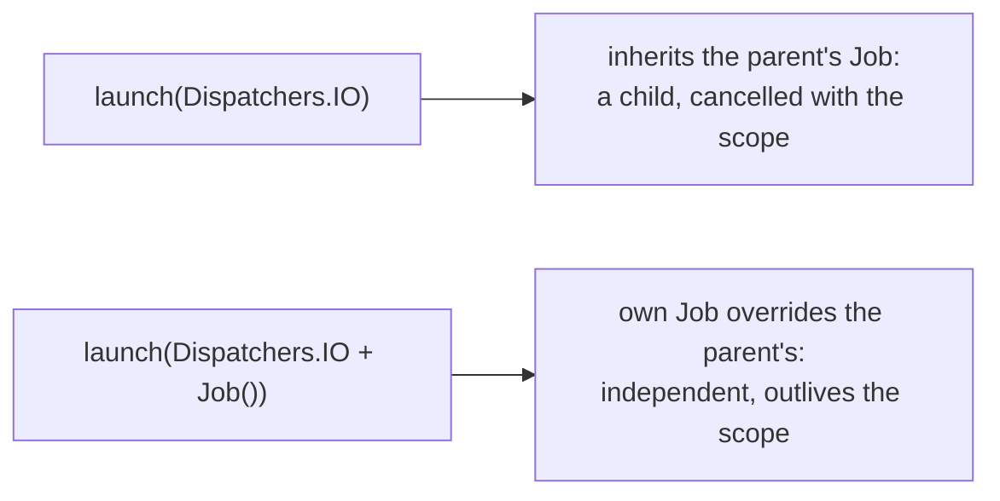
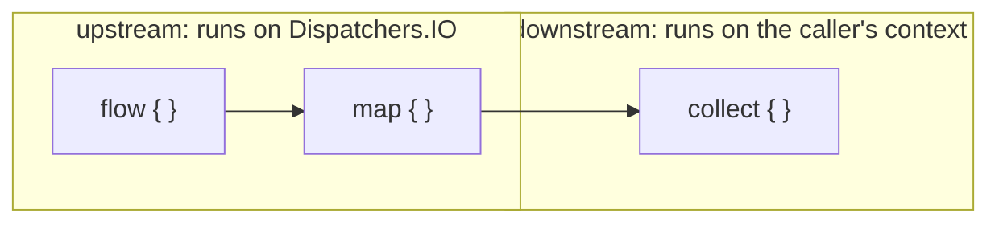
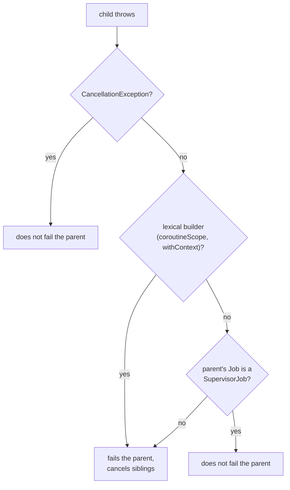

# Concurrency

Predicting what a concurrent coroutine program does before running it. Built for lookup.

## The memory model is the JVM's, not Kotlin's own

Kotlin compiles to the same bytecode Java does, so visibility between threads is governed by the JLS, not by anything Kotlin-specific. See the [Java workspace's concurrency sheet](../../java/reference/concurrency.md) for happens-before edges and visibility-vs-atomicity in full; what follows is only the Kotlin-specific spelling.

| Java | Kotlin | What it does |
|---|---|---|
| `volatile` field | `@Volatile` on a `var` | Atomic reads/writes of the **backing field**; a write is visible to other threads |
| `synchronized` method | `@Synchronized` on a function | Locks the instance's monitor (or the class's, if static). JVM-only; wrong on an extension function (locks the compiled facade class's monitor, not the receiver) |
| `synchronized (lock) { }` | `synchronized(lock) { }` | An ordinary inline function, not a language construct |
| `final` field | `val` with a backing field | The publication guarantee: fields are visible correctly once construction finishes |

**Two guarantees a `val` does not give you:**

- **`val` is not thread safety.** It only guarantees the *reference* is fixed and (via the `final` field publication guarantee) that the object's own fields were correctly initialized when construction finished. A `val` holding a shared `MutableMap` is still a data race on the map's contents.
- **`@Volatile` is not atomicity.** It gives visibility plus atomicity of *one* read or *one* write of the field. `counter++` is a read then a write; two threads can both read 41 and both write 42, losing an increment. Fix: an atomic type or a lock, not a stronger annotation.

**`by lazy` defaults to thread-safe** (`LazyThreadSafetyMode.SYNCHRONIZED`: a lock ensures single initialization, visible to all threads). `PUBLICATION` allows the initializer to run more than once concurrently but only one result becomes the value; `NONE` uses no locks and is unspecified under concurrent access. `lateinit var` gets none of this: it's an ordinary non-final field with a null check.

## Suspend functions

`suspend` marks a function that can pause and resume without changing how the code reads. The one compiler-enforced rule: **a suspending function can only be called from another suspending function.** No callback, no chained continuation at the call site; suspension is a property of the function, declared once.

**A coroutine is not a thread.** It isn't bound to one: it can suspend on one thread and resume on another, and suspending doesn't block the thread, which is why millions of coroutines fit in one process where a JVM handles a few thousand platform threads. Rule to act on: **suspend, don't block.** `delay()` suspends and releases the thread; `Thread.sleep()` blocks it, taking it out of service for everything else scheduled there, unnoticeable in a small test on an idle pool, real under load.

**Three builders:**

| Builder | Returns | Reach for it when |
|---|---|---|
| `runBlocking { }` | the block's value | No other way to call suspending code from non-suspending code (a third-party interface you can't change). **Blocks the current thread** until everything inside finishes. Never needed inside a suspending function |
| `CoroutineScope.launch { }` | `Job` | Fire-and-forget within the scope; the `Job` is the handle for waiting/cancelling |
| `CoroutineScope.async { }` | `Deferred` (a `Job`) | You want a result later; `await()` gets it |

`launch`/`async` are extension functions on `CoroutineScope`, so they resolve with no qualifier only inside a block whose receiver is one; moved into a plain helper function, the function needs its own `CoroutineScope` receiver.

**Suspending is sequential by default.** `delay(1); delay(1)` back to back takes ~2s: nothing about `suspend` makes calls concurrent. Concurrency is requested: `async { one() }` and `async { two() }` started before either is awaited run concurrently, ~1s total. Starting one and awaiting it immediately, then starting the next, is the sequential version with extra machinery.

## Structured concurrency

Coroutines form a parent/child tree with linked lifecycles:

- **A parent cannot reach its final state until every child has.**
- **Cancelling (or failing) a parent recursively cancels every child.**

**Two ways to get a scope:**

| Scope | Guarantee | Cost |
|---|---|---|
| `coroutineScope { }` (lexical) | Does not return until the block **and everything launched inside it** has finished | None: it's the default, scoped to the call |
| `CoroutineScope(...)` (owned, stored as a field) | Follows an object's own lifetime | **You must call `scope.cancel()`** at the end of that lifetime, or everything launched through it outlives the object |

**The one-word bug**: `private val scope get() = CoroutineScope(...)` (a custom getter, no backing field) builds a **fresh scope on every read**. Work launched through one read is never in the scope a later `cancel()` reaches; cancellation does nothing, silently. Write `private val scope = CoroutineScope(...)` instead.

**`GlobalScope`** is `@DelicateCoroutinesApi`: work launched there has no owner, keeps running when nobody needs it, and can touch things (a UI component, a closed connection) that no longer exist. Legitimate only for a genuinely application-lifetime background process (a stats logger). Otherwise: own a scope tied to the actual entity's lifetime and cancel it.

## Coroutine context and dispatchers: two separate axes

The **scope controls lifecycle** (via the `Job`); the **dispatcher controls which threads run the code**. A `CoroutineContext` is a set of elements (`Job`, dispatcher, `CoroutineExceptionHandler`, `CoroutineName`, ...) combined with `+`. A child inherits the parent's context; if no dispatcher is specified anywhere in the chain, `Dispatchers.Default` is used.

| Dispatcher | For |
|---|---|
| `Default` | CPU work; a shared pool sized to core count (min 2) |
| `IO` | Blocking I/O; a pool created/shut down on demand, parallelism capped (default 64 or core count, whichever is larger) |
| `Main` | UI-confined, usually single-threaded (Android) |
| `Unconfined` | Runs the initial continuation in the current frame, then resumes on whatever thread the suspending call used; advanced, not a default |

**`withContext(other)`** may suspend and switch context, only if it actually differs. Two facts that correct the obvious mental model: `Dispatchers.IO` **shares threads with `Default`**, so `withContext(Dispatchers.IO)` from `Default` often doesn't switch threads at all, just re-accounts the call under IO's parallelism budget; and IO's parallelism limit caps **blocking tasks running in parallel**, not total threads (extra threads can exist, starting up or shutting down).

`Dispatchers.IO.limitedParallelism(n)` gives one dependency (say, a slow database) its own elastic budget, so it can't starve every other blocking call sharing `IO`.

**The context element that quietly breaks structured concurrency**: passing a `Job()` as part of a coroutine's own context **overrides the parent's `Job`**, making it independent, uncancelled by the scope, unwaited by it, with nothing at the call site signaling the difference.

## `Flow`: the asynchronous third option

| Type | Produces | Can suspend while producing |
|---|---|---|
| `List` | all, eagerly | No |
| `Sequence` | one at a time, lazily | No |
| `Flow` | one at a time, lazily | **Yes** |

A pipeline has an emitter, optional intermediate operators, and a collector; values move **upstream to downstream**.

**Cold means per collector**: a cold flow's builder doesn't run until collected, and **each new collector starts an independent execution**. Two collectors on a flow reading a database means two reads.

**Emit must happen in the flow's own coroutine context**, enforced at runtime (not compile time): wrapping `emit()` in `withContext()`, or calling it from a coroutine the builder started itself, throws. Fixes: `.flowOn(dispatcher)` to move the whole *upstream* to another context (context-preserving: downstream, including `collect`, stays on the caller's context); or `channelFlow { send(...) }` to genuinely emit from multiple coroutines.

**Hot flows** emit independently of collectors, who are called subscribers and share one stream: `SharedFlow` (events, optional `replay` count) and `StateFlow` (always holds the latest value). `shareIn` turns a cold flow into a hot one. Choice is about the values, not performance: does each collector need its own run, or are they all watching one thing that happens regardless of whether anyone's listening?

## Cancellation: cooperative

`cancel()` on a `Job` throws `CancellationException` the **next time the coroutine checks** (at a suspension point, or explicitly). A tight loop with no suspension point **ignores `cancel()` entirely**.

| Tool | Behavior |
|---|---|
| `yield()` | Suspends briefly, releases the thread, checks cancellation. Default choice |
| `ensureActive()` | Throws if cancelled, without suspending |
| `isActive` | Boolean check, for finishing something first rather than throwing |

**Prompt cancellation**: a suspended coroutine that's cancelled resumes with `CancellationException` instead of its value, **even if the value is already available**, so code after a cancellation point (e.g. touching a closed UI) never runs. This breaks a suspending `finally { cleanup() }`: the first suspension point inside it throws immediately. Fix: `withContext(NonCancellable) { cleanup() }`; never pass `NonCancellable` to `launch`/`async` itself, only wrap a block, or it breaks the parent-child relationship.

`withTimeoutOrNull(duration)` turns a timeout into an ordinary nullable value instead of an exception to catch.

**Why `CancellationException` is not a failure**: a child's exception fails its parent only if *all three* hold:

1. It's not a `CancellationException`.
2. The child wasn't created by a lexical builder (`coroutineScope`, `withContext`).
3. The parent's `Job` isn't a `SupervisorJob`.

`SupervisorJob()` (building the scope) or `supervisorScope` (in place of `coroutineScope`) is the opt-out: one sibling's failure no longer cancels the others.

**`launch` propagates exceptions automatically as a root** (like an uncaught-exception handler); `async` hands them to you through `await()`. A `CoroutineExceptionHandler` on a root coroutine's context is a generic catch for logging/reporting only (the coroutine has already completed with that exception by the time it runs); a handler installed on a child is never used, since children delegate to the root.

## Coroutines vs Java virtual threads

| Axis | Coroutines | Virtual threads |
|---|---|---|
| Code shape | `suspend`-marked, compiler-enforced call rules | Ordinary blocking code, unchanged signatures |
| Unit of work | A coroutine, scheduled onto a pool | A thread per task, not pooled |
| Lifetime/cancellation | Built in: `Job` tree, propagating cancellation, a waiting scope | Not part of the thread type; needs a separate API or your own bookkeeping |
| What still costs | A blocking call needs `Dispatchers.IO` or a bounded view | Native calls and class init still pin the carrier |
| Where neither helps | CPU-bound work (`Dispatchers.Default` sized to cores) | CPU-bound work (~1:1 vs a platform pool) |

Both make blocking cheap, at different layers; the honest comparison names what each workload actually needs (does the code path use a suspending or a blocking client?) rather than declaring a universal winner.

## Related

- [Lesson 22](../lessons/0022-threads-and-the-memory-model.md), [Lesson 23](../lessons/0023-suspend-functions-and-coroutine-builders.md), [Lesson 24](../lessons/0024-structured-concurrency.md), [Lesson 25](../lessons/0025-coroutine-context-and-dispatchers.md), [Lesson 26](../lessons/0026-flows.md), [Lesson 27](../lessons/0027-cancellation-and-exception-handling.md)
- [Concurrency sheet, Java workspace](../../java/reference/concurrency.md): the JVM memory model and virtual threads in full
