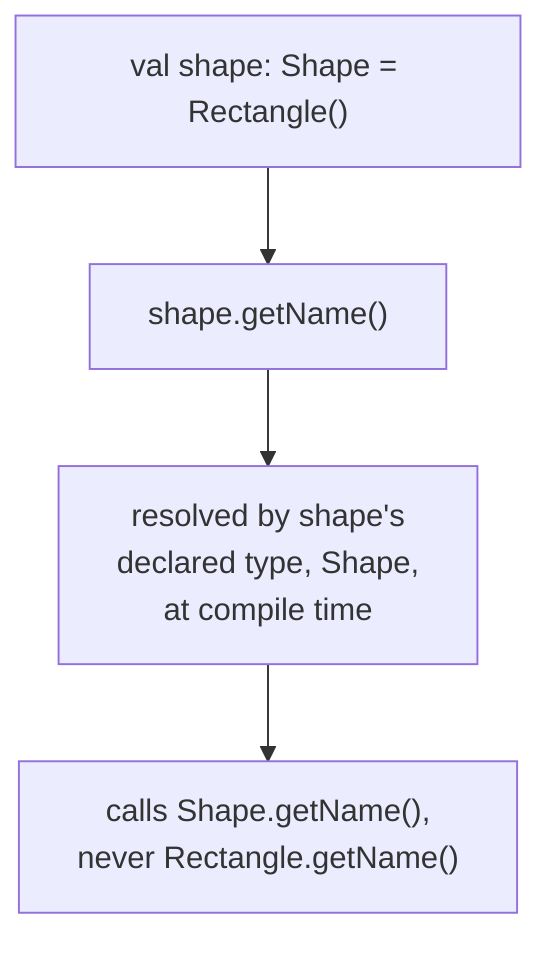
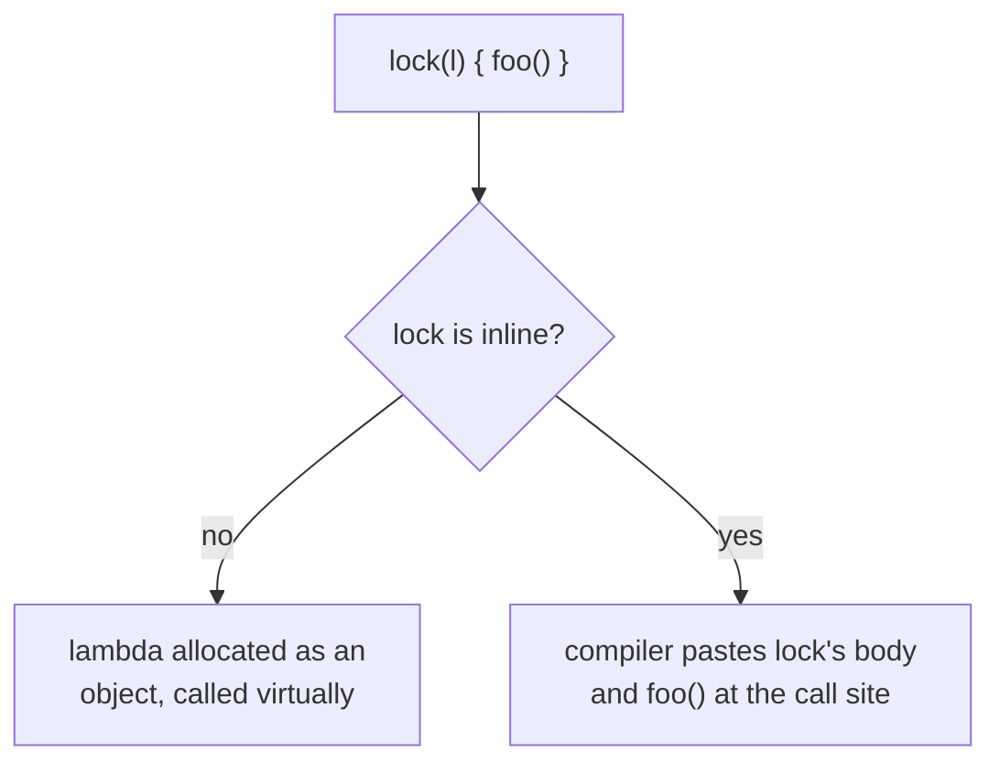

# Idiom

Lookup sheet for stage 3: Kotlin a reviewer would not describe as translated Java.

## Extension functions

`fun String.truncate(n: Int): String { ... }` adds a callable using member syntax (`"hi".truncate(3)`) **without changing the class at all**; nothing is actually added to `String`. Works on final classes and library types precisely because nothing about them needs to change.

**The gotcha: extension functions dispatch statically, by declared type, never the runtime type**, the opposite of a member override:



A member function with a matching signature **always wins** over an extension; the extension is simply never reached for that exact signature (it can still overload, with a different parameter list).

## Scope functions: two independent axes, not five names to memorize

`let`, `run`, `with`, `apply`, `also` all run a lambda in an object's context. What differs:

| | Object exposed as | Returns |
|---|---|---|
| `let` | `it` | the lambda's result |
| `run` | `this` | the lambda's result |
| `with` | `this` (as an argument, not a receiver) | the lambda's result |
| `apply` | `this` | the original object |
| `also` | `it` | the original object |

Fit: `let`/`also` for null-safe chaining or a side effect that keeps the original object; `run`/`apply` for computing a result from an object's members, or configuring it and keeping it. `with` is the odd one out: it takes the context object as an ordinary argument, not as a receiver, so it **cannot** be used in a null-safe chain (`person?.with { }` isn't valid syntax) the way the other four can.

## Higher-order functions: function types are real types

`(Int, Int) -> Int` is a type; a lambda is a literal value of that type, the same way `42` is a literal `Int`. A **higher-order function** takes or returns a function (`fold`'s `combine` parameter).

**Trailing-lambda syntax**: if a function's *last* parameter is a function type, the lambda can go outside the parens (`items.fold(1) { acc, e -> acc * e }`); if it's the *only* argument, the parens disappear entirely (`run { ... }`).

**Receiver-style function types are the actual mechanism behind the scope-function grid.** `A.(B) -> C` is callable on a receiver of type `A`, and inside it the receiver is an implicit `this` (the same mechanism extension functions use). `run`/`apply`/`with` are declared with a receiver-style type (`T.() -> R`); `let`/`also` use an ordinary parameter-style type (`(T) -> R`), where the object is just a regular parameter conventionally named `it`. The `this`-vs-`it` split in the table above is not convention, it's two different function-type shapes.

## Inline functions

Every lambda passed to a higher-order function is normally a real allocated object (capturing a closure), called virtually: a real, measurable cost at hot call sites.



`inline` pastes the function body (and its lambda arguments) directly at each call site: no allocation, no virtual call. Trade-off: inlining grows generated code at every call site, so it pays off for small, frequently-called functions, not by default on every higher-order function.

**Two consequences follow mechanically, not as bolted-on features:**

- **Non-local `return`** from inside a lambda is normally a compile error (the lambda is its own function object with nothing to return from); once its enclosing function is inlined, the lambda's code is pasted directly into the caller's body, so `return` genuinely exits the enclosing function.
- **`reified` type parameters** only work on an `inline` function's type parameter. Ordinary generics are erased at runtime; inlining pastes the body at a call site where the concrete type is known at compile time, so `is`/`as` work on `T` with no `Class<T>` workaround.

`noinline` exempts one lambda parameter from inlining (needed if it must escape as a real object). `crossinline` still inlines a lambda but forbids its non-local return (needed when it actually runs somewhere the return can't safely reach).

## Delegation

**Class delegation** implements an interface entirely by forwarding, compiler-generated, zero boilerplate:

```kotlin
class Derived(b: Base) : Base by b
```

Overriding one member works as expected from outside: `Derived`'s override runs for that member; everything else still forwards to `b`.

**The subtlety: the delegate can't see the derived class's overrides.** If `Base.print()` internally reads `message`, and `Derived` overrides `message`, calling `derived.print()` still uses **`b`'s own** `message`, not `Derived`'s override, since `b` only ever sees its own implementation when calling between its own members. This is forwarding to a separate object, not inheritance; an overridden member in `Derived` is never picked up polymorphically by code running inside `b`.

**Delegated properties** reuse accessor logic the same way: `val x by <expression>` delegates `get()` (and `set()` for `var`) to the expression's `getValue()`/`setValue()`. `by lazy { ... }` computes once on first access and caches; a `val` delegate needs only `getValue()`, a `var` delegate also needs `setValue()`.

## Operator overloading: a fixed symbol-to-function table

Every operator resolves to one exact, fixed function name: `a + b` is `a.plus(b)`; `-a` is `a.unaryMinus()`; `a[i]` is `a.get(i)`; `a < b`/`a <= b`/... all resolve through a single `compareTo()` (not four separate functions); `x in c` is `c.contains(x)`.

The `operator` modifier is the actual authorization, not a naming convention: a function named `plus` with the right signature but no `operator` modifier is never invoked by `+` syntax, which is a deliberate safety rail.

**The compiler enforces the signature, never the reader's expected meaning of the symbol.** `operator fun Point.unaryMinus() = Point(-x, -y)` is a good overload because `-` still means "the opposite" to a reader; overloading `+` for an unrelated side effect compiles fine and reads badly, the same "compiles but violates what a reader assumes" trap this arc keeps naming for other constructs.

## Related

- [Lesson 13](../lessons/0013-extension-functions.md), [Lesson 14](../lessons/0014-scope-functions.md), [Lesson 15](../lessons/0015-higher-order-functions-and-lambdas.md), [Lesson 16](../lessons/0016-inline-functions-and-reified-generics.md), [Lesson 17](../lessons/0017-delegation.md), [Lesson 18](../lessons/0018-operator-overloading.md)
- [Modelling](modelling.md): interfaces with default methods, the composition-over-inheritance fit class delegation implements natively
