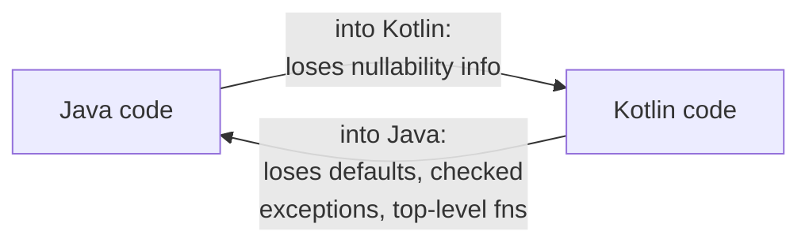
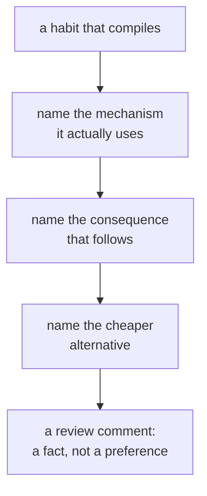

# Judgment

Lookup sheet for stage 8: naming what a construct costs, in Kotlin and across the Java boundary.

## Java interop: the boundary is asymmetric

Crossing **Java into Kotlin** costs nullability information; crossing **Kotlin into Java** costs Kotlin's conveniences. Both directions compile with no ceremony, which is exactly why the losses go unnoticed.

**Java into Kotlin.** An unannotated Java method's return becomes a **platform type** (unwritable, shown as `T!` in diagnostics: "`T` or `T?`", with collection/array variants). Two documented fixes: an explicit type annotation on the Kotlin side (`val name: String? = findName(id)`, local, always available), or nullability annotations on the Java source (fixes it for every caller; the one to push for in code you own). Asserting non-null (`!!`) is **not** on that list: it converts an unknown into a crash rather than a decision.

Java getter/setter pairs become **synthetic properties** (`calendar.firstDayOfWeek = ...`); a setter with no matching getter gets no property at all, since Kotlin has no set-only properties. A Java identifier that's a Kotlin keyword still works, in backticks: `` foo.`is`(bar) ``.

**Kotlin into Java**, what Java can't see and the annotation that restores it:

| What Java can't see | Gets instead | Annotation |
|---|---|---|
| Top-level functions/properties | Static methods on a generated `FileNameKt` class | `@file:JvmName("...")` to rename; `@file:JvmMultifileClass` to merge several files into one facade |
| Default parameter values | Only the full signature | `@JvmOverloads` (constructors and static methods only; **not** abstract/interface methods) |
| A property as a field | A getter and setter | `@JvmField` (needs a backing field, not private, no `open`/`override`/`const`, not delegated) |
| Checked exceptions | Nothing in `throws` (Kotlin has none), so a Java `catch` around it fails to compile | `@Throws(IOException::class)` |

**The judgment**: every one of these annotations is a promise to Java callers that constrains your Kotlin afterward. `@JvmOverloads` publishes the overload set, so reordering parameters becomes breaking; `@file:JvmName` fixes the class name Java depends on; `@JvmField` means no logic can ever go behind that name. All four are cheap to add and expensive to remove, so the question is never "would this be convenient" but "does a Java caller actually need it".

## Reviewing Kotlin: name the cost, not the preference

A review comment worth posting has four parts: **the construct, the mechanism it actually uses, the consequence that follows, and the cheaper alternative.**

A comment with only the construct and the alternative ("use X instead") is a preference; a reader has no way to evaluate it except by trusting you.

**Habits that compile, and what each is costing:**

| Habit that compiles | What it costs |
|---|---|
| `!!` reached for to silence a compile error | Converts an unknown into a crash rather than a decision |
| A null check on a non-nullable type | Dead code, and doubt the author didn't trust the signature |
| `var` where nothing reassigns | The reader must now check whether anything does |
| A `MutableList` returned from a public property | Callers can mutate your state; `val` doesn't stop them |
| A class where a data class was meant | Hand-written (or missing) `equals`, and a `toString` nobody updates |
| `else` on a `when` over a closed (sealed) set | The compiler stops telling you when a case is added |
| A scope function chosen by habit | A return value nobody meant (usually `also` where `let` was wanted) |
| A three-step chain over a large collection | Two intermediate lists built only to be discarded |
| `groupBy` followed by counting | A member list per key, allocated and thrown away for its size |
| `@Volatile` on a counter that's incremented | Visibility without atomicity; increments are lost |
| `Thread.sleep` inside a coroutine | A blocked pool thread, invisible until the pool is under load |
| `GlobalScope.launch`, or a `Job()` passed to a builder | Work nobody owns, waits for, or cancels |
| A hardcoded dispatcher | A test that can't replace it, so its delays are real |
| A cold flow collected twice | The builder's work runs twice, including any query in it |
| `catch (e: CancellationException)` with no rethrow | A coroutine that runs on past cancellation, looking successful |
| `open` added so a test can subclass | A permanent change to an inheritance contract, for one test |
| `api` for a dependency used only internally | An internal choice becomes every consumer's compile-time contract |
| A type parameter used in one direction only | Callers writing projections a declaration-site `out`/`in` would have saved |
| `@JvmOverloads` with no Java callers | A published overload set; parameter order is now breaking |

**Conventions are the shared ground** for genuine style disagreements: prefer a property over a no-arg function when cheap/cached and side-effect-free; `if` for a binary condition, `when` from three options up; the prescribed class-content order without alphabetical/visibility sorting; a file named for what it contains (never `Util`). Where a disagreement is really about style, the guide settles it; where it isn't, say so rather than reaching for the guide anyway.

**What not to review.** A construct that would merely be *shorter* isn't costing anything yet, and flagging everything trains people to skim the review. Before posting: can you name the mechanism, would a reader of this code actually hit the consequence, and is the alternative actually cheaper *here*? If any answer is no, it's a preference, not a finding, and the honest form is to say so as a preference.

## Related

- [Lesson 34](../lessons/0034-java-interop.md), [Lesson 35](../lessons/0035-reviewing-kotlin.md)
- [Null Safety and Mutability](null-safety-and-mutability.md), [Modelling](modelling.md), [Collections and Sequences](collections-and-sequences.md), [Concurrency](concurrency.md), [Testing and Build](testing-and-build.md), [Shipping a Service](shipping-a-service.md): the mechanisms behind most of this checklist's rows
