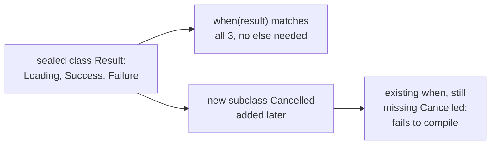
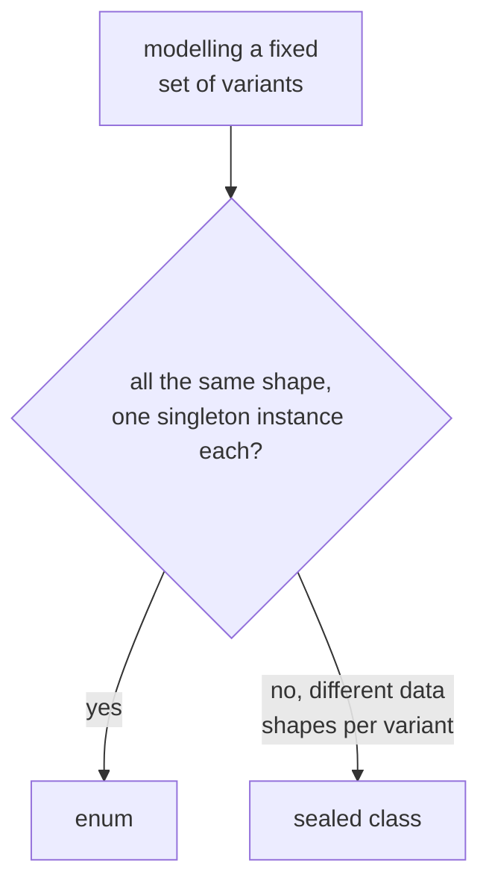

# Modelling

Lookup sheet for stage 2: modelling a domain without reaching for a class-per-thing hierarchy first.

## Choosing the construct

| Need | Reach for | Because |
|---|---|---|
| Just storing data | Data class | Generates equality, `toString`, destructuring, `copy` for free |
| A fixed, closed set of variants, each possibly carrying different data | Sealed class/interface | Compiler knows every subclass; `when` is exhaustive without `else` |
| A fixed set of same-shape constants (one singleton instance each) | Enum | Real objects, each can hold its own state/constructor args |
| Exactly one instance, globally accessible | `object` declaration | Thread-safe lazy singleton, built into the language |
| Java's `static` members | Companion object | Kotlin has no `static`; the companion is a real object, not just a namespace |
| Shared behavior across otherwise-unrelated types | Interface with default methods | Composition instead of forcing a shared base class |
| Real behavior beyond storing values, that none of the above fit | A plain class | The Kotlin docs' own last resort, not the default starting point |

## Properties replace getter/setter boilerplate

`class Person(val name: String, var age: Int)` generates real properties (`person.name`, `person.age = 30`) backed by default getters/setters, no `getName()`/`setAge()` to write. A custom accessor keeps the call site identical:

```kotlin
val area: Int get() = width * height                 // computed on every access
var name: String = ""
    set(value) { field = value.trim() }               // field = the backing field
```

Referring to the property name itself inside its own accessor recurses infinitely; `field` is the only way to reach the backing storage.

**A primary-constructor parameter without `val`/`var` is not a property**: `class Point(x: Int, y: Int) { val doubled = x * 2 }` exposes `point.doubled` but not `point.x`.

## Data classes

`data class User(val name: String, val age: Int)` generates, from **primary-constructor properties only**:

| Generated | Does |
|---|---|
| `equals()`/`hashCode()` | Structural equality |
| `toString()` | `"User(name=John, age=42)"` |
| `componentN()` | Destructuring: `val (name, age) = user` |
| `copy()` | New instance with named properties changed, rest identical |

**A property declared in the class body (not the primary constructor) is invisible to all four.** `data class Person(val name: String) { var age: Int = 0 }`: two instances differing only in `age` are still `==`-equal, since `age` never participates.

Requirements: at least one primary-constructor parameter, all marked `val`/`var`; cannot be `abstract`, `open`, `sealed`, or `inner`; custom `equals()`/`hashCode()`/`toString()` are allowed (the compiler skips generating them), but custom `componentN()`/`copy()` are **disallowed entirely**, keeping them mechanically tied to the real current property list.

All-`val` data classes plus `copy()` give immutability with practical "updates": `user.copy(age = user.age + 1)` produces a new instance without re-specifying every other property or reaching for `var`.

## Sealed classes: exhaustiveness the compiler checks

Every direct subclass of a `sealed class`/`sealed interface` must be declared in the same module and package, so the compiler knows the **complete, closed set** of subclasses. A `when` over a sealed type is exhaustive without `else` as long as every subclass has a branch:



Adding a new subclass later makes every non-`else` `when` over that type that doesn't handle it **fail to compile immediately**, at the exact call site that needs updating. Wrong fit: a hierarchy genuinely meant to be extended by outside code (a plugin system), since sealing forbids exactly that.

## Enums: real objects, not bare labels

Each constant is an actual instance, so it can carry its own constructor arguments (`enum class Color(val rgb: Int) { RED(0xFF0000), ... }`) and even override abstract members per-constant in an anonymous class body, giving different constants different behavior for the same method call. Every enum gets `entries` (ordered `List` of constants), `valueOf(name)`, and per-constant `name`/`ordinal` for free, plus `Comparable` ordered by declaration order.

**Enum vs sealed class:**



Awkward, only-relevant-to-some-constants extra fields on an enum are the signal that the variants actually need a sealed class instead.

## Object declarations and companion objects

`object Name { ... }` defines a class and creates its single instance in one step: Kotlin guarantees the initialization is **thread-safe and lazy** (on first access), with no hand-written double-checked locking. Reference it by name directly: `DataProviderManager.registerDataProvider(...)`.

Kotlin has **no `static` keyword**; a **companion object** (at most one per class, `class X { companion object { ... } }`) is what replaces Java's static members, accessed the same way (`MyClass.create()`). Unlike a Java static member, a companion object is a real object: it can implement interfaces, have its own supertype, and be passed around as a value. Common use: a factory function (`User.create("Ada")`) that can validate, cache, or choose a subclass in ways a plain constructor can't.

## Interfaces with default methods: behavior yes, state no

An interface can implement method bodies and provide computed property accessors (`val x: String get() = "foo"`), but **can never hold a backing field**, regardless of `val`/`var`. That is the precise line between an interface and an abstract class (which can hold real state).

**The diamond conflict is a compile error, not a silent pick**: if a class implements two interfaces that each default-implement the same method, Kotlin forces an explicit override:

```kotlin
class D : A, B {
    override fun foo() { super<A>.foo(); super<B>.foo() }
}
```

`super<Type>.method()` names which interface's implementation to call. Silently preferring one parent's implementation (as some multiple-inheritance languages do) would hide a real decision inside code that merely compiles, which is exactly what this rule refuses to allow.

## Related

- [Lesson 7](../lessons/0007-classes-and-properties.md), [Lesson 8](../lessons/0008-data-classes.md), [Lesson 9](../lessons/0009-sealed-classes-and-exhaustive-when.md), [Lesson 10](../lessons/0010-enums.md), [Lesson 11](../lessons/0011-object-declarations-and-companion-objects.md), [Lesson 12](../lessons/0012-interfaces-with-default-methods.md)
- [Null Safety and Mutability](null-safety-and-mutability.md): structural vs referential equality, which data classes automate
