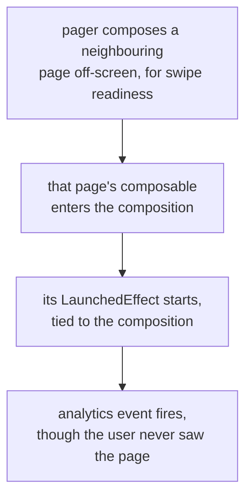

# Shipping a Service

Lookup sheet for stage 7: structuring a typed, tested backend service or Android component.

## Where files go

| Project type | Layout |
|---|---|
| Pure Kotlin | Mirrors the package structure with the **common root package omitted**: `com.acme.billing.invoice.pdf.Renderer` sits at `invoice/pdf/Renderer.kt`, no `com/acme/billing` directories |
| Mixed Kotlin + Java | Full Java-style path, `com/acme/billing/invoice/pdf/Renderer.kt`, matching the Java files in the same source root |

**File naming**: a file holding a single class/interface takes that class's name; a file holding several classes or only top-level declarations takes an upper-camel-case name describing its contents. `Util`/`Utils.kt` is named explicitly as the anti-pattern: it's a sign several unrelated concerns were never actually named.

**Inside a class, order is prescribed, sorting is not**: properties/initializer blocks, secondary constructors, methods, companion object. Do **not** sort methods alphabetically or by visibility, and do not separate regular methods from extension methods; group related things together in one consistent direction instead. Nested classes go next to the code that uses them, or after the companion object if they're for external use. Prefer a property over a no-arg function when it's cheap/cached and doesn't throw; prefer `if` for a binary condition, `when` from three options up.

## Four decisions that decide testability

None are framework-specific; all are visible in a signature.

| Decision | Shape | Why |
|---|---|---|
| Errors are values | A sealed hierarchy handled in an exhaustive `when`, not an exception thrown across a layer boundary | Sealing turns "did I handle every case" into a compiler check |
| Nullability lives at the edge | Parse into non-nullable domain types once, at the boundary; keep nullable forms out of the core | A nullable type traveling inward becomes a defensive check at every layer |
| One request is one scope | `coroutineScope` per request; nothing launched into a scope that outlives it; no `GlobalScope` | The request's lifetime owns its work; a disconnect cancels all of it |
| Dispatchers and clocks are parameters | `suspend fun handle(..., dispatcher: CoroutineDispatcher = Dispatchers.IO)`; a clock parameter instead of reading the current time inline | A test needs to replace both; a default keeps production call sites unchanged |

A fifth, blocking calls: wrap in `withContext(Dispatchers.IO)`, or a `limitedParallelism` view per dependency so one slow backend can't consume the whole blocking budget.

**The generated-file-class trap**: the JVM has no top-level members, so the compiler wraps each file's top-level declarations in a generated class named from the file. Two files with the same name in the same package produce a duplicate-class build error (multiplatform gives platform files a suffix, `Platform.jvm.kt`, to avoid this). This is the same generated class `mockkStatic` mocks from the testing side.

## Android: the platform owns scopes and adds one hard rule

| Arc concept | Android's answer |
|---|---|
| A scope you own is a scope you must cancel | `viewModelScope`: one per `ViewModel`, auto-cancelled when the `ViewModel` is cleared |
| Same, finer-grained | `LaunchedEffect` in Compose: tied to the composable's place in the composition, cancelled on leaving, relaunched on key change |
| Which dispatcher runs this | `Dispatchers.Main` is real and where UI work must happen; not blocking it is called **main-safety** |
| Who collects a flow, and when | `StateFlow` for UI state, via `collectAsStateWithLifecycle` (starts at `STARTED`, stops at `STOPPED` by default; `minActiveState` to change) |
| A dispatcher should be a parameter | Same advice, same reason: inject `Dispatchers` into the repository layer |
| A test needs to own the scope | Pass a `CoroutineScope` into a `ViewModel`'s constructor instead of using `viewModelScope` directly, so a test can inject a `TestScope` |

**Main-safety is a contract the callee keeps.** A function is main-safe when it doesn't block the main thread; put `withContext(Dispatchers.IO)` **inside the repository's own `suspend fun`**, not in every caller, so it's main-safe by construction and no caller has to remember. On a server nobody cares which thread runs a handler; on Android, forgetting this freezes the UI rather than just slowing something down.

**Composition lifetime is not lifecycle lifetime.** `LaunchedEffect` follows the composition, not the host `Activity`'s `Lifecycle`; it can run while the composable isn't visible (a pager composing neighboring pages off-screen for swipe readiness). A side effect that depends on the user actually seeing the screen (an analytics event) belongs on a lifecycle-aware API (`LifecycleEventEffect`), not `LaunchedEffect`.



## Generics and variance: no wildcards

Kotlin has **declaration-site variance** and **type projections** instead of Java wildcards. Java's invariance (`List<String>` is not a `List<Object>`) protects against adding an `Integer` into a `List<String>` through a widened reference, at the cost of writing an `extends`-bounded wildcard at every call site that needs flexibility (`Collection.addAll`).

**Declare it once, at the type, instead**: if a type parameter is only ever *produced*, mark it `out`; the compiler then both enforces that restriction and grants safe subtyping (`C<Base>` a supertype of `C<Derived>`). `in` is the mirror, for parameters only *consumed*.

```text
interface Source<out T> { fun nextT(): T }     // Source<String> IS a Source<Any>
Comparable<in T>                                // Comparable<Number> usable where Comparable<Double> is wanted
```

Producer-Extends-Consumer-Super (PECS), with the keywords doing the work directly: producer is `out`, consumer is `in`. This is why `List` (only `get`, an out-position) is covariant while `MutableList` (also has `add`, an in-position) stays invariant, exactly as relied on since collections basics.

**Type projections are the use-site tool**, for a class that genuinely both produces and consumes (`Array<T>` has both `get` and `set`, so `Array<Int>` is not a subtype of `Array<Any>`):

```kotlin
fun copy(from: Array<out Any>, to: Array<Any>)   // from: only T-returning methods callable
```

**Star projections**, for when nothing is known about the argument:

| Declaration | `Foo<*>` means | Lets you |
|---|---|---|
| `Foo<out T : TUpper>` | `Foo<out TUpper>` | Read `TUpper` values |
| `Foo<in T>` | `Foo<in Nothing>` | Write nothing safely |
| `Foo<T : TUpper>` (invariant) | `out TUpper` for reads, `in Nothing` for writes | Read only |

Each parameter of a multi-parameter type projects independently: `Function<*, String>` is `Function<in Nothing, String>`. Safe unlike a Java raw type, because the unknown is replaced by the safest bound, not by a hole.

**Reading a projection's error message**: the compiler represents the unknown as a **captured type**, using its **upper bound for reads and lower bound for writes**. `Array<out CharSequence>`: `get` compiles (upper bound `CharSequence`), `set` doesn't (lower bound `Nothing`, so nothing is safe to write). Projecting with `out` is precisely a promise not to write; the compile error is that promise being kept.

**Deciding which to use**: the question is direction, not a flexibility preference. A type only ever returned: declaration-site `out`. Only ever accepted: declaration-site `in`. Both: stay invariant and project per-function at the use site (`Cache<out T>` for a read-only function, `Cache<in T>` for a write-only one). Making a type covariant "because we only read from it today" is a promise about today's call sites, not about the type, and breaks at the first `put`.

**Constraints**: an upper bound (`fun <T : Comparable<T>> sort(list: List<T>)`) corresponds to Java's `extends`; default upper bound is `Any?`; only one bound fits in the angle brackets, further ones need a `where` clause (all must hold).

## Related

- [Lesson 31](../lessons/0031-structuring-a-service.md), [Lesson 32](../lessons/0032-android-divergences.md), [Lesson 33](../lessons/0033-generics-and-variance.md)
- [Concurrency](concurrency.md): scopes and dispatchers, what `viewModelScope`/`LaunchedEffect` are built from
- [Collections and Sequences](collections-and-sequences.md): `List` vs `MutableList`, the variance this sheet explains the mechanism behind
