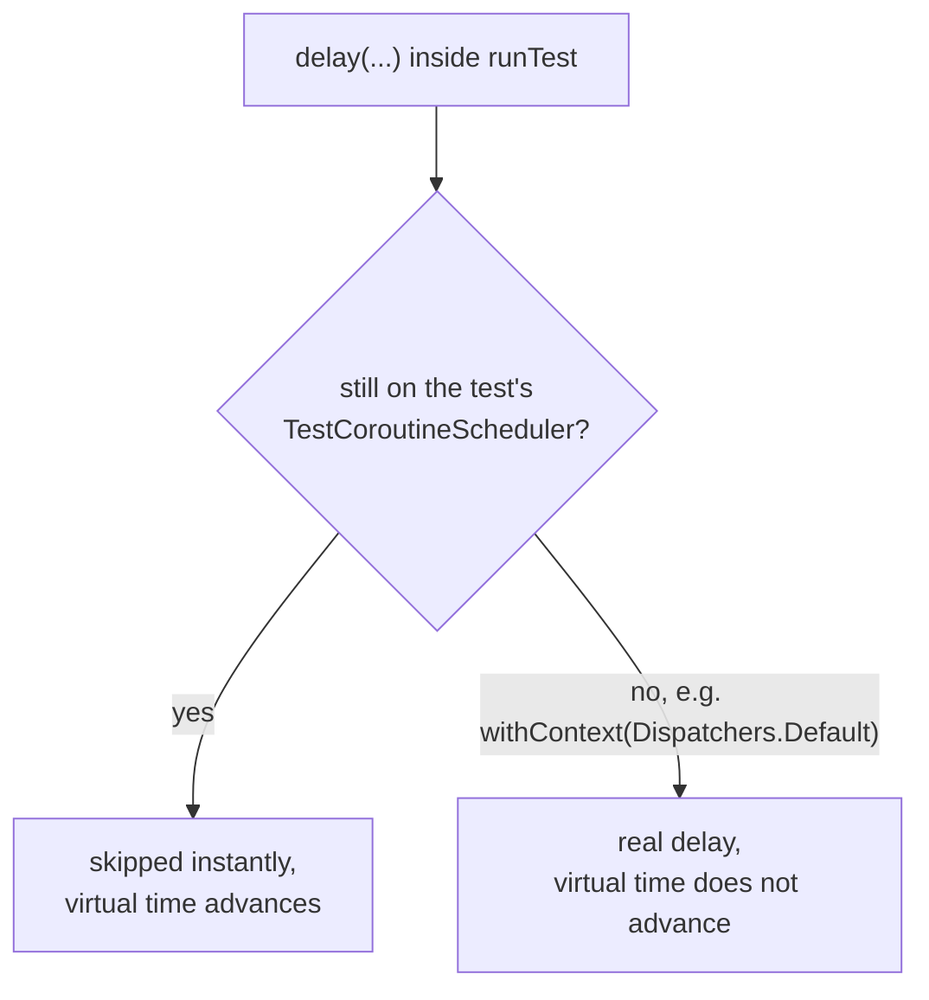
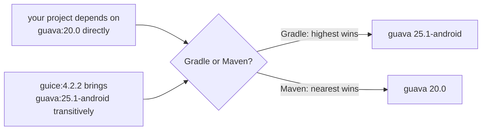

# Testing and Build

Lookup sheet for stage 6: someone else can clone, build, test, and run it. General JUnit/mocking/Maven material lives once in the [Java workspace's testing and build sheet](../../java/reference/testing-and-build.md); this sheet is only what's Kotlin-specific.

## Test layers

| Layer | Gives you |
|---|---|
| `kotlin.test` | Framework-independent `@Test` annotations and assertions, delegating to an `Asserter` |
| A runner | Actually finds/executes tests (JUnit 5 on the JVM, typically) |
| `kotlinx-coroutines-test` | `runTest`, a test-built scope, and virtual time control |
| Turbine | Assertions for what a `Flow` emitted, in order, and whether it completed |

`kotlin.test` is a façade: `kotlin-test-junit5` maps its annotations onto JUnit 5's and provides a JUnit-5-backed `Asserter`; `kotlin-test-junit`/`kotlin-test-testng` do the same for other runners. The artifact has to match the actual runner. [Kotest](https://kotest.io/docs/framework/framework.html) replaces the first two layers together with its own style; mix it in deliberately or not at all.

## `runTest` and the virtual-time boundary

`TestScope` (built by `runTest`) is stateful and doesn't run launched code on its own; virtual time comes from a shared `TestCoroutineScheduler`, letting `delay(3_000)` finish instantly while `currentTime` still reports it accurately.

**Virtual time does not cross a dispatcher change.** `withContext(Dispatchers.Default/IO/Main)` does not use the test's scheduler, so a `delay` inside one is a **real** delay:

**The fix is a production design rule, not a test trick**: make the dispatcher replaceable (injection, a default parameter) so a test can substitute a `TestDispatcher` sharing its scheduler. This is the clearest case of testability dictating a production signature: "don't hardcode a dispatcher" is engineering advice, not style.

**Two test dispatchers:**

| | Behavior | Risk |
|---|---|---|
| `StandardTestDispatcher` | A launched coroutine doesn't run until the test yields or advances the clock | Accurate ordering |
| `UnconfinedTestDispatcher` | Top-level children run **eagerly**, to their first suspension, with no dispatch | Tempting to reach for after a test fails, but it removes the dispatching production actually does, so it stops catching ordering bugs |

`Dispatchers.setMain`/`resetMain` install/restore a testable `Main` (there's no platform `Main` in a unit test).

**Turbine** (`flow.test { awaitItem(); awaitComplete() }`) can't clean up its own coroutine when started via `testIn`: pass `runTest`'s `backgroundScope`, or explicitly `cancel()`/`awaitComplete()`/`awaitError()` before the scope ends. Otherwise the test **hangs**, not fails, the same symptom as an uncancelled coroutine scope.

## Mocking: final-by-default changes the whole approach

Kotlin classes and members are **final unless marked `open`**, so a "generate a subclass, override the methods" mocking technique has nothing to override in ordinary code. [MockK](https://mockk.io/) mocks final classes fine anyway; the taxonomy of test doubles and other general mocking judgment are in the Java sheet, unchanged.

| Doubling | Needs |
|---|---|
| A class or interface | `mockk<T>()`, `every { } returns` (finality is not an obstacle) |
| A **suspending** function | `coEvery`/`coVerify` and the co-variant DSL (`coMatch`, `coAnswers`, ...); `coJustAwait` simulates a suspend call that never returns |
| An `object` singleton | `mockkObject(Obj)` / `unmockkObject`; scoped form `mockkObject(Obj) { }` auto-reverts |
| A **top-level** function | `mockkStatic(::function)`, since the JVM compiles it to a static on a generated file class |
| An **extension** function | Class/object-wide: free with a normal `mockk` of the declaring type. Module-wide: `mockkStatic("pkg.FileKt")` or `mockkStatic(Obj::extensionFunc)` |
| A partly-real object | `spyk(obj)`, a copy; known issue with spying a suspending function |

**Three sharp edges:**

- **`mockkStatic`'s blast radius is a whole file, not one function.** Mocking one top-level function clears mocks of every other function in the same generated file class; a module-wide extension mock (`mockkStatic(Obj::extensionFunc)`) mocks the whole file too.
- **A relaxed mock (`relaxed = true`) works badly with generic return types**, typically throwing a class-cast exception; stub those by hand. `relaxUnitFun = true` relaxes only `Unit`-returning functions.
- **Mocking an `object`, a static, or a constructor changes global state and must be undone**: scoped blocks, or `@ExtendWith(MockKExtension::class)` with `@MockK`/`@RelaxedMockK`/`@SpyK` fields calling `unmockkAll`/`clearAllMocks` automatically.

**The judgment**: when finality gets in the way, that's usually the language telling you the seam is missing. Introduce an interface (or write a fake) rather than marking a production class `open` for one test's convenience: a seam in the type system survives a refactor; a mock pinned to a static call does not. Exception: a collaborator with genuinely one implementation and no plausible second, where the interface would be pure ceremony.

## Gradle Kotlin DSL

`build.gradle.kts` is compiled and type-checked: `implementation`, `testImplementation`, `mavenCentral`, `sourceSets`, `tasks.test` etc. are all **type-safe accessors contributed by applied plugins**, each block a lambda with receiver (the same mechanism behind scope functions and `launch` inside a `CoroutineScope`). When accessors aren't available (a plugin applied via `apply(plugin = "...")` string form), fall back to `configure<T> { }` / `the<T>()`. `./gradlew kotlinDslAccessorsReport` prints what the applied plugins actually contribute.

**A Gradle configuration is not a Maven scope: Gradle splits by role, not by compile/runtime.**

| Role | Purpose | Examples (Java plugins) |
|---|---|---|
| Declarable | Where you put dependencies | `api` (`java-library` only), `implementation`, `compileOnly`, `runtimeOnly`, test variants |
| Resolvable | What you resolve to get a classpath | `compileClasspath`, `runtimeClasspath` |
| Consumable | What Gradle publishes for dependents | `apiElements`, `runtimeElements` |

**`api` vs `implementation` is a design decision.** `api` dependencies are transitively exposed on **consumers' compile classpaths**; `implementation` ones are not. Declaring something `api` that you only use internally makes it part of your library's public surface, unable to be swapped without breaking consumers. `implementation` is the default; `api` is deliberate, for types that actually appear in your own signatures.

**Version catalogs**: `gradle/libs.versions.toml` is auto-imported as `libs`; each alias becomes a type-safe accessor with dashes mapped to dots (`ktor-client-core` → `libs.ktor.client.core`; a single-segment alias like `junit` stays flat as `libs.junit`). A catalog's `from` may be called only once; it can't be assembled from two files.

**Resolution: Gradle takes the highest requested version across the whole graph; Maven takes the nearest (by declaration depth), ties broken by declaration order.**

A Maven habit of "declare the version directly to pin it" does nothing in Gradle, where declaration depth is irrelevant; use a constraint or `strictly` instead (a `strictly` version below the highest requested **fails the build**, rather than silently losing). "Highest" also prefers versions without qualifiers: `1.0.0` beats `1.0.0-beta`.

## What makes a build clonable, buildable, testable by someone else

| Requirement | What breaks without it |
|---|---|
| A checked-in Gradle wrapper | The build depends on whatever Gradle the newcomer happened to install |
| Versions in one place (a version catalog) | The same coordinate drifts to different versions per module |
| Declared, not inherited, dependencies | An upgrade elsewhere in the graph silently removes something from your classpath |
| The right configuration per dependency | Too much `api` leaks internals as a public contract; wrong-way `compileOnly` compiles for you and fails at runtime for consumers |
| A predictable, inspectable resolution outcome | An unrecognized classpath entry looks like a bug instead of a known highest-wins pick |
| Tests with no hardcoded dispatcher, real time, real network, or machine-specific path | "Works on my machine" |

## Related

- [Lesson 28](../lessons/0028-test-frameworks.md), [Lesson 29](../lessons/0029-mocking.md), [Lesson 30](../lessons/0030-gradle-and-dependency-management.md)
- [Testing and build sheet, Java workspace](../../java/reference/testing-and-build.md): JUnit lifecycle, the double taxonomy, and Maven's dependency model
- [Concurrency](concurrency.md): dispatchers and scopes, what `TestDispatcher` has to replace
