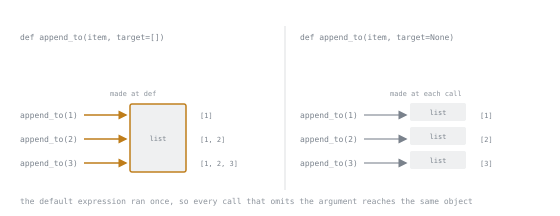

# Lesson 6. Functions and Arguments

**Mission link:** The mutable default argument is the best-known trap in the language, and it is only the visible half. The other half is that every function receiving a container can change the caller's data.
**Primary source:** [The Python Tutorial, Default Argument Values](https://docs.python.org/3/tutorial/controlflow.html#default-argument-values)
**Prerequisites:** [Lesson 1](0001-names-are-bindings.md), [Lesson 2](0002-mutability-and-copying.md), [Lesson 5](0005-truthiness-none-and-equality.md)

## Warm-up

1. ▢ Why is `timeout = timeout or 30` a bug when `0` is a legal timeout?

<details markdown="1"><summary>Check</summary>

`or` tests truthiness and `0` is falsy, so the explicit zero is replaced by the default. `30 if timeout is None else timeout` asks the right question.

</details>

2. ▢ `backup = dict(config)`, then `config["tags"].append("x")`. Does `backup` see the new tag?

<details markdown="1"><summary>Check</summary>

Yes. `dict(config)` is a shallow copy, so both dictionaries refer to the same list.

</details>

## Know this

Parameters follow the same rule as any other name: **calling a function binds its parameter names to the caller's objects.** Nothing is copied.

```python
def add_one(items):
    items.append(1)         # mutates the caller's list

def replace(items):
    items = [1]             # rebinds a local name, caller unaffected
```

The first function changes the caller's data. The second does not, and the difference is exactly the one from lesson 1: mutation reaches the object, rebinding moves a name. A function that mutates its arguments is not wrong, but it is part of its contract, and it belongs in the docstring.

### Default values are evaluated once

The default expression runs **when the `def` statement executes**, not on each call. One object is created and reused for the life of the function:

```python
def append_to(item, target=[]):     # BUG
    target.append(item)
    return target

print(append_to(1))     # [1]
print(append_to(2))     # [1, 2]   the same list, still there
```

The list was created once, when the function was defined, and it accumulates across every call that omits the argument. The same applies to `{}`, to `set()`, and to anything else mutable.

The fix is always the same shape:

```python
def append_to(item, target=None):
    if target is None:
        target = []
    target.append(item)
    return target
```



The convergence on the left is the bug drawn out: three calls, one object. Nothing in the body changed between the two versions except where the list comes from.

This is also why `datetime.now()` as a default is wrong: it is evaluated at import time, so every caller gets the moment the module loaded.

Immutable defaults are safe, because there is nothing to accumulate: `def f(x=0)`, `def f(name="")`, `def f(point=(0, 0))`.

### How arguments are matched

```python
def send(body, *, retries=3, timeout=None):
    ...
```

- **Positional or keyword** by default: `send("hi")` or `send(body="hi")`.
- **`*` in the signature** makes everything after it keyword-only. Callers must write `send("hi", retries=5)`, which keeps a call site readable and lets you reorder those parameters later without breaking anyone.
- **`/` in the signature** makes everything before it positional-only, which mostly matters when writing library code that mirrors built-ins.
- **`*args`** collects extra positional arguments into a tuple, **`**kwargs`** collects extra keyword arguments into a dict.

At the call site, `*` and `**` unpack instead of collecting:

```python
args = ("hi",)
opts = {"retries": 5}
send(*args, **opts)         # same as send("hi", retries=5)
```

A useful default when designing: make anything optional keyword-only. `send("hi", 5, None)` tells a reader nothing, and `send("hi", retries=5)` tells them everything.

### Closures capture names, not values

A function defined inside another function sees the enclosing variable itself, looked up when the inner function runs:

```python
funcs = [lambda: i for i in range(3)]
print([f() for f in funcs])         # [2, 2, 2]
```

Every lambda refers to the same `i`, and by the time any of them is called the loop has finished with `i` at `2`. This is called **late binding**, and it appears whenever functions are built in a loop: callbacks, handlers, retry wrappers.

Bind the value explicitly with a default argument, which is evaluated at definition time and therefore captures the current value:

```python
funcs = [lambda i=i: i for i in range(3)]
print([f() for f in funcs])         # [0, 1, 2]
```

The two facts in this lesson combine here: the trap of default-evaluation-at-definition is also the tool that fixes late binding.

## Practice

1. ▢ Predict all three lines of output.

   ```python
   def collect(x, into=[]):
       into.append(x)
       return into

   print(collect(1))
   print(collect(2))
   print(collect(3, into=[]))
   ```

<details markdown="1"><summary>Hint</summary>

Ask how many list objects this code creates, and when each one is created.

</details>

<details markdown="1"><summary>Check</summary>

`[1]`, then `[1, 2]`, then `[3]`.

Two lists exist. The default was created once when `def` ran, and the first two calls share it. The third call passed its own list, so it is unaffected and the shared default still holds `[1, 2]`.

</details>

2. ▢ Which of these functions can change what the caller sees? Answer for each.

   ```python
   def a(items): items.append(1)
   def b(items): items = items + [1]
   def c(items): items += [1]
   def d(items): items = list(items); items.append(1)
   ```

<details markdown="1"><summary>Check</summary>

`a` and `c` change the caller's list. `b` and `d` do not.

`c` is the one worth pausing on: `+=` on a list extends in place, so it mutates the caller's object even though the line looks like an assignment. `d` shows the deliberate version, taking a copy first, which is how you write a function that promises not to touch its input.

</details>

3. ▢ Rewrite this signature so that the two optional arguments cannot be passed positionally, and say what that buys.

   ```python
   def fetch(url, retries=3, timeout=10):
       ...
   ```

<details markdown="1"><summary>Check</summary>

```python
def fetch(url, *, retries=3, timeout=10):
    ...
```

It buys two things. Call sites become self-describing, since `fetch(url, retries=5)` cannot be confused with `fetch(url, 5)` meaning something else. And the order of the keyword-only parameters stops being part of the API, so they can be reordered or extended without breaking callers.

</details>

4. ▢ What does this print, and what is the minimal change that makes it print `0 1 2`?

   ```python
   handlers = []
   for i in range(3):
       handlers.append(lambda: print(i, end=" "))
   for h in handlers:
       h()
   ```

<details markdown="1"><summary>Check</summary>

It prints `2 2 2`.

All three lambdas close over the same `i`, which is `2` once the loop has finished. The minimal change is `lambda i=i: print(i, end=" ")`, which evaluates the default at definition time and captures each value.

`functools.partial(print, i, end=" ")` is the same idea with the intent stated more clearly, and it is what to reach for when the callback is a real function rather than a lambda.

</details>

5. ▢ You are reviewing this function. Name two defects and the input that exposes each.

   ```python
   def register(name, tags=[], config={}):
       tags.append(name)
       config.setdefault("names", []).append(name)
       return tags, config
   ```

<details markdown="1"><summary>Check</summary>

Both defaults are mutable and shared. Calling `register("a")` and then `register("b")` returns `(['a', 'b'], {'names': ['a', 'b']})` from the second call, because both defaults have accumulated across calls. Any two calls that omit the arguments expose it.

Both are also mutated in place, so a caller who does pass its own `tags` list has that list modified as a side effect. Passing a list you still hold elsewhere exposes that one.

The fix covers both: default to `None`, build a fresh object when it is `None`, and either document the mutation or copy the input.

</details>

## Real-world reps

- [ ] Write the `collect` function with the mutable default and call it four times without arguments. Then add `print(collect.__defaults__)` and watch the default itself grow. Seeing where the list lives is what makes this permanent.
- [ ] Reproduce the late-binding loop, fix it with `i=i`, then fix it again with `functools.partial` and decide which you would rather read in six months.
- [ ] Tomorrow: grep code you know for `=[]` and `={}` in function signatures. Then look for functions that mutate an argument without saying so in the docstring, which is the same bug with no linter to catch it.

## Going further

- [Default Argument Values](https://docs.python.org/3/tutorial/controlflow.html#default-argument-values): the tutorial's warning, and the standard workaround
- [Keyword-only arguments](https://docs.python.org/3/tutorial/controlflow.html#special-parameters): `/` and `*` in signatures, with the reasoning for each
- [Call by reference, in the FAQ](https://docs.python.org/3/faq/programming.html#how-do-i-write-a-function-with-output-parameters-call-by-reference): the official answer to "how does Python pass arguments"
- [Resources](../RESOURCES.md)

---

Not landing? Reread the primary source at the top, since this lesson compresses it and compression is where understanding leaks. Check the [glossary](../GLOSSARY.md) for any term that felt slippery.

If the lesson itself is unclear rather than the material, that is a defect: [open an issue](https://github.com/TokenCemetery/teach/issues).
