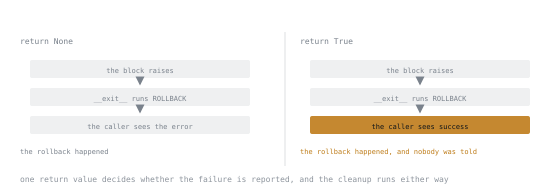

# Lesson 11. Context Managers

**Mission link:** Every resource that has to be released, every setting that has to be restored, and every temporary state that has to be undone is the same problem, and Python has one construct for all of them. Recognising the pattern is what stops `try/finally` from spreading.
**Primary source:** [The Python Language Reference, The with statement](https://docs.python.org/3/reference/compound_stmts.html#the-with-statement)
**Prerequisites:** [Lesson 9](0009-generators.md), [Lesson 10](0010-exceptions.md)

## Warm-up

1. ▢ Lesson 10: what does `finally` guarantee that an `except` clause does not?

<details markdown="1"><summary>Check</summary>

It runs on every path out of the block: success, a handled exception, an unhandled one still propagating, and a `return` or `break` inside the `try`.

</details>

2. ▢ Lesson 9 put a `with open(...)` inside a generator. When does the file close if the caller abandons the generator halfway?

<details markdown="1"><summary>Check</summary>

When the generator is closed or collected, which CPython usually does promptly and does not promise. This lesson gives the deliberate version.

</details>

## Know this

`with` is `try/finally` with a name. This:

```python
with open(path) as f:
    data = f.read()
```

is this:

```python
manager = open(path)
f = manager.__enter__()
try:
    data = f.read()
finally:
    manager.__exit__(*sys.exc_info())
```

Two methods make an object usable this way.

`__enter__(self)` runs on entry, and **its return value is what `as` binds**. That is worth stating separately, because it is not necessarily the manager. A file returns itself, so `f` is the file. `threading.Lock.__enter__` returns the result of `acquire`, so `with lock as x` binds `True`, which is why nobody writes the `as` there.

`__exit__(self, exc_type, exc, tb)` runs on exit. The three arguments are `None, None, None` on a clean exit and describe the exception otherwise. **Returning a truthy value suppresses that exception**; returning `None` lets it propagate, which is what almost every `__exit__` should do.

### Writing one with a generator

The everyday way is a generator plus a decorator. Everything before the `yield` is entry, everything after is exit, and the `yield`s value is what `as` binds:

```python
from contextlib import contextmanager

@contextmanager
def timed(label):
    start = time.perf_counter()
    try:
        yield                          # the body of the with block runs here
    finally:
        log.info("%s took %.3fs", label, time.perf_counter() - start)
```

```python
with timed("import"):
    run_import()
```

The `try/finally` inside is not optional. Without it, an exception in the caller's block propagates out of the `yield` and the cleanup never runs. That is the one thing to get right in a generator-based manager, and forgetting it produces a manager that works in every test and leaks in production.

To bind something, yield it:

```python
@contextmanager
def temporary_table(conn, name):
    conn.execute(f"CREATE TEMP TABLE {name} (id bigint)")
    try:
        yield name
    finally:
        conn.execute(f"DROP TABLE {name}")
```

A generator-based manager is **single-use**. Each `with` needs a fresh call, because the generator it built is an iterator and lesson 9 applies. When a manager must be entered twice, or nested inside itself, write a class.

### Writing one as a class

```python
class Transaction:
    def __init__(self, conn):
        self.conn = conn

    def __enter__(self):
        self.conn.execute("BEGIN")
        return self.conn

    def __exit__(self, exc_type, exc, tb):
        if exc_type is None:
            self.conn.execute("COMMIT")
        else:
            self.conn.execute("ROLLBACK")
        return None                    # never swallow: the caller must know
```

The `exc_type is None` test is the reason to reach for a class: entry and exit differ by outcome, not just by cleanup. Note the explicit `return None`, and note how easy the bug is: `return True` here would roll back and then tell the caller everything succeeded.



The first two steps are identical in both columns. The rollback is not what changes; what changes is whether anyone downstream is allowed to know it happened.

### Several at once

```python
with open(src) as fin, open(dst, "w") as fout:
    fout.write(fin.read())
```

Left to right on entry, right to left on exit, and the second `open` is protected by the first, so a failure there still closes `fin`. Parenthesised across lines is legal from Python 3.10:

```python
with (
    open(src) as fin,
    open(dst, "w") as fout,
):
    ...
```

When the number is not known until runtime, `ExitStack` collects them:

```python
from contextlib import ExitStack

with ExitStack() as stack:
    files = [stack.enter_context(open(p)) for p in paths]
    merge(files)                       # every file closed on the way out
```

`ExitStack` also solves the conditional case, where a resource is only sometimes needed, without an `if` around the whole block.

### What `contextlib` already contains

| Tool | Use |
|---|---|
| `contextmanager` | the decorator above |
| `suppress(ExcType)` | a named narrow `except: pass`, from lesson 10 |
| `closing(thing)` | wraps an object that has `close` but no `__exit__` |
| `nullcontext(value)` | a manager that does nothing, for the optional-resource branch |
| `redirect_stdout(f)` | captures prints from code you cannot change |
| `chdir(path)` | changes the working directory and restores it, from Python 3.11 |
| `ExitStack` | a dynamic number of managers |

`nullcontext` is the one that removes real duplication:

```python
with (open(path) if path else nullcontext(sys.stdin)) as f:
    process(f)
```

### The pattern, stated once

Anything with a **paired** operation belongs in a context manager: open and close, acquire and release, begin and commit, set and restore, mkdir and remove, patch and unpatch, connect and disconnect. If the pair is spelled out at two different indentation levels in a function, a manager will delete more code than it adds.

Async has its own pair, `__aenter__` and `__aexit__`, used through `async with`. Stage 6 covers it. The rules above transfer unchanged.

## Practice

1. ▢ What is wrong with this manager, and when does it show up?

   ```python
   @contextmanager
   def locked(lock):
       lock.acquire()
       yield
       lock.release()
   ```

<details markdown="1"><summary>Check</summary>

No `try/finally`. If the `with` body raises, the exception propagates out of the `yield` and `lock.release()` never runs, so the lock is held forever and the next acquirer deadlocks.

It passes every test where the body succeeds, which is most of them.

```python
@contextmanager
def locked(lock):
    lock.acquire()
    try:
        yield
    finally:
        lock.release()
```

</details>

2. ▢ Predict the output.

   ```python
   class Quiet:
       def __enter__(self):
           return self
       def __exit__(self, exc_type, exc, tb):
           return True

   with Quiet():
       print("before")
       raise ValueError("boom")
       print("after")
   print("done")
   ```

<details markdown="1"><summary>Hint</summary>

What does a truthy return from `__exit__` mean, and where does execution resume after it?

</details>

<details markdown="1"><summary>Check</summary>

```text
before
done
```

`__exit__` returned truthy, so the `ValueError` is suppressed. `after` never runs, because suppression does not resume the block: control leaves the `with` at the point of the exception and continues after it.

This is `except Exception: pass` wearing a class, with the same objection from lesson 10. Suppressing anything unconditionally in `__exit__` is nearly always wrong; `contextlib.suppress` at least names the type.

</details>

3. ▢ What does `x` hold?

   ```python
   with open("notes.txt") as f, threading.Lock() as x:
       ...
   ```

<details markdown="1"><summary>Check</summary>

`True`. `Lock.__enter__` returns whatever `acquire()` returned, and `as` binds the return of `__enter__`, not the manager. Writing the `as` here suggests the lock is being used, which it is not, so drop it.

</details>

4. ▢ Rewrite without `try/finally`.

   ```python
   original = os.environ.get("TZ")
   os.environ["TZ"] = "UTC"
   try:
       run_report()
   finally:
       if original is None:
           del os.environ["TZ"]
       else:
           os.environ["TZ"] = original
   ```

<details markdown="1"><summary>Check</summary>

```python
@contextmanager
def env(name, value):
    original = os.environ.get(name)
    os.environ[name] = value
    try:
        yield
    finally:
        if original is None:
            del os.environ[name]
        else:
            os.environ[name] = original
```

```python
with env("TZ", "UTC"):
    run_report()
```

The `try/finally` did not disappear, it moved once. The win is at the call sites: the second, third and tenth caller are one line each, and none of them can forget the restore.

</details>

5. ▢ This opens a variable number of files. Why does the naive version leak, and what fixes it?

   ```python
   files = [open(p) for p in paths]
   try:
       merge(files)
   finally:
       for f in files:
           f.close()
   ```

<details markdown="1"><summary>Check</summary>

If `open` raises partway through the comprehension, the list never gets built, `files` is unbound, and every file already opened stays open. The `finally` cannot help, because it is not entered yet.

```python
with ExitStack() as stack:
    files = [stack.enter_context(open(p)) for p in paths]
    merge(files)
```

`enter_context` registers each file the moment it opens, so a failure on the fifth `open` still closes the first four.

</details>

6. ▢ Name two things in code you have seen that are paired operations written without a context manager.

<details markdown="1"><summary>Check</summary>

Common ones: `cursor()` and `close()`, `begin` and `commit`, `chdir` there and back, a feature flag set and unset in a test, `setLevel(DEBUG)` and back, a temporary directory created and removed, a signal handler installed and restored, monkeypatching in a test teardown.

The test for whether it is worth extracting: does the restore appear in more than one function, or is it ever conditional? Either answer is a yes.

</details>

## Real-world reps

- [ ] Find a `try/finally` in code you own whose `finally` restores something rather than closing something. Turn it into a context manager and convert two call sites.
- [ ] Write the `timed` manager from this lesson from memory, including the `try/finally`, and use it on something slow you already have.
- [ ] Find a place that opens a resource and closes it in a different function, so the pairing is invisible. Decide whether a manager can bring them together, and write down why if it cannot.
- [ ] Tomorrow: read the [`contextlib`](https://docs.python.org/3/library/contextlib.html) page once. It is a list of problems you have already solved by hand.

## Going further

- [The `with` statement](https://docs.python.org/3/reference/compound_stmts.html#the-with-statement): the exact desugaring, including the multiple-manager form
- [With Statement Context Managers](https://docs.python.org/3/reference/datamodel.html#with-statement-context-managers): `__enter__` and `__exit__` as the data model states them
- [`contextlib`](https://docs.python.org/3/library/contextlib.html): the decorator, `ExitStack`, and the ready-made managers
- [PEP 343, The "with" Statement](https://peps.python.org/pep-0343/): the rationale, and why suppression is opt-in
- [Resources](../RESOURCES.md)

---

Not landing? Reread the primary source at the top, since this lesson compresses it and compression is where understanding leaks. Check the [glossary](../GLOSSARY.md) for any term that felt slippery.

If the lesson itself is unclear rather than the material, that is a defect: [open an issue](https://github.com/TokenCemetery/teach/issues).
