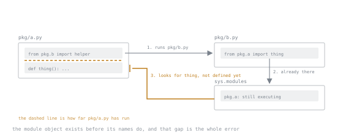

# Lesson 13. Modules and Packages

**Mission link:** `ModuleNotFoundError` on code that clearly exists, and a circular import that appears when a file is split, are both explained by two rules. Knowing them is also what lets a project be installed rather than run from its own directory.
**Primary source:** [The Python Language Reference, The import system](https://docs.python.org/3/reference/import.html)
**Prerequisites:** [Lesson 1](0001-names-are-bindings.md), [Lesson 6](0006-functions-and-arguments.md)

## Warm-up

1. ▢ Lesson 1: what does `a = b` do to the object `b` refers to?

<details markdown="1"><summary>Check</summary>

Nothing. It binds the name `a` to the same object. Every import in this lesson is that same operation.

</details>

2. ▢ A file `random.py` sits next to your script. What breaks?

<details markdown="1"><summary>Check</summary>

Anything that imports the standard library's `random`, directly or through a dependency, gets your file instead. This lesson explains which directory wins.

</details>

## Know this

Two rules produce everything else.

**A module's code runs once per process.** The first import executes the file top to bottom and stores the resulting module object in `sys.modules`. Every later import of that name finds it there and executes nothing.

**An import binds a name.** That is lesson 1 again, and the form matters:

```python
import config                    # binds `config`, the module object
from config import TIMEOUT       # binds `TIMEOUT`, the object it referred to
import config as cfg             # binds `cfg`
```

The second form copies the binding. If something later sets `config.TIMEOUT = 30`, code that did `import config` and reads `config.TIMEOUT` sees 30; code that did `from config import TIMEOUT` still holds the old object. That single fact explains why a patch in a test does not take effect, and why `import module` is the more robust form in code that may be patched.

### Packages

A directory with an `__init__.py` is a package, and its dotted name is the path:

```text
shop/
├── __init__.py
├── orders.py
└── storage/
    ├── __init__.py
    └── sqlite.py
```

```python
from shop.storage import sqlite
```

Importing `shop.storage.sqlite` runs `shop/__init__.py`, then `shop/storage/__init__.py`, then the module. A heavy `__init__.py` therefore taxes every import beneath it, which is why "import the package for the side effect" is a habit worth not forming.

A directory **without** `__init__.py` can still be imported, as a namespace package. That is a feature for splitting one package across distributions, and it is also how a typo silently produces an importable but empty thing. Write the `__init__.py`.

Inside a package, imports may be relative:

```python
from . import orders            # sibling module
from .storage import sqlite     # child
from ..config import TIMEOUT    # parent package
```

Relative imports resolve against the module's package, so they work regardless of where the project sits. They do **not** work in a file being run directly, because such a file has no package. That is the next section.

### `python file.py` against `python -m package.module`

This is the difference that produces most import errors:

| | `python shop/orders.py` | `python -m shop.orders` |
|---|---|---|
| first entry on `sys.path` | the directory holding the file, `shop/` | the current working directory |
| the module's `__name__` | `"__main__"` | `"__main__"` |
| the module's package | none | `shop` |
| `from . import x` | `ImportError` | works |
| `import shop` | fails, `shop/` is not on the path, its parent is not either | works |

Running a file inside a package as a script therefore breaks its own imports, and the error message names the module rather than the cause. `-m` is the answer, and once a project is installed, as stage 3 covers, the question disappears.

`sys.path[0]` also explains the `random.py` warm-up: the script's own directory is searched before the standard library.

### `__name__ == "__main__"`

```python
def main():
    ...

if __name__ == "__main__":
    main()
```

The guard means the module can be imported without running its work. Without it, a test that imports the module runs the program. It stops being merely good practice in stage 6, where the `multiprocessing` spawn method imports the main module in each child, and an unguarded module launches processes recursively.

### Circular imports

```python
# pkg/a.py
from pkg.b import helper        # runs pkg/b.py
def thing(): ...

# pkg/b.py
from pkg.a import thing         # pkg.a is half-executed
def helper(): return thing()
```

```text
ImportError: cannot import name 'thing' from partially initialized module 'pkg.a'
(most likely due to a circular import)
```

The cause is rule one: `pkg.a` is already in `sys.modules`, still executing, and `thing` is not defined yet.



The dashed line is the whole explanation: `pkg.a` is a real module object, present and findable, whose body has only run as far as its own first line. The lookup arrives below that line, where nothing has been defined yet.

Read the message rather than trusting it. For two **top-level** modules in the same cycle, CPython currently reports `cannot import name 'thing' from 'a' (consider renaming 'a.py' if it has the same name as a library you intended to import)`, which points at shadowing when the actual cause is the cycle. Same defect, different hint.

Three fixes, in order of preference:

1. **Extract the shared thing** into a third module both import. A cycle almost always means the boundary is drawn in the wrong place.
2. **`import a` instead of `from a import thing`**, and call `a.thing()`. The module object exists immediately; only the attribute lookup is deferred to call time.
3. **Move the import inside the function.** Legitimate for a genuinely optional or expensive dependency, and a smell as a routine fix, because it hides the cycle from anyone reading the top of the file.

### The shape of a module that reads well

- Imports at the top, standard library first, then third party, then local.
- No work at import time. Definitions, and constants that cannot fail.
- `__init__.py` re-exports the package's public names and nothing else, so callers write `from shop import Order` and internal moves are invisible.
- `__all__` is a list of names for `from module import *`, and it is also read by tooling as a statement of what is public. It does not restrict anything else.
- A leading underscore is the actual convention for private, and it is honoured by convention alone.

Module-level state is process-wide state. A `_cache = {}` at module level is a singleton with no lifecycle, no locking and no way to reset between tests. Sometimes correct, always a decision.

## Practice

1. ▢ Predict the output.

   ```python
   # tools.py
   print("loading tools")
   VALUE = 1
   ```

   ```python
   # main.py
   import tools
   import tools
   from tools import VALUE
   print(VALUE)
   ```

<details markdown="1"><summary>Check</summary>

```text
loading tools
1
```

The module executes once. The second `import` and the `from` both find it in `sys.modules` and only bind names.

</details>

2. ▢ Why does the assertion fail?

   ```python
   # settings.py
   TIMEOUT = 10
   ```

   ```python
   # client.py
   from settings import TIMEOUT
   def get_timeout():
       return TIMEOUT
   ```

   ```python
   # test
   import settings, client
   settings.TIMEOUT = 30
   assert client.get_timeout() == 30
   ```

<details markdown="1"><summary>Hint</summary>

How many names refer to the integer 10, and which one did the test rebind?

</details>

<details markdown="1"><summary>Check</summary>

`client.TIMEOUT` and `settings.TIMEOUT` are two independent names that were bound to the same object at import time. The test rebound one of them, and `get_timeout` reads the other.

Fix in `client.py`:

```python
import settings
def get_timeout():
    return settings.TIMEOUT
```

The attribute is now looked up when the function runs. This is exactly why `unittest.mock.patch` takes a string naming where the object is *used*, not where it is defined.

</details>

3. ▢ For each command, say whether it works and why.

   Layout: `project/shop/__init__.py`, `project/shop/orders.py`, where `orders.py` starts with `from . import storage`.

   - a) `cd project && python shop/orders.py`
   - b) `cd project && python -m shop.orders`
   - c) `cd project/shop && python orders.py`
   - d) `cd project/shop && python -m shop.orders`

<details markdown="1"><summary>Check</summary>

- a) Fails. `sys.path[0]` is `project/shop`, and the file has no package, so the relative import raises `ImportError: attempted relative import with no known parent package`.
- b) Works. `sys.path[0]` is `project`, and the module's package is `shop`.
- c) Fails, same reason as a.
- d) Fails. `sys.path[0]` is `project/shop`, which contains no directory named `shop`, so `ModuleNotFoundError: No module named 'shop'`.

The rule: run `-m` from the directory that **contains** the package.

</details>

4. ▢ Break this cycle without moving any import inside a function.

   ```python
   # models.py
   from validation import check
   class User:
       def save(self):
           check(self)

   # validation.py
   from models import User
   def check(obj):
       if not isinstance(obj, User):
           raise TypeError
   ```

<details markdown="1"><summary>Check</summary>

The honest fix is to notice the direction is wrong: validation depends on models, and models should not depend on validation. Move the call:

```python
# models.py
class User: ...

# validation.py
from models import User
def check(obj): ...
```

and have the caller validate, or have `save` accept a validator. If `save` genuinely must validate, `import validation` and call `validation.check(self)`, which defers the attribute lookup to call time.

The general form: a cycle is a design statement, and the extract-a-third-module fix is the one that survives the next change.

</details>

5. ▢ A colleague adds `sys.path.insert(0, "../shared")` at the top of a library module so it can import a sibling project. Name three things this breaks.

<details markdown="1"><summary>Check</summary>

- It depends on the working directory, so it works when run one way and not another.
- It has global effect: every later import in the process, including in unrelated libraries, now searches that directory first, so a file named `logging.py` there shadows the standard library.
- It cannot be installed, packaged or imported by anyone else, because the path is relative to a layout only this checkout has.
- It runs at import time, so merely importing the module mutates interpreter state.

The fix is stage 3's: make `shared` an installed package, and depend on it by name.

</details>

6. ▢ Why does an `__init__.py` that imports every submodule cost something, and when is it worth it?

<details markdown="1"><summary>Check</summary>

Every import of anything in the package executes all of it, so start-up time and memory pay for the whole package no matter how little is used, and any import error anywhere in it becomes an import error for everything. A command-line tool feels this directly.

It is worth it when the package's public API is small and deliberately curated, so callers write `from shop import Order` and the internal file layout stays free to change. The compromise is to re-export only the public names, not every submodule.

</details>

## Real-world reps

- [ ] Take a project you know and run one of its modules both ways, `python path/to/file.py` and `python -m package.module`, from the wrong directory on purpose. Read the two error messages carefully enough to recognise them later.
- [ ] Find a `from x import y` of something that is mocked in tests, and switch it to `import x` plus `x.y`. Note whether the mock target string in the test had to change.
- [ ] Grep your code for imports inside functions. For each, decide whether it is deferring an expensive dependency or hiding a cycle, and write the answer in a comment.
- [ ] Tomorrow: open one `__init__.py` in a project you depend on and see whether it is a curated API or a wall of re-exports.

## Going further

- [The import system](https://docs.python.org/3/reference/import.html): finders, loaders, `sys.modules`, and namespace packages
- [Modules, in the tutorial](https://docs.python.org/3/tutorial/modules.html): the guided version, including `__all__` and packages
- [PEP 328, Imports: Multi-Line and Absolute/Relative](https://peps.python.org/pep-0328/): why relative imports are explicit
- [PEP 420, Implicit Namespace Packages](https://peps.python.org/pep-0420/): what a directory without `__init__.py` becomes
- [`__main__`](https://docs.python.org/3/library/__main__.html): the guard, and `__main__.py` in a package
- [Resources](../RESOURCES.md)

---

Not landing? Reread the primary source at the top, since this lesson compresses it and compression is where understanding leaks. Check the [glossary](../GLOSSARY.md) for any term that felt slippery.

If the lesson itself is unclear rather than the material, that is a defect: [open an issue](https://github.com/TokenCemetery/teach/issues).
