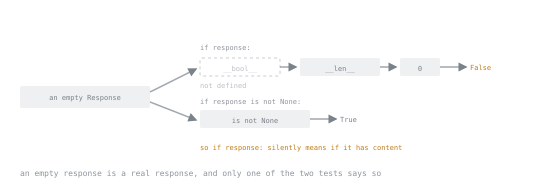

# Lesson 24. Dunder Methods

**Mission link:** The mission asks when to implement a dunder method and when a plain function is better. The answer comes from knowing what each protocol actually promises, and which ones the interpreter derives from others for free.
**Primary source:** [The Python Language Reference, Special method names](https://docs.python.org/3/reference/datamodel.html#special-method-names)
**Prerequisites:** [Lesson 5](0005-truthiness-none-and-equality.md), [Lesson 8](0008-the-iteration-protocol.md), [Lesson 12](0012-dataclasses.md)

## Warm-up

1. ▢ Lesson 5: what does `if x:` ask an object?

<details markdown="1"><summary>Check</summary>

Whether it is truthy, which for a container means "not empty". This lesson gives the two methods that decide it.

</details>

2. ▢ Lesson 8: which single method is enough to make a class work with `for`, `list`, `sum` and `in`?

<details markdown="1"><summary>Check</summary>

`__iter__`. This lesson explains why `in` comes for free with it.

</details>

## Know this

A dunder method is how a type opts into a language construct. `len(x)` calls `x.__len__()`, `a + b` calls `a.__add__(b)`, `for` calls `__iter__`. There are around eighty; six matter for most classes.

### The one to always write

```python
def __repr__(self) -> str:
    return f"Order(id={self.id!r}, amount={self.amount!r})"
```

`__repr__` is for developers: it appears in tracebacks, debuggers, log lines, test failures and the interactive prompt. The default is `<shop.Order object at 0x104e2b7d0>`, which turns a failing assertion into a puzzle. Aim for something unambiguous, and ideally something that could be pasted back in as code.

`__str__` is for users, and defaults to calling `__repr__`. Write it only when the two should differ, which for most internal classes they should not. `@dataclass` generates `__repr__`, which is one of its best arguments.

### Equality and hashing, and their contract

```python
def __eq__(self, other: object) -> bool:
    if not isinstance(other, Order):
        return NotImplemented              # not False
    return self.id == other.id

def __hash__(self) -> int:
    return hash(self.id)
```

Three rules, and breaking any of them produces a bug that takes days:

1. Objects that compare equal **must** hash equal. The reverse is not required.
2. A hash must not change while the object is in a dict or set, which is lesson 4's mutable-key bug.
3. Defining `__eq__` without `__hash__` sets `__hash__ = None`, so instances become unhashable. This is deliberate, and it is why `@dataclass` needs `frozen=True` to produce a usable key.

Return `NotImplemented`, not `False`, for an unrecognised type: Python then tries the other operand's `__eq__` before falling back to identity, so comparing your class with a compatible one from another library still works.

For ordering, implement `__lt__` and add `functools.total_ordering`, which derives `__le__`, `__gt__` and `__ge__`:

```python
@total_ordering
class Version:
    def __eq__(self, other): ...
    def __lt__(self, other): ...
```

Or use `@dataclass(order=True)`, which compares the field tuple.

### Truthiness, length, containment

```python
def __len__(self) -> int: ...
def __bool__(self) -> bool: ...
def __contains__(self, item) -> bool: ...
```

The fallbacks are the interesting part:

| Construct | Tries | Then |
|---|---|---|
| `bool(x)` | `__bool__` | `__len__` (zero is false) |
| `bool(x)` with neither | | always `True` |
| `item in x` | `__contains__` | `__iter__`, comparing each item |
| `x[i]` | `__getitem__` | nothing |
| `for i in x` | `__iter__` | `__getitem__` from 0 until `IndexError` |

So a class with `__len__` and nothing else already answers `if x:` correctly, and a class with `__iter__` already supports `in` at linear cost. Implement `__contains__` when you can beat that, for example with a set inside.



The same object goes into both tests. One of them walks a chain to a length and reports on the content; the other reports on the object.

The trap is a class with `__len__` that can legitimately be empty and meaningful. An empty `Response` object is falsy, so `if response:` silently means "if it has content". Either define `__bool__` returning `True`, or make callers write `if response is not None:`.

### Calling, and context

```python
class Retry:
    def __init__(self, attempts: int) -> None:
        self.attempts = attempts

    def __call__(self, func):        # instances become callable
        ...
```

`__call__` is right when an object carries configuration and is then invoked repeatedly. A closure does the same thing in fewer lines; the class wins when it also needs `__repr__`, state you can inspect, or several methods.

`__enter__` and `__exit__` are lesson 11. `__aenter__`, `__aexit__` and `__await__` are stage 6.

### The full map, by what you want to support

| Want | Implement |
|---|---|
| useful printing | `__repr__` |
| user-facing text | `__str__` |
| `==`, and dict or set membership | `__eq__` and `__hash__` together |
| sorting and comparison | `__lt__` plus `@total_ordering` |
| `len`, and truthiness for free | `__len__` |
| `for`, `list`, `sum`, `in` | `__iter__` |
| `x[key]`, and slicing | `__getitem__` |
| `with` | `__enter__`, `__exit__` |
| `+`, `-`, `*` | `__add__`, `__sub__`, `__mul__`, plus the `__r*__` reflected forms |
| `+=` in place | `__iadd__`, and return `self` |
| `f"{x:>10.2f}"` | `__format__` |
| attribute fallback | `__getattr__`, from lesson 22 |
| copying | usually nothing: the default works |

### When a plain function is the answer

Operator overloading earns its place where the operation is genuinely the operator: money, vectors, matrices, paths, durations, sets. `Order + Order` is not addition, and `config @ override` is a puzzle. If a reader has to guess what the symbol means for your type, a method with a name is better.

The same test applies to the whole list: implement a protocol when your type **is** that kind of thing. A `Playlist` is a sequence, so `__len__`, `__iter__` and `__getitem__` are honest. A `PaymentProcessor` is not a container, and giving it `__getitem__` because a dict was convenient is how a codebase becomes unreadable.

## Practice

1. ▢ Predict both, and explain the second.

   ```python
   class Bag:
       def __init__(self, items): self.items = list(items)
       def __len__(self): return len(self.items)

   print(bool(Bag([1, 2])))
   print(bool(Bag([])))
   ```

<details markdown="1"><summary>Check</summary>

`True`, then `False`.

`bool` finds no `__bool__` and falls back to `__len__`, treating zero as false. That is usually what you want for a container, and it is a bug for any class where "empty" and "absent" mean different things.

</details>

2. ▢ Find the two defects.

   ```python
   class Point:
       def __init__(self, x, y):
           self.x, self.y = x, y

       def __eq__(self, other):
           return self.x == other.x and self.y == other.y
   ```

<details markdown="1"><summary>Hint</summary>

Try `Point(1, 2) == "not a point"`, and then try putting a point in a set.

</details>

<details markdown="1"><summary>Check</summary>

- Comparing against anything without `.x` raises `AttributeError` instead of returning `False`. The fix is an `isinstance` check returning `NotImplemented`.
- Defining `__eq__` set `__hash__ = None`, so `{Point(1, 2)}` raises `TypeError: unhashable type: 'Point'`.

```python
def __eq__(self, other: object) -> bool:
    if not isinstance(other, Point):
        return NotImplemented
    return (self.x, self.y) == (other.x, other.y)

def __hash__(self) -> int:
    return hash((self.x, self.y))
```

Both are why `@dataclass(frozen=True)` is the better default: it generates both correctly.

</details>

3. ▢ Which of these does a class with only `__iter__` already support?

   - a) `for x in obj`
   - b) `len(obj)`
   - c) `5 in obj`
   - d) `list(obj)`
   - e) `obj[0]`
   - f) `if obj:`

<details markdown="1"><summary>Check</summary>

Supported: **a**, **c**, **d**.

- b) No. `len` needs `__len__` and does not consume iterators.
- e) No. Indexing needs `__getitem__`.
- f) It "works" and always returns `True`, because with neither `__bool__` nor `__len__` every object is truthy. An empty iterable object being truthy is the bug hiding in that answer.

</details>

4. ▢ Rank these by how defensible the operator is.

   - a) `Money("10.00") + Money("2.50")`
   - b) `Path("/etc") / "hosts"`
   - c) `User + Permission`
   - d) `Query & Filter` for combining query conditions

<details markdown="1"><summary>Check</summary>

**a**, **b**, **d**, **c**.

- a) Addition of two quantities of the same kind. Exactly what `+` means.
- b) Not division, and it is an established convention that `pathlib` made universal. Precedent counts.
- d) Defensible: `&` for conjunction is a known idiom in query builders, so a reader has seen it before. Document it.
- c) Meaningless. Granting a permission is not addition, and `user.grant(permission)` says what happens.

</details>

5. ▢ Why `NotImplemented` rather than `False`?

<details markdown="1"><summary>Check</summary>

Returning `NotImplemented` tells Python the comparison was not handled, so it asks the **other** operand's `__eq__`, and only falls back to identity if that also declines. Returning `False` claims the objects are unequal, which prevents a compatible type from another library from ever matching yours.

The visible symptom is asymmetry: `mine == theirs` is `False` while `theirs == mine` is `True`, and which one you get depends on the order someone wrote the comparison.

</details>

6. ▢ A class gets `__getitem__` so that `config["timeout"]` works, alongside its six methods. Argue against.

<details markdown="1"><summary>Check</summary>

It makes the class claim to be a mapping while implementing one operation of one. With `__getitem__` alone, and `_d` holding the real dict:

```text
len(config)            TypeError: object of type 'Config' has no len()
for k in config        KeyError: 0
"timeout" in config    KeyError: 0
```

The last two are the damaging ones. Both fall back to the old sequence protocol, which asks for index `0`, and a dict-backed `__getitem__` raises `KeyError` where the fallback expects `IndexError`. So `in` does not return `False`: it raises, from inside a construct that looks incapable of raising.

Either implement the whole protocol, by inheriting from `collections.abc.Mapping` and providing `__getitem__`, `__iter__` and `__len__`, or expose `config.get("timeout")` as an ordinary method and let the class be what it is.

</details>

## Real-world reps

- [ ] Add `__repr__` to the three classes that appear most often in your logs and test failures, then read one failure and notice the difference.
- [ ] Find a class with `__eq__` and no `__hash__`, and decide which of the two it actually needs. Often the answer is `@dataclass(frozen=True)` and deleting both.
- [ ] Look for `if some_object:` in code you own where the object has a `__len__`. Check whether "empty" was meant to be falsy there.
- [ ] Find any operator overload in a codebase you use and decide whether you could have guessed its meaning without reading the class.
- [ ] Tomorrow: subclass `collections.abc.Mapping` or `Sequence` for a class that pretends to be one, and see which methods it was missing.

## Going further

- [Special method names](https://docs.python.org/3/reference/datamodel.html#special-method-names): all of them, with the fallback rules stated
- [`object.__hash__`](https://docs.python.org/3/reference/datamodel.html#object.__hash__): the contract, and what defining `__eq__` does to it
- [`functools.total_ordering`](https://docs.python.org/3/library/functools.html#functools.total_ordering): deriving the rest of the comparisons
- [`collections.abc`](https://docs.python.org/3/library/collections.abc.html): the base classes that tell you which methods a protocol actually requires
- [Format Specification Mini-Language](https://docs.python.org/3/library/string.html#format-specification-mini-language): what `__format__` receives
- [Resources](../RESOURCES.md)

---

Not landing? Reread the primary source at the top, since this lesson compresses it and compression is where understanding leaks. Check the [glossary](../GLOSSARY.md) for any term that felt slippery.

If the lesson itself is unclear rather than the material, that is a defect: [open an issue](https://github.com/TokenCemetery/teach/issues).
