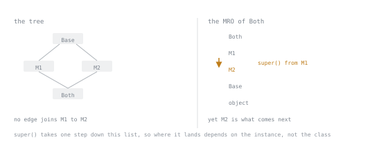

# Lesson 26. Inheritance and the MRO

**Mission link:** `super()` does not mean "the parent class", and knowing what it does mean is what makes multiple inheritance predictable rather than mysterious. The same knowledge is what lets you say precisely why an inheritance chain in review is the wrong tool.
**Primary source:** [The Python 2.3 Method Resolution Order](https://docs.python.org/3/howto/mro.html)
**Prerequisites:** [Lesson 22](0022-attribute-lookup.md), [Lesson 25](0025-construction.md)

## Warm-up

1. ▢ Lesson 22 said lookup walks "the class and its bases". In what order, for a class with two bases?

<details markdown="1"><summary>Check</summary>

A computed order, not left to right through each branch. This lesson is that computation.

</details>

2. ▢ True or false: `super().method()` calls the method on the class you inherited from.

<details markdown="1"><summary>Check</summary>

False, in general. It calls the next class after the current one in the **instance's** method resolution order, which may be a class the current one has never heard of.

</details>

## Know this

Every class has a **method resolution order**, a flat list of classes searched in sequence:

```python
class A: pass
class B(A): pass
class C(A): pass
class D(B, C): pass

[k.__name__ for k in D.__mro__]     # ['D', 'B', 'C', 'A', 'object']
```

Note where `A` sits: **after** both `B` and `C`, not immediately after `B`. The order is computed by C3 linearisation, which guarantees three properties:

1. A class comes before all of its bases.
2. Bases keep the order they were declared in.
3. Every class appears exactly once.

When no order satisfies all three, the class cannot be created:

```python
class Bad(B, A, C): pass
```

```text
TypeError: Cannot create a consistent method resolution order (MRO) for bases A, C
```

`A` before `C` is required by the declaration, and `C` before `A` is required by rule one, since `C` is a base of nothing here but `A` is a base of `B` which precedes it. The error is the language refusing to guess.

### `super()` walks the MRO, not the tree

```python
class Base:
    def __init__(self, **kw): print("Base")

class M1(Base):
    def __init__(self, **kw): print("M1"); super().__init__(**kw)

class M2(Base):
    def __init__(self, **kw): print("M2"); super().__init__(**kw)

class Both(M1, M2): pass

Both()
```

```text
M1
M2
Base
```



`M1.__init__` called `super()`, and got `M2`, which is not its base. `super()` means "the next class after me in the MRO of the object being constructed", so what it resolves to depends on the instance, not on where the code was written. That is the mechanism that makes cooperative multiple inheritance work, and it is why every class in such a chain has to follow the same protocol:

- always call `super().__init__(**kwargs)`, exactly once;
- accept and forward `**kwargs`, since you do not know who comes next;
- do not assume you are last, and do not assume you are first.

A class that skips its `super()` call silently truncates the chain, and the symptom appears in an unrelated mixin whose `__init__` never ran.

Zero-argument `super()` works inside a class body only, using a compiler-provided reference to the class. `super(M1, self)` is the explicit form and is what you need outside a method body.

### Mixins, and the one rule for them

A mixin adds behaviour and is not instantiated alone:

```python
class TimestampMixin:
    def touch(self) -> None:
        self.updated_at = datetime.now(timezone.utc)

class Record(TimestampMixin, Base): ...
```

Rules that keep them usable: put mixins **before** the base class, so they precede it in the MRO and can intercept; keep them stateless or document what attributes they require; and give them one job. A mixin that requires `self.updated_at` to exist has a hidden dependency, which is the most common way mixins become unmaintainable.

### Abstract base classes

```python
from abc import ABC, abstractmethod

class Storage(ABC):
    @abstractmethod
    def save(self, order: Order) -> None: ...

    def save_all(self, orders: Iterable[Order]) -> None:   # shared implementation
        for order in orders:
            self.save(order)
```

`ABC` refuses instantiation while an abstract method is unimplemented, which turns a missing method into an error at construction rather than at call time. Use it when you own the implementations and they share code, which is lesson 17's table: shape only, no shared code, use a `Protocol`.

### When inheritance is the wrong tool

The test is one question: **is a subclass genuinely a kind of the base, everywhere the base is accepted?** If a caller holding the base type could be surprised by the subclass, the relationship is not inheritance.

Three shapes that are almost always composition instead:

| Written as inheritance | Should be |
|---|---|
| `class OrderService(DatabaseConnection)` | a service **holding** a connection |
| `class Cache(dict)` | a class holding a dict, exposing the four methods it needs |
| `class Retry(HttpClient)` | a wrapper taking a client |

Subclassing built-in containers deserves its own warning: `dict`, `list` and `str` do not route their internal operations through your overrides, so overriding `__setitem__` on a `dict` subclass does not affect `update`, `setdefault` or the constructor. `collections.UserDict`, `UserList` and `UserString` exist for that, and holding a dict is usually better than either.

Composition costs one attribute and a few forwarding methods, and buys the ability to change the relationship later. Inheritance is the tighter coupling in the language: it exposes every base attribute, and the base can break you by adding a name.

## Practice

1. ▢ Give the MRO.

   ```python
   class A: pass
   class B(A): pass
   class C(A): pass
   class D(B): pass
   class E(D, C): pass
   ```

<details markdown="1"><summary>Check</summary>

`E, D, B, C, A, object`.

`D` and `B` come first, in declaration order down that branch, then `C`, and `A` only after both `B` and `C`, because both list it as a base. `object` is always last.

</details>

2. ▢ Predict the output, then say which class is missing from it and why.

   ```python
   class Base:
       def setup(self): print("Base")

   class Logging(Base):
       def setup(self): print("Logging"); super().setup()

   class Caching(Base):
       def setup(self): print("Caching")

   class Service(Logging, Caching, Base):
       def setup(self): print("Service"); super().setup()

   Service().setup()
   ```

<details markdown="1"><summary>Hint</summary>

Write out the MRO first, then follow each `super()` call along it.

</details>

<details markdown="1"><summary>Check</summary>

```text
Service
Logging
Caching
```

The MRO is `Service, Logging, Caching, Base, object`. `Caching.setup` does not call `super()`, so `Base.setup` never runs and the chain stops there.

This is the defect to recognise: the missing call is in `Caching`, and the symptom appears as `Base` being skipped, which the reader of `Service` cannot see. In a cooperative hierarchy, every override calls `super()`.

</details>

3. ▢ Why does this fail, and what is the minimal change?

   ```python
   class Reader: pass
   class Writer(Reader): pass
   class ReadWrite(Reader, Writer): pass
   ```

<details markdown="1"><summary>Check</summary>

```text
TypeError: Cannot create a consistent method resolution order (MRO) for bases Reader, Writer
```

The declaration asks for `Reader` before `Writer`, and rule one requires `Writer` before `Reader`, because `Writer` is a subclass of it. No order satisfies both.

Minimal change: reverse them, `class ReadWrite(Writer, Reader)`, at which point `Reader` is redundant and `class ReadWrite(Writer)` says the same thing.

</details>

4. ▢ For each, choose inheritance, composition, `Protocol`, or `ABC`.

   - a) `SqliteStorage` and `PostgresStorage`, both needing the same `save_all` loop
   - b) `RetryingClient` that wraps any HTTP client and repeats failed calls
   - c) A parameter that accepts anything with `read` and `close`, including third-party objects
   - d) A `CaseInsensitiveDict` used everywhere a dict is expected

<details markdown="1"><summary>Check</summary>

- a) `ABC`. You own both, and `save_all` is shared code an abstract base can hold.
- b) Composition. It takes a client and forwards, which is what lets it wrap clients it was not written for.
- c) `Protocol`. Structural, and it reaches classes you do not own.
- d) Composition, or `collections.UserDict`. Subclassing `dict` does not route `update`, `setdefault` or the constructor through an overridden `__setitem__`, so the case-insensitivity silently applies to some operations and not others.

</details>

5. ▢ A mixin needs to know the model's table name. Compare two ways of arranging that.

<details markdown="1"><summary>Check</summary>

Implicit: the mixin reads `self.table_name` and documents that subclasses must define it. Cheap to write, and it fails at run time in whichever method touches it first, with an `AttributeError` that names the mixin rather than the class that forgot.

Explicit: the mixin declares it and validates at class creation.

```python
class TableMixin:
    table_name: ClassVar[str]

    def __init_subclass__(cls, **kwargs) -> None:
        super().__init_subclass__(**kwargs)
        if not getattr(cls, "table_name", None):
            raise TypeError(f"{cls.__name__} must set table_name")
```

The annotation lets a checker catch it, and the hook from lesson 25 catches it at import time in the class that is wrong. That combination is what makes a mixin's requirement a contract rather than a note in a docstring.

</details>

6. ▢ `class OrderService(DatabaseConnection)` passes every test. Argue for changing it.

<details markdown="1"><summary>Check</summary>

The service now exposes every method of the connection, so callers can commit, roll back, execute arbitrary SQL or close the connection through the service, and some of them will. Every public name the connection library adds in a future version lands in your service's namespace, and a collision with one of your method names is a silent override.

It also fails the substitution question: code expecting a `DatabaseConnection` would accept an `OrderService`, which is not a connection in any useful sense.

Composition costs one attribute:

```python
class OrderService:
    def __init__(self, conn: DatabaseConnection) -> None:
        self._conn = conn
```

and buys a boundary: the service's public interface is what it chose to expose, and a test can pass a fake without subclassing anything.

</details>

## Real-world reps

- [ ] Print `SomeClass.__mro__` for the most-inherited class in a codebase you use. If the list surprises you, that class is where a bug will eventually be.
- [ ] Grep for overrides that do not call `super()`, in hierarchies that have mixins. Each one is a truncated chain.
- [ ] Find a class inheriting from `dict`, `list` or `str` and check whether the overridden method is bypassed by `update`, `extend` or the constructor.
- [ ] Take one inheritance relationship in your code and ask the substitution question out loud. Convert one that fails it to composition.
- [ ] Tomorrow: replace an abstract base class whose subclasses share no implementation with a `Protocol`, and delete the inheritance.

## Going further

- [`super`](https://docs.python.org/3/library/functions.html#super): what the zero-argument form does, and when to write the explicit one
- [The Python 2.3 Method Resolution Order](https://docs.python.org/3/howto/mro.html): C3 linearisation, worked through in full, by the person who implemented it
- [Customizing class creation](https://docs.python.org/3/reference/datamodel.html#customizing-class-creation): where the MRO is computed, and the hooks around it
- [`abc`](https://docs.python.org/3/library/abc.html): `ABC`, `abstractmethod`, and registering virtual subclasses
- [`collections.UserDict`, `UserList`, `UserString`](https://docs.python.org/3/library/collections.html#collections.UserDict): the subclassable versions of the built-in containers
- [Resources](../RESOURCES.md)

---

Not landing? Reread the primary source at the top, since this lesson compresses it and compression is where understanding leaks. Check the [glossary](../GLOSSARY.md) for any term that felt slippery.

If the lesson itself is unclear rather than the material, that is a defect: [open an issue](https://github.com/TokenCemetery/teach/issues).
