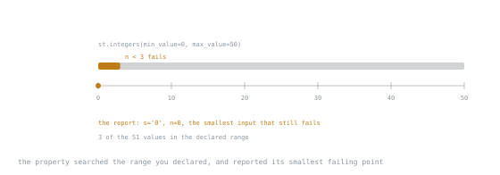

# Lesson 32. Property-Based Testing

**Mission link:** Example-based tests check the cases you thought of. A property states an invariant and hands the search for counterexamples to a library that is better at it than you are, and it reports the smallest input that breaks the claim.
**Primary source:** [Hypothesis documentation](https://hypothesis.readthedocs.io/en/latest/)
**Prerequisites:** [Lesson 28](0028-what-a-test-asserts.md), [Lesson 30](0030-parametrisation.md)

## Warm-up

1. ▢ Lesson 30 parametrised a test over the falsy set. What was still true about the coverage?

<details markdown="1"><summary>Check</summary>

It covered exactly the five inputs someone remembered to list. Anything not on the list is untested.

</details>

2. ▢ `truncate(s, n)` should never return more than `n` characters. Which inputs would you write tests for?

<details markdown="1"><summary>Check</summary>

Probably a long string, a short string, and maybe an empty one. Hold on to your answer: the counterexample below is `n=0`, and most people do not list it.

</details>

## Know this

An example test says "for this input, expect that output". A **property** says "for every input, this must hold":

```python
from hypothesis import given, strategies as st

def truncate(s: str, n: int) -> str:
    return s if len(s) <= n else s[: n - 3] + "..."

@given(st.text(), st.integers(min_value=0, max_value=50))
def test_truncate_respects_limit(s: str, n: int) -> None:
    assert len(truncate(s, n)) <= n
```

The library generates inputs, runs the body many times, and on failure **shrinks** the counterexample to the smallest one it can still fail with:

```text
s = '0', n = 0

>       assert len(truncate(s, n)) <= n
E       AssertionError: assert 3 <= 0
E        +  where 3 = len('...')
E        +    where '...' = truncate('0', 0)
E       Failing test case: test_truncate_respects_limit(
E           s='0',
E           n=0,
E       )
```

The bug is real and the report is minimal: with `n` below 3, `s[: n - 3]` slices from the end and the ellipsis alone already exceeds the limit. Nobody writes `truncate("0", 0)` by hand, and the property found it in under a second.



The failing values are three out of the fifty-one you declared, at one end of the range. Nothing about that stretch is special to look at; it is only special to `truncate`.

Shrinking is what makes this practical. Without it a failure arrives as a 400-character string of astral-plane characters, and reading it is the whole job.

### Strategies

| Strategy | Generates |
|---|---|
| `st.integers(min_value=, max_value=)` | ints, biased toward boundaries |
| `st.floats(allow_nan=False, allow_infinity=False)` | floats, including subnormals and negative zero |
| `st.text(alphabet=, min_size=)` | strings, including empty and non-Latin |
| `st.booleans()`, `st.none()` | |
| `st.lists(inner, min_size=, unique=)` | lists of another strategy |
| `st.dictionaries(keys, values)`, `st.sets(inner)` | |
| `st.decimals(places=)`, `st.dates()`, `st.datetimes(timezones=)` | |
| `st.sampled_from(list(SomeEnum))` | one of a fixed set |
| `st.one_of(a, b)`, or `a \| b` | either |
| `st.builds(Order, amount=st.decimals())` | your own class |
| `st.from_type(Order)` | your class, inferred from its annotations |

Defaults are deliberately hostile: `st.text()` produces empty strings, whitespace, combining characters and emoji; `st.floats()` produces `nan` and `-0.0` unless excluded. That is the point, and if your function genuinely does not accept those, say so in the strategy rather than in the test body.

`st.builds` and `st.from_type` are what make this usable on a real domain: annotate a dataclass, from lesson 15, and the strategy comes for free.

### The properties worth looking for

Five shapes cover most real uses:

| Property | Assertion |
|---|---|
| **round trip** | `decode(encode(x)) == x` |
| **idempotence** | `f(f(x)) == f(x)` |
| **invariant** | `len(truncate(s, n)) <= n`; a total is never negative |
| **oracle** | the fast implementation agrees with the obvious slow one |
| **metamorphic** | `sorted(xs + [y])` contains everything `sorted(xs)` did |

Round trips are the highest-value and the easiest to spot: serialisation, parsing, encoding, compression, currency formatting, URL building. Any pair of functions named `to_` and `from_` is a property waiting to be written.

The oracle shape is worth naming because it applies to optimisation. When you replace a straightforward implementation with a fast one, keep the slow one in the test file and assert they agree on generated input. That test is stronger than any set of examples and it costs three lines.

### Steering the generator

```python
from hypothesis import given, assume, example, settings, strategies as st

@given(st.lists(st.integers(), min_size=1))
@example([0])                                  # always try this one
@settings(max_examples=500)
def test_average_within_bounds(xs: list[int]) -> None:
    assume(len(set(xs)) > 1)                   # skip uninteresting cases
    assert min(xs) <= average(xs) <= max(xs)
```

- `min_size=1` in the strategy is better than `assume(xs)` in the body, because filtering throws generated cases away and can exhaust the generator.
- `@example` pins a case you care about, usually one a property already found, so it is checked first every run.
- `assume` discards a case; use it rarely, and prefer a more precise strategy.
- `@settings(max_examples=...)` trades runtime for search. The default is a hundred, which is right for a fast property.

Hypothesis also keeps a database of previously failing examples, in `.hypothesis/`, and replays them first. So a fixed bug stays checked, and a flaky-looking property that failed once yesterday fails immediately today. Add that directory to your ignore file, and know it exists when a failure appears with no code change.

### Where it does not fit

- **Anything with no expressible invariant.** "The invoice PDF looks right" is not a property.
- **Slow operations.** A hundred examples times a database round trip is a minute per test.
- **Exact business rules.** "German VAT is 19 per cent" is an example, and parametrisation from lesson 30 is the tool.
- **As a replacement for examples.** Keep both: examples document intent and read as specification, properties find the inputs nobody imagined.

The honest workflow is example tests for the behaviour you are building, plus one or two properties for the invariants that must never break. Two properties on a serialisation layer are worth more than fifty examples; zero examples on a pricing rule is unreadable.

## Practice

1. ▢ Name the property, and write it.

   ```python
   def to_query_string(params: dict[str, str]) -> str: ...
   def from_query_string(qs: str) -> dict[str, str]: ...
   ```

<details markdown="1"><summary>Check</summary>

A round trip.

```python
@given(st.dictionaries(st.text(min_size=1), st.text()))
def test_query_string_round_trip(params: dict[str, str]) -> None:
    assert from_query_string(to_query_string(params)) == params
```

Expect this to fail on the first run, and to be right to fail: keys containing `=` or `&`, empty keys, non-ASCII characters, and duplicate keys after encoding are all things the pair has to decide about. The property does not just test the code, it forces the specification to exist.

</details>

2. ▢ Why is the strategy better than the `assume`?

   ```python
   @given(st.lists(st.integers()))
   def test_first_is_smallest(xs):
       assume(len(xs) > 0)
       assert sorted(xs)[0] == min(xs)
   ```

<details markdown="1"><summary>Hint</summary>

What happens to a generated case that `assume` rejects?

</details>

<details markdown="1"><summary>Check</summary>

It is thrown away, and the run needs another. `st.lists(st.integers())` generates the empty list often, because Hypothesis deliberately favours boundaries, so a large share of the budget is spent producing cases that are immediately discarded, and with enough filtering the test fails with `FailedHealthCheck` for filtering too much.

```python
@given(st.lists(st.integers(), min_size=1))
```

The generator now only produces valid input. General rule: express the precondition in the strategy, and keep `assume` for conditions a strategy cannot express.

</details>

3. ▢ Match each function to the property shape.

   - a) `normalise_whitespace(s)`
   - b) `compress(data)` and `decompress(data)`
   - c) A new binary search replacing a linear scan
   - d) `merge(a, b)` for two sorted lists

<details markdown="1"><summary>Check</summary>

- a) Idempotence: `normalise(normalise(s)) == normalise(s)`. Also an invariant: no double spaces in the output.
- b) Round trip: `decompress(compress(x)) == x`. Plus an invariant if compression is meant to help: never larger than the input by more than a bounded margin.
- c) Oracle: keep the linear scan in the test and assert both return the same index for generated input.
- d) Invariant and metamorphic: the result is sorted, its length is the sum of the inputs' lengths, and it is a permutation of `a + b`.

</details>

4. ▢ `@given(st.floats())` fails immediately on a function that averages numbers. Is that a bug in the code or the test?

<details markdown="1"><summary>Check</summary>

It depends on the contract, and answering that is the useful part.

`st.floats()` includes `nan` and infinities. If the function is documented to accept any float, then `nan` propagating through an average is a real behaviour that needs deciding: reject, ignore, or propagate. If the function only ever receives amounts from a database column, the contract excludes them and the strategy should say so:

```python
st.floats(allow_nan=False, allow_infinity=False, min_value=0, max_value=1e9)
```

Either way the property has done its job: it turned an unstated assumption into a decision. What is wrong is silencing it with `assume(not math.isnan(x))` while leaving the function's contract unwritten.

</details>

5. ▢ A property fails once in CI and passes on re-run, with no code change. What happened, and what do you do?

<details markdown="1"><summary>Check</summary>

The generator explored an input it had not tried before. Property tests are not deterministic across runs by default, which is a feature: the search continues.

What to do: take the counterexample from the output, pin it with `@example(...)`, and fix the bug. That converts a random find into a permanent regression test.

What not to do: re-run until green and move on. Also worth knowing: Hypothesis stores failing examples in `.hypothesis/`, so locally the failure reproduces immediately, while a fresh CI container has no database and will not reproduce it. `derandomize=True` in settings makes runs reproducible at the cost of the ongoing search, and is a reasonable choice for CI when flakiness is unacceptable.

</details>

6. ▢ A colleague replaces the whole example suite of a parser with three properties. Argue against.

<details markdown="1"><summary>Check</summary>

Properties state that something holds, not what the thing does. `parse(unparse(x)) == x` passes for a parser of a completely different format, so the suite no longer documents the grammar, and a new contributor cannot learn the expected input from reading it.

Examples are also the better failure report for business rules: `test_parses_iso_with_offset` failing names the feature, while a shrunk counterexample of `'0'` names a character.

The complement is the answer. Keep enough examples that the file reads as a specification of the format, and add properties for the invariants that examples cannot cover exhaustively. The properties will find the bugs; the examples will explain what the code is for.

</details>

## Real-world reps

- [ ] Find a `to_`/`from_` or `encode`/`decode` pair in code you own and write the round-trip property. Expect it to fail, and treat the first failure as a specification question rather than a bug report.
- [ ] Write one oracle property for a function you have optimised, keeping the slow version in the test file.
- [ ] Take a function with an invariant you would state in a docstring, such as "never returns more than n items", and turn that sentence into a property.
- [ ] Add `@example(...)` for every counterexample a property finds, so the fix stays checked.
- [ ] Tomorrow: annotate one dataclass fully and try `st.from_type` on it, to see how little strategy code a typed domain needs.

## Going further

- [Hypothesis documentation](https://hypothesis.readthedocs.io/en/latest/): the tutorial, then the strategies reference
- [What you can generate and how](https://hypothesis.readthedocs.io/en/latest/reference/strategies.html): every built-in strategy, and composing your own
- [Settings](https://hypothesis.readthedocs.io/en/latest/reference/api.html#hypothesis.settings): `max_examples`, `deadline`, `derandomize`, and the example database
- [`assume` and filtering](https://hypothesis.readthedocs.io/en/latest/reference/api.html#hypothesis.assume): when filtering is acceptable and when it exhausts the generator
- [Resources](../RESOURCES.md)

---

Not landing? Reread the primary source at the top, since this lesson compresses it and compression is where understanding leaks. Check the [glossary](../GLOSSARY.md) for any term that felt slippery.

If the lesson itself is unclear rather than the material, that is a defect: [open an issue](https://github.com/TokenCemetery/teach/issues).
