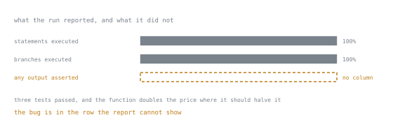

# Lesson 33. Coverage and Confidence

**Mission link:** The mission asks for coverage as a signal rather than a target. The distinction is not philosophical: a suite can reach 100 per cent branch coverage, assert nothing, and ship a wrong answer, and this lesson demonstrates it.
**Primary source:** [Coverage.py documentation](https://coverage.readthedocs.io/en/latest/)
**Prerequisites:** [Lesson 28](0028-what-a-test-asserts.md), [Lesson 30](0030-parametrisation.md)

## Warm-up

1. ▢ Lesson 28 said a test with a weak assertion is nearly worthless. Would coverage notice?

<details markdown="1"><summary>Check</summary>

No. Coverage records which lines ran, not what was checked about them.

</details>

2. ▢ What does 80 per cent coverage tell you about the other 20 per cent?

<details markdown="1"><summary>Check</summary>

That no test executed it. That is genuinely useful information, and it is all the number means.

</details>

## Know this

### What the report says

```text
Name                  Stmts   Miss Branch BrPart  Cover   Missing
-----------------------------------------------------------------
src/shop/pricing.py      12      5      6      1    56%   8-11, 14
```

| Column | Means |
|---|---|
| `Stmts` | statements found |
| `Miss` | statements never executed |
| `Branch` | branch outcomes found, with `branch = true` |
| `BrPart` | branches taken one way only |
| `Missing` | the line numbers, which is the useful column |

**Turn branch coverage on.** Without it, an `if` with no `else` counts as covered when only the true path ran, and the untested path is the one that ships broken.

```toml
[tool.coverage.run]
branch = true
source = ["src"]

[tool.coverage.report]
exclude_also = ["if TYPE_CHECKING:", "raise NotImplementedError"]
show_missing = true
```

`source = ["src"]` matters more than it looks: without it, a module that no test imports at all is absent from the report entirely, and the number is computed over the files you happened to touch.

### The demonstration

```python
def discount(amount: Decimal, code: str | None) -> Decimal:
    if code is None:
        return amount
    if code == "HALF":
        return amount * 2          # a bug: it should divide
    return amount
```

```python
@pytest.mark.parametrize("code", [None, "HALF", "X"])
def test_it_runs(code):
    discount(Decimal("100"), code)      # no assertion at all
```

```text
Name                  Stmts   Miss Branch BrPart  Cover   Missing
-----------------------------------------------------------------
src/shop/pricing.py       7      0      4      0   100%
3 passed
```

100 per cent of statements, 100 per cent of branches, three passing tests, and a function that doubles the price where it should halve it. Coverage measures execution. Only an assertion measures correctness.



The third row is drawn empty rather than at zero, because zero would mean the tool looked and found none. It did not look: there is no such column in the report, and no threshold you can set against it. Every number the run printed was about the first two rows, and the defect was in the third.

That is the whole argument against a coverage target: a number that can be reached without asserting anything will be, once someone is required to reach it.

### What the number is actually good for

Three things, all of them about **finding** rather than proving:

1. **Which lines have never run.** Read the `Missing` column, not the percentage. Each entry is a question: is this untested, unreachable, or dead?
2. **The diff.** Coverage on the lines a pull request changed is a much better signal than a project total, because it is actionable and it does not punish the codebase for its history.
3. **Dead code.** A line no test touches, in a code path no user reaches, is a candidate for deletion. Coverage is the cheapest way to find it.

And one honest use of a threshold: a **ratchet** that forbids the number going down. That prevents erosion without inviting the assertion-free tests a fixed target produces.

### When coverage looks wrong

| Symptom | Cause |
|---|---|
| a file missing from the report | no test imports it, and `source` is not set |
| lines in `if TYPE_CHECKING:` counted as missed | they never run at run time; exclude them |
| a subprocess's code uncovered | needs `concurrency` configuration or `coverage run` around the child |
| coverage drops when tests run in parallel | needs `parallel = true` and `coverage combine` |
| an `async` function partly covered | the branch after an `await` that never resumed |

### Beyond coverage: does the test detect anything?

The property coverage cannot measure is whether a test **fails when the code is wrong**. Three ways to check it, in increasing cost:

1. **Break it on purpose.** Change a `+` to a `-`, run the suite, and see whether anything turns red. Ten seconds, and it is the single most informative thing you can do to a suite you have inherited.
2. **Write the regression test first.** Watch it fail before the fix. Lesson 28 said this; it is the same idea with the proof built in.
3. **Mutation testing.** A tool makes small changes automatically and reports which ones the suite survived. `mutmut` and `cosmic-ray` do this for Python. It is slow, so run it on one important module rather than the project.

A surviving mutant is a precise statement: this change to your code broke nothing that you check.

### Flaky tests

A test that fails intermittently is worse than no test, because it trains everyone to re-run rather than to read. The causes, in the order they occur:

| Cause | Fix |
|---|---|
| shared state between tests | narrower fixture scope, from lesson 29 |
| order dependence | run with random ordering to expose it, then fix the state |
| real time: `sleep`, timeouts, "now" | inject the clock, from lesson 31 |
| network or external service | fake it at a boundary you own |
| unordered data compared as ordered | compare sets, or sort both sides |
| concurrency in the code under test | the code has a race, and the test found it |

Quarantining a flaky test with `xfail` is acceptable for a day, with `strict=False` and a reason. Leaving it is how a suite becomes advisory. The last row deserves emphasis: sometimes the flaky test is the only thing that noticed a real race, and deleting it deletes the evidence.

### What the suite is for

Speed is a correctness feature. A suite that takes 40 minutes gets run once a day, so it stops being feedback and becomes a report. Aim for the whole unit suite in seconds, which means most tests touch no database, no network, and no clock.

```bash
pytest --durations=10        # the ten slowest tests
```

Run that once. The result is usually a small number of tests that account for most of the time, and they are usually the ones that talk to something real.

Layering, stated without the pyramid diagram:

| Layer | Answers | Should be |
|---|---|---|
| unit | does this function behave? | almost all of them, milliseconds each |
| integration | do my pieces talk correctly to a real database, queue, or service? | few, and genuinely against the real thing |
| end to end | does the system do the user's task? | very few, and expected to be slow and occasionally flaky |

The failure mode in real projects is not the shape of the pyramid, it is the middle layer being mocked into meaninglessness: an "integration" test where every collaborator is a `Mock` tests only the wiring of the mocks. If it does not touch something real, it is a unit test with extra setup.

## Practice

1. ▢ A module reports 100 per cent coverage. Name three defects it can still contain.

<details markdown="1"><summary>Check</summary>

- A wrong result on every input, if the tests assert nothing, or assert only that no exception was raised.
- A wrong result on inputs the tests do not use: coverage says the line ran, not that it ran with a negative number, an empty string, or a value at the boundary.
- A missing behaviour. Coverage cannot report a branch that was never written, so an unhandled case is invisible.

Also: anything about performance, concurrency, or the interaction between two modules that both have full coverage individually.

</details>

2. ▢ Why is branch coverage worth enabling?

<details markdown="1"><summary>Hint</summary>

Consider `if x is None: return default` with only one test.

</details>

<details markdown="1"><summary>Check</summary>

Statement coverage counts a line as covered once it has executed at all. For an `if` with no `else`, running only the true path executes every statement in the block, so the file can reach 100 per cent statements while the false path has never run.

Branch coverage counts outcomes, so it reports `BrPart`, a branch taken one way only. That column is where the untested path lives, and the untested path is where the bug ships.

</details>

3. ▢ A team sets a CI gate at 90 per cent. Predict what happens over six months.

<details markdown="1"><summary>Check</summary>

The predictable sequence: tests that execute code without asserting on it, because they are the cheapest way to move the number; `# pragma: no cover` on the hard parts; error-handling branches tested with `pytest.raises(Exception)`; and generated or boilerplate files added to the exclusion list.

The number reaches 90 and stays there, and it now measures compliance rather than confidence. Meanwhile the tests that matter, the regression tests for real bugs, contribute almost nothing to the number, because a bug fix is usually two lines.

The version that works is a ratchet on the diff: coverage must not fall, and new lines should be covered. It asks for the same behaviour without rewarding the assertion-free test.

</details>

4. ▢ You inherit a 3,000-test suite of unknown quality. What do you do first?

<details markdown="1"><summary>Check</summary>

Break the code and see whether the suite notices. Pick three important functions, invert a condition or change a constant in each, and run the suite. The number of tests that fail per mutation is your first real measurement, and it takes minutes.

Then, in order: `pytest --durations=10` to find where the time goes; branch coverage with `Missing` to find what nothing touches; and a look at whether the `Missing` lines are the error paths, which they usually are.

What not to start with: the coverage percentage. It answers a question you did not ask.

</details>

5. ▢ A test fails roughly one run in twenty. Give the diagnostic order.

<details markdown="1"><summary>Check</summary>

1. Run it alone, repeatedly. If it never fails alone, it is shared state or ordering: check fixture scopes, then module-level state.
2. Run the suite with random ordering. If failing depends on what ran before, you have found it.
3. Look for real time in the test and in the code: `sleep`, timeouts, `datetime.now()`, cache expiry.
4. Look for unordered data compared as ordered: dict iteration is insertion-ordered, but a set, a database query without `ORDER BY`, or a directory listing is not.
5. Look for concurrency in the code under test. If it is there, the test is not flaky, the code is.

Then decide honestly: fix it today, or mark it `xfail` with a reason and a ticket. Do not re-run until green.

</details>

6. ▢ An "integration" test suite runs in 4 seconds and patches the database, the HTTP client and the clock. What is it testing?

<details markdown="1"><summary>Check</summary>

The wiring of the doubles. Every boundary that integration testing exists to check, the SQL actually being valid, the driver's type conversions, transaction and isolation behaviour, the real service's response shape, timeouts, is replaced by an assumption the test cannot falsify.

That is not worthless: it does check that the pieces call each other in the right order with the right arguments, which is a unit test of the composition. It should be named as one.

The missing thing is a small number of tests against something real, a database in a container or an in-memory engine with the same dialect, plus one live check against the external service run outside the pull-request loop. Few, slow, and real beats many, fast, and imaginary at that layer.

</details>

## Real-world reps

- [ ] Change one operator in code you own, run the suite, and count the failures. That number is what your tests are worth on that line.
- [ ] Turn on `branch = true` and `source` in your coverage configuration and compare the number with what it was. The drop is the information.
- [ ] Read the `Missing` column and classify ten entries: untested, unreachable, or dead. Delete the dead ones.
- [ ] Run `pytest --durations=10` and decide, for each of the slowest tests, whether it needs to touch the real thing.
- [ ] Run mutation testing on one module. Every surviving mutant is a specific missing assertion.
- [ ] Tomorrow: find the flakiest test in your suite and follow the diagnostic order rather than re-running it.

## Going further

- [Coverage.py](https://coverage.readthedocs.io/en/latest/): configuration, branch measurement, and the report formats
- [Branch coverage](https://coverage.readthedocs.io/en/latest/branch.html): what a partial branch is and why it matters
- [Excluding code](https://coverage.readthedocs.io/en/latest/excluding.html): `exclude_also`, and the honest uses of `pragma: no cover`
- [pytest-cov](https://pytest-cov.readthedocs.io/en/latest/): running coverage under pytest, including in parallel
- [mutmut](https://mutmut.readthedocs.io/en/latest/): mutation testing, for measuring whether tests detect anything
- [Resources](../RESOURCES.md)

---

Not landing? Reread the primary source at the top, since this lesson compresses it and compression is where understanding leaks. Check the [glossary](../GLOSSARY.md) for any term that felt slippery.

If the lesson itself is unclear rather than the material, that is a defect: [open an issue](https://github.com/TokenCemetery/teach/issues).
