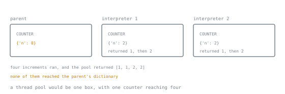

# Lesson 36. Processes and Interpreters

**Mission link:** When the work is computation rather than waiting, threads do not help and something with its own interpreter state must. There are now two such things, and both charge for every object that crosses the boundary.
**Primary source:** [The Python Standard Library, multiprocessing](https://docs.python.org/3/library/multiprocessing.html)
**Prerequisites:** [Lesson 13](0013-modules-and-packages.md), [Lesson 34](0034-the-gil-precisely.md)

## Warm-up

1. ▢ Lesson 13: why does `if __name__ == "__main__":` matter more here than anywhere else?

<details markdown="1"><summary>Check</summary>

Because a child process imports the main module, so unguarded top-level code runs again in every child, and code that starts processes starts them recursively.

</details>

2. ▢ Lesson 34 measured four processes at 0.38 seconds against 1.01 sequential. Why is that not four-fold?

<details markdown="1"><summary>Check</summary>

Starting the processes and moving the data costs something. This lesson is about that cost.

</details>

## Know this

### Processes

```python
from concurrent.futures import ProcessPoolExecutor

with ProcessPoolExecutor(max_workers=4) as pool:
    results = list(pool.map(analyse, chunks))
```

The interface is identical to `ThreadPoolExecutor`, and everything from lesson 35 about futures and exceptions applies unchanged. The differences are all about the boundary.

**Everything crossing it is serialised.** Arguments are pickled in the parent and unpickled in the child, and results come back the same way. That produces the error you will hit first:

```text
lambda to a process: PicklingError Can't pickle <function <lambda> ...>:
                     it's not found as __main__.<lambda>
```

| Crosses fine | Does not |
|---|---|
| module-level functions | `lambda`, closures, local functions |
| built-in and standard types | open files, sockets, database connections |
| dataclasses of picklable fields | locks, threads, generators |
| a class defined at module level | a class defined inside a function |

The fix is nearly always to make the callable a module-level function and pass plain data. `functools.partial` of a module-level function pickles; a closure over the same values does not.

**Start methods** changed recently and it matters:

| Method | Behaviour | Default on |
|---|---|---|
| `spawn` | fresh interpreter, re-imports the main module | Windows, macOS |
| `forkserver` | forks from a small clean server process | POSIX, from Python 3.14 |
| `fork` | copies the parent, including its threads | **no longer the default anywhere** |

`fork` was removed as a default because forking a process that already has threads is unsafe: the child inherits locks in whatever state they were in, and deadlocks at start-up. Code that relied on inheriting parent state by forking, a common shortcut for passing large read-only data, must now pass it explicitly or select `fork` deliberately with `get_context("fork")`.

### The cost of the boundary

Measured on one machine:

```text
process pool of 4, trivial work           0.09s
interpreter pool of 4, trivial work       0.03s
sending a 2M-element list to 2 processes  0.15s
len() on that list locally                0.000002s
```

Two rules follow.

**Send few, large tasks, not many small ones.** A pool whose per-item work is shorter than the transfer cost is slower than a plain loop, and the profile shows all the time in pickling.

**Send indexes, not data.** If the workers can read the file, the rows, or the array region themselves, pass a path and a range. `multiprocessing.shared_memory` exists for large numeric arrays, and `numpy` on a memory-mapped file is usually simpler.

### Subinterpreters

New in Python 3.14, and the second way to get real parallelism:

```python
from concurrent.futures import InterpreterPoolExecutor

with InterpreterPoolExecutor(max_workers=4) as pool:
    results = list(pool.map(analyse, chunks))
```

Each worker is a separate interpreter **inside one process**, with its own interpreter state and its own lock. From lesson 34's measurements, four subinterpreters did the CPU-bound work in 0.30 seconds against 1.01 sequential, and started faster than four processes.

Isolation is real. A module-level global is not shared:

```python
COUNTER = {"n": 0}
def bump(_):
    COUNTER["n"] += 1
    return COUNTER["n"]
```

```text
result: [1, 1, 2, 2]
parent: {'n': 0}
```

Two interpreters each counted to two, and the parent's dictionary never changed. Each also has its own `sys.modules`, so imports happen per interpreter.



`COUNTER` is written once in the source and exists three times at run time. The four increments are all accounted for, two in each interpreter, and none of them landed in the box the source file appears to describe. That is what makes the isolation worth trusting and also what makes it a trap: code that quietly relied on a shared global does not fail here, it just stops having any effect.

Where they sit between threads and processes:

| | Threads | Subinterpreters | Processes |
|---|---|---|---|
| CPU parallelism | no, on a standard build | yes | yes |
| start-up cost | lowest | low | highest |
| shared memory objects | yes, and that is the risk | no | no |
| crash isolation | none | partial: one process | full |
| C extension support | complete | not all extensions yet | complete |
| maturity | decades | new | decades |

The honest recommendation today: **processes for CPU-bound work you need to ship, subinterpreters when you can test them on your dependencies.** The extension-compatibility question is the deciding one, and it is answered by trying it, not by reading.

### Neither one fixes a design

Both boundaries reward the same shape: **pure functions over data that can be split.** If the work needs a shared cache, a shared connection, or ordered access to one resource, the parallel version needs a coordinator, and the coordinator is usually where the time goes.

The order of things to try, in this order:

1. Do less work. An algorithmic change beats any of this, and lesson 39 measures it.
2. Move the loop into a library that already releases the lock: NumPy, Polars, a database.
3. Split the data and use a pool.
4. Rewrite the hot part in C or Rust, behind a measurement that justifies it.

## Practice

1. ▢ Why does this fail, and what is the minimal fix?

   ```python
   def process_all(rows, scale):
       with ProcessPoolExecutor(4) as pool:
           return list(pool.map(lambda r: r.amount * scale, rows))
   ```

<details markdown="1"><summary>Hint</summary>

What has to be sent to the child, and can it be?

</details>

<details markdown="1"><summary>Check</summary>

`PicklingError`: a `lambda` cannot be pickled, and even a named local function could not, because pickling a function stores a reference to its module-level name.

```python
def _scaled(args):
    row, scale = args
    return row.amount * scale

def process_all(rows, scale):
    with ProcessPoolExecutor(4) as pool:
        return list(pool.map(_scaled, ((r, scale) for r in rows)))
```

or, more readably, `functools.partial(_scale_row, scale=scale)`, which pickles because `_scale_row` is module-level.

The deeper problem is the per-item work: one multiplication per task, with a pickle round trip each. This code will be slower than a list comprehension no matter how the callable is spelled. Chunk it, or do not use a pool.

</details>

2. ▢ A job runs in 8 seconds sequentially and 30 seconds with a process pool of eight. Give three causes.

<details markdown="1"><summary>Check</summary>

- **Transfer dominates.** Each task sends a large object and returns a large object, so the pickling costs more than the work.
- **Tasks are too small.** Eight thousand tasks of one millisecond each pay the boundary cost eight thousand times. Chunk into eight tasks of a thousand items.
- **Start-up per call.** A pool created inside a loop pays process start-up on every iteration. Create it once.

A fourth, on POSIX: the work re-imports a heavy module in every child under `spawn` or `forkserver`, so import time is multiplied by the number of workers.

</details>

3. ▢ Threads, subinterpreters, or processes?

   - a) Fetching 500 URLs
   - b) Parsing 500 large JSON files, CPU-bound in `json.loads`
   - c) Resizing images with Pillow
   - d) Running an untrusted user-supplied script
   - e) A CPU-bound task in a library that ships a C extension of unknown thread safety

<details markdown="1"><summary>Check</summary>

- a) Threads. Waiting, so the lock is released and there is nothing to parallelise.
- b) Processes or subinterpreters. Pass paths, not contents, so the workers read their own files and the boundary carries almost nothing.
- c) Threads are enough, since Pillow releases the lock, and processes also work.
- d) Processes. Only a separate process gives crash and memory isolation, and even that is not a security boundary by itself.
- e) Processes. Full isolation, and no question about whether the extension supports being loaded into several interpreters.

</details>

4. ▢ Code that worked on Python 3.13 on Linux breaks on 3.14 with children that cannot see data the parent loaded. What changed?

<details markdown="1"><summary>Check</summary>

The default start method on POSIX changed from `fork` to `forkserver`. Under `fork`, a child inherited the parent's entire memory, so a large dictionary loaded before the fork was simply there. Under `forkserver` the children fork from a small clean server process instead, so nothing the parent loaded afterwards is inherited.

The options: pass the data explicitly as arguments, load it in each worker with a pool `initializer`, put it in `shared_memory` or a memory-mapped file, or select the old behaviour with `mp.get_context("fork")`.

The last one is a decision with a cost, which is exactly why the default moved: forking a process that has any threads, including ones a library started, can deadlock the child.

</details>

5. ▢ Rewrite so the boundary carries as little as possible.

   ```python
   rows = read_all_rows(path)                    # 4 million rows in memory
   with ProcessPoolExecutor(8) as pool:
       totals = list(pool.map(sum_amounts, chunk(rows, 500_000)))
   ```

<details markdown="1"><summary>Check</summary>

```python
def sum_range(args) -> Decimal:
    path, start, stop = args
    return sum_amounts(read_rows(path, start, stop))       # each worker reads its own slice

ranges = [(path, i, i + 500_000) for i in range(0, total_rows, 500_000)]
with ProcessPoolExecutor(8) as pool:
    totals = list(pool.map(sum_range, ranges))
```

The original pickles four million rows in the parent and unpickles them in the children, so the same data is serialised, copied and rebuilt once per chunk. The rewrite sends three small values per task and lets the operating system's page cache do the sharing.

The parent also no longer needs the rows in memory at all, which is often the larger win.

</details>

6. ▢ A colleague wants to switch a shipping service from processes to subinterpreters for the lower start-up cost. What do you check first?

<details markdown="1"><summary>Check</summary>

Whether every C extension in the dependency tree supports being loaded into multiple interpreters. That is the binding constraint, it is not documented consistently, and the failure mode is a crash or a subtle misbehaviour rather than a clean error.

Then: whether the start-up cost is actually significant, since a long-lived pool pays it once; whether anything relies on the workers sharing module state, which they do not, as the measurement above shows; and whether losing full crash isolation matters, since one bad interpreter takes the process with it.

If the answers are favourable, the way to find out is a load test with the real dependencies, not a microbenchmark.

</details>

## Real-world reps

- [ ] Take a CPU-bound job you have and time it three ways: sequential, thread pool, process pool. Keep the numbers, because they settle the argument permanently.
- [ ] Find a pool whose tasks are individual items and chunk them. Measure before and after.
- [ ] Look for anything sent to a worker that could be replaced by a path and a range.
- [ ] Check whether any of your `multiprocessing` code depended on `fork` inheriting parent state, and make it explicit either way.
- [ ] Tomorrow: run one CPU-bound workload through `InterpreterPoolExecutor` and see whether your dependencies survive it.

## Going further

- [`multiprocessing`](https://docs.python.org/3/library/multiprocessing.html): start methods, the `__main__` guard, and what can be pickled
- [Contexts and start methods](https://docs.python.org/3/library/multiprocessing.html#contexts-and-start-methods): the 3.14 change, and `get_context`
- [`concurrent.futures`](https://docs.python.org/3/library/concurrent.futures.html): `ProcessPoolExecutor` and `InterpreterPoolExecutor` behind one interface
- [PEP 734, Multiple Interpreters in the Stdlib](https://peps.python.org/pep-0734/): what a subinterpreter is and what it isolates
- [`multiprocessing.shared_memory`](https://docs.python.org/3/library/multiprocessing.shared_memory.html): for large arrays that must not be copied
- [Resources](../RESOURCES.md)

---

Not landing? Reread the primary source at the top, since this lesson compresses it and compression is where understanding leaks. Check the [glossary](../GLOSSARY.md) for any term that felt slippery.

If the lesson itself is unclear rather than the material, that is a defect: [open an issue](https://github.com/TokenCemetery/teach/issues).
