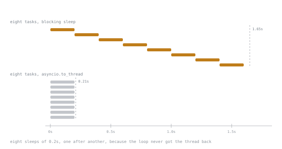

# Lesson 37. asyncio

**Mission link:** The mission asks for async code that does not stall and an explanation of what a blocking call inside an event loop does. Both come from one fact: there is a single thread, and it only moves when a coroutine yields at an `await`.
**Primary source:** [The Python Standard Library, asyncio](https://docs.python.org/3/library/asyncio.html)
**Prerequisites:** [Lesson 9](0009-generators.md), [Lesson 10](0010-exceptions.md), [Lesson 34](0034-the-gil-precisely.md)

## Warm-up

1. ▢ Lesson 9: what does a generator do at a `yield`?

<details markdown="1"><summary>Check</summary>

Freezes its frame, hands a value out, and resumes on the next line when asked. A coroutine at an `await` does the same, and the event loop is what asks.

</details>

2. ▢ Lesson 35 got an eight-fold speedup from eight threads on eight waits. What does `asyncio` add?

<details markdown="1"><summary>Check</summary>

Scale, without a thread each. Eight is nothing; ten thousand concurrent waits is where the model pays.

</details>

## Know this

```python
async def fetch(i: int) -> int:
    await asyncio.sleep(0.2)         # stands in for a network call
    return i
```

Calling `fetch(1)` runs nothing: it builds a **coroutine**, exactly as calling a generator function builds a generator. Something has to drive it, and that something is the event loop, started by `asyncio.run`.

### `await` in a loop is sequential

Measured, eight waits of 0.2 seconds:

```text
await in a loop (8 x 0.2s)     1.62s
asyncio.gather                 0.20s
asyncio.TaskGroup              0.20s
```

```python
results = [await fetch(i) for i in range(8)]         # 1.62s: one at a time
results = await asyncio.gather(*(fetch(i) for i in range(8)))   # 0.20s
```

`await` means "suspend until this finishes". It creates no concurrency by itself. Concurrency comes from having several **tasks** in flight, and a task is created by `gather`, `TaskGroup`, or `create_task`.

This is the most common async bug, and it is invisible: the code is correct, uses `async` throughout, and runs eight times slower than intended.

### `TaskGroup` over `gather`

```python
async with asyncio.TaskGroup() as tg:
    tasks = [tg.create_task(fetch(i)) for i in range(8)]
results = [t.result() for t in tasks]
```

`TaskGroup`, from Python 3.11, is the one to reach for. The difference is failure behaviour, and it is the whole argument:

- If one task raises, the group **cancels the others** and waits for them, then raises an `ExceptionGroup`.
- Nothing is left running when the block exits, so there are no orphaned tasks.
- With `gather`, a failure leaves the other tasks running unless you pass `return_exceptions=True` and inspect the results by hand.

Measured, with one task raising `ValueError`:

```text
TaskGroup raised ExceptionGroup containing ['ValueError']
```

Which is why `except*` from lesson 10 exists: a plain `except ValueError` does not catch a `ValueError` inside a group.

```python
try:
    async with asyncio.TaskGroup() as tg:
        ...
except* ValueError as eg:
    ...
```

### Cancellation and timeouts

```python
async with asyncio.timeout(0.1):
    await slow()
```

```text
slow(): saw CancelledError, cleaning up
timeout raised TimeoutError
```

Two facts to hold together. Cancellation is delivered as `CancelledError` raised **at the `await` where the coroutine is suspended**, so cleanup in a `finally` or a `with` runs normally. And `asyncio.timeout` converts that into `TimeoutError` for the caller.

The rules that follow:

- **Never swallow `CancelledError`.** Catch it only to clean up, then `raise`. A coroutine that returns normally after being cancelled breaks the shutdown of everything above it.
- **A coroutine with no `await` cannot be cancelled**, because there is no point at which the exception can be delivered.
- Cleanup that must complete during cancellation goes in `finally`, and if it needs to `await`, wrap it in `asyncio.shield` or accept that it may be cancelled too.

### The blocking call

```text
blocking sleep inside async    1.65s        (time.sleep in eight tasks)
asyncio.to_thread              0.21s
```

Eight tasks, each calling `time.sleep(0.2)` instead of `await asyncio.sleep(0.2)`, took as long as doing them one at a time, because there is **one thread** and a blocking call does not release it to the loop. Nothing raises, nothing warns, and the concurrency silently disappears.



Both runs are the same eight sleeps of the same length, drawn on the same axis. The staircase is what "one thread" looks like when nothing gives it back.

Everything in this category behaves the same way: `requests.get`, a synchronous database driver, `open(...).read()` on a slow disk, `subprocess.run`, `hashlib` over a large file, a tight computation loop. In a server, one such call in one handler adds its full duration to the latency of **every** other request in flight.

Three fixes, in order:

1. Use the async library: `httpx` or `aiohttp` instead of `requests`, an async driver instead of a synchronous one.
2. Offload it: `await asyncio.to_thread(blocking_fn, *args)`, which is a thread pool behind an `await`. Correct for a blocking call you cannot replace.
3. Offload CPU work to a process: `loop.run_in_executor(ProcessPoolExecutor(), fn, ...)`, since a thread would not help per lesson 34.

To find them, run with debug mode on, which logs callbacks that take too long:

```bash
PYTHONASYNCIODEBUG=1 python -m myapp
```

```text
Executing <Task finished name='Task-2' coro=<bad() done ...>> took 0.210 seconds
```

### The rest of the everyday API

| Need | Use |
|---|---|
| run an async program | `asyncio.run(main())` |
| many things at once, with failure handling | `asyncio.TaskGroup` |
| many things at once, tolerating failures | `gather(..., return_exceptions=True)` |
| a deadline | `async with asyncio.timeout(seconds)` |
| a blocking function | `await asyncio.to_thread(fn, *args)` |
| a background task that outlives the caller | `task = asyncio.create_task(...)`, and **keep a reference** |
| bounded concurrency | `asyncio.Semaphore(n)` |
| a queue between tasks | `asyncio.Queue` |
| a lock between tasks | `asyncio.Lock`, never `threading.Lock` |
| per-task context | `contextvars`, not `threading.local` |

Two traps in that table. A task created with `create_task` and not stored can be garbage collected mid-flight, so keep the reference or use a `TaskGroup`. And `threading.Lock` in a coroutine blocks the whole loop rather than yielding, which turns a lock into a stall.

### What asyncio does not fix

It does not make CPU-bound code faster: one thread, one interpreter, per lesson 34. It does not remove races, since a task can be suspended at any `await`, so check-then-act across an `await` has exactly the bug from lesson 34, without needing another thread. And it does not simplify anything: it colours every function in the call chain, because only a coroutine can `await`, so adopting it partway through a codebase means duplicating interfaces or bridging with `to_thread` and `asyncio.run`.

Choose it when the concurrency is large and the work is waiting. For eight requests, threads are simpler and just as fast.

## Practice

1. ▢ Why does this take 1.6 seconds rather than 0.2?

   ```python
   async def main():
       results = []
       for url in urls:                 # eight urls
           results.append(await fetch(url))
       return results
   ```

<details markdown="1"><summary>Check</summary>

`await` suspends until that one fetch completes, then the loop starts the next. There is only ever one request in flight, so the total is the sum.

```python
async def main():
    async with asyncio.TaskGroup() as tg:
        tasks = [tg.create_task(fetch(url)) for url in urls]
    return [t.result() for t in tasks]
```

Now eight are in flight and the total is the slowest one. The tell in review: an `await` inside a `for` body, with nothing else in the loop that depends on the previous result.

</details>

2. ▢ Find the stall.

   ```python
   async def handle(request):
       user = await db.fetch_user(request.user_id)
       avatar = requests.get(user.avatar_url).content     # 300 ms
       return render(user, avatar)
   ```

<details markdown="1"><summary>Hint</summary>

Which of those two calls releases the event loop, and what are the other requests doing meanwhile?

</details>

<details markdown="1"><summary>Check</summary>

`requests.get` is synchronous. For 300 milliseconds the single event-loop thread is inside C code doing a socket read, so no other handler runs, no other `await` resumes, and every concurrent request's latency grows by 300 milliseconds.

Fixes: `await httpx.AsyncClient().get(...)` if you can change the dependency, or `await asyncio.to_thread(requests.get, user.avatar_url)` if you cannot. Do not leave it, and do not "fix" it by adding more workers, which multiplies processes rather than removing the stall.

`PYTHONASYNCIODEBUG=1` finds these: it logs any callback that occupies the loop too long.

</details>

3. ▢ `TaskGroup` or `gather`?

   - a) Fetch three resources; if any fails, the request fails
   - b) Notify twelve webhooks; failures are logged and ignored
   - c) Two queries whose results are both required
   - d) A background metrics flusher that runs for the process's life

<details markdown="1"><summary>Check</summary>

- a) `TaskGroup`. One failure cancels the rest, which is exactly right when partial results are useless.
- b) `gather(..., return_exceptions=True)`, then inspect each result. A `TaskGroup` would cancel the remaining webhooks on the first failure.
- c) `TaskGroup`, same reason as a.
- d) Neither, quite: it outlives any block. `asyncio.create_task` with the reference stored somewhere that lives as long as the app, plus cancellation on shutdown. An unreferenced task can be collected while running.

</details>

4. ▢ What is wrong with this cleanup?

   ```python
   async def worker():
       try:
           await do_work()
       except asyncio.CancelledError:
           log.info("cancelled")
           return
   ```

<details markdown="1"><summary>Check</summary>

It swallows the cancellation. The caller that cancelled this task sees it complete normally, so a `TaskGroup` above it believes the shutdown succeeded, `asyncio.timeout` may not raise, and code waiting for everything to stop proceeds while this coroutine's callers think it finished its work.

```python
except asyncio.CancelledError:
    log.info("cancelled")
    raise
```

Catch it to clean up, then re-raise, always. If the cleanup itself must `await` and must not be interrupted, `asyncio.shield` protects that one operation, at the cost of delaying the shutdown.

</details>

5. ▢ Does this race, in a single-threaded event loop?

   ```python
   async def get_or_create(key):
       if key not in cache:
           cache[key] = await build(key)
       return cache[key]
   ```

<details markdown="1"><summary>Check</summary>

Yes, and it is the same bug as lesson 34's with no threads involved. The `await` is a suspension point: task A checks, finds nothing, suspends inside `build`; task B checks, also finds nothing, and also calls `build`. Measured with eight concurrent callers for one key:

```text
unsafe: builds for one key = 8
with an asyncio.Lock: builds = 1
```

```python
locks: dict[str, asyncio.Lock] = defaultdict(asyncio.Lock)

async def get_or_create(key):
    if key in cache:
        return cache[key]
    async with locks[key]:
        if key not in cache:                 # check again, holding the lock
            cache[key] = await build(key)
    return cache[key]
```

The lesson generalises: **an `await` is exactly as dangerous as a thread switch for any invariant spanning it.** Single-threaded does not mean atomic; it means the switch points are visible, which is genuinely easier to review.

</details>

6. ▢ A team proposes converting a synchronous service to `asyncio` for performance. It handles 50 concurrent requests, each spending 95 per cent of its time on database queries. Advise them.

<details markdown="1"><summary>Check</summary>

Fifty concurrent waits is well within what threads handle: lesson 35's measurement scaled linearly, and a thread pool of fifty is unremarkable. The conversion buys little throughput here.

What it costs: every function in the request path becomes a coroutine, so the whole codebase is coloured; the database driver must be replaced with an async one, along with its migration and pooling story; every synchronous library still in use needs `to_thread`, which reintroduces the thread pool they were trying to avoid; and the failure modes are new, including stalls that only appear under load.

Where the answer flips: tens of thousands of mostly-idle connections, such as websockets or long polling, where one thread per connection does not fit. That is the workload `asyncio` is for.

What to do instead: measure the 95 per cent. Connection pool size, a missing index, and one query per row are the usual answers, and none of them are fixed by changing the concurrency model.

</details>

## Real-world reps

- [ ] Time an `await` inside a `for` loop against the same work in a `TaskGroup`. The factor is the number of items, and seeing it once fixes the habit.
- [ ] Run an async program with `PYTHONASYNCIODEBUG=1` and read what it reports. Every slow callback is a blocking call.
- [ ] Grep an async codebase for `requests.`, `time.sleep`, `open(`, and `subprocess.run` inside `async def`. Each is a stall.
- [ ] Find every `except asyncio.CancelledError` and confirm each one re-raises.
- [ ] Find every `create_task` and confirm the task is referenced somewhere that outlives it.
- [ ] Tomorrow: write the check-then-act across an `await` from practice 5 and observe the duplicate build, so the single-threaded-is-not-atomic point lands.

## Going further

- [`asyncio`](https://docs.python.org/3/library/asyncio.html): the whole library, with the low-level parts marked as such
- [Coroutines and Tasks](https://docs.python.org/3/library/asyncio-task.html): `TaskGroup`, `gather`, `timeout`, `to_thread`, and cancellation
- [Developing with asyncio](https://docs.python.org/3/library/asyncio-dev.html): debug mode, and the documented list of what blocks the loop
- [PEP 654, Exception Groups and `except*`](https://peps.python.org/pep-0654/): how a `TaskGroup` reports several failures
- [`contextvars`](https://docs.python.org/3/library/contextvars.html): per-task context, since a thread-local is shared by every task
- [Resources](../RESOURCES.md)

---

Not landing? Reread the primary source at the top, since this lesson compresses it and compression is where understanding leaks. Check the [glossary](../GLOSSARY.md) for any term that felt slippery.

If the lesson itself is unclear rather than the material, that is a defect: [open an issue](https://github.com/TokenCemetery/teach/issues).
