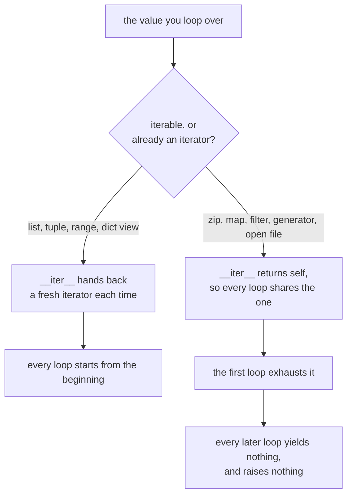

# Iteration and Generators

Lookup sheet for stage 2. The question it exists to answer: **has this already been consumed, and how do I get a second pass?**

## The protocol

```python
it = iter(obj)                   # obj must have __iter__
value = next(it)                 # it must have __next__
                                 # StopIteration means finished, for good
```

| Role | Must implement | Guarantee |
|---|---|---|
| iterable | `__iter__` returning an iterator | can be looped over repeatedly, if each call returns a fresh iterator |
| iterator | `__next__`, and `__iter__` returning `self` | one pass, then exhausted permanently |

Every iterator is an iterable. Most iterables are not iterators.

## Consumed once, or not

| Value | Re-iterable | Notes |
|---|---|---|
| `list`, `tuple`, `str`, `bytes`, `set`, `dict` | yes | each loop gets a fresh iterator |
| `range` | yes | lazy and re-iterable: supports `len` and indexing |
| `d.keys()`, `d.values()`, `d.items()` | yes | live views, so mutating the dict during a loop raises `RuntimeError` |
| `iter(anything)` | **no** | |
| `zip`, `map`, `filter`, `enumerate`, `reversed` | **no** | all return iterators in Python 3 |
| generator expression | **no** | |
| call to a generator function | **no** | the function is reusable, the result is not |
| open file object | **no** | its own iterator; needs `seek(0)` to repeat |
| `itertools.*` | **no** | every one of them |



The two tables above meet here. Which column of the second table a value lands in is decided by one line of the first: whether `__iter__` builds something new or hands back `self`. Nothing about a `for` loop changes between the two branches, which is why the mistake is invisible at the call site.

Exhausted iterators do not raise. They yield nothing, so `sum` returns `0`, `list` returns `[]`, and `max` raises only because it has no default.

## Getting a second pass

| Option | When |
|---|---|
| `items = list(source)` | the default; costs memory, buys every list operation |
| call the producing function again | source is cheap, or too large to hold |
| `itertools.tee(it, 2)` | two consumers advancing together; buffers the gap between them |

## Generator mechanics

| Written | Effect |
|---|---|
| `yield` anywhere in the body | calling the function runs **no** code and returns a generator |
| `next(gen)` | runs to the next `yield`, freezes the frame, returns the value |
| falling off the end | raises `StopIteration` |
| `return` | ends it; `return v` attaches `v` to the `StopIteration` |
| `yield from sub` | yields all of `sub`, and forwards `send`, `throw`, `close` |
| `gen.close()` | raises `GeneratorExit` at the paused `yield`, so `finally` runs |
| an unhandled `StopIteration` in the body | becomes `RuntimeError`, since Python 3.7 |

Cleanup inside a generator (`with`, `try/finally`) runs on exhaustion, on `close()`, or at collection. Abandonment alone is not a language-level guarantee of prompt cleanup.

## Choosing between a list and a generator

| Need | Answer |
|---|---|
| `len`, indexing, slicing, sorting, two passes | list |
| constant memory over a large or unbounded source | generator |
| the caller may stop early | generator |
| the values are consumed exactly once, in order | generator |
| the result crosses an API boundary to callers you do not control | list, or document it |

## `itertools` by problem

| Problem | Tool |
|---|---|
| take the first n, or a window | `islice(it, start, stop)` |
| join several iterables | `chain(a, b)`, `chain.from_iterable(nested)` |
| stop at the first failing item | `takewhile(pred, it)` |
| skip a leading run | `dropwhile(pred, it)` |
| consecutive runs of an equal key | `groupby(it, key)`, **input must be sorted by that key** |
| overlapping neighbours | `pairwise(it)`, from Python 3.10 |
| fixed-size chunks | `batched(it, n)`, from Python 3.12 |
| endless counter, or repetition | `count(start)`, `cycle(it)`, `repeat(x, n)` |
| all combinations or orderings | `product`, `permutations`, `combinations` |
| running totals | `accumulate(it, func)` |
| two passes over one iterator | `tee(it, 2)` |

## Built-ins that take a lazy iterable

`sum`, `any`, `all`, `min`, `max`, `sorted`, `list`, `tuple`, `set`, `dict`, `enumerate`, `zip`, `map`, `filter`, `next`.

Passing a generator expression rather than a list comprehension avoids a container that exists only to be consumed: `sum(x.total for x in orders)`. `any` and `all` additionally stop at the first decisive item.

## Pitfalls

| Symptom | Cause |
|---|---|
| second loop prints nothing, no error | the value was an iterator, already consumed |
| `ValueError: max() iterable argument is empty` | an earlier `sum` or `len` consumed it |
| `RuntimeError: dictionary changed size during iteration` | mutating a dict while looping over a view; loop over `list(d)` |
| `RuntimeError: generator raised StopIteration` | a bare `next(it)` inside a generator body; use `next(it, None)` |
| a nested loop over one object finishes the outer one | the object is its own iterator; give it `__iter__` returning `iter(self._items)` |
| file appears empty | it was read once already |
| `TypeError: 'generator' object is not subscriptable` | indexing a generator; use `islice` or a list |

## Sources

- [Iterator Types](https://docs.python.org/3/library/stdtypes.html#iterator-types)
- [Yield expressions](https://docs.python.org/3/reference/expressions.html#yield-expressions)
- [`itertools`](https://docs.python.org/3/library/itertools.html)
- [Glossary: iterable, iterator, generator](https://docs.python.org/3/glossary.html)
- [PEP 479, Change StopIteration handling inside generators](https://peps.python.org/pep-0479/)
