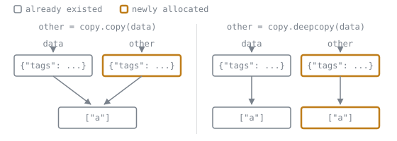

# Mutability and Copying

Lookup sheet for stage 1. The question it exists to answer: **if I do this, who else can see it?**

## Mutable or not

| Type | Mutable | Hashable | Notes |
|---|---|---|---|
| `int`, `float`, `bool`, `complex` | no | yes | arithmetic builds new objects |
| `str`, `bytes` | no | yes | every method returns a new object |
| `tuple` | no | only if contents are | fixes its slots, not its contents |
| `frozenset` | no | yes | |
| `range` | no | yes | |
| `list` | yes | no | |
| `dict` | yes | no | keys must be hashable |
| `set` | yes | no | members must be hashable |
| `bytearray` | yes | no | |
| your own class | yes by default | yes by default | hashable until you define `__eq__` without `__hash__` |

**Hashability follows mutability.** A `dict` key or `set` member must be hashable, so one list anywhere inside a tuple disqualifies the whole tuple.

## Rebinding against mutating

| Code | What it does | Can another name see it? |
|---|---|---|
| `x = value` | rebinds the name `x` | no |
| `x.method()` that mutates | changes the object | yes |
| `x[0] = value` | changes the object | yes |
| `x += [1]` on a **list** | mutates in place, then rebinds | yes |
| `x += "a"` on a **str** | builds new, then rebinds | no |
| `x = x + [1]` | builds new, then rebinds | no |
| `del x` | unbinds the name only | no, the object survives |

The single test: a name on the left of `=` is being rebound and nothing else observes it. Anything reaching *through* the name is a mutation, and every name for that object observes it.

`+=` is the exception that catches everyone: it means "mutate if the type can, otherwise rebuild", so the answer depends on the type on the left.

## What each copy idiom copies

Given `data = {"tags": ["a"]}`:

| Idiom | Depth | New outer object | New inner objects |
|---|---|---|---|
| `other = data` | none | no | no |
| `data.copy()` | shallow | yes | no |
| `dict(data)` | shallow | yes | no |
| `{**data}` | shallow | yes | no |
| `data["tags"][:]` | shallow, of the inner list | yes | no |
| `copy.copy(data)` | shallow | yes | no |
| `copy.deepcopy(data)` | deep | yes | yes |

The two columns of the table are the two rows of boxes. A shallow copy allocates the outer object and nothing else, so `data["tags"] is other["tags"]` stays true and appending to it is visible through both names.

For sequences, `items[:]`, `list(items)` and `copy.copy(items)` are the same shallow copy.

**Choosing:** shallow is enough when you only reorder or add and remove elements. Deep is needed when the elements themselves will be modified. If neither feels right, the real answer is usually to stop sharing the mutable object.

`deepcopy` handles cycles, calls `__deepcopy__` where defined, and is slow enough to matter in a loop.

## Mutating methods against their non-mutating twins

Every in-place method returns `None`.

| In place | Builds a new object |
|---|---|
| `items.sort()` | `sorted(items)` |
| `items.reverse()` | `reversed(items)`, `items[::-1]` |
| `items.append(x)` | `items + [x]` |
| `items.extend(other)` | `items + other` |
| `items.clear()` | `[]` |
| `d.update(other)` | `{**d, **other}` |
| `s.add(x)` | `s.union({x})` |

`items = items.sort()` is therefore always a bug: it discards the list and leaves `None`.

## Traps, with the fix

| Trap | Why | Fix |
|---|---|---|
| `def f(x, acc=[])` | default evaluated once at definition, accumulates | `acc=None`, then `if acc is None: acc = []` |
| `[[0] * 3] * 2` | repeats one reference to one inner list | `[[0] * 3 for _ in range(2)]` |
| `backup = dict(config)` called a backup | shallow, so nested values are shared | `copy.deepcopy`, or do not share |
| `if x:` for an optional argument | rejects `0`, `""`, `[]` | `if x is not None:` |
| `x = x or default` | same, `0 or 30` is `30` | `default if x is None else x` |
| deleting keys while iterating a dict | `RuntimeError` | iterate `list(d)` |
| `("a", [1])` as a dict key | unhashable content | use a tuple of hashables |

## Deciding in review

Ask in this order:

1. Is the object mutable at all? If not, nothing here applies.
2. Does the code rebind, or reach through the name? Rebinding is invisible to everyone else.
3. If a copy was taken, is anything nested inside it going to be modified? If yes, shallow was not enough.
4. Does a function mutate an argument? If yes, it is part of the contract and belongs in the docstring.

## Sources

- [`copy`](https://docs.python.org/3/library/copy.html)
- [Mutable sequence types](https://docs.python.org/3/library/stdtypes.html#mutable-sequence-types)
- [Naming and binding](https://docs.python.org/3/reference/executionmodel.html#naming-and-binding)
- [Default Argument Values](https://docs.python.org/3/tutorial/controlflow.html#default-argument-values)
