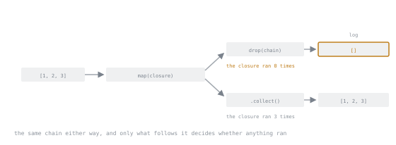

# Lesson 12. Iterators and Closures

**Mission link:** Most idiomatic Rust code touching a collection is an iterator chain, and its closures obey lesson 3's borrow rule exactly, which is why a broken-looking chain is usually a borrow held one adapter too long.
**Primary source:** [std::iter](https://doc.rust-lang.org/std/iter/index.html)
**Prerequisites:** [Lesson 3](0003-borrowing.md), [Lesson 9](0009-option.md)

## Warm-up

1. ▢ Lesson 3's rule: many shared borrows or one mutable borrow, never both, and a borrow ends at its last use. A closure capturing a local by mutable reference is bound by it too. State the rule from memory.

<details markdown="1"><summary>Check</summary>

Many shared borrows or exactly one mutable borrow, never both, valid for as long as used. A closure that mutates a captured local is just another mutable borrow.

</details>

2. ▢ Lesson 9's `Option<T>` has two variants, present and absent. An iterator's `next` returns exactly that type. Which variant means no elements are left?

<details markdown="1"><summary>Check</summary>

`None`. `Some(item)` means there was one more; `None` means the sequence is exhausted, lesson 9's enum doing its usual job.

</details>

## Know this

### What an iterator is

An iterator is any type implementing the `Iterator` trait, which asks for exactly one method: `fn next(&mut self) -> Option<Self::Item>`. That return type is lesson 9's `Option`: `Some(item)` means there was one, `None` means the sequence is over.

```rust
let v = vec![1, 2, 3];
let mut it = v.iter();
println!("{:?}", it.next());
println!("{:?}", it.next());
println!("{:?}", it.next());
println!("{:?}", it.next());
```

This prints `Some(1)`, `Some(2)`, `Some(3)`, `None`. A `for` loop is exactly that call, wrapped: `for x in v.iter() { ... }` desugars to

```rust
let mut it = v.iter().into_iter();
loop {
    match it.next() {
        Some(x) => { /* body */ }
        None => break,
    }
}
```

both print the identical `1 2 3`.

A collection hands you an iterator three ways, each different for ownership. `iter` borrows each element, leaving `v` usable afterwards. `iter_mut` borrows mutably: `for x in v.iter_mut() { *x *= 2; }` doubles every element in place and `v` still prints as `[2, 4, 6]`. `into_iter` takes ownership of the collection itself, moving every element out, and the collection is gone once the loop is written:

```rust
let v = vec![1, 2, 3];
for x in v.into_iter() {
    print!("{x} ");
}
println!("{v:?}");
```

```text
error[E0382]: borrow of moved value: `v`
   --> src/main.rs:6:16
    |
  2 |     let v = vec![1, 2, 3];
    |         - move occurs because `v` has type `Vec<i32>`, which does not implement the `Copy` trait
  3 |     for x in v.into_iter() {
    |                ----------- `v` moved due to this method call
...
  6 |     println!("{v:?}");
    |                ^ value borrowed here after move
```

Trimmed of a `help` suggestion to `clone`. `into_iter` moved `v` into the loop, and nothing is left at that name by the time `println!` runs. The honest fix is rarely `clone`: reach for `iter` or `iter_mut` unless the loop genuinely means to consume the collection.

### Laziness, proven rather than asserted

Building a chain does no work at all; only a call that asks for values, a consumer, runs anything inside it.

```rust
let mut log = Vec::new();
let v = vec![1, 2, 3];
let chain = v.iter().map(|x| {
    log.push(*x);
    x * 2
});
drop(chain);
println!("{log:?}");
```

This prints `[]`. The closure passed to `map` never ran, since `chain` was dropped without anything calling `next` on it. Finishing the same shaped chain with `.collect()` instead changes that completely:

```rust
let result: Vec<i32> = v.iter().map(|x| {
    log.push(*x);
    x * 2
}).collect();
println!("{log:?}, {result:?}");
```

This prints `[1, 2, 3], [2, 4, 6]`; `collect` called `next` three times, running the closure once each time.



Both endings hang off the same two boxes. The log is not a property of the chain, it is a property of what was asked of it.

That closure captured `log` by mutable reference, and the borrow lasts as long as the chain does, lesson 3's rule again. Read the captured local before the borrowing chain is done, and the borrow is still live:

```rust
let mut side_effects = Vec::new();
let v = vec![1, 2, 3];
let chain = v.iter().map(|x| {
    side_effects.push(*x);
    x * 2
});
println!("{side_effects:?}");
let result: Vec<i32> = chain.collect();
```

```text
error[E0502]: cannot borrow `side_effects` as immutable because it is also borrowed as mutable
 --> src/main.rs:8:16
  |
4 |     let chain = v.iter().map(|x| {
  |                              --- mutable borrow occurs here
5 |         side_effects.push(*x);
  |         ------------ first borrow occurs due to use of `side_effects` in closure
...
8 |     println!("{side_effects:?}");
  |                ^^^^^^^^^^^^ immutable borrow occurs here
9 |     let result: Vec<i32> = chain.collect();
  |                            ----- mutable borrow later used here
```

This is `E0502` from lesson 3, not a new iterator-specific code. `chain` is still alive because it is used again on the next line, so its mutable borrow of `side_effects` has not ended, and the rule is the one lesson 3 named: many shared borrows or one mutable borrow, never both. Moving the read below the `collect` fixes it by ending the borrow before the conflicting use, rather than fighting it.

### The adapters worth knowing

Each adapter changes what a chain will produce, without running anything yet. `map` asks what you want instead of each element: mapping `[1, 2, 3]` by doubling yields `2, 4, 6`. `filter` asks which elements to keep: filtering `1..=6` by evenness keeps `[2, 4, 6]`. `filter_map` does both, keeping only what a closure turns into `Some`: parsing `["1", "x", "3"]` and dropping failures gives `[1, 3]` in one step. `enumerate` pairs each element with its index: `(0, 1), (1, 2), (2, 3)` for `[1, 2, 3]`. `zip` pairs two sequences in step, stopping at the shorter: `[1, 2, 3]` zipped with `['a', 'b', 'c']` gives `(1, 'a'), (2, 'b'), (3, 'c')`. `take` and `skip` keep or drop from the front: over `1..=6` they give `[1, 2, 3]` and `[4, 5, 6]`. `chain` joins a second iterator onto the first's end: `[1, 2]` then `[3, 4]` gives `[1, 2, 3, 4]`. `flat_map` flattens as it maps: `[[1, 2], [3], [4, 5]]` gives one flat `[1, 2, 3, 4, 5]`. `rev` needs a known end and gives the back first: reversing `1..=6` gives `[6, 5, 4, 3, 2, 1]`. `peekable` answers what none of the others can, what comes next without taking it: peeking `[1, 2, 3]` returns `Some(1)` without advancing, so `.next()` still returns `Some(1)`.

Consuming the chain is where the rest of the vocabulary lives. `collect` gathers everything into whatever type is named. `sum` and `count` reduce to one number, the total or the length: `21` and `6` for `1..=6`. `fold` runs a computation from a seed: folding `1..=6` with `0` and addition gives `21`. `any` and `all` ask yes or no, stopping once settled: over `1..=6`, `any` even is `true`, `all` even is `false`. `find` returns the first match as an `Option`, `Some(5)` for the first over `4` in `1..=6`; `position` gives the index instead, `Some(4)`. `min_by_key` and `max_by_key` take the extreme by a derived key: over `1..=6`, maximum by value is `Some(6)`, minimum by distance from `3` is `Some(3)`. `for_each` runs a closure on every element and keeps nothing; a plain `for` loop is usually clearer, needing no closure at all.

### `collect`, and what it collects into

`collect` does not know what to build until told, since several types can be assembled from an iterator and one has to be chosen. The same chain of uppercased words collects into a `Vec<String>` with an annotation on the binding,

```rust
let shout: Vec<String> = words.iter().map(|s| s.to_uppercase()).collect();
```

or with a turbofish on the call instead, which says exactly the same thing without touching the binding:

```rust
let shout = words.iter().map(|s| s.to_uppercase()).collect::<Vec<String>>();
```

Both give `["AB", "CD", "EF"]` for `["ab", "cd", "ef"]`. The identical call, annotated `String` instead, collects the same chain into one concatenated `String`, since `String` can be built from an iterator of `String`s: `"ABCDEF"`, one string rather than three.

Collecting into a `Result` changes what the chain does, not just where it lands. `["10", "20", "oops", "40"].iter().map(|s| s.parse::<i32>()).collect::<Result<Vec<i32>, _>>()` gives `Err(ParseIntError { kind: InvalidDigit })` and stops there, never even parsing `"40"`. The same mapping collected as a plain `Vec<Result<i32, _>>` keeps every attempt: `[Ok(10), Ok(20), Err(ParseIntError { kind: InvalidDigit }), Ok(40)]`. Which is right is the question lesson 10 raised for a whole input, whether one bad element should sink the batch, and `collect`'s target type is how that gets decided.

### Closures, and the three traits

A closure is checked against three traits, `Fn`, `FnMut` and `FnOnce`, chosen by what its body does to what it captured. A closure that only reads a capture implements `Fn`:

```rust
let x = 10;
let read_only = || x + 1;
```

A closure that mutates a capture implements `FnMut` instead, needing a `mut` binding to be called more than once:

```rust
let mut count = 0;
let mut increment = || { count += 1; count };
```

calling it twice gives `1` then `2`. A closure that moves a captured value out implements only `FnOnce`, since a second call would need that value again:

```rust
let s = String::from("owned");
let consume = move || s;
```

`FnOnce` is the floor every closure meets; `Fn` and `FnMut` are earned by never moving anything out.

`move` changes what gets captured, not which trait results: every capture is taken by value, which is why a closure outliving its own scope, such as one handed to a thread, needs it. Calling a `FnOnce` closure twice is worth compiling on purpose:

```rust
let s = String::from("owned");
let consume = move || s;
println!("{}", consume());
println!("{}", consume());
```

```text
error[E0382]: use of moved value: `consume`
 --> src/main.rs:5:20
  |
4 |     println!("{}", consume());
  |                    --------- `consume` moved due to this call
5 |     println!("{}", consume());
  |                    ^^^^^^^ value used here after move
  |
note: closure cannot be invoked more than once because it moves the variable `s` out of its environment
```

The first call moved `s` out of `consume`; the second needs `s` again and there is none left. This is `E0382`, the same used-after-move code lesson 9 met on a struct field.

Rust 2021 changed what a closure captures. Before that edition, naming one field captured the whole struct, so a closure failed to compile if another field was already moved out or mutably borrowed elsewhere, even untouched; the workaround was cloning the field, or the struct, just for something independent. Since Rust 2021, a closure captures only the fields it names:

```rust
struct Point { left: i32, right: i32 }
let mut p = Point { left: 1, right: 2 };
let mut touch_left = || { p.left += 1; };
touch_left();
println!("{}", p.right);
```

`touch_left` borrows only `p.left`, so `p.right` prints `2` while it is still alive, and calling it again leaves `p.left` at `3`. [The release announcement](https://blog.rust-lang.org/2021/05/11/edition-2021.html) says it plainly: "Starting in Rust 2021, closures will only capture the fields that they use."

### When a loop is the better answer

An iterator chain is not automatically the clearer choice. A computation needing an index, a running mutation, and an early exit all at once is usually easier to read as the loop it would otherwise be. Finding how far into a list of byte counts the running total first exceeds a budget, stopping as soon as it does, is a `for` loop that simply returns:

```rust
fn first_over(bytes: &[u64], budget: u64) -> Option<(usize, u64)> {
    let mut total = 0u64;
    for (i, &b) in bytes.iter().enumerate() {
        total += b;
        if total > budget {
            return Some((i, total));
        }
    }
    None
}
```

Reaching for `fold` to avoid writing that loop needs a tuple threaded through every step to fake the early exit `fold` does not have, since `fold` always runs to the end regardless of what its accumulator already holds: a `(total, done, found)` tuple, a check for `done` on every element after the answer already sits in `found`, and the same `Some((2, 600))` for a budget of `500` over `[100, 200, 300, 900]`, bought at the cost of a closure nobody would call readable. This is a style, not an improvement: write the loop when the chain would fight `fold`'s shape just to say what `return` already says.

## Practice

1. ▢ Predict which of these two blocks compile.

   ```rust
   // A
   let mut v = vec![1, 2, 3];
   for x in v.iter_mut() {
       *x *= 2;
   }
   println!("{v:?}");

   // B
   let v = vec![1, 2, 3];
   for x in v.into_iter() {
       print!("{x} ");
   }
   println!("{v:?}");
   ```

<details markdown="1"><summary>Check</summary>

A compiles, printing `[2, 4, 6]`: `iter_mut` only borrows. B does not: `E0382`, since `into_iter` moved `v`, leaving nothing at that name for the final `println!`.

</details>

2. ▢ Predict what `visited` and `first_two` hold once this runs, then compile it.

   ```rust
   let mut visited = Vec::new();
   let v = vec![1, 2, 3, 4, 5];
   let first_two: Vec<i32> = v
       .iter()
       .map(|x| {
           visited.push(*x);
           x * 10
       })
       .take(2)
       .collect();
   ```

<details markdown="1"><summary>Hint</summary>

`take(2)` only asks `next` for two values. Work out how many times `map`'s closure can run before that.

</details>

<details markdown="1"><summary>Check</summary>

`visited` is `[1, 2]` and `first_two` is `[10, 20]`. `take(2)` stops the chain after two elements, so `map` never runs on `3`, `4` or `5`; laziness bounds how much of a chain runs, not just whether it runs.

</details>

3. ▢ These collect the same mapping over `["10", "20", "oops", "40"]` two ways. Predict both outputs, then compile and run it.

   ```rust
   let entries = ["10", "20", "oops", "40"];
   let as_result: Result<Vec<i32>, _> =
       entries.iter().map(|s| s.parse::<i32>()).collect();
   let as_vec_of_results: Vec<Result<i32, _>> =
       entries.iter().map(|s| s.parse::<i32>()).collect();
   ```

<details markdown="1"><summary>Check</summary>

`as_result` is `Err(ParseIntError { kind: InvalidDigit })`, stopping at the first failure. `as_vec_of_results` is `[Ok(10), Ok(20), Err(ParseIntError { kind: InvalidDigit }), Ok(40)]`, keeping every attempt. Same mapping; the target type decides the behaviour.

</details>

4. ▢ Predict whether this compiles, naming the error code if not, then compile it.

   ```rust
   let s = String::from("owned");
   let consume = move || s;
   println!("{}", consume());
   println!("{}", consume());
   ```

<details markdown="1"><summary>Hint</summary>

Work out which trait `consume` implements from what its body does to `s`, then ask what a second call would need.

</details>

<details markdown="1"><summary>Check</summary>

Does not compile: `E0382`, use of a moved value. `consume` moves `s` out on its first call, so it implements only `FnOnce`; a second call has nothing left to move.

</details>

5. ▢ Judgement call, not a compile check. `first_over_fold` computes the same answer as the `first_over` loop above. Say which version you would rather maintain, and why.

   ```rust
   fn first_over_fold(bytes: &[u64], budget: u64) -> Option<(usize, u64)> {
       let (_, _, found) = bytes.iter().enumerate().fold(
           (0u64, false, None),
           |(total, done, found), (i, &b)| {
               if done {
                   (total, done, found)
               } else {
                   let total = total + b;
                   if total > budget {
                       (total, true, Some((i, total)))
                   } else {
                       (total, false, found)
                   }
               }
           },
       );
       found
   }
   ```

<details markdown="1"><summary>Check</summary>

The loop. `fold` has no early exit, so this version carries a `done` flag through the accumulator and keeps checking it after the answer is already known, purely to imitate a `return` the loop gets for free.

</details>

## Real-world reps

- [ ] Rewrite whichever loop in your `logsum` project tallies requests, notes, blanks and rejected lines as one iterator chain, and keep whichever version reads better, saying why.
- [ ] Reproduce this lesson's laziness demonstration against a chain of your own: log to a `Vec` inside a closure, drop the chain unconsumed, then build it again and finish with `.collect()`.
- [ ] Tomorrow: without looking back, name the three closure traits and what distinguishes each, then check against this lesson.

## Going further

- [Closures](https://doc.rust-lang.org/book/ch13-01-closures.html): capturing the environment, and the three `Fn` traits
- [Processing a Series of Items with Iterators](https://doc.rust-lang.org/book/ch13-02-iterators.html): the `Iterator` trait, laziness, and adapters versus consumers
- [Iterator](https://doc.rust-lang.org/std/iter/trait.Iterator.html): the trait, with every method's exact signature
- [The Plan for the Rust 2021 Edition](https://blog.rust-lang.org/2021/05/11/edition-2021.html): the release behind disjoint field capture
- [Data and control](../reference/data-and-control.md): the stage 2 reference sheet
- [Resources](../RESOURCES.md)

---

Not landing? Reread the primary source at the top, since this lesson compresses it and compression is where understanding leaks. Check the [glossary](../GLOSSARY.md) for any term that felt slippery.

If the lesson itself is unclear rather than the material, that is a defect: [open an issue](https://github.com/TokenCemetery/teach/issues).
