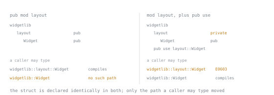

# Lesson 18. Modules and Visibility

**Mission link:** A caller can only reach what your module tree exposes, so choosing `pub`, `pub(crate)` or nothing for each item is where a library's public surface actually gets decided, not a filing exercise done after the logic works.
**Primary source:** [The Rust Programming Language, Managing Growing Projects](https://doc.rust-lang.org/book/ch07-00-managing-growing-projects-with-packages-crates-and-modules.html)
**Prerequisites:** [Lesson 15](0015-designing-an-error-type.md), [Lesson 7](0007-structs.md)

## Warm-up

1. ▢ Lesson 15 established that an error type's shape is a decision about what a caller can act on, not an internal convenience. The same test applies to any `pub` item. What should decide whether a struct or an enum variant is marked `pub` at all?

<details markdown="1"><summary>Check</summary>

Whether some caller outside the defining module genuinely needs to see it, the same test lesson 15 applied to an error's variants. Marking something `pub` out of convenience hands out a promise nobody asked for; once it is `pub`, narrowing or removing it later is a breaking change.

</details>

2. ▢ Lesson 7 established that a struct owns its fields and that an `impl` block adds behaviour beside them, but said nothing about a field's visibility outside the struct's own module. Given that every item defaults to private, what happens when code outside the module builds one of those structs with a struct literal naming every field?

<details markdown="1"><summary>Check</summary>

It fails to compile: a private field cannot be named in a struct literal from outside its defining module, even when the struct itself is `pub`. Only code inside that module, or a method the struct exposes on purpose, can set it. This lesson makes that failure concrete.

</details>

## Know this

### The module tree, and the two ways to spell it

A crate is a tree of modules with one root, `src/lib.rs` for a library or `src/main.rs` for a binary, and every other module attaches with a `mod` declaration somewhere between it and the root. `mod` is a declaration, not an import: a path used before anything declares its module fails not with a privacy error but with this:

```text
error[E0432]: unresolved import `helpers`
 --> src/main.rs:1:5
  |
1 | use helpers::hello;
  |     ^^^^^^^ use of unresolved module or unlinked crate `helpers`
```

A module can be spelled inline, wrapping code in the same file:

```rust
mod inline_mod {
    pub fn hello() -> &'static str {
        "inline"
    }
}
```

or with a trailing semicolon instead of a body, so it lives in its own file, named after it, beside the file that declares it:

```rust
// in src/lib.rs
mod file_mod;

// in src/file_mod.rs
pub fn hello() -> &'static str {
    "file"
}
```

A module with children needs a directory instead: `src/dir_mod.rs` declares it and lists what it holds, and `src/dir_mod/thing.rs` is the child:

```rust
// in src/dir_mod.rs
pub mod thing;

// in src/dir_mod/thing.rs
pub fn hello() -> &'static str {
    "dir"
}
```

All three are equally part of the crate, reachable from the root, and calling them together confirms it:

```rust
format!("{} {} {}", inline_mod::hello(), file_mod::hello(), dir_mod::thing::hello())
```

```text
inline file dir
```

Which spelling to use is a file-size decision: a screenful of code can stay inline or in its own file, and a module that grows children earns a directory.

### `use`, and what it does and does not do

`use` only creates a shorter local name for a path that already resolves; it changes nothing about what that path may reach. Trying to `use` a private item fails exactly as calling it by its full path would:

```rust
mod inner {
    fn secret() -> i32 {
        42
    }
}

use inner::secret;

fn main() {
    println!("{}", secret());
}
```

```text
error[E0603]: function `secret` is private
 --> src/main.rs:7:12
  |
7 | use inner::secret;
  |            ^^^^^^ private function
  |
note: the function `secret` is defined here
 --> src/main.rs:2:5
  |
2 |     fn secret() -> i32 {
  |     ^^^^^^^^^^^^^^^^^^
```

`use` never had authority to grant access; it only saves typing a reachable path, and this is the same `E0603` a bare `inner::secret()` call gives with no `use` in sight.

Three spellings matter: a plain path brings one item in, `use inner::hello;`; `as` renames it, useful when two items would collide, `use inner::bye as farewell;`; and a brace group brings several paths sharing a prefix, a rename allowed inside it, `use inner::{hello as hi2, bye};`. All three compile together, each call resolving under whichever name brought it in:

```rust
mod inner {
    pub fn hello() -> &'static str {
        "hi"
    }
    pub fn bye() -> &'static str {
        "bye"
    }
}

use inner::hello;
use inner::bye as farewell;
use inner::{hello as hi2, bye};

fn main() {
    println!("{} {} {} {}", hello(), farewell(), hi2(), bye());
}
```

```text
hi bye hi bye
```

### The visibility levels

Four levels each answer a question about who may reach an item, verified by taking it away and watching what breaks. Nothing marked at all is private to the defining module and its descendants, the default, answering the narrowest question: is there any reason for this to exist outside the module that wrote it? A function with no visibility keyword cannot be reached even from the crate's own root:

```rust
mod inner {
    fn secret() -> i32 {
        1
    }
}

fn main() {
    println!("{}", inner::secret());
}
```

```text
error[E0603]: function `secret` is private
 --> src/main.rs:8:27
  |
8 |     println!("{}", inner::secret());
  |                           ^^^^^^ private function
```

`pub` answers the widest question: can anything reach this, even a different crate? Remove it from an item another crate calls and the same `E0603` appears from outside the crate boundary, the version of this diagnostic most common once code ships as a library.

`pub(crate)` narrows the question to one crate: can any module here reach it, while a dependant crate cannot? A helper shared between a library's own modules fits this, but a dependant crate reaching for it the same way still gets `E0603`, since `pub(crate)` never promised anything past the boundary. In the library:

```rust
pub(crate) fn internal_helper() -> i32 {
    7
}
```

a dependant crate's own file gets:

```rust
fn main() {
    println!("{}", widgetlib::internal_helper());
}
```

```text
error[E0603]: function `internal_helper` is private
 --> src/main.rs:2:31
  |
2 |     println!("{}", widgetlib::internal_helper());
  |                               ^^^^^^^^^^^^^^^ private function
```

One note is trimmed from that output.

`pub(super)` narrows further, to one level up: can the parent, and anything it already reaches, use this, while a sibling cannot? A child module's `pub(super)` helper is visible to a function the parent calls, but a sibling reaching the same path, even seeing `child` itself, cannot see the function inside it:

```rust
mod parent {
    pub(crate) mod child {
        pub(super) fn helper() -> i32 {
            5
        }
    }
}

mod sibling {
    pub fn try_call() -> i32 {
        crate::parent::child::helper()
    }
}

fn main() {
    println!("{}", sibling::try_call());
}
```

```text
error[E0603]: function `helper` is private
  --> src/main.rs:11:31
   |
11 |         crate::parent::child::helper()
   |                               ^^^^^^ private function
```

Every one of these four cases diagnoses with `E0603`: to the compiler, private-by-default and a narrower visibility that does not reach the caller are the same fact, something this caller may not see.

### Field visibility, and the constructor pattern

A struct's visibility and its fields' visibility are separate decisions, and the second is what people forget: marking a struct `pub` says a caller may hold a value of this type, not build one directly. A private field on an otherwise `pub` struct blocks the struct literal a caller reaches for first:

```rust
mod widget {
    pub struct Counter {
        count: u32,
    }
}

fn main() {
    let _c = widget::Counter { count: 5 };
}
```

```text
error[E0451]: field `count` of struct `Counter` is private
 --> src/main.rs:8:32
  |
8 |     let _c = widget::Counter { count: 5 };
  |                                ^^^^^ private field
```

That failure is the mechanism, not a gap to work around: a private field promises the type's own methods the sole say over its values. `Counter` keeps that promise while still letting a caller build one, via a constructor instead of the field:

```rust
mod widget {
    pub struct Counter {
        count: u32,
    }

    impl Counter {
        pub fn new(start: u32) -> Self {
            Counter { count: start }
        }

        pub fn value(&self) -> u32 {
            self.count
        }
    }
}

fn main() {
    let c = widget::Counter::new(5);
    println!("{}", c.value());
}
```

```text
5
```

Whatever invariant `new` enforces holds for every `Counter` built this way, since the literal that would skip it cannot compile from outside the module. Marking `count` `pub` instead gives that guarantee away: the same literal now compiles, no constructor consulted. A struct with every field `pub` is a fixed public shape, not a type with enforceable behaviour.

### Private types in a public signature

A `pub` function whose return type is private looks like a contradiction, and until Rust 1.74.0 it sometimes was: that release replaced `private_in_public` with `private_interfaces` and `private_bounds`, per its release notes and RFC 2145, turning a hard error older writing describes into a warning. Defining one here compiles, warning rather than refusing:

```rust
mod outer {
    struct Private;

    pub fn leak() -> Private {
        Private
    }
}

fn main() {}
```

```text
warning: type `Private` is more private than the item `leak`
 --> src/main.rs:4:5
  |
4 |     pub fn leak() -> Private {
  |     ^^^^^^^^^^^^^^^^^^^^^^^^ function `leak` is reachable at visibility `pub(crate)`
  |
note: but type `Private` is only usable at visibility `pub(self)`
 --> src/main.rs:2:5
  |
2 |     struct Private;
  |     ^^^^^^^^^^^^^^
  = note: `#[warn(private_interfaces)]` on by default
```

That warning is not noise: it flags a signature not every caller who can call it can actually use. Code outside `outer` calling `leak` still fails, just without a code:

```rust
mod outer {
    struct Private;

    pub fn leak() -> Private {
        Private
    }
}

fn main() {
    outer::leak();
}
```

```text
error: type `Private` is private
  --> src/main.rs:10:5
   |
10 |     outer::leak();
   |     ^^^^^^^^^^^^^ private type
```

The right fix is never to silence the lint; it is deciding whether `Private` should actually be `pub`, since a caller cannot keep a value whose type they cannot name.

### Re-exports, and the public API checklist

`pub use` presents a flat public path over a nested private structure, letting a library reorganise its files without breaking callers' paths. A library with a public `layout` module:

```rust
pub mod layout {
    pub struct Widget {
        pub id: u32,
    }

    impl Widget {
        pub fn new(id: u32) -> Self {
            Widget { id }
        }
    }
}
```

lets a dependant crate's caller follow the real file layout:

```rust
fn main() {
    let w = widgetlib::layout::Widget::new(1);
    println!("{}", w.id);
}
```

```text
1
```

After the library hides `layout` and re-exports `Widget` at the root instead:

```rust
mod layout {
    pub struct Widget {
        pub id: u32,
    }

    impl Widget {
        pub fn new(id: u32) -> Self {
            Widget { id }
        }
    }
}

pub use layout::Widget;
```

the same caller's short path still compiles, unchanged:

```rust
fn main() {
    let w = widgetlib::Widget::new(1);
    println!("{}", w.id);
}
```

```text
1
```

but the old long path now fails, since `layout` stopped being reachable from outside:

```text
error[E0603]: module `layout` is private
 --> src/main.rs:2:24
  |
2 |     let w = widgetlib::layout::Widget::new(1);
  |                        ^^^^^^  ------ struct `Widget` is not publicly re-exported
  |                        |
  |                        private module
```



Exactly one of the two paths works in each arrangement, and it is a different one each time. The `Widget` declaration is the same on both sides; what changed is only which spelling a caller is allowed to reach it by.

The rule: the module path a caller types is part of your API just as much as a function's name, so re-exporting buys the freedom to move a file later.

That is a checklist for "the public API": every `pub` item, every field of a `pub` struct, every variant of a `pub` enum, every trait implementation on a public type, and the error type in every public signature, such as a project's own `ParseError`. Stage 8 is where changing any of these earns a version number; this stage is where you decide which ones to promise.

## Practice

1. ▢ Predict whether this compiles, and if not, which error code names the problem, then compile it.

   ```rust
   mod inner {
       fn secret() -> i32 {
           9
       }
   }

   use inner::secret;

   fn main() {
       println!("{}", secret());
   }
   ```

<details markdown="1"><summary>Check</summary>

It fails with `E0603`, `secret` is private: `use` brings nothing into scope the caller was not already forbidden from reaching, since `secret` has no visibility keyword.

</details>

2. ▢ `helper` below is `pub(super)`, and `try_it` calls it from a module nested two levels inside `helper`'s own module, not from its direct parent. Predict whether this compiles.

   ```rust
   mod parent {
       pub(crate) mod child {
           pub(super) fn helper() -> i32 {
               1
           }

           pub mod grandchild {
               pub fn try_it() -> i32 {
                   super::helper()
               }
           }
       }
   }

   fn main() {
       println!("{}", parent::child::grandchild::try_it());
   }
   ```

<details markdown="1"><summary>Hint</summary>

`pub(super)` only adds visibility outward, towards the parent; it never removes the visibility every item already has within its own defining module and that module's descendants.

</details>

<details markdown="1"><summary>Check</summary>

It compiles and prints `1`. `grandchild::try_it` reaches `helper` through `super`, naming `child`, `helper`'s own defining module; `helper` was always visible there and to everything nested inside it, and `pub(super)` only extended that reach up to `parent` too.

</details>

3. ▢ Predict the error code, then compile.

   ```rust
   mod config {
       pub struct Settings {
           api_key: String,
       }
   }

   fn main() {
       let _s = config::Settings { api_key: String::from("x") };
   }
   ```

<details markdown="1"><summary>Check</summary>

`E0451`, field `api_key` of struct `Settings` is private: `Settings` being `pub` never extended to its fields, so the struct literal cannot name one from outside `config`.

</details>

4. ▢ This defines `leak` exactly as in this lesson, but never calls it. Predict whether `cargo build` reports an error, a warning, or neither, then build it.

   ```rust
   mod outer {
       struct Private;

       pub fn leak() -> Private {
           Private
       }
   }

   fn main() {}
   ```

<details markdown="1"><summary>Hint</summary>

The warning fires on the declaration itself, regardless of whether anything ever calls `leak`.

</details>

<details markdown="1"><summary>Check</summary>

A warning, not an error: type `Private` is more private than the item `leak`, from `private_interfaces`. The crate still builds; the warning flags a signature some caller could not fully use, it does not forbid writing one.

</details>

5. ▢ A library used to expose `widgetlib::layout::Widget` directly, and now hides `layout` and re-exports `Widget` at the crate root. A dependant crate still has `let w = widgetlib::layout::Widget::new(1);` from before the change. Predict the error code, then fix the caller's line.

<details markdown="1"><summary>Check</summary>

`E0603`, module `layout` is private, since it stopped being reachable once it lost its `pub`. The fix is `widgetlib::Widget::new(1)`, the flat path the re-export was written to support; that this is the only line needing a change is the whole point of `pub use`.

</details>

## Real-world reps

- [ ] Split `logsum`'s single file into modules with deliberate visibility: keep parsing behind a boundary with only the entry point `pub`, give the error type's variants and constructors the level each earns, and use `pub(crate)` for anything shared between your own modules but not meant for a dependant.
- [ ] Add a `pub use` at the crate root re-exporting whatever a caller most needs, so their path does not depend on which file you put things in.
- [ ] Tomorrow: list every `pub` item in `logsum`, every field of a `pub` struct, and every variant of a `pub` enum, then ask whether a caller needs each one; anything you cannot justify is a candidate to make private.

## Going further

- [Control Scope and Privacy with Modules](https://doc.rust-lang.org/book/ch07-02-defining-modules-to-control-scope-and-privacy.html): the module tree and the visibility keywords
- [Bringing Paths Into Scope with the use Keyword](https://doc.rust-lang.org/book/ch07-04-bringing-paths-into-scope-with-the-use-keyword.html): `use`, renaming, and re-exporting
- [E0603](https://doc.rust-lang.org/error_codes/E0603.html): the diagnostic behind reaching for an item you cannot see
- [E0451](https://doc.rust-lang.org/error_codes/E0451.html): the diagnostic behind a private field in a struct literal
- [Errors and API shape](../reference/errors-and-api-shape.md): the stage 3 reference sheet
- [Resources](../RESOURCES.md)

---

Not landing? Reread the primary source at the top, since this lesson compresses it and compression is where understanding leaks. Check the [glossary](../GLOSSARY.md) for any term that felt slippery.

If the lesson itself is unclear rather than the material, that is a defect: [open an issue](https://github.com/TokenCemetery/teach/issues).
