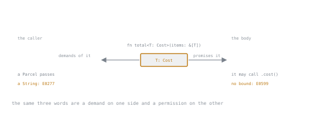

# Lesson 22. Trait Bounds and Generic Functions

**Mission link:** A bound is a two-sided contract, what it grants the function's body and what it demands of the caller, and reading it that way is what turns a vague `T` into a signature someone else can use correctly on the first try.
**Primary source:** [Defining Shared Behavior with Traits](https://doc.rust-lang.org/book/ch10-02-traits.html)
**Prerequisites:** [Lesson 12](0012-iterators-and-closures.md), [Lesson 21](0021-traits-as-shared-behaviour.md)

## Warm-up

1. ▢ Lesson 21 showed that calling a trait's method on a type whose `impl` exists but whose trait is not imported fails with `E0599`, and that the fix is a `use` line, not a bound. What does that diagnostic tell you is true about the type, that a different `E0599` in this lesson will tell you is false?

<details markdown="1"><summary>Check</summary>

Lesson 21's version tells you the type already implements the trait, the method exists, it is simply not reachable without importing the trait. This lesson's version fires when the type parameter carries no bound naming that trait at all, so the compiler cannot even promise the method exists for whatever `T` turns out to be. Same error code, opposite problem: one is a missing `use`, the other is a missing bound.

</details>

2. ▢ Lesson 12 wrote closure parameters as `F: Fn(i32) -> i32` without calling `Fn` a trait or the whole thing a bound. Looking back, what is being restricted there, and by what?

<details markdown="1"><summary>Check</summary>

`F` is a generic type parameter, and `Fn(i32) -> i32` restricts it to types implementing that closure trait with that exact call signature. It is a trait bound like any other, just spelled with the parenthesised sugar closures use instead of the angle-bracket form a trait like `Display` takes; the mechanism this lesson names is one lesson 12 already used without the vocabulary.

</details>

## Know this

### A bound is a promise the body can spend

A generic function with no bound can accept any type, but that freedom comes at the cost of being unable to do anything with it beyond moving it around:

```rust
trait Cost {
    fn cost(&self) -> u32;
}

fn total<T>(items: &[T]) -> u32 {
    items.iter().map(|i| i.cost()).sum()
}
```

`T` could be anything, so the compiler will not let the body call `.cost()` on it, and refuses to compile:

```text
error[E0599]: no method named `cost` found for reference `&T` in the current scope
  --> src/main.rs:6:28
   |
6  |     items.iter().map(|i| i.cost()).sum()
   |                          ^^^^ method not found in `&T`
   |
   = help: items from traits can only be used if the type parameter is bounded by the trait
help: the following trait defines an item `cost`, perhaps you need to restrict type parameter `T` with it:
   |
5  | fn total<T: Cost>(items: &[T]) -> u32 {
   |           ++++++
```

Adding the bound the `help` suggests turns the promise the other way round: now every caller who reaches this function must supply a `T` that implements `Cost`, and in exchange the body is allowed to call `.cost()` on it as if `T` were `Cost` itself:

```rust
fn total<T: Cost>(items: &[T]) -> u32 {
    items.iter().map(|i| i.cost()).sum()
}
```

Compiled against two `Parcel` values whose weights are 3 and 5, this returns 16, the same number a hand-written loop over a concrete `Vec<Parcel>` would give, because a bound changes what the compiler will check, not what the function computes.

### The caller answers for the bound too

A bound is not only a demand on the body's behalf, it is also a promise the compiler checks at every call site, and a caller who breaks it gets rejected before the function ever runs:

```rust
let names = [String::from("a")];
total(&names);
```

```text
error[E0277]: the trait bound `String: Cost` is not satisfied
  --> src/main.rs:11:26
   |
11 |     println!("{}", total(&names));
   |                    ----- ^^^^^^ the trait `Cost` is not implemented for `String`
   |                    |
   |                    required by a bound introduced by this call
   |
help: the trait `Cost` is implemented for `Parcel`
note: required by a bound in `total`
  --> src/main.rs:5:13
   |
5  | fn total<T: Cost>(items: &[T]) -> u32 {
   |             ^^^^ required by this bound in `total`
```

The `note` names exactly which bound on which function rejected the call, and the `help` names a type that would have passed, which is the compiler doing the caller's debugging for them. This is the same shape as lesson 16's `?` failing to find a `From` implementation: a bound is checked against the concrete type the instant one is chosen, never deferred to runtime.



One chip, two arrows, and two different error codes depending on which side failed to hold up its end. The words never change; the audience does.

### Multiple bounds, written two ways

A type parameter can carry more than one bound with `+`, and the same set of bounds can move into a `where` clause after the signature:

```rust
fn describe<T: Cost + std::fmt::Debug>(item: &T) -> String {
    format!("{item:?} costs {}", item.cost())
}

fn describe_where<T>(item: &T) -> String
where
    T: Cost + std::fmt::Debug,
{
    format!("{item:?} costs {}", item.cost())
}
```

Both compile and both print the identical string for the same `Parcel`, because `where` changes where the bound is written, not what it means. The `+` form is fine for one short list, but once several type parameters each carry their own bounds, the angle brackets between the name and the argument list get crowded enough to hide the signature's actual shape; a `where` clause pulls that detail out afterwards, which is the point at which it earns the extra lines.

### `impl Trait` in argument position is the same bound, spelled shorter

Writing `impl Cost` as a parameter's type is sugar for a trait bound, not a different mechanism:

```rust
fn total_impl(items: &[impl Cost]) -> u32 {
    items.iter().map(|i| i.cost()).sum()
}
```

is what the compiler builds from `fn total_generic<T: Cost>(items: &[T]) -> u32`, and both accept exactly the same callers. The difference that matters is that `impl Trait` erases the name of the type parameter along with writing it, so there is nothing left for a caller to name with turbofish:

```rust
total_impl::<Parcel>(&parcels);
```

```text
error[E0107]: function takes 0 generic arguments but 1 generic argument was supplied
  --> src/main.rs:9:20
   |
9  |     total_impl::<Parcel>(&parcels);
   |     ^^^^^^^^^^---------- help: remove the unnecessary generics
   |                expected 0 generic arguments
   |
note: function defined here, with 0 generic parameters
  --> src/main.rs:1:4
   |
1  | fn total_impl(items: &[impl Cost]) -> u32 {
   |    ^^^^^^^^^^
   = note: `impl Trait` cannot be explicitly specified as a generic argument
```

`total_generic::<Parcel>(&parcels)` compiles without complaint, because `T` is a real, named parameter there. Reach for `impl Trait` when the caller will always let inference pick the type; keep the named `T: Cost` when the caller needs to pin the type down explicitly, or when the same `T` must appear twice to force two arguments to match.

### Monomorphisation: one function, one copy per type

The compiler does not compile `total_generic` once and dispatch through it at runtime; it compiles a separate, fully concrete copy for every type that ever calls it, a process called monomorphisation. Building a binary that calls a generic `total_static::<T: Area>` with both a `Square` and a `Circle`, then listing the compiled symbols whose demangled names contain that function, shows exactly two:

```text
mono::total_static::<mono::Circle>
mono::total_static::<mono::Square>
```

each with its own inlined closure, `mono::total_static::<mono::Circle>::{closure#0}` and the `Square` equivalent, because the `map` call inside is specialised per type as well. The same binary's `&[&dyn Area]` version, `total_dyn`, which lesson 24 covers properly, produces exactly one:

```text
mono::total_dyn
```

because there is only ever one dynamically dispatched function, regardless of how many concrete types eventually pass through it. Two copies against one is the visible trade: a monomorphised call is an ordinary direct call the compiler is free to inline, at the cost of one compiled copy of the function's code per type, and more code to generate as types accumulate. Which side wins is a design question for lesson 24; this lesson's job is only to show the compiler really does produce separate code, not to ask you to take "monomorphisation" on faith.

### A bound can sit on the `impl` block instead of the type

A generic struct itself carries no bound; the bound can instead sit on a specific `impl` block, so only the methods that block defines require it:

```rust
struct Pair<T> {
    first: T,
    second: T,
}

impl<T: PartialOrd> Pair<T> {
    fn larger(&self) -> &T {
        if self.first >= self.second {
            &self.first
        } else {
            &self.second
        }
    }
}
```

`Pair<T>` can hold any `T`, including one with no ordering at all, but `larger` only exists on a `Pair` whose `T` implements `PartialOrd`, because that is the only place the bound was written. A second `impl<T> Pair<T>` block with no bound could add methods that work for every `T`, and the two blocks would coexist, each contributing the methods its own bound earns.

## Practice

1. ▢ Predict the error code before compiling this, and say what is missing from the signature that the diagnostic will suggest adding.

   ```rust
   trait Weight {
       fn kg(&self) -> f64;
   }

   struct Box2 {
       kg: f64,
   }

   impl Weight for Box2 {
       fn kg(&self) -> f64 {
           self.kg
       }
   }

   fn heaviest<T>(items: &[T]) -> f64 {
       items.iter().map(|i| i.kg()).fold(0.0, f64::max)
   }
   ```

<details markdown="1"><summary>Check</summary>

It is `E0599`: `.kg()` is called on `&T`, and with no bound the compiler has no reason to believe any `T` has a `kg` method at all. The suggested fix restricts `T` to `T: Weight`.

</details>

2. ▢ Add the bound from the previous item, then predict what `heaviest` returns for two `Box2` values weighing 4.0 and 7.5, and confirm by compiling and running.

<details markdown="1"><summary>Hint</summary>

`fold(0.0, f64::max)` starts from 0.0 and keeps the larger value at each step, the same shape a hand-written loop comparing two `f64`s would take.

</details>

<details markdown="1"><summary>Check</summary>

It returns `7.5`. Bounding `T` by `Weight` is what makes `.kg()` legal inside `fold`'s closure, and the arithmetic itself is unaffected by whether the type was concrete or generic.

</details>

3. ▢ Predict which trait the diagnostic names as unsatisfied when this compiles, and which line it blames.

   ```rust
   fn heaviest<T: Weight>(items: &[T]) -> f64 {
       items.iter().map(|i| i.kg()).fold(0.0, f64::max)
   }

   fn main() {
       let words = [String::from("a"), String::from("bb")];
       println!("{}", heaviest(&words));
   }
   ```

<details markdown="1"><summary>Check</summary>

It is `E0277`, naming `String: Weight` as the trait bound that is not satisfied at the `heaviest(&words)` call, with a `note` pointing at the `T: Weight` bound in `heaviest`'s own signature as the one that rejected it.

</details>

4. ▢ Rewrite this as a `where` clause instead, predict whether the swap changes what callers can pass, then compile both to confirm.

   ```rust
   fn report<T: Weight + std::fmt::Debug>(item: &T) -> String {
       format!("{item:?} weighs {}", item.kg())
   }
   ```

<details markdown="1"><summary>Hint</summary>

Moving bounds into a `where` clause changes where they are written in the source, not which types satisfy them.

</details>

<details markdown="1"><summary>Check</summary>

Nothing changes for callers: `fn report<T>(item: &T) -> String where T: Weight + std::fmt::Debug` accepts exactly the same types and compiles to the same thing as the `+` version, since a `where` clause is a second spelling of the identical bound rather than a different rule.

</details>

5. ▢ This turbofishes a call against a function taking `impl Weight`. Predict the error code before compiling, then say what the equivalent generic signature would need to change to make the same call succeed.

   ```rust
   fn heaviest_impl(items: &[impl Weight]) -> f64 {
       items.iter().map(|i| i.kg()).fold(0.0, f64::max)
   }

   fn main() {
       let boxes = [Box2 { kg: 4.0 }, Box2 { kg: 7.5 }];
       println!("{}", heaviest_impl::<Box2>(&boxes));
   }
   ```

<details markdown="1"><summary>Check</summary>

It is `E0107`, whose note reads `impl Trait` cannot be explicitly specified as a generic argument, because `heaviest_impl` has no named type parameter for turbofish to fill in. Writing it as `fn heaviest_impl<T: Weight>(items: &[T]) -> f64` gives the compiler a real `T` to target, and `heaviest_impl::<Box2>(&boxes)` then compiles.

</details>

## Real-world reps

- [ ] Make your project's summarising function generic over its input: instead of taking a `Vec<String>`, bound the parameter by `impl IntoIterator<Item = String>` (or the equivalent named `T: IntoIterator<Item = String>`) so a test can hand it a vector while the binary hands it a file's lines through an iterator. Keep the line owned as a `String` inside the loop; borrowing it instead is lesson 27's rep, not this one.
- [ ] Find one function in your own code, outside the project, that takes a `&Vec<T>` or a `&String` where a bound would let it accept anything with the right behaviour instead. Rewrite its signature with a trait bound or `impl Trait` and confirm every existing caller still compiles unchanged.
- [ ] Tomorrow: take a generic function you bounded today, call it with two different concrete types from `main`, build the binary, and list its symbols to confirm you see two compiled copies, the way this lesson's `total_static` example did.

## Going further

- [Generic Data Types](https://doc.rust-lang.org/book/ch10-01-syntax.html): generic functions, generic structs, and a bound written on an `impl` block rather than the type
- [Trait and lifetime bounds](https://doc.rust-lang.org/reference/trait-bounds.html): the Reference's grammar for `+` and `where`, and where a bound may appear
- [E0599](https://doc.rust-lang.org/error_codes/E0599.html): the diagnostic for a method the compiler cannot find, the same code a missing bound and a missing `use` both produce
- [E0277](https://doc.rust-lang.org/error_codes/E0277.html): the diagnostic for a call site whose type does not satisfy a bound
- [Traits and lifetimes](../reference/traits-and-lifetimes.md): the stage 4 reference sheet
- [Resources](../RESOURCES.md)

---

Not landing? Reread the primary source at the top, since this lesson compresses it and compression is where understanding leaks. Check the [glossary](../GLOSSARY.md) for any term that felt slippery.

If the lesson itself is unclear rather than the material, that is a defect: [open an issue](https://github.com/TokenCemetery/teach/issues).
