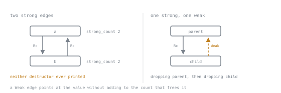

# Lesson 31. Shared Ownership with Rc and Arc

**Mission link:** A worker pool that a function starts and leaves running needs data that survives that function's return, and reaching for a clone or a global to make that compile hides the real design decision instead of making it, exactly the habit this stage exists to break.
**Primary source:** [std::rc](https://doc.rust-lang.org/std/rc/index.html)
**Prerequisites:** [Lesson 30](0030-scoped-threads.md), [Lesson 1](0001-ownership-and-drop.md)

## Warm-up

1. ▢ Lesson 30's scoped threads let a closure borrow a local value across threads with no `Arc`, no `clone` and no lifetime annotation, because `thread::scope` guarantees every thread joins before the scope call returns. If a thread has to keep running after the function that spawned it returns, what does that join-before-return guarantee no longer promise about the borrowed data?

<details markdown="1"><summary>Check</summary>

It no longer promises the data is still there. A scoped borrow is sound only because the compiler sees the join happening before the borrowed local's scope ends; a thread outliving its creating function has no such join, so its data has to be owned, whether by one owner or several.

</details>

2. ▢ Lesson 1 established that a value has exactly one owner at a time and that its destructor runs when that owner's scope ends. What would have to change about that rule if two independent parts of a program both needed to be the reason a value stays alive?

<details markdown="1"><summary>Check</summary>

Single ownership would have to go: something would need to count how many owners exist and run the destructor only once that count reaches zero, not the moment any one binding goes out of scope. That is what this lesson's two pointer types add.

</details>

## Know this

### One owner, or several

Lesson 30's scoped threads solve one shape: work that starts and finishes inside a function, borrowing the caller's data for as long as the scope runs, then handing it back untouched. That trade depends on the join happening before the function returns, and says nothing about a value a thread still needs once that function has returned, or a value with no single owner to borrow from. `Box<T>`, already met behind `Box<dyn Trait>` in stage 4, is the heap's single-owner shape: one allocation, one owner, one destructor call when that owner goes out of scope, like an ordinary local except on the heap. Shared ownership asks a different question: not "does this outlive the function that made it" but "does more than one part of the program get to be the reason it stays alive."

### `Rc`: a count instead of a copy

`Rc<T>` gives a value several owners inside one thread by counting how many `Rc` pointers exist and dropping the value only once that count reaches zero. `Rc::clone` does not copy the value; it copies the pointer and increments the count, which is why the documentation recommends `Rc::clone(&value)` over `value.clone()`, so a reader can tell a pointer is being shared, not data duplicated.

```rust
use std::rc::Rc;

fn main() {
    let table = Rc::new(vec!["/index", "/login"]);
    println!("after new: {}", Rc::strong_count(&table));

    let second = Rc::clone(&table);
    println!("after clone: {}", Rc::strong_count(&table));

    drop(second);
    println!("after drop: {}", Rc::strong_count(&table));
}
```

```text
after new: 1
after clone: 2
after drop: 1
```

The count rises on `Rc::clone` and falls on `drop`, and when the last owner drops, the value drops with it. Nothing here drops `table`'s contents directly, because `table` is not the value, it is one of the value's owners.

### `Arc`: the same shape, made to cross threads

`Arc<T>` is the same idea with the count stored as an atomic integer instead of a plain one, which makes incrementing and decrementing it safe when more than one thread can do so at once.

```rust
use std::sync::Arc;

fn main() {
    let table = Arc::new(vec!["/index", "/login"]);
    println!("after new: {}", Arc::strong_count(&table));

    let second = Arc::clone(&table);
    println!("after clone: {}", Arc::strong_count(&table));

    drop(second);
    println!("after drop: {}", Arc::strong_count(&table));
}
```

```text
after new: 1
after clone: 2
after drop: 1
```

The two types are also the same size on this target: `size_of::<Rc<i32>>()` and `size_of::<Arc<i32>>()` both come back `8`, matching `size_of::<usize>()`, because a counted pointer is just a pointer; the count lives in the heap allocation, not inside it. What differs is how that count gets updated, and that is the whole rule for choosing: `Rc` when the value never leaves one thread, `Arc` the moment it crosses into another. An atomic update is real work a plain update is not, and pretending otherwise would be dishonest, but that cost is not why one gets picked: the choice is made by whether the data crosses a thread boundary, and if it does, `Rc` is not available regardless of cost, as the next section shows.

### `Rc` does not cross a thread boundary

Moving an `Rc` into a new thread does not compile.

```rust
use std::rc::Rc;
use std::thread;

fn main() {
    let data = Rc::new(vec![1, 2, 3]);
    let handle = thread::spawn(move || {
        println!("{:?}", data);
    });
    handle.join().unwrap();
}
```

```text
error[E0277]: `Rc<Vec<i32>>` cannot be sent between threads safely
   --> src/main.rs:6:32
    |
  6 |       let handle = thread::spawn(move || {
    |                    ------------- ^------
    |                    |             |
    |  __________________|_____________within this `{closure@src/main.rs:6:32: 6:39}`
    | |                  |
    | |                  required by a bound introduced by this call
  7 | |         println!("{:?}", data);
  8 | |     });
    | |_____^ `Rc<Vec<i32>>` cannot be sent between threads safely
    |
    = help: within `{closure@src/main.rs:6:32: 6:39}`, the trait `Send` is not implemented for `Rc<Vec<i32>>`
note: required because it's used within this closure
   --> src/main.rs:6:32
    |
  6 |     let handle = thread::spawn(move || {
    |                                ^^^^^^^
note: required by a bound in `spawn`
    |
125 | pub fn spawn<F, T>(f: F) -> JoinHandle<T>
    |        ----- required by a bound in this function
...
128 |     F: Send + 'static,
    |        ^^^^ required by this bound in `spawn`
```

The last note's path pointed inside the standard library's source and is trimmed here; it was proving `spawn`'s real bound, `F: Send + 'static`, so the closure must satisfy `Send`, and this one fails only because it captured an `Rc`. `Send` is a trait the compiler implements automatically for types it can prove safe to move between threads, called an auto trait, and `Rc` deliberately does not get it, since its plain count has no protection against two threads touching it at once. What `Send` and its sibling `Sync` actually are is lesson 34's subject; the point to keep is that `Rc` fails this by design, not oversight, and `Arc` is what paying for the atomic buys back.

### Cycles leak, and `Weak` breaks them

An `Rc` drops its value only once its count reaches zero, and nothing forces that if two values hold `Rc`s pointing at each other: each keeps the other's count above zero forever, so neither destructor ever runs. Building that needs mutating a field once both values exist, which a shared `Rc` alone forbids; the minimum tool for it is `RefCell`, which mutates through a shared reference by checking borrows at runtime instead of compile time. Lesson 32 owns that mechanism, and the panic it can produce, in full; here it does only the one job of letting two already-built nodes point at each other.

```rust
use std::cell::RefCell;
use std::rc::Rc;

struct Node {
    name: String,
    next: RefCell<Option<Rc<Node>>>,
}

impl Drop for Node {
    fn drop(&mut self) {
        println!("dropping {}", self.name);
    }
}

fn main() {
    let a = Rc::new(Node { name: "a".to_string(), next: RefCell::new(None) });
    let b = Rc::new(Node { name: "b".to_string(), next: RefCell::new(None) });

    *a.next.borrow_mut() = Some(Rc::clone(&b));
    *b.next.borrow_mut() = Some(Rc::clone(&a));

    println!("a strong_count: {}", Rc::strong_count(&a));
    println!("b strong_count: {}", Rc::strong_count(&b));
    println!("end of main, a and b are about to go out of scope");
}
```

```text
a strong_count: 2
b strong_count: 2
end of main, a and b are about to go out of scope
```

Both counts read `2`. After `main` ends, neither `dropping a` nor `dropping b` ever prints, across every run: the two `Rc`s keep each other's count at one, and the memory is never freed.



The two shapes are the same graph. Same nodes, same two edges, same direction on each; only one edge's kind differs, and that is the difference between memory that is never freed and memory that is.

`Weak`, the pointer `Rc::downgrade` produces, does not count towards that total, so a shape with one strong edge and one `Weak` edge has a strong count that does reach zero. The standard library's own advice for a tree is this shape: a strong `Rc` from parent to child, `Weak` back from child to parent.

```rust
use std::cell::RefCell;
use std::rc::{Rc, Weak};

struct Node {
    name: String,
    child: RefCell<Option<Rc<Node>>>,
    parent: RefCell<Option<Weak<Node>>>,
}

impl Drop for Node {
    fn drop(&mut self) {
        println!("dropping {}", self.name);
    }
}

fn main() {
    let parent = Rc::new(Node { name: "parent".to_string(), child: RefCell::new(None), parent: RefCell::new(None) });
    let child = Rc::new(Node { name: "child".to_string(), child: RefCell::new(None), parent: RefCell::new(None) });

    *parent.child.borrow_mut() = Some(Rc::clone(&child));
    *child.parent.borrow_mut() = Some(Rc::downgrade(&parent));

    let still_there = child.parent.borrow().as_ref().unwrap().upgrade();
    println!("while parent is alive, upgrade is some: {}", still_there.is_some());
    drop(still_there);

    drop(parent);

    let gone = child.parent.borrow().as_ref().unwrap().upgrade();
    println!("after parent is dropped, upgrade is none: {}", gone.is_none());
}
```

```text
while parent is alive, upgrade is some: true
dropping parent
after parent is dropped, upgrade is none: true
dropping child
```

`upgrade` turns a `Weak` back into something usable: it returns `Option<Rc<T>>`, `Some` while the value is alive and `None` once it is not, as shown above. Dropping `parent` drops it immediately, since `child`'s pointer back was never strong, and `child` drops normally when `main` ends, printed last: no leak, since one edge never added to the count.

### The read-only case that needs no lock

The shape most real programs want is not mutation at all: a table built once and only ever read afterwards, by every thread that needs it. `Arc<T>` alone is enough for that, because sharing read access to a value nobody writes to needs no coordination between readers.

```rust
use std::collections::HashMap;
use std::sync::Arc;
use std::thread;

fn load_categories() -> HashMap<String, String> {
    let mut map = HashMap::new();
    map.insert("/index".to_string(), "page".to_string());
    map.insert("/login".to_string(), "auth".to_string());
    map
}

fn spawn_workers(paths: Vec<&'static str>) -> Vec<thread::JoinHandle<()>> {
    let categories = Arc::new(load_categories());
    let mut handles = Vec::new();
    for path in paths {
        let categories = Arc::clone(&categories);
        handles.push(thread::spawn(move || {
            let category = categories.get(path).map(|s| s.as_str()).unwrap_or("unknown");
            println!("{path} -> {category}");
        }));
    }
    handles
}

fn main() {
    let handles = spawn_workers(vec!["/index", "/login", "/missing"]);
    for handle in handles {
        handle.join().unwrap();
    }
}
```

This compiles, and every run printed all three mappings correctly, `/index -> page`, `/login -> auth`, `/missing -> unknown`, though the order between them varied between runs, since nothing here says which thread's `println!` reaches the terminal first. A summariser's path-to-category table is exactly this shape: built once at start-up, handed to workers that only read it, expected to keep running after `spawn_workers` has returned. That is why this cannot be a scoped borrow the way lesson 30's was: a scoped thread only borrows as long as the function calling `thread::scope` is still on the stack to join it, and these workers outlive `spawn_workers` entirely. A `Mutex` around a table nobody writes to again would be habit carried from code that did need one, not a decision from what this table is.

## Practice

1. ▢ Predict the three numbers this prints.

   ```rust
   use std::rc::Rc;

   fn main() {
       let value = Rc::new(String::from("shared"));
       let a = Rc::clone(&value);
       let b = Rc::clone(&value);
       println!("after two clones: {}", Rc::strong_count(&value));
       drop(a);
       println!("after dropping one: {}", Rc::strong_count(&value));
       drop(b);
       println!("after dropping both: {}", Rc::strong_count(&value));
   }
   ```

<details markdown="1"><summary>Check</summary>

The counts are `3`, `2` and `1`: `value`, `a` and `b` are three owners after the two clones, and each `drop` removes one, leaving `value` as the sole owner at the end.

</details>

2. ▢ Predict the error code, before compiling a version of the thread example that captures `Rc::new(String::from("worker"))` instead of the vector.

<details markdown="1"><summary>Hint</summary>

The failure does not depend on what the `Rc` wraps.

</details>

<details markdown="1"><summary>Check</summary>

It is `E0277` again, with `Send` not implemented for `Rc<String>` this time. No `Rc<T>`, regardless of `T`, implements `Send`, so only the named type changes.

</details>

3. ▢ Swap which edge is `Weak` in the parent and child example: `parent` gets the `Weak` pointer, `child` gets the strong `Rc`. Predict whether both drop prints still appear once the bindings go out of scope, then compile it to check.

<details markdown="1"><summary>Check</summary>

Both still print: exactly one edge is strong either way, and a cycle leaks only when both edges add to the count, so swapping which side holds the `Weak` still leaves one that does not.

</details>

4. ▢ Rewrite `spawn_workers` to drop the `Arc` entirely: keep `categories` as a plain `HashMap`, and give each thread its own `categories.clone()`. Predict whether it still compiles and prints the same mappings, then compile it and decide which version you would ship.

<details markdown="1"><summary>Hint</summary>

`HashMap` implements `Clone`; the question is cost at runtime, not whether it compiles.

</details>

<details markdown="1"><summary>Check</summary>

It compiles and prints the same three mappings, since cloning still gives each thread correct data. The difference is that this version builds one independent copy of the table per thread instead of sharing one allocation, the cost `Arc` avoids once the table is large.

</details>

5. ▢ Predict whether `size_of::<Box<i32>>()` is smaller than, equal to, or larger than `size_of::<Rc<i32>>()`, then check both with `std::mem::size_of`.

<details markdown="1"><summary>Check</summary>

Equal: both come back `8` on this target. `Box`, `Rc` and `Arc` are all a single pointer at the binding's own size; what a counted pointer adds lives in the heap allocation it points to, not the pointer itself.

</details>

## Real-world reps

- [ ] Add a path-to-category table to your summariser, loaded once at start-up, and share it behind an `Arc` with the worker threads that read it, rather than giving each thread its own copy or a global.
- [ ] Next to that `Arc`, write one line saying why this table could not be a scoped borrow the way lesson 30's shared vector was: name what about the workers' lifetime makes the difference.
- [ ] Tomorrow: find any place your project reaches for `.clone()` to silence a borrow or `Send` error, and check whether that value was meant to have one owner or several; that answer decides whether `Rc` or `Arc` belongs there instead.

## Going further

- [std::sync::Arc](https://doc.rust-lang.org/std/sync/struct.Arc.html): the API page for atomic reference counting and `Arc::clone`
- [std::rc::Weak](https://doc.rust-lang.org/std/rc/struct.Weak.html): `upgrade`, and why `Weak` breaks a cycle
- [std::thread::spawn](https://doc.rust-lang.org/std/thread/fn.spawn.html): the API page whose `F: Send + 'static` bound an `Rc` fails
- [E0277](https://doc.rust-lang.org/error_codes/E0277.html): the diagnostic for a missing trait bound, here `Send`
- [Sharing and threads](../reference/sharing-and-threads.md): the stage 5 reference sheet
- [Resources](../RESOURCES.md)

---

Not landing? Reread the primary source at the top, since this lesson compresses it and compression is where understanding leaks. Check the [glossary](../GLOSSARY.md) for any term that felt slippery.

If the lesson itself is unclear rather than the material, that is a defect: [open an issue](https://github.com/TokenCemetery/teach/issues).
