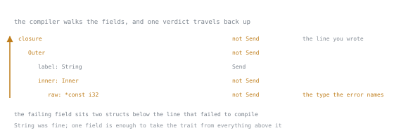

# Lesson 34. Send and Sync

**Mission link:** A closure that fails to compile inside `thread::spawn` almost always blames a type several fields deep inside the one you actually captured, not the struct you wrote, and reading that correctly is what separates a design fix from a `clone` that only makes the message go away.
**Primary source:** [Special types and traits](https://doc.rust-lang.org/reference/special-types-and-traits.html)
**Prerequisites:** [Lesson 21](0021-traits-as-shared-behaviour.md), [Lesson 31](0031-shared-ownership.md)

## Warm-up

1. ▢ Lesson 21 defined a trait bound as a promise an `impl` block writes out by hand. Given that, what would it mean for a type to satisfy a trait despite nobody, anywhere, ever writing `impl TraitName for YourType`?

<details markdown="1"><summary>Check</summary>

It would mean the compiler decides the answer itself, from a rule applied to the type's own definition rather than from a written `impl`. `Send` and `Sync` work exactly this way; this lesson calls that an auto trait.

</details>

2. ▢ Lesson 31 distinguished `Rc` from `Arc` by what each spends to keep its count: a plain integer for `Rc`, an atomic one for `Arc`. Which of the two would you expect a compiler to consider safe to clone from two threads at once, and which not?

<details markdown="1"><summary>Check</summary>

It is `Arc`, since an atomic counter cannot be corrupted by two threads updating it at once. `Rc`'s plain integer can be, the undefined behaviour that makes it unsafe from more than one thread and why it carries neither of this lesson's two traits.

</details>

## Know this

### Two traits, one relation

`Send` and `Sync` answer different questions. `Send` marks "types that can be transferred across thread boundaries": moving a `Send` value into another thread is safe. `Sync` marks "types for which it is safe to share references between threads": a shared borrow, `&T`, of a `Sync` type can be handed to another thread while the owner keeps using it. The relation is `Sync`'s own definition: "a type `T` is `Sync` if and only if `&T` is `Send`", a bound the compiler checks rather than an assertion to trust:

```rust
fn assert_send<T: Send>() {}

fn requires_sync<T: Sync>() {
    assert_send::<&T>();
}
```

This compiles for any `T: Sync`: `&T` satisfies `assert_send`'s bound solely because `requires_sync` already established `T: Sync`.

### Auto traits: derived, not written

Neither trait has an `impl` block an ordinary author writes. The Reference states the rule instead: "structs, enums, unions, and tuples implement the trait if all of their fields do", and "closures implement the trait if the types of all of their captures do". An error about `Send` can therefore name a type absent from the line you wrote, since the compiler walks a type's fields structurally, and the moment one lacks the trait, everything containing it loses it too, silently.



Read the arrow, not the indentation: the verdict is decided at the bottom and carried upward, while the code is written at the top. That mismatch is the whole reason the message names a type you never typed, and it is why the fix is found by reading downward through the fields rather than by adding a bound at the line that failed. To see this, bury the losing field two structs deep, then move the whole thing into a thread:

```rust
struct Inner {
    raw: *const i32,
}

struct Outer {
    label: String,
    inner: Inner,
}

fn main() {
    let value = 5;
    let outer = Outer {
        label: String::from("x"),
        inner: Inner { raw: &value as *const i32 },
    };
    std::thread::spawn(move || {
        println!("{} {}", outer.label, outer.inner.raw as usize);
    })
    .join()
    .unwrap();
}
```

```text
error[E0277]: `*const i32` cannot be sent between threads safely
   --> src/main.rs:16:24
    |
 16 |       std::thread::spawn(move || {
    |       ------------------ ^------
    |       |                  |
    |  _____|__________________within this `{closure@src/main.rs:16:24: 16:31}`
    | |     |
    | |     required by a bound introduced by this call
 17 | |         println!("{} {}", outer.label, outer.inner.raw as usize);
 18 | |     })
    | |_____^ `*const i32` cannot be sent between threads safely
    |
    = help: within `{closure@src/main.rs:16:24: 16:31}`, the trait `Send` is not implemented for `*const i32`
note: required because it's used within this closure
   --> src/main.rs:16:24
    |
 16 |     std::thread::spawn(move || {
    |                        ^^^^^^^
note: required by a bound in `spawn`
    |
125 | pub fn spawn<F, T>(f: F) -> JoinHandle<T>
    |        ----- required by a bound in this function
...
128 |     F: Send + 'static,
    |        ^^^^ required by this bound in `spawn`
```

The standard library's path line is cut here, since it names an absolute location on the compiling machine. What remains is the teaching: the message names only `*const i32`, never `Outer`, never `Inner`. Every note talks about "this closure", because the loss happened silently at each layer: `Inner` lost `Send` when its field did, `Outer` lost it when `Inner` did, and the closure lost it by capturing `outer` whole. This is why such diagnostics read as coming from nowhere: the somewhere is real, just never named unless you know to look past your own type for the field that failed.

### The catalogue: four types, four reasons

Four standard-library types make a missing trait concrete; the two traits are independent rather than a ladder, so each is worth checking on its own.

`Rc<T>` has neither trait: `assert_send` and `assert_sync` both fail on it. Its reference count is a plain, unsynchronised integer, so two threads cloning or dropping the same `Rc` could rewrite it at once, the race `Arc` pays an atomic operation to avoid.

`RefCell<T>` is `Send` but not `Sync`: `assert_send` compiles, `assert_sync` fails. Handing the whole cell to one other thread is fine, since only one owner touches it at a time, but sharing `&RefCell` would let two threads each believe they hold the only mutable borrow, since its borrow counter has no cross-thread synchronisation either.

`MutexGuard<'_, T>` is `Sync` but not `Send`: `assert_sync` compiles, `assert_send` fails. Sharing a reference to a guard is fine, since the lock behind it works the same from anywhere, but moving the guard off the thread that acquired it would let a lock be released by a thread that never took it, unsound on platforms whose mutexes require the unlocking thread to match the locking one.

A raw pointer, `*const T` or `*mut T`, has neither trait, failing both assertions as the centrepiece already showed. It carries none of the compiler's aliasing or lifetime information, so nothing stops two threads racing on what it points to, or one outliving the memory it names.

### Reading an E0277 for Send, and one for Sync

The canonical case is `Rc` moved into `thread::spawn`:

```rust
use std::rc::Rc;
use std::thread;

fn main() {
    let shared = Rc::new(vec![1, 2, 3]);
    let handle = thread::spawn(move || {
        println!("{:?}", shared);
    });
    handle.join().unwrap();
}
```

```text
error[E0277]: `Rc<Vec<i32>>` cannot be sent between threads safely
   --> src/main.rs:6:32
    |
  6 |       let handle = thread::spawn(move || {
    |                    ------------- ^------
    |                    |             |
    |  __________________|_____________within this `{closure@src/main.rs:6:32: 6:39}`
    | |                  |
    | |                  required by a bound introduced by this call
  7 | |         println!("{:?}", shared);
  8 | |     });
    | |_____^ `Rc<Vec<i32>>` cannot be sent between threads safely
    |
    = help: within `{closure@src/main.rs:6:32: 6:39}`, the trait `Send` is not implemented for `Rc<Vec<i32>>`
note: required because it's used within this closure
   --> src/main.rs:6:32
    |
  6 |     let handle = thread::spawn(move || {
    |                                ^^^^^^^
note: required by a bound in `spawn`
    |
125 | pub fn spawn<F, T>(f: F) -> JoinHandle<T>
    |        ----- required by a bound in this function
...
128 |     F: Send + 'static,
    |        ^^^^ required by this bound in `spawn`
```

The standard library's path is cut again. Read top to bottom: the error line names the type that lacks the trait, not `shared` and not `main`. The underlined span covers the whole closure, because the bound applies to its captured environment, and moving `shared` in put an `Rc` inside it. `required because it's used within this closure` is the explicit link: the missing trait travelled from the value into the closure's own status, the structural walk the previous section built by hand. The final note shows where the requirement was written, `F: Send + 'static` on `spawn` itself.

Now the `Sync` version, `Arc<RefCell<T>>` sent to a thread:

```rust
use std::cell::RefCell;
use std::sync::Arc;
use std::thread;

fn main() {
    let shared = Arc::new(RefCell::new(vec![1, 2, 3]));
    let other = Arc::clone(&shared);
    let handle = thread::spawn(move || {
        other.borrow_mut().push(4);
    });
    handle.join().unwrap();
    println!("{:?}", shared.borrow());
}
```

```text
error[E0277]: `RefCell<Vec<i32>>` cannot be shared between threads safely
   --> src/main.rs:8:32
    |
  8 |       let handle = thread::spawn(move || {
    |  __________________-------------_^
    | |                  |
    | |                  required by a bound introduced by this call
  9 | |         other.borrow_mut().push(4);
 10 | |     });
    | |_____^ `RefCell<Vec<i32>>` cannot be shared between threads safely
    |
    = help: the trait `Sync` is not implemented for `RefCell<Vec<i32>>`
    = note: if you want to do aliasing and mutation between multiple threads, use `std::sync::RwLock` instead
    = note: required for `Arc<RefCell<Vec<i32>>>` to implement `Send`
note: required because it's used within this closure
   --> src/main.rs:8:32
    |
  8 |     let handle = thread::spawn(move || {
    |                                ^^^^^^^
note: required by a bound in `spawn`
    |
125 | pub fn spawn<F, T>(f: F) -> JoinHandle<T>
    |        ----- required by a bound in this function
...
128 |     F: Send + 'static,
    |        ^^^^ required by this bound in `spawn`
```

The bound `spawn` checks is the same `F: Send + 'static` as before, but this text says "cannot be shared" and its `help` names `Sync`. `Arc`'s own note explains why: required for `Arc<RefCell<Vec<i32>>>` to implement `Send`, because `Arc<T>` is only `Send` when `T` is both `Send` and `Sync`, sharing an `Arc` means sharing a `&T` underneath its atomic count, and `Sync` is what that needs. `RefCell` is `Send` on its own but not `Sync`, and that missing `Sync` surfaces here as a `Send` failure one layer up, on the `Arc`. The compiler's suggested `RwLock` is lesson 33's territory; this lesson only needed the contrast in which trait each message names.

### Where the bounds come from, and the fix that is not a bound

Both diagnostics end at a bound on a signature. `thread::spawn`, stable since release 1.0.0, is:

```text
pub fn spawn<F, T>(f: F) -> JoinHandle<T>
where
    F: FnOnce() -> T + Send + 'static,
    T: Send + 'static,
```

`Scope::spawn`, stabilised in release 1.63.0 alongside `thread::scope` itself from lesson 30, is:

```text
pub fn spawn<F, T>(&'scope self, f: F) -> ScopedJoinHandle<'scope, T>
where
    F: FnOnce() -> T + Send + 'scope,
    T: Send + 'scope,
```

Both require `Send`, since handing a closure's captured state to a new thread is exactly what `Send` gates. Only `thread::spawn` requires `'static`: the parent function might return, and everything it owned might go, before the new thread finishes, so nothing borrowed can be trusted to still exist. `Scope::spawn` asks for `'scope` instead, the block's own lifetime, because `thread::scope` blocks until every spawned thread has joined, so a borrow that only needs to outlive the scope is provably good for as long as the thread runs, lesson 30's guarantee stated here as a bound.

When a type is not `Send`, the missing trait is reporting a design question, not asking for a workaround. Reach for the threaded counterpart when a value genuinely needs sharing: `Rc` becomes `Arc` from lesson 31, `RefCell` becomes a `Mutex` or `RwLock` from lesson 33. Keep the value on one thread when sharing was never required, and only touch it from there. Or send the data itself, an owned copy now or later a channel message from lesson 35, rather than a handle to memory the sender still cares about.

## Practice

1. ▢ Predict whether this compiles, then check it with `assert_send::<Session>()`.

   ```rust
   struct Session {
       id: u32,
       cache: std::rc::Rc<Vec<String>>,
   }
   ```

<details markdown="1"><summary>Check</summary>

It does not: `Rc<Vec<String>>` cannot be sent between threads safely, with a note that it is required because it appears within the type `Session`. `Session` is named here, unlike in the centrepiece, because you named it directly in the turbofish; a closure's captured environment has no name of its own to give.

</details>

2. ▢ Predict whether this compiles.

   ```rust
   let cell = std::cell::RefCell::new(0);
   let handle = std::thread::spawn(move || {
       *cell.borrow_mut() += 1;
   });
   handle.join().unwrap();
   ```

<details markdown="1"><summary>Hint</summary>

Ask which of the two traits a one-way ownership transfer actually needs.

</details>

<details markdown="1"><summary>Check</summary>

It compiles. Moving `cell` gives the new thread sole ownership, and `thread::spawn`'s bound only asks for `Send`, which `RefCell` has. Nothing here shares `&RefCell` between two threads, so `Sync`, which `RefCell` lacks, never enters into it.

</details>

3. ▢ Predict the error and which trait it names, for this program under `thread::scope`.

   ```rust
   let shared = std::rc::Rc::new(vec![1, 2, 3]);
   std::thread::scope(|s| {
       s.spawn(move || {
           println!("{:?}", shared);
       });
   });
   ```

<details markdown="1"><summary>Hint</summary>

`thread::scope` removes the `'static` requirement lesson 30 taught. Ask whether it removes the other one too.

</details>

<details markdown="1"><summary>Check</summary>

It is `E0277` naming `Send`: `Rc<Vec<i32>>` cannot be sent between threads safely, quoting `Scope::spawn`'s own bound. Dropping `'static` only drops half of the requirement; a scoped thread still needs a `Send` environment, since sharing is still happening, only for a shorter time.

</details>

4. ▢ Predict whether this compiles, and if not, which trait its `help` names.

   ```rust
   let m = std::sync::Mutex::new(0i32);
   let guard = m.lock().unwrap();
   let handle = std::thread::spawn(move || {
       println!("{}", *guard);
   });
   handle.join().unwrap();
   ```

<details markdown="1"><summary>Check</summary>

It does not compile: `E0277` naming `Send`, because a `MutexGuard` is `Sync` but not `Send`, the catalogue entry above. Moving the `Mutex` itself into the closure, rather than a guard already taken from it, would compile instead, since the lock would then be acquired on the thread that needs it.

</details>

5. ▢ Add a second field, another `String`, to `Outer` from this lesson's centrepiece example. Predict whether the diagnostic changes.

<details markdown="1"><summary>Hint</summary>

The auto trait rule looks at every field, but a struct only fails once.

</details>

<details markdown="1"><summary>Check</summary>

It does not change: the diagnostic still names only `*const i32`, because a struct implements the trait only if all of its fields do, and a field that already has the trait changes nothing about the one that does not.

</details>

## Real-world reps

- [ ] In your summariser's threaded worker, add a field to whatever value each thread carries back that is not `Send`, such as an `Rc` used to avoid cloning a shared label, and read the exact error; fix it by design rather than a bound, and write down which of this lesson's three fixes you used and what the alternative would have cost.
- [ ] Pick one type already in your project that is single-threaded on purpose, such as a parser's internal cache, and write one comment saying which of `Send` or `Sync` it lacks and why that is fine as long as it never crosses a thread boundary.
- [ ] Tomorrow: find one value your workers return by handle rather than by data, such as a shared tag, and note it as a candidate for a channel instead, which lesson 35 covers.

## Going further

- [Send](https://doc.rust-lang.org/std/marker/trait.Send.html): the standard library's definition, with its own `Rc` counterexample
- [Sync](https://doc.rust-lang.org/std/marker/trait.Sync.html): the standard library's definition, including the exact relation to `Send`
- [E0277](https://doc.rust-lang.org/error_codes/E0277.html): the diagnostic for a type missing a trait a bound requires
- [Extensible Concurrency with Send and Sync](https://doc.rust-lang.org/book/ch16-04-extensible-concurrency-sync-and-send.html): the Book's introduction to both traits
- [Sharing and threads](../reference/sharing-and-threads.md): the stage 5 reference sheet
- [Resources](../RESOURCES.md)

---

Not landing? Reread the primary source at the top, since this lesson compresses it and compression is where understanding leaks. Check the [glossary](../GLOSSARY.md) for any term that felt slippery.

If the lesson itself is unclear rather than the material, that is a defect: [open an issue](https://github.com/TokenCemetery/teach/issues).
