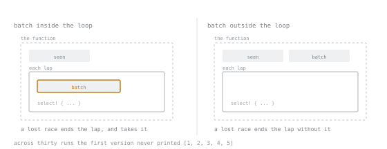

# Lesson 43. Cancellation Safety

**Mission link:** Lesson 42 showed that dropping a future is silent: no error, no panic, nothing resembling a bug report. A `select!` loop that discards a loser every lap turns that silence into a routine way to lose data, and knowing whether a given call can afford it means looking it up, which is this lesson's skill.
**Primary source:** [tokio::select!](https://docs.rs/tokio/1.53.1/tokio/macro.select.html)
**Prerequisites:** [Lesson 42](0042-cancellation.md), [Lesson 35](0035-channels.md)

## Warm-up

1. ▢ Lesson 42 showed a future dropped mid-flight destroys its own locals with no notification. If a `select!` loser was partway through building a value in one of its own locals when it lost the race, what happens to that value?

<details markdown="1"><summary>Check</summary>

It is dropped with everything else the future owned, like any local going out of scope; nothing preserves it and nothing reports it, which is why cancellation is a design question, not a runtime one.

</details>

2. ▢ Lesson 35 covered what each end of a channel does when the other disappears. A single call to a receiver's `recv` returns a whole message or learns none is coming, never half of one. If a `select!` branch is exactly one `recv()` call, does losing that race leave anything partial behind?

<details markdown="1"><summary>Check</summary>

No. `recv()` resolves in one indivisible step, a full message or nothing, so a single call has no partial state to lose; this lesson's loss comes from state built up around several calls, not from any one call's own result.

</details>

## Know this

### The property, not a list of safe methods

Lesson 42 established the mechanism: any future can be dropped before it finishes, stopping it there with nothing resembling an error. What that lesson left open is which futures can afford it. `tokio::select!`'s documentation names the property and gives it a precise test: "Cancellation safety can be defined in the following way: If you have a future that has not yet completed, then it must be a no-op to drop that future and recreate it." This is a statement about the future's state, not the code racing it: cancel safe means whatever it has done so far can be thrown away and restarted unnoticed; cancel unsafe means it has taken an action, or built up a value, that restarting cannot recover. The warm-up already applied the test: a bare `recv()` passes since it has no intermediate state, and the rest of this lesson fails it because that state lives somewhere the test does not reach.

### The failure, reproduced

A batching consumer reads two values at a time before recording them, racing a per-batch deadline in a loop:

```rust
async fn unsafe_consumer(mut rx: mpsc::Receiver<u8>) -> Vec<u8> {
    let mut seen = Vec::new();
    loop {
        let mut batch = Vec::new();                 // rebuilt every lap
        tokio::select! {
            n = collect_two(&mut rx, &mut batch) => {
                if n == 0 { break; }
                seen.extend(batch);
            }
            _ = sleep(Duration::from_millis(30)) => {
                // batch is dropped here, with anything already collected
            }
        }
    }
    seen
}
```

Fed the values one to five, sent every twenty milliseconds against a thirty millisecond deadline, this lost data every run: across thirty runs, twenty seven kept exactly `[1, 2, 5]` and the other three kept `[1, 2, 4, 5]`, but none printed the full `[1, 2, 3, 4, 5]`, and none printed an error, a panic or a log line. The two groups disagree on which value goes missing, which is the lesson: `batch` looks local to one lap, but a lost race throws it all away and the next lap starts empty, regardless of what `collect_two` had pushed. The bug is not in `collect_two` or `recv`; it is in where `batch` lives.

### The fix is where the state lives, not a different method



The lap box is the same size in both drawings, and `seen` is outside it in both. The only thing that moves is `batch`, and a lost race ends the lap either way; what changes is whether the lap has anything of yours inside it when it does.

Moving `batch` above the loop is the entire change: the variable survives a lost race, so a version of `collect_two` that fills to a target length, rather than always adding two more, picks up next lap where it left off.

```rust
async fn safe_consumer(mut rx: mpsc::Receiver<u8>) -> Vec<u8> {
    let mut seen = Vec::new();
    let mut batch = Vec::new();                     // now outside the loop
    loop {
        tokio::select! {
            n = fill_to_two(&mut rx, &mut batch) => {
                if n == 0 { break; }
                seen.append(&mut batch);
            }
            _ = sleep(Duration::from_millis(30)) => {
                // the timer won, but batch keeps whatever was already pushed
            }
        }
    }
    seen
}

async fn fill_to_two(rx: &mut mpsc::Receiver<u8>, batch: &mut Vec<u8>) -> usize {
    while batch.len() < 2 {
        match rx.recv().await {
            Some(v) => batch.push(v),
            None => return batch.len(),
        }
    }
    2
}
```

Across fifteen runs, against the same producer and deadline that lost data every time above, this version printed `sent 1..=5, consumer kept [1, 2, 3, 4, 5]` every time: the whole sequence, nothing missing.

### Where the answer lives: looked up per method

Tokio documents cancel safety once per method, under that method's own "Cancel safety" heading, checked before a call goes into a `select!` branch. `AsyncReadExt`'s page alone carries twenty five such headings, one per method. `AsyncReadExt::read` states: "This method is cancel safe. If you use it as a branch in `tokio::select!` and another branch completes first, then it is guaranteed that no data was read." `mpsc::Receiver::recv`, the method the two examples above rely on, says almost the same thing in its own words: "This method is cancel safe. If `recv` is used as a branch in `tokio::select!` and another branch completes first, it is guaranteed that no messages were received on this channel." Not every method gets a reassuring version: tokio's asynchronous `Mutex::lock` states "This method uses a queue to fairly distribute locks in the order they were requested. Cancelling a call to `lock` makes you lose your place in the queue." That cost is real without being data loss: nothing corrupts, only requeues. None of these three sentences generalise, so look up the specific method every time, before it goes into a `select!` branch.

### The `&mut` pattern: the same future, not a new one

Sometimes the state worth protecting is the future's own progress, not a value built around it: hold the future across laps instead of rebuilding it. Racing a slow task against a fast timer, recreating it every lap:

```rust
let mut ticks = 0;
loop {
    tokio::select! {
        v = slow_task() => { println!("finished: {v} after {ticks} ticks"); break; }
        _ = sleep(Duration::from_millis(10)) => { ticks += 1; }
    }
}
```

never finishes if the timer is faster than the task: under a three second watchdog, this stalled in three of three attempts, printing an increasing tick count and never reaching `finished`, since the task restarts from nothing every lap. Awaiting `&mut` the same future fixes it:

```rust
let fut = slow_task();
tokio::pin!(fut);
let mut ticks = 0;
loop {
    tokio::select! {
        v = &mut fut => { println!("finished: {v} after {ticks} ticks"); break; }
        _ = sleep(Duration::from_millis(10)) => { ticks += 1; }
    }
}
```

Across ten runs this printed `finished: 9 after 4 ticks` or `finished: 9 after 5 ticks` every time: the task, now making progress instead of restarting, was eventually ready. `tokio::pin!` is doing real work this lesson will not explain: an ordinary local can move, and `&mut fut` needs a guarantee it will not, which is lesson 44's subject; for now, treat `tokio::pin!(fut)` as the line that makes `&mut fut` legal.

### What is not a cancellation-safety problem

This property has a scope; reaching outside it is its own mistake. A call with no partial state, the warm-up's bare `recv()` or `AsyncReadExt::read`'s guarantee above, has nothing for a lost race to catch, so recreating it every lap costs nothing. The same is true of anything whose retry is free: a timer branch like the `sleep` calls above carries no data, so a fresh one next lap is as good as the original. The property only bites when a future, or the code racing it, has taken an action or built up a value a fresh attempt cannot recover, narrower than "anything involving `select!`."

## Practice

1. ▢ Predict what `unsafe_consumer` prints when fed one to five, sent every twenty milliseconds, racing a thirty millisecond deadline, then run it several times.

<details markdown="1"><summary>Check</summary>

It loses at least one value every run, most often `[1, 2, 5]` and occasionally `[1, 2, 4, 5]`, since `batch` is rebuilt at the top of the loop and a lap the timer wins throws away whatever `collect_two` had already pushed.

</details>

2. ▢ Predict whether `unsafe_consumer` still loses data if the deadline slows from thirty milliseconds to two hundred, same producer, then run it to check.

   ```rust
   _ = sleep(Duration::from_millis(200)) => { /* unchanged otherwise */ }
   ```

<details markdown="1"><summary>Hint</summary>

Which branch of a `select!` wins depends on which becomes ready first, not on which one is "wrong."

</details>

<details markdown="1"><summary>Check</summary>

It keeps everything: a batch of two now always completes before the deadline fires, so the timer branch never wins. The bug is still there; it just never triggers, which is why a clean run proves nothing about a race.

</details>

3. ▢ Predict what `safe_consumer`, with `batch` moved above the loop, prints under the original thirty millisecond deadline, then run it several times.

<details markdown="1"><summary>Check</summary>

It prints `sent 1..=5, consumer kept [1, 2, 3, 4, 5]` every time: losing a lap to the timer costs nothing now, since `batch` lives above the loop and `fill_to_two` resumes rather than starting over.

</details>

4. ▢ Predict whether this compiles, then try it.

   ```rust
   let mut fut = slow_task();
   tokio::select! {
       v = &mut fut => { println!("{v}"); }
       _ = sleep(Duration::from_millis(5)) => { println!("tick"); }
   }
   ```

<details markdown="1"><summary>Hint</summary>

`&mut fut` needs a guarantee that `fut` will never move again. Does an ordinary local give that on its own?

</details>

<details markdown="1"><summary>Check</summary>

It does not compile, trimmed to the line and note that carry the teaching:

```text
error[E0277]: `{async fn body of slow_task()}` cannot be unpinned
   = note: consider using the `pin!` macro
```

Lesson 44 explains `Unpin` and why an async fn's future lacks it; for now, adding `tokio::pin!(fut);` before the `select!` is what the note asks for.

</details>

5. ▢ A judgement call, not a compile check: for each `select!` branch, say whether recreating it every lap is fine or needs the state moved above the loop.

   - a) A branch that is a bare `mpsc::Receiver::recv()` call, nothing else.
   - b) A hand-rolled branch that appends bytes to a `Vec<u8>` declared inside the loop, waiting for a full line, racing a per-line timeout.
   - c) A branch that calls tokio's `Mutex::lock()` and increments a counter immediately after acquiring it, racing a shutdown signal.

<details markdown="1"><summary>Check</summary>

a) Fine as is: `recv` is documented cancel safe and carries no state beyond its own return value. b) Needs moving: the `Vec<u8>` is this lesson's bug in a different shape, and belongs above the loop. c) Not a data-loss risk: `lock`'s guarantee is only about queue position, but losing this race repeatedly sends the same waiter to the back of the queue each time, worth noticing under contention.

</details>

## Real-world reps

- [ ] In your project's async summariser, list every tokio method your per-source read loop puts in a `select!` branch, look up each one's "Cancel safety" section, and write its verdict beside the call; then move any buffer or partial line the loop builds up inside the loop body, rather than above it, the way this lesson's fix does.
- [ ] Rerun lesson 42's timeout experiment against the restructured loop and confirm the lines a slow source's deadline used to lose are no longer lost; if any still are, some state is living in the wrong place.
- [ ] Tomorrow: pick one `select!` loop already in your code and decide, using this lesson's test, whether recreating its losing branch's future every lap was a decision or an oversight.

## Going further

- [Select](https://tokio.rs/tokio/tutorial/select): the tutorial chapter working the `&mut`-and-`pin!` pattern used above, in its Loops section
- [tokio::io::AsyncReadExt](https://docs.rs/tokio/1.53.1/tokio/io/trait.AsyncReadExt.html): the trait behind the twenty five per-method "Cancel safety" sections cited above
- [tokio::sync::mpsc::Receiver](https://docs.rs/tokio/1.53.1/tokio/sync/mpsc/struct.Receiver.html): `recv`'s cancel safety guarantee, quoted above
- [tokio::sync::Mutex](https://docs.rs/tokio/1.53.1/tokio/sync/struct.Mutex.html): the asynchronous mutex whose `lock` is the caveat above
- [Async](../reference/async.md): the stage 6 reference sheet
- [Resources](../RESOURCES.md)

---

Not landing? Reread the primary source at the top, since this lesson compresses it and compression is where understanding leaks. Check the [glossary](../GLOSSARY.md) for any term that felt slippery.

If the lesson itself is unclear rather than the material, that is a defect: [open an issue](https://github.com/TokenCemetery/teach/issues).
