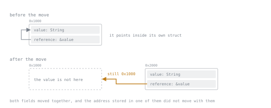

# Lesson 44. Pinning

**Mission link:** A future that borrows one of its own locals across an await is ordinary async code, and the moment it needs to sit in a collection, be produced by a self-calling function, or be polled again inside a loop, the compiler asks for a `Pin` instead of a bare value. Knowing what that wrapper promises, and which of its two constructors fits, is the difference between reading the error once and reaching for `Box::pin` out of habit forever after.
**Primary source:** [std::pin](https://doc.rust-lang.org/std/pin/index.html)
**Prerequisites:** [Lesson 27](0027-types-that-borrow.md), [Lesson 37](0037-what-a-future-is.md)

## Warm-up

1. ▢ Lesson 27 showed that a struct holding a field and a reference into that same field does not compile, because nothing updates the reference when the struct moves, and it named the async stage as where this problem comes back. If a language did let such a struct move anyway, what would have to happen to the reference at the moment of the move for the struct to stay sound?

<details markdown="1"><summary>Check</summary>

The reference would have to be rewritten to point at the new address, and nothing in a move does that: a move is a bytewise copy with no per-field fix-up. Lesson 27 closed off that possibility for an ordinary struct by refusing to compile it; this lesson is about the same danger inside a future, where the compiler writes the self-referential struct itself and cannot simply refuse to.

</details>

2. ▢ Lesson 37 described an `async fn` compiling down to a struct implementing `Future`, whose `poll` resumes a state machine from wherever it last returned `Pending`. A local declared before an `.await` and used again afterwards has to survive that pause. Where does the compiler actually put such a local?

<details markdown="1"><summary>Check</summary>

It becomes a field of the generated future rather than a stack variable, since the whole point of `poll` returning and being called again is that the function's state has to persist between those calls. Once one field of that struct can hold a reference to another field of the same struct, lesson 27's rule and lesson 37's state machine collide, and that collision is this lesson's subject.

</details>

## Know this

### The shape lesson 27 forbade, written by the compiler

An `async` block borrowing one of its own locals across an `.await` compiles and runs without mentioning `Pin`:

```rust
fn make_holder() -> impl std::future::Future<Output = String> {
    async {
        let value = String::from("hello");
        let reference: &String = &value;
        tokio::time::sleep(std::time::Duration::from_millis(1)).await;
        reference.clone()
    }
}

#[tokio::main]
async fn main() {
    println!("{}", make_holder().await);
}
```

This printed `hello`. The compiler's generated future has a field for `value` and, across the `.await`, a field borrowing it, exactly the struct lesson 27 rejected. It compiles because `.await` already carries the ceremony this lesson makes explicit: the moment a reader drives that future by calling `poll` directly, storing it, or handing it to something generic, the compiler stops covering for them.



Both fields move together, and the address stored in one of them does not move with them. That is the whole reason the ceremony exists: nothing about the struct is wrong until it is relocated, so the guarantee has to be about *where the value stays*, not about what it contains.

### What Pin promises, and the error without it

The standard library states plainly what pinning buys: "we say that a value has been pinned when it has been put into a state where it is guaranteed to remain located at the same place in memory from the time it is pinned until its drop is called." `Pin` wraps a pointer, `&mut T`, `Box<T>` and so on, promising that about its target, which is why `Future::poll` takes `Pin<&mut Self>`, not plain `&mut Self`. Calling `poll` on an unpinned value fails at the method-lookup stage:

```rust
fn main() {
    let mut fut = std::future::ready(5);
    let waker = std::task::Waker::noop();
    let mut cx = std::task::Context::from_waker(waker);
    let _ = fut.poll(&mut cx);
}
```

```text
error[E0599]: no method named `poll` found for struct `std::future::Ready<T>` in the current scope
  |
  |     let _ = fut.poll(&mut cx);
  |                 ^^^^ method not found in `std::future::Ready<{integer}>`
help: consider pinning the expression
  |
    let mut pinned = std::pin::pin!(fut);
    let _ = pinned.as_mut().poll(&mut cx);
```

Spans trimmed. The method is not there: `poll` exists on `Pin<&mut Ready<i32>>`, not `Ready<i32>`, so a bare value has no `poll` to find until wrapped in a `Pin`.

### Unpin: automatic almost everywhere, except here

The standard library says plainly: "this trait is automatically implemented for almost every type." A type implementing `Unpin` "expresses the fact that it is pinning-agnostic: it shall not expose nor rely on any pinning guarantees", so wrapping it in `Pin` is a formality. A compile check settles which side of that line a type sits on:

```rust
fn assert_unpin<T: Unpin>(_: T) {}

fn main() {
    assert_unpin(5i32);
    assert_unpin(String::from("x"));
    assert_unpin(Box::new(5i32));
    println!("all unpin");
}
```

That printed `all unpin`: `i32`, `String` and `Box<i32>` implement `Unpin` without asking for it. Passing the borrowing future through the same check gets a different answer:

```rust
fn assert_unpin<T: Unpin>(_: T) {}

fn main() {
    assert_unpin(make_holder());
}
```

```text
error[E0277]: `{async block@src/main.rs:6:5: 6:10}` cannot be unpinned
  |
  |     assert_unpin(make_holder());
  |     ------------ ^^^^^^^^^^^^^ within `impl Future<Output = i32>`, the trait `Unpin` is not implemented for `{async block@src/main.rs:6:5: 6:10}`
  |
  = note: consider using the `pin!` macro
          consider using `Box::pin` if you need to access the pinned value outside of the current scope
```

Notes trimmed. Nobody wrote `impl !Unpin` anywhere: the compiler infers it, since this future's own state borrows one of its own fields, exactly the address-sensitive case pinning exists for. For an ordinary `async` block that crosses an await while holding a reference, the answer is always no.

### Two ways to pin, and what each one costs

A pinned pointer can be produced two ways, and a small hand-rolled driver, the same pieces lesson 37 used for `block_on`, shows both giving the same result. With `Box::pin`:

```rust
let mut fut: std::pin::Pin<Box<dyn std::future::Future<Output = i32>>> = Box::pin(make_holder());
let waker = std::task::Waker::noop();
let mut cx = std::task::Context::from_waker(waker);
loop {
    match fut.as_mut().poll(&mut cx) {
        std::task::Poll::Ready(v) => { println!("boxed ready: {v}"); break; }
        std::task::Poll::Pending => println!("boxed pending"),
    }
}
```

printed `boxed pending` then `boxed ready: 21`. Swapping the first line for `let mut fut = std::pin::pin!(make_holder());` printed the identical two lines. `Box::pin` allocates on the heap and gives an owned `Pin<Box<T>>` that can be moved, stored, or pushed into a `Vec`. `std::pin::pin!` trades that away: "unlike `Box::pin`, this does not create a new heap allocation", pinning the value in place, usually on the stack, and handing back a borrow that cannot escape the block it was created in:

```rust
let x: std::pin::Pin<&mut Foo> = {
    let x: std::pin::Pin<&mut Foo> = std::pin::pin!(Foo);
    x
};
```

```text
error[E0716]: temporary value dropped while borrowed
  |
  |         let x: Pin<&mut Foo> = pin!(Foo);
  |                                ^^^^^^^^^ creates a temporary value which is freed while still in use
  |
  = note: consider using a `let` binding to create a longer lived value
```

Location and context lines trimmed. `pin!` stabilised in release **1.68.0**: that release's announcement describes "the new `pin!` macro" as one that "constructs a `Pin<&mut T>` from a `T` expression, anonymously captured in local state".

### Where a reader actually meets this

Three shapes force `Pin` on code that otherwise never mentions it. First, a collection of futures from more than one `async fn`: each produces its own distinct compiler-generated type even when signatures match, so a plain `Vec` of two different ones does not type-check:

```rust
let futs = vec![from_a(), from_b()];
```

```text
error[E0308]: mismatched types
  |
  |     let futs = vec![from_a(), from_b()];
  |                               ^^^^^^^^ expected future, found a different future
  |
  = note: distinct uses of `impl Trait` result in different opaque types
```

Location and a duplicate help line trimmed. `Vec<Pin<Box<dyn Future<Output = i32>>>>` fixes it: boxing erases the distinct types behind one trait object, and pinning is still required because a boxed `dyn Future` needs a stable address to be polled through. Storing `Box::pin(from_a())` and `Box::pin(from_b())` that way printed `1` then `2`. Second, an `async fn` that calls itself does not compile, boxed or not, because its own future would have to contain itself:

```rust
async fn countdown(n: u32) -> u32 {
    if n == 0 { 0 } else { countdown(n - 1).await }
}
```

```text
error[E0733]: recursion in an async fn requires boxing
  |
  | async fn countdown(n: u32) -> u32 {
  | ^^^^^^^^^^^^^^^^^^^^^^^^^^^^^^^^^
  = note: a recursive `async fn` call must introduce indirection such as `Box::pin` to avoid an infinitely sized future
```

Location and span trimmed. Rewriting it to return `Pin<Box<dyn Future<Output = u32> + Send>>` and boxing the recursive call fixed it and printed `0`. Third, lesson 43's pattern of awaiting `&mut future` inside a loop needs the future pinned first, because `&mut F` implements `Future` only when `F: Unpin`, and `tokio::time::Sleep` is not:

```text
error[E0277]: `PhantomPinned` cannot be unpinned
  |
  = note: consider using the `pin!` macro
          consider using `Box::pin` if you need to access the pinned value outside of the current scope
  = note: required for `Sleep` to implement `Unpin`
  = note: required for `&mut Sleep` to implement `Future`
```

Location and macro-backtrace lines trimmed. Writing `let mut timer = std::pin::pin!(sleep(...));` before the loop and using `&mut timer` as the branch fixed it and printed `done after 1 ticks`.

### The boundary: this arc stops at moving the whole future

Everything above pins and moves a future as one unit; nothing here reaches inside a pinned value to move one field out while leaving the rest pinned. That operation, called projection, and writing a `Future` by hand for a type with genuine internal pointers both need `unsafe` and a soundness argument that belongs to stage 7, along with the pin-projection crates that automate it, and this lesson stops here on purpose.

## Practice

1. ▢ `line` is one `async fn`. Predict whether `vec![line(1), line(2), line(3)]` compiles as a plain `Vec`, then run it.

   ```rust
   async fn line(n: u32) -> u32 {
       n * 2
   }
   ```

<details markdown="1"><summary>Hint</summary>

Ask what makes two `async fn` calls produce the "same" opaque type: is it the arguments, or the function that was called?

</details>

<details markdown="1"><summary>Check</summary>

Yes, it compiles as a plain `Vec<impl Future<Output = u32>>` and prints `2`, `4`, `6`. Every call to the same `async fn` produces the same compiler-generated type regardless of arguments, so boxing is only needed once two calls come from different `async fn` items, as with `from_a`/`from_b` earlier.

</details>

2. ▢ Predict what `std::future::ready(5).poll(&mut cx)` does when called directly in `fn main`, with no pinning, then compile it and check.

<details markdown="1"><summary>Check</summary>

It fails with `error[E0599]: no method named` `poll` `found for struct` `std::future::Ready<T>` `in the current scope`, since `poll` lives on `Pin<&mut Self>` and a bare `Ready<i32>` has no such method. The compiler suggests binding `std::pin::pin!(fut)` first and calling `.as_mut().poll(&mut cx)`.

</details>

3. ▢ One struct holds a `u32` and a `String`; another holds a `u32` and a `std::marker::PhantomPinned`. Predict which one, if either, fails `assert_unpin`, then check both.

<details markdown="1"><summary>Hint</summary>

`Unpin` is inferred from the fields: it holds only if every field's type also holds.

</details>

<details markdown="1"><summary>Check</summary>

The plain struct passes `assert_unpin`, since `u32` and `String` are both `Unpin`, and the compiler derives the same for a struct built only from `Unpin` fields. The one holding `PhantomPinned` fails with `error[E0277]:` `PhantomPinned` `cannot be unpinned`, because that field exists purely to make the containing type opt out, the manual equivalent of what an `async` block gets automatically once it borrows itself.

</details>

4. ▢ Predict whether `countdown` from this lesson's "Know this" compiles as an ordinary `async fn`, then run it and, if it fails, fix it with `Box::pin`.

<details markdown="1"><summary>Check</summary>

It does not compile: `error[E0733]: recursion in an async fn requires boxing`, because the future for `countdown` would need to contain another `countdown` future inside itself, and the compiler cannot compute a finite size for that. Returning `Pin<Box<dyn Future<Output = u32> + Send>>` and boxing the recursive call breaks the cycle, since a `Box` is one fixed-size pointer regardless of recursion depth, and the fixed version prints `0` for `countdown(3)`.

</details>

5. ▢ This one is a judgement call, not a compile check. For each storage need below, say whether `std::pin::pin!` is enough or `Box::pin` is required.

   - a) A single future created and awaited once, in the same function, with nothing else touching it in between.
   - b) A `Vec` built once and awaited across the whole run, holding one future per input source, where sources come from more than one `async fn`.
   - c) A future built in one function and returned to a caller that will store it and poll it later.

<details markdown="1"><summary>Check</summary>

a) `pin!` is enough: the value never outlives the block it was created in, so a stack pin costs nothing extra. b) `Box::pin` twice over: a `Vec` needs one element type, so the futures must already be behind `dyn Future`, sized and pinned only through a pointer such as `Box`. c) `Box::pin`, since `pin!`'s pointer is tied to the scope that created it and cannot be returned out of the function that built it.

</details>

## Real-world reps

- [ ] Give your project's per-source futures a home in `Vec<Pin<Box<dyn Future<Output = _>>>>` instead of their old concrete type, run the summariser, confirm results arrive as each source finishes rather than in a fixed order, and write one comment saying what `Box::pin` bought here and why `pin!` could not, since the vector must outlive the scope any single `pin!` call is tied to.
- [ ] Pick one future in your project that borrows a local across an `.await`, call `.poll()` on it directly without pinning first, paste the `E0599` you get, then fix it with `pin!` and note whether that fix would still work if the future had to be returned from the function instead of driven on the spot.
- [ ] Tomorrow: find one place in code you have written where a future is awaited more than once inside a loop, and check whether it is already pinned or only working by luck because the type happens to be `Unpin`.

## Going further

- [std::pin::Pin](https://doc.rust-lang.org/std/pin/struct.Pin.html): the wrapper type's full API, including `as_mut`
- [std::marker::Unpin](https://doc.rust-lang.org/std/marker/trait.Unpin.html): the auto trait itself, and `PhantomPinned` for opting out by hand
- [std::pin::pin!](https://doc.rust-lang.org/std/pin/macro.pin.html): the stack-pinning macro's own documentation, with a worked `block_on`
- [Pinning](https://rust-lang.github.io/async-book/part-reference/pinning.html): the async book's chapter-length walk-through, with diagrams the API documentation leaves out
- [Async](../reference/async.md): the stage 6 reference sheet
- [Resources](../RESOURCES.md)

---

Not landing? Reread the primary source at the top, since this lesson compresses it and compression is where understanding leaks. Check the [glossary](../GLOSSARY.md) for any term that felt slippery.

If the lesson itself is unclear rather than the material, that is a defect: [open an issue](https://github.com/TokenCemetery/teach/issues).
