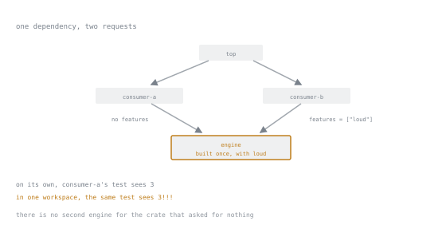

# Lesson 59. Features and the Minimum Version

**Mission link:** A crate that stays useful for years grows features and states a minimum Rust version, both promises to code you will never see: a feature must only add, or a crate two dependencies away silently changes behaviour, and `rust-version` tells cargo what it may assume is installed.
**Primary source:** [Features](https://doc.rust-lang.org/cargo/reference/features.html)
**Prerequisites:** [Lesson 58](0058-designing-for-change.md), [Lesson 20](0020-a-library-callers-can-handle.md)

## Warm-up

1. ▢ Lesson 58 designed a struct and an enum so a later field or variant would cost nothing. What did `cargo semver-checks check-release` report for that edit with `#[non_exhaustive]` and a constructor in place, next to the plain versions?

<details markdown="1"><summary>Check</summary>

With `#[non_exhaustive]` on both types plus a constructor, adding a field and a variant reported `196 checks: 196 pass` and `Summary no semver update required`. The same edit on plain versions, no `#[non_exhaustive]`, no constructor, reported `196 checks: 194 pass, 2 fail`, naming `constructible_struct_adds_field` and `enum_variant_added`, closing with `semver requires new major version: 2 major and 0 minor checks failed`. Lesson 58's design choice is the whole difference.

</details>

2. ▢ Lesson 20 split the project into a library and a thin binary, since nothing in `src/main.rs` is reachable from a caller's `use` statement, so only the library's `pub` items count as its API. A feature's promise, that enabling it only adds, is made to whom, and why does the binary side never have to keep it?

<details markdown="1"><summary>Check</summary>

The promise is to whatever depends on the package as a library, since a feature gates anything the library exposes and other crates compile against exactly that. The binary is never depended on, so a feature could change its behaviour outright with nobody two hops away noticing, which is why the promise concerns the library, not the whole package.

</details>

## Know this

### 1. What a feature is

A feature is a named switch declared in a package's `[features]` table: cargo turns it on or off, and the crate reads the result with `cfg`. `default` is a feature like any other; the only thing special about it is that cargo enables it unless told otherwise. A small crate with two features shows all three build modes differing:

```toml
[features]
default = ["ansi"]
ansi = []
truecolor = []
```

```rust
fn main() {
    #[cfg(feature = "ansi")]
    println!("ansi enabled");

    #[cfg(feature = "truecolor")]
    println!("truecolor enabled");

    #[cfg(not(any(feature = "ansi", feature = "truecolor")))]
    println!("no colour support compiled in");
}
```

```text
$ cargo run -q --no-default-features
no colour support compiled in
$ cargo run -q
ansi enabled
$ cargo run -q --all-features
ansi enabled
truecolor enabled
```

`--no-default-features` turned `default` off, plain `cargo run` left it on, and `--all-features` turned on everything regardless of `default`. Nothing here needed a dependency: `ansi` and `truecolor` are just names `cfg` checks, the whole mechanism before anything else is layered on.

### 2. Feature unification, verified rather than described

The primary source states the mechanism plainly: "Features are unique to the package that defines them. Enabling a feature on a package does not enable a feature of the same name on other packages. When a dependency is used by multiple packages, Cargo will use the union of all features enabled on that dependency when building it." Three crates make it concrete: `engine` is a shared dependency with a feature that changes what a function returns rather than adding to it:

```rust
// engine/src/lib.rs
pub fn describe(n: i32) -> String {
    if cfg!(feature = "loud") {
        format!("{n}!!!")
    } else {
        format!("{n}")
    }
}
```

`consumer-a` depends on `engine` with no features and asserts the plain form in a test; `consumer-b` depends on the same `engine` with `features = ["loud"]`; `top` depends on both. Testing `consumer-a` alone passes:

```text
$ cargo test -p consumer-a -q
running 1 test
.
test result: ok. 1 passed; 0 failed; 0 ignored; 0 measured; 0 filtered out; finished in 0.00s
```

Building the whole workspace, which anything depending on both consumers forces, changes the answer, trimmed to the lines carrying the teaching:

```text
$ cargo test -q
running 1 test
tests::plain_by_default --- FAILED
thread 'tests::plain_by_default' panicked at consumer-a/src/lib.rs:11:9:
assertion `left == right` failed
  left: "3!!!"
 right: "3"
test result: FAILED. 0 passed; 1 failed; 0 ignored; 0 measured; 0 filtered out; finished in 0.00s
```



Both edges arrive at the same box. There is no second `engine` for the crate that asked for nothing, which is the whole of it.

(Repeated failure-summary lines and a machine-specific thread number are trimmed.) `consumer-a` asked for nothing and its test still fails, because `consumer-b`'s request for `loud` reached the one build of `engine` the workspace shares; running `top` confirms it, both consumers print `3!!!`. The primary source's conclusion follows directly: "A consequence of this is that features should be additive. That is, enabling a feature should not disable functionality, and it should usually be safe to enable any combination of features. A feature should not introduce a SemVer-incompatible change." A feature that switches behaviour is not a configuration option a careful user can avoid, since `consumer-a` never touched the feature that broke it; it is a design error.

### 3. `cfg` and what it does to a public item

`#[cfg(feature = "...")]` on an item does not hide it at runtime; the compiler never sees it when the feature is off, as if the line were deleted before parsing continued. On a `pub` item the consequence is that the item exists in some builds and not others:

```rust
pub fn core(n: i32) -> i32 {
    n * 2
}

#[cfg(feature = "extra")]
pub fn bonus(n: i32) -> i32 {
    n * 3
}
```

A caller depending on this crate without turning on `extra` and calling `bonus` gets a compile error, not a runtime one, trimmed to the lines carrying the teaching:

```text
error[E0425]: cannot find function `bonus` in crate `apidemo`
 --> src/main.rs:2:29
  |
2 |     println!("{}", apidemo::bonus(4));
  |                             ^^^^^ not found in `apidemo`
  |
note: found an item that was configured out
  |
5 | #[cfg(feature = "extra")]
  |       ----------------- the item is gated behind the `extra` feature
6 | pub fn bonus(n: i32) -> i32 {
  |        ^^^^^
```

(This crate's build path in the note, and trailing compiler boilerplate, are cut.) Enabling `extra` in the caller's manifest compiles and prints `12`. That dependence is why lesson 0057 treats a feature-gated public item as a semver hazard: a caller who built against it has no guarantee that a combination someone else chose still has it, since unification makes that choice not fully theirs. Lesson 0057 owns the catalogue; this is only the mechanism.

### 4. Optional dependencies and the `dep:` syntax

Marking a dependency optional gives a feature for free: `optional = true` implicitly defines a feature of the same name that only turns the dependency on. For a long time that implicit name was the only option, so a feature name and its dependency's name were always identical. Putting `dep:itoa` inside another feature's list turns that off:

```toml
[dependencies]
itoa = { version = "1", optional = true }

[features]
fast_format = ["dep:itoa"]
```

Now `itoa` is not a feature a caller can name, only `fast_format` is:

```text
$ cargo build --features itoa
error: package `depdemo v0.1.0` does not have feature `itoa`

help: an optional dependency with that name exists, but the `features` table includes it with the "dep:" syntax so it does not have an implicit feature with that name
Dependency `itoa` would be enabled by these features:
    - `fast_format`
```

(The package line carried this crate's build path; cut.) `cargo build --features fast_format` compiles without complaint. The primary source dates this precisely: "Note: The dep: syntax is only available starting with Rust 1.60. Previous versions can only use the implicit feature name." The release itself confirms it in [Announcing Rust 1.60.0](https://blog.rust-lang.org/2022/04/07/Rust-1.60.0/), which introduced "Namespaced dependencies and weak dependency features". Before that release a feature name and its dependency's name were the same fact by construction; after it, they are a choice, and `dep:` plus the matching `?` in `"name?/feature"` state that choice.

### 5. The minimum supported version, and its trap

`rust-version` in `[package]` states the oldest toolchain the crate promises to build on, and cargo enforces it rather than merely documenting it:

```toml
[package]
name = "msrvdemo"
version = "0.1.0"
edition = "2024"
rust-version = "1.99.0"
```

```text
$ cargo build
error: rustc 1.98.0 is not supported by the following package:
  msrvdemo@0.1.0 requires rustc 1.99.0
```

Cargo refuses outright, a clearer failure than a confusing syntax error partway through a build. The key must sit under `[package]`; placed after `[dependencies]` by habit, it reads as a dependency instead:

```toml
[dependencies]
rust-version = "1.99.0"
```

```text
$ cargo build
error: no matching package named `rust-version` found
location searched: crates.io index
```

(A `required by package` line naming this crate's build path followed; cut.) Cargo looked for a crate called `rust-version` on crates.io, found none, and said so, useless unless you already suspect the placement mistake. What declaring a number commits you to, the rust-version chapter states plainly: "Changing rust-version is assumed to be a minor incompatibility". In theory that needs none of a removed function's ceremony. In practice it does: a user on the dropped version cannot build the crate at all, harder than most breaking changes, which at least leave old code compiling against an older dependency. Deciding the number is not whatever is installed; it is the oldest toolchain actually verified, which with no stated policy yet is honestly whatever last ran the tests, written down rather than left to guesswork.

### 6. What none of this fixes

A feature can turn code on or off; it cannot express "this API, but different". A function whose signature should change, or whose errors should differ between callers, cannot be fixed by a feature: every feature in a build is on or off for everyone sharing that dependency, and unification means "everyone" is not a set any caller controls. Reaching for a flag there is not a design decision but a way of avoiding one, deferring which behaviour is correct onto whichever combination a future build enables. The honest alternatives are the ones lessons 0057 and 0058 already named: a major version, a new type, a function under a new name. A feature earns its place only when both builds, on and off, agree on what every existing caller's code already means.

## Practice

1. ▢ The crate above defines `default = ["ansi"]`, `ansi = []` and `truecolor = []`. Predict what `cargo run --no-default-features --features truecolor` prints, then run it.

<details markdown="1"><summary>Check</summary>

`truecolor enabled`, alone. `--no-default-features` turns `ansi` off along with `default`, and `--features truecolor` turns `truecolor` on independently, so only that branch of the `cfg` chain compiles in.

</details>

2. ▢ In the three-crate workspace, `top`, depending on both consumers, has already been built once. Predict what `cargo test -p consumer-a -q` prints run alone straight afterwards.

<details markdown="1"><summary>Hint</summary>

Ask whether cargo recomputes activated features from the command line each time, or remembers a previous, different package selection.

</details>

<details markdown="1"><summary>Check</summary>

It passes: `test result: ok. 1 passed`. Feature activation is recomputed from the packages named on that command line, not carried over from an earlier build of `top`. Unification only reaches the packages actually selected together in one invocation.

</details>

3. ▢ `depdemo` defines `itoa = { version = "1", optional = true }` and `fast_format = ["dep:itoa"]`. Predict what `cargo build --features itoa` does, then run it.

<details markdown="1"><summary>Check</summary>

It fails, reporting that the package does not have a feature named `itoa`, with a help note that the dependency exists but is only reachable through `fast_format`. Writing `dep:itoa` inside another feature's list removed the implicit `itoa` feature the plain `optional = true` would otherwise have created.

</details>

4. ▢ A crate exposes `pub fn core` unconditionally and `#[cfg(feature = "extra")] pub fn bonus` behind a feature nobody has enabled. Predict the error code a caller gets calling `bonus` directly, before checking.

<details markdown="1"><summary>Check</summary>

`E0425`, cannot find function `bonus` in crate, with a note that the item was "configured out". The function is not private or deprecated, it simply never existed in this build: a `cfg`-gated public item is optional in a way a normal `pub` item is not.

</details>

5. ▢ `msrvdemo` declares `rust-version = "1.99.0"` correctly under `[package]`, on a toolchain that reports `1.98.0`. Predict what `cargo build --ignore-rust-version` does differently from plain `cargo build`, then check.

<details markdown="1"><summary>Hint</summary>

The flag's name says what it does to the requirement; the question is whether the toolchain still has to be capable of compiling the crate.

</details>

<details markdown="1"><summary>Check</summary>

It compiles. `--ignore-rust-version` skips the check and lets the older toolchain try anyway, succeeding here only because nothing in the crate needs a newer compiler; the flag overrides the promise, it does not verify that breaking it was safe.

</details>

## Real-world reps

- [ ] Give the summariser one honestly additive feature, gated with `#[cfg(feature = "...")]` on the new code path only, then write one sentence saying what would have to be true of it to become a behaviour switch instead, the case to refuse.
- [ ] Set the summariser's `rust-version` to a number you can justify, the toolchain you tested on or the oldest one a feature it uses requires, and write down which reason it was.
- [ ] Tomorrow: build the summariser `--no-default-features`, plain, and `--all-features`, and confirm the three builds genuinely differ as your feature promised, since one that behaves identically in all three was not worth declaring.

## Going further

- [Dependency Resolution](https://doc.rust-lang.org/cargo/reference/resolver.html): where feature unification's exceptions, build and dev dependencies, target-specific dependencies, are catalogued
- [Rust Version](https://doc.rust-lang.org/cargo/reference/rust-version.html): the fuller policy behind choosing, updating and deliberately drifting from a minimum supported version
- [Announcing Rust 1.60.0](https://blog.rust-lang.org/2022/04/07/Rust-1.60.0/): the release that shipped the `dep:` and `?/` syntax used above
- [Judgment](../reference/judgment.md): the stage 8 reference sheet
- [Resources](../RESOURCES.md)

---

Not landing? Reread the primary source at the top, since this lesson compresses it and compression is where understanding leaks. Check the [glossary](../GLOSSARY.md) for any term that felt slippery.

If the lesson itself is unclear rather than the material, that is a defect: [open an issue](https://github.com/TokenCemetery/teach/issues).
