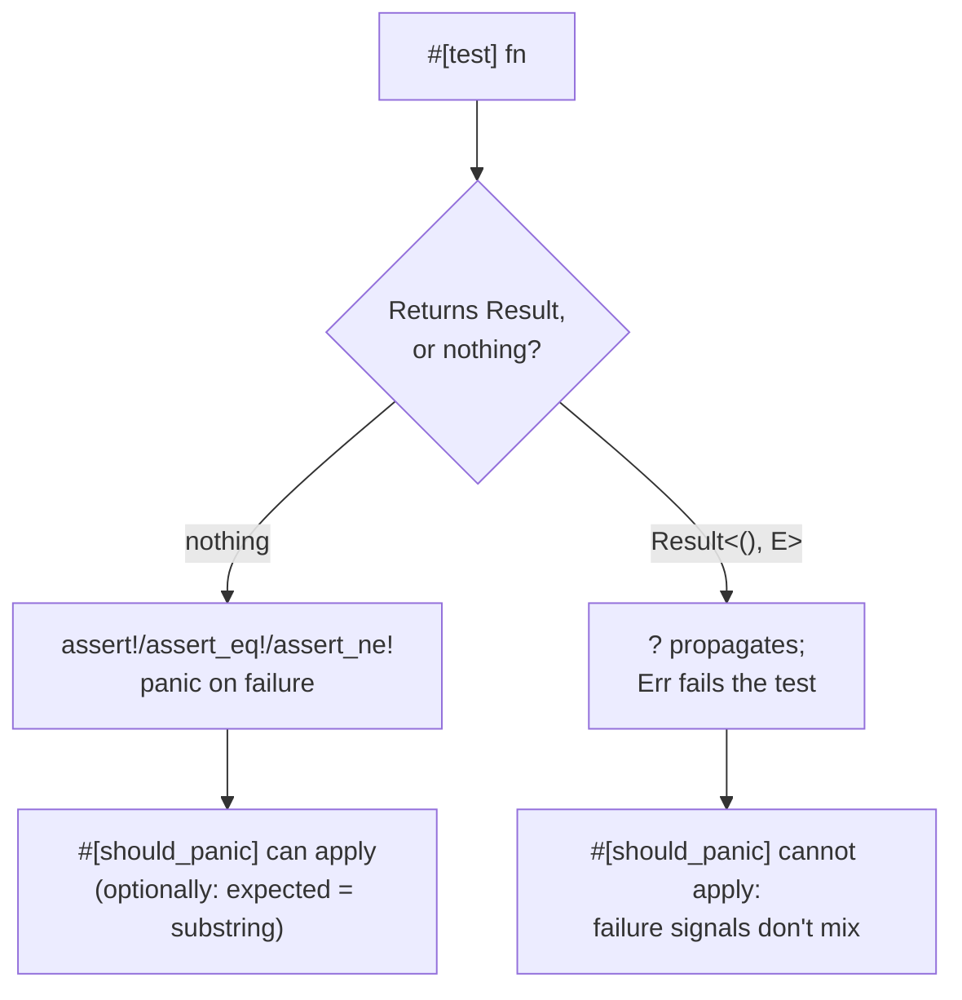

# Lesson 64. The Test Attribute and cargo test

**Mission link:** Lesson 19 showed `cargo test` running a doctest, a fenced example inside a doc comment, and treating a broken assertion in it as a failure. That's one mechanism `cargo test` drives, not the only one. An ordinary `#[test]` function, living in the crate's own source rather than inside a comment, is the shape almost all Rust testing actually takes, and it's the one this arc has never taught.
**Primary source:** [How to Write Tests](https://doc.rust-lang.org/book/ch11-01-writing-tests.html)
**Prerequisites:** [Lesson 19](0019-documentation-that-compiles.md), [Lesson 17](0017-panic-or-error.md)

## Warm-up

1. ▢ Per lesson 19, what makes a fenced block in a doc comment run as a test at all, rather than sitting there as prose `cargo test` ignores?

<details markdown="1"><summary>Check</summary>

Nothing about the fence itself; `cargo test` specifically collects and compiles doctests as part of what it runs, treating an `# Examples` block's failure to compile or its panic the same way it treats any other test's failure.

</details>

2. ▢ Per lesson 17, what does a panic actually mean about the state of the program, as distinct from an `Err`?

<details markdown="1"><summary>Check</summary>

That the program is broken, an invariant your own code assumed has been violated, unwinding the thread with a message rather than returning normally. An `Err` returns normally and says the input, not the program, was the problem.

</details>

## Know this

### `#[test]` marks a function `cargo test` collects and runs

An ordinary function annotated `#[test]`, living directly in the crate's own source rather than inside a doc comment, is what `cargo test` runs alongside every doctest it also collects:

```rust
#[test]
fn parses_a_valid_request_line() {
    let line = crate::parse("/index 200 1200").unwrap();
    assert_eq!(line.path(), "/index");
}
```

`cargo test` builds a special test binary containing every `#[test]` function it finds, plus the doctests lesson 19 already covered, and runs them, by default in parallel with output captured unless a test fails. The two mechanisms live in different places, one inside a doc comment's fence, one as an ordinary function with an attribute, and `cargo test` happening to run both under one command is a convenience, not a sign they're the same thing.

### A test fails the same way any panic does

`assert!(condition)` panics if `condition` is false; `assert_eq!(left, right)` and `assert_ne!(left, right)` compare two values and panic on a mismatch, printing both `left` and `right` regardless of which one the test's author thought of as "expected", since Rust assigns no special meaning to either position. This is lesson 17's own distinction, applied to test code specifically: a test failing is a panic, the program (here, the test) discovering its own assumption was wrong, and `cargo test` reports it exactly the way any other panic would be reported, a message, a file, and a line.

### `#[should_panic]` inverts the pass condition, and checks the message by substring

```rust
#[test]
#[should_panic(expected = "byte count is not a number")]
fn rejects_a_non_numeric_byte_count() {
    crate::parse("/index 200 not-a-number").unwrap();
}
```

A test marked `#[should_panic]` passes only if the code inside it panics, and fails if it runs to completion without one. The optional `expected = "..."` argument checks that the panic message *contains* that text, not that it matches exactly, which is precise enough to confirm the test caught the panic it meant to, rather than an unrelated one that happened to occur for a different reason and would otherwise pass just as easily.

### A test can return `Result`, and that's where the two attributes stop combining

A test function may return `Result<(), E>` instead of nothing, which lets `?` be used directly in the test body, exactly lesson 14's propagation applied to test code:

```rust
#[test]
fn parses_a_valid_request_line() -> Result<(), crate::ParseError> {
    let line = crate::parse("/index 200 1200")?;
    assert_eq!(line.path(), "/index");
    Ok(())
}
```

Returning `Err` fails the test the same way a panic does, but through a different channel entirely, an ordinary return rather than an unwind. That's precisely why `#[should_panic]` cannot be combined with a `Result`-returning test: the two attributes signal failure through mechanisms that don't mix, one through panicking, the other through `Err`, and a test can only be set up to expect one of them.

### Choosing between the two return shapes is the same choice lesson 17 already taught

A test that panics on a broken assertion is testing that your code's own invariant holds; a test returning `Result` and propagating with `?` is exercising a function that itself returns `Result`, letting the test read almost like the caller code lesson 15 was designing an error type for in the first place. Neither is more "correct" than the other in general; which one fits depends on whether the thing under test itself returns `Result`, the identical question lesson 17 asked about the code being tested, not about the test.



## Practice

1. ▢ A `#[test]` function calls `assert_eq!(summary.request_count(), 3)` against a summariser that actually counted 2 requests. What does `cargo test`'s failure output show, and does it label either number "expected" or "actual"?

<details markdown="1"><summary>Hint</summary>

Think about what Rust actually names the two sides of the comparison.

</details>

<details markdown="1"><summary>Check</summary>

It prints both values under `left` and `right`, matching the order they were written in the macro call, with no special "expected" or "actual" label attached to either side; Rust assigns no particular meaning to left versus right in an equality assertion.

</details>

2. ▢ A test is marked `#[should_panic(expected = "missing field")]`, but the code inside it panics with the message `"index out of bounds"` instead, for an unrelated reason. Does the test pass?

<details markdown="1"><summary>Check</summary>

No. `expected` checks that the panic message contains the given text; a panic that happens to occur for a completely different reason, with a message that doesn't contain it, still fails the test. This is exactly what the substring check is for: confirming the right panic happened, not merely that some panic did.

</details>

3. ▢ Can a single test function be annotated both `#[should_panic]` and declared to return `Result<(), E>`?

<details markdown="1"><summary>Check</summary>

No. A `Result`-returning test signals failure by returning `Err`, not by panicking, and `#[should_panic]` expects the opposite: a panic as the pass condition. The two failure-signaling mechanisms don't combine, which is a documented restriction rather than something either attribute happens to allow.

</details>

4. ▢ A test function returns `Result<(), crate::ParseError>` and uses `?` on a call that returns the same error type. What happens if that call returns `Err`, and how does this differ mechanically from an `assert_eq!` failure in an ordinary test?

<details markdown="1"><summary>Check</summary>

The `?` returns the `Err` early from the test function, which `cargo test` reports as a failed test, the same overall outcome as a panicking `assert_eq!`, but through an entirely different mechanism: an ordinary early return rather than an unwind. The test still fails either way; only the channel differs.

</details>

5. ▢ Which claim correctly distinguishes a doctest from a `#[test]` function?

    - a) They are the same mechanism; `cargo test` merely reports them under different headings
    - b) A doctest is a fenced example inside a doc comment, compiled and run as its own tiny program; a `#[test]` function is an ordinary function in the crate's own source marked with an attribute, and `cargo test` runs both under one command without them being mechanically the same thing
    - c) Only `#[test]` functions can use the `?` operator; a doctest can never return `Result`
    - d) `#[should_panic]` can be applied to a doctest the same way it applies to a `#[test]` function

<details markdown="1"><summary>Check</summary>

**b)** That's the precise distinction this lesson draws, building on lesson 19's own doctest coverage. (a) is false: they live in genuinely different places, a doc comment's fence versus an ordinary attributed function, even though one command runs both. (c) is false: lesson 19 showed a doctest's hidden `# Ok::<(), ErrorType>(())` line specifically to let an example use `?`, meaning a doctest can and often does behave like a `Result`-returning function. (d) is false: `#[should_panic]` is a `#[test]`-function attribute; a doctest signals its own success or failure by compiling and running to completion without panicking, not through that attribute.

</details>

## Real-world reps

- [ ] Add at least one `#[test]` function to your `logsum` library's parsing logic, asserting on a value the function actually returns, not merely that it doesn't panic.
- [ ] Write one `#[should_panic(expected = "...")]` test against a function you know panics on a specific bad input, and confirm changing the expected substring to something that doesn't appear in the real message makes the test fail.
- [ ] Tomorrow: rewrite one existing `#[test]` function to return `Result<(), YourErrorType>` and use `?` inside it instead of `.unwrap()`, and confirm `cargo test` still reports the same pass or fail outcome.

## Going further

- [How to Write Tests](https://doc.rust-lang.org/book/ch11-01-writing-tests.html)
- [Running Tests](https://doc.rust-lang.org/book/ch11-02-running-tests.html)
- [Lesson 19. Documentation That Compiles](0019-documentation-that-compiles.md)
- [Resources](../RESOURCES.md)

---

Not landing? Reread the primary source at the top, since this lesson compresses it and compression is where understanding leaks. Check the [glossary](../GLOSSARY.md) for any term that felt slippery.

If the lesson itself is unclear rather than the material, that is a defect: [open an issue](https://github.com/TokenCemetery/teach/issues).
