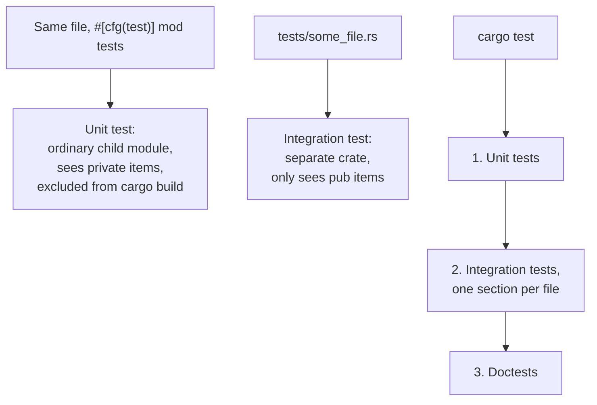

# Lesson 65. Unit Tests Versus Integration Tests

**Mission link:** Lesson 64 taught `#[test]` itself; this lesson is where one lives, and why that location is not a style choice. A unit test in the same file as the code can reach a private item because it's an ordinary child module, nothing special about testing grants that; a test in a separate `tests/` directory can't, because it's compiled as its own crate seeing only what lesson 18 already called the promise a public item makes.
**Primary source:** [Test Organization](https://doc.rust-lang.org/book/ch11-03-test-organization.html)
**Prerequisites:** [Lesson 64](0064-the-test-attribute-and-cargo-test.md), [Lesson 18](0018-modules-and-visibility.md)

## Warm-up

1. ▢ Per lesson 18, what does making an item `pub` actually commit you to?

<details markdown="1"><summary>Check</summary>

That callers outside the crate can depend on it, so changing or removing it later is a breaking change; visibility is an API decision the module tree encodes, not just an organisational one.

</details>

2. ▢ Per lesson 64, what does `#[test]` mark, and where does that function typically live relative to the code it tests?

<details markdown="1"><summary>Check</summary>

An ordinary function `cargo test` collects and runs; lesson 64 didn't specify where it has to live, which is exactly the gap this lesson closes.

</details>

## Know this

### A unit test lives in the same file, as an ordinary child module

The convention is a `#[cfg(test)] mod tests` block inside the same source file as the code it exercises, with `use super::*` bringing the parent module's items into scope:

```rust
fn internal_adder(a: i32, b: i32) -> i32 {
    a + b
}

#[cfg(test)]
mod tests {
    use super::*;

    #[test]
    fn adds_two_numbers() {
        assert_eq!(internal_adder(2, 3), 5);
    }
}
```

`internal_adder` is never marked `pub`, and the test still calls it directly. Nothing about testing grants special access; a child module can always see its ancestor's items, the ordinary visibility rule lesson 18 already established, and `mod tests` is simply another child module that happens to hold test functions.

### `#[cfg(test)]` is ordinary conditional compilation, not a testing-specific mechanism

`#[cfg(test)]` tells the compiler to include the annotated module only when compiling for `cargo test`, never for an ordinary `cargo build`. This is the same conditional-compilation attribute Rust uses for other configuration switches, applied here to keep test-only code out of the artifact a `cargo build` actually ships, and to avoid compiling it at all when nobody asked to run tests. A unit test's access to private items and its exclusion from a normal build are two separate facts, one about module visibility, one about conditional compilation, that happen to combine in this one convention.

### An integration test lives in `tests/`, and is compiled as its own separate crate

A file placed at `tests/some_test.rs` is compiled as an entirely separate crate, one that depends on your library exactly the way any external caller would, through `use your_crate::...` and nothing else. It never needs `#[cfg(test)]`, since everything under `tests/` is already only ever built for test runs; the directory itself is the gate, not an attribute inside it.

```rust
// tests/parsing.rs
use logsum::parse;

#[test]
fn rejects_a_missing_field() {
    assert!(parse("/missing 200").is_err());
}
```

### An integration test can only see what you actually made public

Because an integration-test file is compiled as an external crate, it can only reach items your library actually marked `pub`, the identical boundary lesson 18 already drew around what a caller may depend on. An integration test that can't reach some internal helper isn't missing a testing feature; it's telling you, accurately, that the helper was never part of the surface a real caller could use either. This is what makes an integration-test suite the honest check of whether the public API lesson 20 designed is actually usable end to end, not merely whether each internal piece works in isolation.

### `cargo test` runs three sections, in order, and stops at the first failure

A single `cargo test` invocation runs unit tests first, then one section per file found in `tests/`, then doctests last. If the unit-test section fails, the later sections, integration tests and doctests, don't run at all in that invocation; a clean report on doctests specifically means they ran and passed, not that they were merely skipped past a failure earlier in the same run, which is exactly the distinction worth checking before treating "no doctest failures shown" as "the doctests passed."



## Practice

1. ▢ A private function `fn validate(line: &str) -> bool` has a `#[test]` in a `#[cfg(test)] mod tests` block in the same file, calling `validate` directly. Why does this compile, given that `validate` is never `pub`?

<details markdown="1"><summary>Hint</summary>

Think about what relationship the `tests` module actually has to the module `validate` lives in.

</details>

<details markdown="1"><summary>Check</summary>

`mod tests` is an ordinary child module of the module `validate` is defined in, and a child module can always see its ancestor's items regardless of visibility. This is the standard module-visibility rule, not a testing-specific exception; nothing about `#[test]` or `#[cfg(test)]` grants extra access on its own.

</details>

2. ▢ A test author writes `use super::*;` at the top of a `mod tests` block. What is this line actually doing, mechanically?

<details markdown="1"><summary>Check</summary>

Bringing every item from the parent (enclosing) module into scope inside `mod tests`, so the test functions can refer to them by their short names instead of a fully qualified path. It's an ordinary `use` statement, working the same way it would anywhere else in the module tree.

</details>

3. ▢ A file at `tests/integration.rs` tries to call a private helper function from the library it's testing, and the build fails. Is this a bug in the test setup?

<details markdown="1"><summary>Check</summary>

No. A `tests/` file is compiled as a separate crate, seeing only what the library actually marked `pub`, exactly like any real external caller would. The failure correctly reports that the helper was never part of the public surface, the same boundary an actual dependant would hit trying to use it.

</details>

4. ▢ Does a file under `tests/` need `#[cfg(test)]` the way a unit test module does?

<details markdown="1"><summary>Check</summary>

No. Everything in the `tests/` directory is already only ever compiled when running tests; the directory itself is the gate. `#[cfg(test)]` matters specifically for unit tests, which share a file with ordinary, always-compiled code and need an explicit attribute to be excluded from a normal build.

</details>

5. ▢ A `cargo test` run shows a failing unit test and reports no doctest failures at all. Does this mean every doctest in the crate passed?

<details markdown="1"><summary>Check</summary>

Not necessarily. `cargo test` runs unit tests, then integration tests, then doctests, in that order, and stops at the first section that fails; a failing unit test can mean the doctest section never ran in that invocation at all. "No doctest failures shown" has to be checked against whether the doctest section actually ran, not assumed from its absence in the output.

</details>

## Real-world reps

- [ ] Add a `#[cfg(test)] mod tests` block to one file in your `logsum` library that tests a private helper function directly, confirming it compiles without making that function `pub`.
- [ ] Create a `tests/` directory with one integration test file that only calls `logsum`'s public functions, and confirm it fails to compile if you try to reach anything private from it.
- [ ] Tomorrow: deliberately break a unit test in `logsum`, run `cargo test`, and check whether the integration-test and doctest sections ran at all in that output.

## Going further

- [Test Organization](https://doc.rust-lang.org/book/ch11-03-test-organization.html)
- [Lesson 18. Modules and Visibility](0018-modules-and-visibility.md)
- [Lesson 20. A Library a Caller Can Handle](0020-a-library-callers-can-handle.md)
- [Resources](../RESOURCES.md)

---

Not landing? Reread the primary source at the top, since this lesson compresses it and compression is where understanding leaks. Check the [glossary](../GLOSSARY.md) for any term that felt slippery.

If the lesson itself is unclear rather than the material, that is a defect: [open an issue](https://github.com/TokenCemetery/teach/issues).
