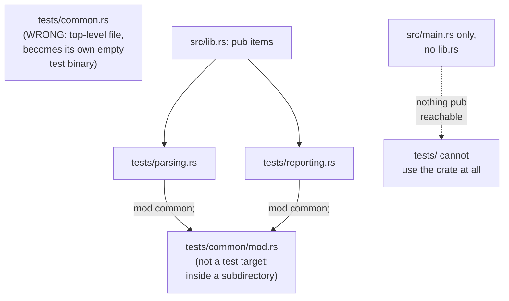

# Lesson 66. Organising Tests for a Library

**Mission link:** Lesson 65 drew the boundary: a `tests/` file only sees what you marked `pub`. This lesson is what that boundary does to the suite as a whole, once there's more than one integration test file: how you group them, where shared setup code has to live for `cargo test` not to treat it as a phantom test file, and why a crate with no `src/lib.rs`, the split lesson 20 made `logsum` do, cannot be integration-tested at all.
**Primary source:** [Test Organization](https://doc.rust-lang.org/book/ch11-03-test-organization.html)
**Prerequisites:** [Lesson 65](0065-unit-versus-integration-tests.md), [Lesson 20](0020-a-library-callers-can-handle.md)

## Warm-up

1. ▢ Per lesson 65, what can a file in `tests/` reach, and what can't it?

<details markdown="1"><summary>Check</summary>

Only what the library actually marked `pub`, exactly like any external caller. It's compiled as its own separate crate, so a private item is as unreachable from it as from any other crate depending on the library.

</details>

2. ▢ Per lesson 20, what does `logsum`'s `src/main.rs` contribute to the crate's public API?

<details markdown="1"><summary>Check</summary>

Nothing. A binary is run, never depended on, so nothing in `main.rs` is reachable from a `use` statement anywhere, inside the crate's own `tests/` files or outside it.

</details>

## Know this

### An integration suite's shape is forced by whatever you already made `pub`

A `tests/` file can only call what a real dependant could call, so it groups by public entry point, not by which file in `src/` happens to implement that behaviour. `logsum`'s library exposes `Record`, `LineError` and `parse_line`; an integration test can exercise `parse_line` and match on `LineError`'s variants exactly as lesson 20's second consumer did, and nothing an integration test tries can reach whatever `split_fields` still does its work behind. Organising the suite by public surface rather than by internal file layout isn't a style choice: it's the only axis a `tests/` file is capable of seeing at all.

### One file per behaviour grouping, each its own crate

Cargo compiles every file directly inside `tests/` as its own separate crate and its own test binary:

```text
tests/
├── parsing.rs
└── reporting.rs
```

```rust
// tests/parsing.rs
use logsum::parse_line;

#[test]
fn rejects_a_missing_field() {
    assert!(parse_line("/missing 200").is_err());
}
```

Two files buy two independently compiled and linked test binaries, which is a real cost at scale, but it also means a failure in `reporting.rs` never blocks `parsing.rs`'s tests from running and reporting their own result in the same `cargo test` invocation, since each is compiled, run, and reported on separately.

### Shared setup goes in `tests/common/mod.rs`, not `tests/common.rs`

Two files that both need the same setup code can't `use` each other the way two modules under `src/` would, since each is its own crate with no path between them. The natural move, a `tests/common.rs` holding a shared `setup()`, backfires: Cargo still treats any file directly inside `tests/` as its own test target, so `common.rs` gets compiled and run as a test binary too, appearing in `cargo test`'s output with a `running 0 tests` section for a file that was never meant to hold any. Naming it `tests/common/mod.rs` instead avoids this, because Cargo's directory scan for test targets only looks at files directly inside `tests/`, not inside a subdirectory of it:

```text
tests/
├── common
│   └── mod.rs
├── parsing.rs
└── reporting.rs
```

```rust
// tests/common/mod.rs
pub fn setup() -> &'static str {
    "/index 200 1200\n/login 200 not-a-number\n"
}
```

```rust
// tests/parsing.rs
mod common;
use logsum::parse_line;

#[test]
fn rejects_a_missing_field() {
    let input = common::setup();
    assert!(input.lines().any(|l| parse_line(l).is_err()));
}
```

`mod common;` in `parsing.rs` is what actually pulls `tests/common/mod.rs` in, using the older module-file naming convention Rust still recognises, precisely because a `tests/` file's contents are otherwise cut off from any file outside itself. A consequence follows directly from each `tests/` file being its own crate: if both `parsing.rs` and `reporting.rs` declare `mod common;`, `tests/common/mod.rs`'s code is compiled twice, once inside each binary, not shared between them the way a `src/` module would be. That's not a mistake to fix; it's the same "separate crate per file" fact lesson 65 already established, applied to a module you only meant to reuse.

### A fixture is shared data, not shared code, and it needs no `#[cfg(test)]` either

The same problem shows up for data instead of functions: several integration tests wanting the same sample input. It can live as a constant returned from `tests/common/mod.rs`, or as a separate file under `tests/`, read in at compile time with `include_str!`:

```rust
// tests/parsing.rs
mod common;
use logsum::parse_line;

const SAMPLE: &str = include_str!("fixtures/sample.log");

#[test]
fn parses_every_valid_line_in_the_sample() {
    let valid_lines = SAMPLE.lines().filter(|l| !l.is_empty() && !l.starts_with('#'));
    assert!(valid_lines.filter(|l| parse_line(l).is_ok()).count() >= 3);
}
```

`tests/fixtures/sample.log` needs no `#[cfg(test)]`, for the same reason lesson 65 gave for the rest of the `tests/` directory: it isn't Rust source Cargo would otherwise compile into a normal build at all, so there's nothing to gate, and everything under `tests/` is only ever read by a test binary in the first place.

### No `src/lib.rs` means no integration tests, full stop

A crate that is only `src/main.rs`, with no `src/lib.rs`, exposes nothing a `use` statement anywhere can reach, including from a file in its own `tests/` directory, because a binary crate is meant to be run, never depended on. This is the concrete cost of skipping lesson 20's split: `logsum` can only have the integration suite this lesson describes because stage 3 already moved `Record`, `LineError` and `parse_line` into `src/lib.rs`, leaving `main.rs` to call the library the same way an integration test now does. A project that never made that split has, at most, unit tests inside `src/main.rs` itself; `tests/` is closed to it entirely.



## Practice

1. ▢ A team creates `tests/common.rs` holding a `setup()` helper called from two other test files. Predict what `cargo test`'s output shows for `common.rs` itself, then create the file and run it.

<details markdown="1"><summary>Hint</summary>

Ask what makes Cargo decide a file is a test target in the first place: its location, or whether it contains a `#[test]` function.

</details>

<details markdown="1"><summary>Check</summary>

A `running 0 tests` section appears for `common`, since Cargo compiles every file directly inside `tests/` as its own test binary regardless of whether it contains any `#[test]` functions. Renaming it to `tests/common/mod.rs` removes that section, because a file inside a subdirectory of `tests/` isn't scanned as a target on its own.

</details>

2. ▢ `tests/common/mod.rs` is pulled into both `tests/a.rs` and `tests/b.rs` via `mod common;`. Is its code compiled once and shared, or once per file that declares it?

<details markdown="1"><summary>Check</summary>

Once per file. Each file in `tests/` is its own separate crate, so `mod common;` in `a.rs` and `mod common;` in `b.rs` each compile their own copy of `tests/common/mod.rs`'s code into their own separate test binary; nothing is shared between the two the way a `src/` module would be.

</details>

3. ▢ A crate is only `src/main.rs`, with no `src/lib.rs`. A learner writes `tests/integration_test.rs` with `use myapp::run;` at the top. Predict whether this compiles, then try it.

<details markdown="1"><summary>Check</summary>

It fails to compile: there is no library crate named `myapp` to `use` from, since a binary-only crate exposes nothing another crate, including a `tests/` file, can reach. Integration-testing this project at all requires first moving the logic into `src/lib.rs`, the same split lesson 20 performed on `logsum`.

</details>

4. ▢ `tests/fixtures/sample.log` holds sample input read by `include_str!` in two different test files. Does this file need `#[cfg(test)]` the way a unit test module does?

<details markdown="1"><summary>Check</summary>

No. It isn't Rust source at all, so there's nothing for `#[cfg(test)]` to gate; everything under `tests/` is already only ever read when a test binary in that directory is built, the same "the directory itself is the gate" reasoning lesson 65 gave for why an integration test file needs no attribute either.

</details>

5. ▢ `tests/common/mod.rs` contains a `#[test]` function, not just a plain helper, and both `tests/a.rs` and `tests/b.rs` declare `mod common;`. Predict what happens when `cargo test` runs.

<details markdown="1"><summary>Hint</summary>

You already found, in question 2, how many times `tests/common/mod.rs`'s code gets compiled. A `#[test]` function is still ordinary code as far as that fact is concerned.

</details>

<details markdown="1"><summary>Check</summary>

The test runs twice, once inside `a.rs`'s test binary and once inside `b.rs`'s, since each file that declares `mod common;` compiles its own copy of everything in it, `#[test]` functions included. This is exactly why `tests/common/mod.rs` is meant to hold plain helpers and fixtures, not tests of its own.

</details>

## Real-world reps

- [ ] Split `logsum`'s integration tests into at least two files grouped by behaviour, such as `tests/parsing.rs` and `tests/reporting.rs`, each using only `logsum`'s `pub` items.
- [ ] Move any setup code duplicated between them into `tests/common/mod.rs`, pull it in with `mod common;`, and confirm `cargo test` no longer shows a spurious `common` test section the way a top-level `tests/common.rs` would have.
- [ ] Tomorrow: save the seven-line sample from `reference/the-project.md` as `tests/fixtures/sample.log`, load it with `include_str!` in at least one integration test instead of repeating the literal text inline, and confirm renaming `tests/common/mod.rs` back to `tests/common.rs` makes a phantom `common` section reappear in `cargo test`'s output.

## Going further

- [Test Organization](https://doc.rust-lang.org/book/ch11-03-test-organization.html)
- [`include_str!`](https://doc.rust-lang.org/std/macro.include_str.html): the standard library macro behind the fixture-file example above
- [Lesson 65. Unit Tests Versus Integration Tests](0065-unit-versus-integration-tests.md)
- [Lesson 20. A Library a Caller Can Handle](0020-a-library-callers-can-handle.md)
- [Resources](../RESOURCES.md)

---

Not landing? Reread the primary source at the top, since this lesson compresses it and compression is where understanding leaks. Check the [glossary](../GLOSSARY.md) for any term that felt slippery.

If the lesson itself is unclear rather than the material, that is a defect: [open an issue](https://github.com/TokenCemetery/teach/issues).
