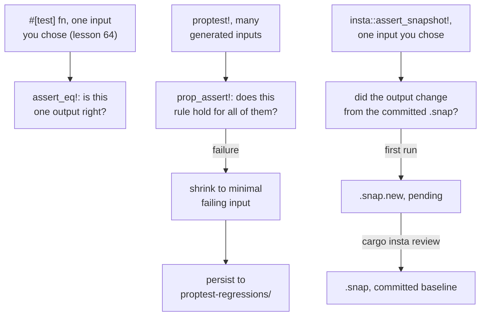

# Lesson 67. Property-Based and Snapshot Testing

**Mission link:** This is stage 9's capstone. Lesson 64 taught `assert_eq!` against one input you chose by hand; this lesson is the same failure mechanism turned two different directions. `proptest` asks the computer to find an input that breaks a rule you state once, generating hundreds of them and shrinking a failure down to the smallest case that still breaks it. A snapshot, with `insta`, keeps testing exactly one input you did choose, but against an entire recorded output a human reviewed once, rather than an assertion you had to write out by hand. And it's where the release procedure's own first step, "the test suite passes," which stage 8 had to state before this arc had taught what a test suite even was, finally has something behind it.
**Primary source:** [Proptest: Getting Started](https://altsysrq.github.io/proptest-book/proptest/getting-started.html)
**Prerequisites:** [Lesson 66](0066-organising-tests-for-a-library.md), [Lesson 64](0064-the-test-attribute-and-cargo-test.md)

## Warm-up

1. ▢ Per lesson 64, what does `assert_eq!(left, right)` do when the two sides differ, and who chose the input it was run against?

<details markdown="1"><summary>Check</summary>

It panics, printing both sides under `left` and `right` with no "expected" label on either. The human writing the test chose the one input the assertion runs against; the test says nothing about any other input.

</details>

2. ▢ Per lesson 66, what does an integration test in `logsum`'s `tests/` directory see of the library, and what can't it reach?

<details markdown="1"><summary>Check</summary>

Only what `logsum` marked `pub`: `Record`, `LineError`, and `parse_line`. It can't reach `split_fields` or anything else left without a visibility keyword, the same boundary a real dependant would hit.

</details>

## Know this

### A property test asks the computer to find a case that breaks a rule you state once

`#[dev-dependencies] proptest = "1"` in `Cargo.toml`, then a `proptest!` macro block replacing a plain `#[test]` function:

```rust
use proptest::prelude::*;

proptest! {
    #[test]
    fn parse_line_never_panics(s in "\\PC*") {
        let _ = logsum::parse_line(&s);
    }
}
```

The text to the right of `in` is a `Strategy`: here, a regular expression describing arbitrary non-control-character strings, elsewhere an integer range such as `1u32..10000` or `any::<T>()` for a type's whole domain. `proptest!` runs the body against many generated values drawn from that strategy, by default hundreds, rather than the one value a hand-written `#[test]` runs against. The property being checked here is a narrow one, "never panics," exactly the kind lesson 17 already named an invariant worth stating even before you can state anything stronger about the output.

### A failure is shrunk to the smallest case that still breaks the property, not left as whatever random value first triggered it

A failing property test doesn't report the first random input that broke it; it searches for a smaller one that still fails, and keeps shrinking until no smaller failing case can be found:

```text
thread 'main' panicked at 'Test failed: byte index 4 is not a char boundary;
it is inside 'ௗ' (bytes 2..5) of `aAௗ0㌀0`; minimal failing input: s = "aAௗ0㌀0"
	successes: 102
	local rejects: 0
	global rejects: 0
'
```

`minimal failing input` is the shrunk case, not the case that was first generated; the `successes` count is how many earlier inputs passed before this one failed. This is the mechanism that makes a property test's failure actually readable: a hundred generated inputs collapsing into one short counterexample is what turns "somewhere in here is a bug" into a specific string worth staring at.

### The failure is persisted to `proptest-regressions/`, and that file is meant to be committed

The first time a property test fails, a `proptest-regressions/` directory appears, holding one file per source file that had a failure, recording the exact shrunk case. Every later run of that test tries the persisted case first, before generating any new random input, so a bug proptest already found once is checked on every run from then on rather than left to chance rediscovery. The primary source is explicit about what to do with it: `git add proptest-regressions`, the same discipline as any other test asset, not a scratch file to `.gitignore`.

### A snapshot test asks whether one chosen output changed from what a human already reviewed

`insta::assert_snapshot!` takes one value, the same kind of single input a hand-written `#[test]` already runs against, but compares its rendering against a baseline file instead of a hand-written expected value:

```rust
#[test]
fn summary_report_format() {
    let summary = logsum::summarise(SAMPLE_LOG);
    insta::assert_snapshot!(summary.to_string());
}
```

The first run, with no baseline yet, writes the current output to a pending `.snap.new` file rather than failing outright (`INSTA_UPDATE=auto`, the default, is `no` in CI and `new` everywhere else). `cargo insta review` shows the pending value and lets a human accept it, which is what turns `.snap.new` into a committed `.snap` file; only from that point on does a later run have anything to compare against. A subsequent run whose output differs from the committed `.snap` file fails, and the same `cargo insta review` step decides whether that difference is the bug or the update, rather than either silently passing or requiring a human to have written out the entire expected report by hand in the test source.

### The stage capstone: three tools answering three different questions, and what they finally let stage 8 assume

Lesson 64's `assert_eq!` answers "does this one input, that I chose, produce this one output": correct and necessary, and blind to every input nobody thought to write down. Property testing answers a different question, "does this rule hold for every input the strategy can generate," and shrinks a violation down to something a human can read; it says nothing about whether a particular output is the *right* one, only whether the stated property held. Snapshot testing answers a third question, "did this one output change from what a human already signed off on," which is exactly the tool for a structured report too large to hand-write an assertion against, and exactly the wrong tool for checking a rule that has to hold for every input. `reference/judgment.md`'s own release procedure opens with "the test suite passes," written in stage 8 before this arc had taught what such a suite actually contains; stage 9, ending here, is what that first step was always assuming: tests beside the code and tests through the public API (lessons 64 and 65), organised by what that API actually exposes (lesson 66), and, where a hand-picked example or a hand-written assertion isn't enough on its own, a property that must always hold or a snapshot a human has already reviewed.



## Practice

1. ▢ A property test reads `fn doesnt_crash(s in "\\PC*") { logsum::parse_line(&s); }`, ignoring the return value entirely. What property is actually being checked, and what would a passing run *not* tell you?

<details markdown="1"><summary>Hint</summary>

Think about what the test body does with `parse_line`'s output, versus what it does if `parse_line` panics.

</details>

<details markdown="1"><summary>Check</summary>

Only that `parse_line` doesn't panic on any of the generated strings; the return value is discarded, so a passing run says nothing at all about whether the parsed result is correct. That's a real and worthwhile property, since a parser panicking on untrusted input is a bug lesson 17 already named, but it's a much narrower claim than "parses correctly."

</details>

2. ▢ A property test fails, and the panic message ends with `minimal failing input: s = "0"` after `successes: 340`. Does this mean proptest tried exactly 341 inputs in total before reporting?

<details markdown="1"><summary>Check</summary>

No. `successes: 340` counts inputs that passed before the failing one was found; after a failure, proptest then shrinks that failing case toward a smaller one, trying further candidate inputs during shrinking that aren't counted in `successes` at all. The number describes the search before failure, not the total work done.

</details>

3. ▢ A team's CI pipeline runs `cargo test` and a snapshot test fails because the report format changed on purpose. What does the failure actually mean, and what's the next step?

<details markdown="1"><summary>Check</summary>

It means the current output no longer matches the committed `.snap` baseline, exactly what a snapshot test exists to catch, and it says nothing on its own about whether the change is a bug or an intended update. The next step is `cargo insta review` to look at the diff and accept the new output if the format change was correct, turning the new value into the committed baseline.

</details>

4. ▢ A `proptest-regressions/some_test.txt` file is deleted by a teammate who assumed it was build output and added it to `.gitignore`. What's lost?

<details markdown="1"><summary>Check</summary>

The persisted minimal failing case for a bug proptest already found once. Without that file, the next run generates fresh random inputs from scratch and has no guarantee of hitting the same failing case again soon, so a bug that was already caught and shrunk down to a specific string could go unexercised for a long time before random generation happens to rediscover it.

</details>

5. ▢ **Stage capstone.** `logsum` needs to check that its summary report never panics on malformed input, that parsing a valid line and reformatting it always reproduces the same fields, and that the report's printed layout hasn't drifted since it was last reviewed. Which of this stage's tools fits each of those three, and why would swapping any two of them not work as well?

<details markdown="1"><summary>Check</summary>

"Never panics on malformed input" is a property test over arbitrary strings (this lesson): the rule has to hold for inputs nobody enumerated by hand, and a hand-written `#[test]` could only ever check the specific bad inputs someone thought to try. "Parsing a line and reformatting it reproduces the same fields" is also a property, over the narrower strategy of only well-formed lines, checking a round-trip invariant across many generated valid inputs rather than one. "The report's printed layout hasn't drifted" is a snapshot test: there's no rule to state, only "does this match what a human already approved," and a property test has nothing to generate against since the question is about one specific, chosen report's formatting, not a rule over many inputs. Using a snapshot for the panic check would mean re-approving a new baseline every time the one sample input happened to change, catching nothing about inputs the sample never included; using a property test for the layout check has no property to write, since "looks right" isn't a rule a strategy can be checked against, only something a human has to look at once.

</details>

## Real-world reps

- [ ] Add `proptest = "1"` to `logsum`'s `[dev-dependencies]` and write one property test asserting `logsum::parse_line` never panics on an arbitrary string, using the `"\\PC*"` strategy from this lesson.
- [ ] Add `insta` as a dev-dependency and snapshot `logsum`'s full summary report against the seven-line sample from `reference/the-project.md`, then run `cargo insta review` to accept the first baseline.
- [ ] Tomorrow: commit the `proptest-regressions/` directory that appears the first time one of your property tests fails, deliberately break the property afterward, and confirm the persisted case is what `cargo test` reports first, before any new random input is generated.

## Going further

- [Proptest: Getting Started](https://altsysrq.github.io/proptest-book/proptest/getting-started.html)
- [Proptest: Failure Persistence](https://altsysrq.github.io/proptest-book/proptest/failure-persistence.html): what `proptest-regressions/` stores and why it's checked in
- [`insta` crate documentation](https://docs.rs/insta/latest/insta/): `assert_snapshot!`, `INSTA_UPDATE`, and `cargo insta review`
- [Lesson 66. Organising Tests for a Library](0066-organising-tests-for-a-library.md)
- [Judgment](../reference/judgment.md): the stage 8 sheet, whose release procedure opens with the test suite this stage taught how to write
- [Resources](../RESOURCES.md)

---

Not landing? Reread the primary source at the top, since this lesson compresses it and compression is where understanding leaks. Check the [glossary](../GLOSSARY.md) for any term that felt slippery.

If the lesson itself is unclear rather than the material, that is a defect: [open an issue](https://github.com/TokenCemetery/teach/issues).
