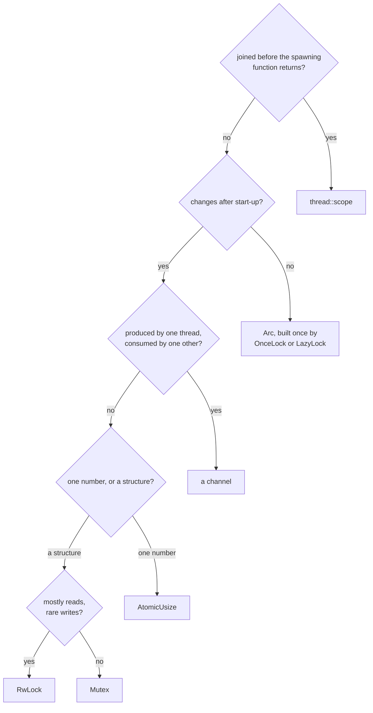

# Sharing and threads

Lookup sheet for stage 5. The question it exists to answer: **which sharing type does this data actually need, and what does choosing wrong look like?**

## The strategy decision, as a procedure

Ask these in order. Stop at the first question that settles it.

1. **Does the work finish inside this function?** If every thread you would spawn is joined before the function that spawns it returns, `thread::scope` (Lesson 30) needs none of the machinery below: no `Arc`, no lock, no lifetime annotation, because the compiler can see the join happening before the borrowed data's scope ends.
2. **Does the data change after start-up?** If not, `Arc` (Lesson 31) shares ownership of a value nobody writes to again, and `OnceLock` or `LazyLock` (Lesson 36) build that value lazily, exactly once, without a lock surviving into every later read. If it does change, a lock or an atomic is the honest tool, and the next two questions pick which.
3. **Does ownership need to move rather than be shared?** A value produced by one thread and consumed by exactly one other is what a channel (Lesson 35) says honestly: the value has one owner at a time, so nothing needs locking. A `Mutex` around the same handoff still compiles, but it hides a handoff as shared state.
4. **Is it one value, or a structure?** A single number only ever updated is what an atomic is for (Lesson 36). A structure, or a value that must be read and acted on before it is written, needs a `Mutex` or `RwLock` (Lesson 33) so the whole step happens under one guard.
5. **Is the read-to-write ratio lopsided?** Mostly reads with rare writes is what `RwLock` is for. Even reads and writes gain nothing over a plain `Mutex`, since every access still pays the reader-count bookkeeping a `Mutex` does not need.

Scoped threads first, `Arc` once the data outlives the scope, and a lock only once a write has to be coordinated. Interior mutability (Lesson 32) and `Send`/`Sync` (Lesson 34) are not a sixth question: they explain why the compiler accepts or rejects whatever tool the five questions above already pointed at, not which tool to pick.

## The sharing types

| Type | For | Crosses a thread | Costs |
|---|---|---|---|
| `Box<T>` | One owner, on the heap | Moves across if `T: Send` | One heap allocation |
| `Rc<T>` | Several owners, one thread only | No: neither `Send` nor `Sync` | A pointer plus an unsynchronised count |
| `Arc<T>` | Several owners, across threads | Yes, once `T: Send + Sync` | A pointer plus an atomically updated count |
| `Cell<T>` | Interior mutability by value, `Copy` types | No: not `Sync` | A move in or out; never panics, since nothing is ever borrowed |
| `RefCell<T>` | Interior mutability by reference, checked at run time | No: `Send` but not `Sync` | A borrow counter; panics if a borrow and a conflicting one overlap |
| `Mutex<T>` | Exclusive access, coordinated writes | Yes | One lock per access; the guard's scope decides how much of the program queues behind it |
| `RwLock<T>` | Many readers, or one writer | Yes | Reader-count bookkeeping on every access, paid even by a write-heavy workload |
| `AtomicUsize` | One number, updated from more than one thread | Yes | A single hardware-level operation; applies only to one scalar, not a structure |
| `OnceLock<T>` | A value known only once a runtime event supplies it, built exactly once | Yes | One accepted write; every read after that is free of locking |
| `LazyLock<T>` | A value built from a closure, once, on first use | Yes | Same guarantee as `OnceLock`, with the closure supplying the value instead of a runtime `set` |
| A channel (`mpsc::channel`, `mpsc::sync_channel`) | Moving ownership from one or more producers to one consumer | Yes | An internal queue; unbounded grows without limit, the bounded form blocks the sender once full |

## Send and Sync

`Send` marks a type safe to move into another thread. `Sync` marks a type whose `&T` is safe to share with another thread while the owner keeps using it; by definition, `T` is `Sync` exactly when `&T` is `Send`. Neither trait has a written `impl`: a struct, enum, union or tuple has the trait only if every one of its fields does, and a closure has it only if every one of its captures does, so the compiler walks a type's shape rather than trusting an assertion. This is why an error can name a type several fields deep, never the struct or closure you actually wrote.

| Type | `Send` | `Sync` | Why |
|---|---|---|---|
| `Rc<T>` | No | No | Its count is a plain, unsynchronised integer; two threads cloning or dropping the same `Rc` could corrupt it |
| `RefCell<T>` | Yes | No | Safe to hand to one other thread outright; unsafe to share, since its borrow counter has no cross-thread protection |
| `MutexGuard<'_, T>` | No | Yes | Safe to reference from elsewhere; unsound to unlock from a thread other than the one that locked it |
| `*const T`, `*mut T` | No | No | Carries no aliasing or lifetime information at all |

Reading the error: a bound failing on `Send` points at `thread::spawn`'s `F: Send + 'static` or `Scope::spawn`'s `F: Send + 'scope`, and the message names the deepest type missing the trait, not the closure or struct that captured it. A bound failing on `Sync` often surfaces one layer up, as a `Send` failure on an `Arc<T>`, because `Arc<T>` is `Send` only when `T` is both `Send` and `Sync`; sharing an `Arc` means sharing a `&T` underneath its count, and that is exactly what `Sync` covers.

## Failures

| Failure | Presents as | Would a test catch it | Honest fix |
|---|---|---|---|
| Lost update | A wrong total; the failure rate and how wrong it is both vary run to run, but a separate read and write around the same lock is wrong on nearly every run | Only an exact-value assertion; a "close enough" check passes on luck | Hold one guard across the whole read-modify-write, or replace the value with a single atomic operation |
| Two-lock deadlock | A silent hang: no output, no panic, no exit code | No, unless run under a watchdog; a test with no contention never exercises the interleaving | A single global lock order, or never holding two locks at once, copying data out first if needed |
| Reentrant hang | A silent hang on a second `lock()` from the same thread, sometimes through an innocent-looking `&self` call one level removed | No, same as the deadlock above | End the outer borrow before calling anything that might lock the same value again |
| Never-ending receiver | A loop draining a channel never returns, even though every message has already arrived | No; the hang only appears once every consumer stops reading, which a fast test may never notice | Drop every clone of the `Sender` once it is no longer needed, rather than sending a sentinel value |
| Poisoning | The next `lock()` returns `Err` once a thread has panicked while holding the guard | Yes: `is_poisoned` and the `Err` are ordinary values a test can assert on | Recover with `into_inner` once the invariant is checked, call `clear_poison`, or propagate the error rather than a blanket `unwrap` |
| Leaked cycle | Destructors that should run at the end of the program never print | No; a leak is invisible to a test unless it checks allocation or drop counts directly | Break the cycle with `Weak`: one strong edge, one non-owning edge back |

## Channel against lock

A channel moves ownership: a value has exactly one owner at any moment, work is serialised through whichever thread reads the queue, and nothing needs locking because no two threads ever hold the same value at once. A lock instead keeps one shared copy that any thread can reach through the same guard at any point, not only the thread currently holding it. A pipeline, where each item is produced once, processed once and discarded, fits a channel: the handoff matches the shape of the work. A structure several threads must consult and update in no particular order, such as a running total or a shared cache, fits a lock instead, since forcing that through one consumer would only add a queue between threads that all genuinely need the same value. Std's channel is single-consumer only; a second `Receiver` on the same channel needs a multi-consumer implementation that stable Rust does not yet provide from the standard library alone.

## Deliberately not in this stage

| Topic | Where it went |
|---|---|
| Comparing memory orderings, `Relaxed` against `SeqCst` and the rest | Stage 7 |
| `async`, `await`, and cancellation | Stage 6 |
| `unsafe impl Send` for a type the compiler will not derive it for | Stage 7 |
| A data-parallelism crate, a multi-consumer channel crate, and a non-poisoning lock crate | Named once, in Lesson 36, rather than taught |
