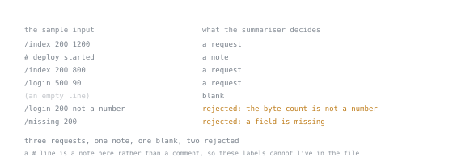

# The Project

The real-world reps in this arc are not disconnected exercises. From stage 2 onward they build one small crate, a piece at a time, and each stage leaves it in a state the next stage needs. This page says what it is and where it should be by the end of each stage, so a reader who skipped a rep knows what to catch up on and a reader starting late knows what to build first.

It is a command-line tool, deliberately, because a tool needs no framework and nothing here should turn into a lesson about somebody's web library. It is small enough that every rep fits one sitting.

## What it does

**A log summariser.** It reads records from a text stream, one per line, decides what each line is, rejects the ones it cannot parse, and prints a summary: how many requests, how many bytes per path, how many lines it refused and why.

That shape was chosen because it needs exactly what this arc teaches, in the order the arc teaches it. A line is one of several kinds, which is an enum with payloads. A field can be missing and a number can fail to parse, which is `Option` and `Result` rather than a contrived example. Counting bytes per path needs a map. Reading many files at once needs threads, and then tasks. Deciding whether a faster parser is worth writing needs a measurement. And publishing it needs a public API you can evolve.

Nothing outside the standard library is needed until stage 3 introduces dependencies, so the version you build in stage 2 has an empty `[dependencies]` section.

## Starting it

```bash
cargo new logsum
cd logsum
```

The crate name is yours; the reps refer to it as `logsum`. Everything in stage 2 goes in `src/main.rs`, and stage 3 is where that gets split up properly.

The input format is one record per line, and three kinds of line:

```text
/index 200 1200
# deploy started
/index 200 800
/login 500 90

/login 200 not-a-number
/missing 200
```

A request line is a path, a status and a byte count separated by spaces. A line starting with `#` is a note. An empty line is blank. The last two lines are deliberately broken: one has a byte count that is not a number, and one is missing a field. A summariser that silently counts those as requests is wrong, and noticing that is part of the point.



These labels have to sit beside the input rather than inside it, because a line beginning with `#` is a note in this format and not a comment: annotating the sample in place would add an eighth line and change what it tests. The counts underneath are what a correct stage 2 summariser reports for this input, and the two rejections are the part a first attempt usually gets wrong.

## Where it should be at the end of each stage

| Stage | The project should | Which lessons' reps get it there |
|---|---|---|
| 2. Data and control | Parse a line into an enum with payloads, return `Result` on a malformed line, and summarise a whole input with a map: counts per kind, bytes per path, and the number of rejected lines | 0007 to 0013 |
| 3. Errors and API shape | Be a library plus a thin binary, with an error type a caller can match on, `?` propagation throughout, module boundaries, and documentation examples that compile | stage 3 |
| 4. Traits, generics and lifetimes | Take its input from anything that yields lines rather than from one concrete type, and borrow the line rather than owning a copy of every field | stage 4 |
| 5. Sharing and threads | Summarise several files at once, combining the partial summaries, with the sharing strategy chosen rather than inherited | stage 5 |
| 6. Async | Read from sources that wait, without stalling the whole run on the slowest one | stage 6 |
| 7. Unsafe and performance | Have a measured per-line cost, and either a faster path justified by that measurement or a written note saying why the obvious optimisation was not worth it | stage 7 |
| 8. Judgment | Be published, versioned, documented, and reviewable, with a public API you could change without breaking a dependant | stage 8 |

## The rule that makes it useful

**Do not skip ahead to the design a later stage will teach.** Building the stage 2 version with a hand-rolled error enum and no traits is correct, even though stage 3 will replace the error type and stage 4 will generalise the input. Rewriting a piece once the stage that owns it arrives is the exercise; arriving at the final shape early means never meeting the problem each stage exists to solve.

The second rule follows from the first: **keep the old version**. A commit per stage, or a copy of the file, makes the diff between two stages the most useful thing you will read about your own code.

---

Stage 1's lessons predate this page and use small examples of their own rather than the project, which is deliberate: ownership is easier to see in five lines than in a program.
