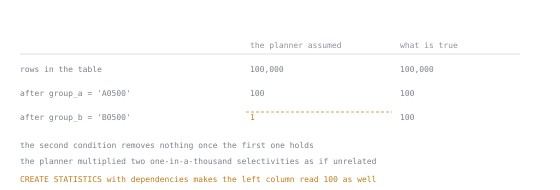

# Lesson 37. Selectivity and Statistics

**Mission link:** A query that goes from fast to slow with no code change usually still has a sensible plan for the wrong row count, and finding that means reading the statistics the planner read, not staring at the query again.
**Primary source:** [PostgreSQL, 14.2. Statistics Used by the Planner](https://www.postgresql.org/docs/current/planner-stats.html)
**Prerequisites:** [Lesson 35](0035-reading-a-plan.md), [Lesson 36](0036-what-an-index-does.md)

## Warm-up

1. ▢ Lesson 35 read a plan's `rows=` figure twice, once from a bare `EXPLAIN` and once, under `ANALYZE`, next to what actually happened, and treated a wide gap between the two as a sign that something upstream needed attention. Before a single row of the query is read, where does that first, printed-without-`ANALYZE` number come from?

<details markdown="1"><summary>Check</summary>

From `pg_stats`, not from the table. A previous `ANALYZE` sampled the table and left behind a small set of numbers about each column, and the planner does arithmetic on those stored numbers to print every `rows=` estimate, without opening a single page of the table at planning time. This lesson is about where those numbers come from and what happens when they are wrong.

</details>

## Know this

### Selectivity, and the cardinality it produces

Selectivity is the fraction of a table's rows a condition keeps; cardinality is the row count that follows from multiplying that fraction by the table's size. Neither word is in the glossary yet, so both are pinned here. Of the large fixture's 1,049,916 orders, `customer_id = 4242` keeps a handful, and `customer_id < 33334` keeps 349932, almost exactly a third. With an index on `customer_id`, `EXPLAIN (ANALYZE)` prints the planner's guess next to what happened for each:

```text
Aggregate (actual rows=1.00 loops=1)
  -> Index Only Scan using i37_customer_id on orders (cost=0.43..12.61 rows=13 width=0) (actual rows=7.00 loops=1)
        Index Cond: (customer_id = 4242)
```

```text
Finalize Aggregate (actual rows=1.00 loops=1)
  -> Gather (actual rows=3.00 loops=1)
        Workers Planned: 2
        -> Partial Aggregate (actual rows=1.00 loops=3)
              -> Parallel Index Only Scan using i37_customer_id on orders (cost=0.43..10358.80 rows=146198 width=0) (actual rows=116644.00 loops=3)
                    Index Cond: (customer_id < 33334)
```

`rows=13` is almost double the actual `rows=7.00`, a harmless miss. `rows=146198` is a per-loop figure; times three loops against `116644.00` times three, both sides land near 439000 estimated against 349932 actual. The plan's shape changed too: the tiny predicate stayed a single `Index Only Scan`, and the third-of-the-table predicate became a `Gather` over a `Parallel Index Only Scan`, because the planner's arithmetic, done before either query ran, told it roughly how much work each was.

### Where the numbers come from

`pg_stats` on `orders` held these figures after one `ANALYZE`:

```text
attname     | n_distinct  | correlation | most_common_vals | most_common_freqs
customer_id | 80112.0     | 0.96066135  | {54843}          | {0.0002}
shipped_at  | -0.3462353  | 0.06040191  |                  |
id          | -1.0        | 0.96066135  |                  |
amount      | 40224.0     | -0.02006983 | {475.20}         | {0.00023333334}
```

`n_distinct`'s sign changes its meaning: positive, as `customer_id`'s 80112, is an absolute headcount, here an underestimate of the true 100000 because `ANALYZE` samples rather than reads the table; negative, as `id`'s `-1.0`, is minus the ratio of distinct values to rows, so `-1` means one distinct value per row, right for a primary key, and `shipped_at`'s `-0.3462353` means roughly a third as many distinct timestamps as rows. `most_common_vals` is empty for `id` and `shipped_at`, and nearly so for `customer_id` and `amount`: every customer holds one to twenty orders and no value stands out, so nothing repeats often enough to be worth naming. The one entry that did surface, `customer_id = 54843` claimed at frequency `0.0002`, is a sampling artefact: its true frequency is about 0.000019, roughly ten times smaller, because the sample happened to see a few extra rows of that value. The histogram, 101 bounds from `1.01` to `500.97` for `amount`, divides its range into 100 roughly equal-frequency buckets, priced against by a range condition once `most_common_vals` does not cover it. `correlation` is `0.96`, close to `1.0`, for `id` and `customer_id`, since the generator inserted every customer's orders in order, and near zero, `-0.02`, for `amount`; it prices an index scan's cost, since rows an index visits in order sit together on disk near `1.0` and scattered near zero.

### `ANALYZE`, and the sample it takes

Those numbers are a snapshot and go stale the moment the data moves without a fresh `ANALYZE`, shown here on a table of one's own rather than the shared fixture: a million rows, `id` and `group_id` set to `id % 100000`, giving each of 100,000 groups about ten rows, so `group_id = 4242` analyses to a true count of 10 and a matching estimate. Inserting 5,000 more rows for `group_id = 4242` moves the true count to 5010, but the stale estimate still reads the pre-insert figure:

```text
-> Parallel Seq Scan on stale (cost=0.00..10667.34 rows=4 width=0) (actual rows=1670.00 loops=3)
      Filter: (group_id = 4242)
```

`rows=4` per loop, unchanged, against an actual `rows=1670.00` per loop, three loops of a true 5010 the stale statistics know nothing about. `ANALYZE` on that same table moves the estimate:

```text
-> Parallel Seq Scan on stale (cost=0.00..10667.38 rows=2233 width=0) (actual rows=1670.00 loops=3)
      Filter: (group_id = 4242)
```

`rows=2233` against the same actual `rows=1670.00` is off by less than half rather than by two orders of magnitude. Autovacuum does the same job on its own schedule, queuing an automatic analyse once more than `autovacuum_analyze_threshold` (50 here) plus `autovacuum_analyze_scale_factor` (0.1) times the row count has changed since the last one. `default_statistics_target`, 100 by default and confirmed by the 101-entry histogram above, sets the sample size and how many `most_common_vals` and histogram entries `ANALYZE` keeps per column, and it can be raised for one column alone, back on the shared fixture: `ALTER TABLE orders ALTER COLUMN customer_id SET STATISTICS 1000` then `ANALYZE orders` moved `customer_id`'s `n_distinct` from 80112 to 91251, closer to the true 100000, and its `customer_id = 4242` estimate from `rows=13` to `rows=11`, against a true 7. A wider sample on the one column that needs it is the most useful move in this lesson.

### The estimate the planner cannot get right alone

Every number so far describes one column at a time, and the planner assumes two conditions on two columns are independent, an assumption that fails when the columns move together. A scratch table of 100,000 rows, `group_a` and `group_b` both derived from the same value so one always determines the other, shows the failure cleanly:

```text
Aggregate (actual rows=1.00 loops=1)
  -> Seq Scan on pairs (cost=0.00..2137.00 rows=1 width=0) (actual rows=100.00 loops=1)
        Filter: ((group_a = 'A0500'::text) AND (group_b = 'B0500'::text))
```



The two columns agree until the second condition, and the whole error is one step. Nothing is wrong with either selectivity on its own, which is why no single-column statistic can fix this and why the repair is an object that describes the pair.

The estimate, `rows=1`, is a hundred times smaller than the actual `rows=100.00`: the planner multiplied each column's one-in-a-thousand selectivity as if unrelated, when the second condition adds nothing once the first is true. `CREATE STATISTICS i37_group_dep (dependencies, ndistinct) ON group_a, group_b FROM pairs`, followed by another `ANALYZE`, tells the planner about the dependency directly:

```text
Aggregate (actual rows=1.00 loops=1)
  -> Seq Scan on pairs (cost=0.00..2137.00 rows=100 width=0) (actual rows=100.00 loops=1)
        Filter: ((group_a = 'A0500'::text) AND (group_b = 'B0500'::text))
```

The same query now estimates `rows=100`, matching the actual count exactly. That fix only reaches equality conditions; the documentation is explicit that a `dependencies` object does nothing for a range condition or a `LIKE`, so the same misestimate returns the moment `=` becomes `BETWEEN`.

### What a wrong estimate does downstream

A wrong row count rarely stays where it started. The node that expected about 12 rows and produced 5010 feeds that number to whatever runs next, and a join or an aggregate above it sizes its strategy and working memory against the number handed to it, not reality; lesson 39 covers that choice of join strategy, and this lesson stops short of teaching it. The symptom, a slow join or a sort spilling to disk, is often two plan levels above the estimate that caused it, so the first move on a surprising plan is finding the smallest node whose estimated and actual `rows=` disagree by an order of magnitude, not the node where the time was spent.

### The limits of a sample

None of this makes an estimate exact. Raising `amount`'s target from 100 to 1000 moved the estimate for `amount BETWEEN 100 AND 102` from 5190 to 5244, against a true count of 4238, further away rather than closer, because a bigger sample is still a sample. `ANALYZE` runs before a single row of any later query is read, so every plan rests on a forecast, and the reader's job is noticing when that forecast is wrong by an order of magnitude, not chasing one a sample cannot deliver exactly.

## Practice

1. ▢ Using the `pg_stats` row for `id`, where `n_distinct` reads `-1.0`, predict what `n_distinct` would read for a boolean column storing `shipped_at IS NULL`, and say why its sign differs from `id`'s.

<details markdown="1"><summary>Check</summary>

A small positive number, `2`, since a boolean holds only two values regardless of table size. Positive is used when the distinct count stays roughly fixed as the table grows, negative when it scales with row count, which is why `id`, one distinct value per row, reads `-1` while a boolean does not.

</details>

2. ▢ Predict which keeps the smaller fraction of `orders`, `customer_id = 4242` or `customer_id < 33334`, and roughly how many rows each keeps.

<details markdown="1"><summary>Check</summary>

`customer_id = 4242` is far more selective: 7 rows against 349932, roughly five orders of magnitude apart, which is why one plan stayed a plain `Index Only Scan` and the other a `Parallel Index Only Scan` across two workers.

</details>

3. ▢ The `pairs` demonstration fixed its misestimate with `CREATE STATISTICS ... (dependencies, ndistinct)` on an equality condition. Predict what the same statistics object buys a query written as `group_a BETWEEN 'A0490' AND 'A0510' AND group_b BETWEEN 'B0490' AND 'B0510'` instead.

<details markdown="1"><summary>Hint</summary>

Functional-dependency statistics correct which kind of condition, according to the documentation linked above?

</details>

<details markdown="1"><summary>Check</summary>

Nothing. A `dependencies` object only adjusts equality-style conditions and does nothing for a range condition, so the two `BETWEEN`s get multiplied together as independent, exactly as before the fix.

</details>

4. ▢ After the bulk insert into the scratch table for `group_id = 4242`, the estimate stayed at `rows=4` per loop while the true count had already become 5010. Predict whether running the same query again, with no `ANALYZE` in between, changes that estimate.

<details markdown="1"><summary>Check</summary>

No. The estimate comes from `pg_statistic`, not the table, so the same stale `rows=4` prints every time until a manual or automatic `ANALYZE` rewrites those stored numbers.

</details>

5. ▢ This server's `autovacuum_analyze_threshold` is 50 and its `autovacuum_analyze_scale_factor` is 0.1. Predict, in round numbers, how many changed rows on the 1,049,916-row `orders` table it takes before autovacuum queues an automatic `ANALYZE`.

<details markdown="1"><summary>Hint</summary>

The threshold contributes a flat count and the scale factor a fraction of the table; both add together.

</details>

<details markdown="1"><summary>Check</summary>

About 105042: 50 plus 0.1 times 1,049,916. Below that, autovacuum leaves the statistics as they were.

</details>

6. ▢ Raising `amount`'s statistics target from 100 to 1000 moved the `amount BETWEEN 100 AND 102` estimate from 5190 to 5244, against a true count of 4238, further away rather than closer. Predict whether raising it again, to the maximum of 10000, reliably fixes that.

<details markdown="1"><summary>Check</summary>

Not reliably. A larger target enlarges the sample and can improve an estimate, as it did for `customer_id`'s `n_distinct` earlier, but the sample is still a sample, and this result shows a bigger one does not guarantee a smaller error every time. The right response to a bad estimate is checking it again, not assuming a bigger number fixes it.

</details>

## Real-world reps

- [ ] Pick a query you run often and check whether its `WHERE` clause has two conditions on columns that tend to move together; if so, that is this lesson's correlated-columns section waiting to happen to you.
- [ ] Run `EXPLAIN (ANALYZE)` on a query of your own against a table you can freely `ANALYZE`, and compare the estimated and actual row counts on its most selective node.
- [ ] Tomorrow: find one skewed column in your own schema and check whether raising its statistics target with `ALTER TABLE ... ALTER COLUMN ... SET STATISTICS` changes the plan for a query filtering on it.

## Going further

- [14.2. Statistics Used by the Planner](https://www.postgresql.org/docs/current/planner-stats.html#PLANNER-STATS): where every number here comes from
- [ANALYZE](https://www.postgresql.org/docs/current/sql-analyze.html): the command that refreshes those numbers
- [CREATE STATISTICS](https://www.postgresql.org/docs/current/sql-createstatistics.html): the object behind the correlation fix
- [Chapter 69. How the Planner Uses Statistics](https://www.postgresql.org/docs/current/planner-stats-details.html): the arithmetic behind each estimate
- [Performance](../reference/performance.md): the stage 6 reference sheet
- [Resources](../RESOURCES.md)

---

Not landing? Reread the primary source at the top, since this lesson compresses it and compression is where understanding leaks. Check the [glossary](../GLOSSARY.md) for any term that felt slippery.

If the lesson itself is unclear rather than the material, that is a defect: [open an issue](https://github.com/TokenCemetery/teach/issues).
