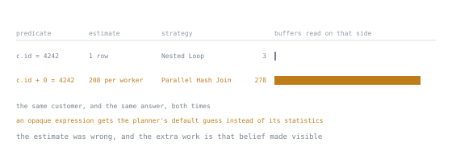

# Lesson 39. Join Strategies

**Mission link:** A join over a million rows can run as a hash, a merge or a nested loop, and the choice can differ from ten thousand buffers to three hundred thousand, so diagnosing a slow join means finding out which one ran and why.
**Primary source:** [PostgreSQL, 19.7.1 Planner Method Configuration](https://www.postgresql.org/docs/current/runtime-config-query.html#RUNTIME-CONFIG-QUERY-ENABLE)
**Prerequisites:** [Lesson 7](0007-joins-and-what-they-do.md), [Lesson 37](0037-selectivity-and-statistics.md)

## Warm-up

1. ▢ Lesson 7 called a join a cross product with a filter attached, every pair of rows checked against the join's condition. Predict which of a hash join, a merge join and a nested loop actually runs that way, comparing pairs one at a time, and what the other two do instead to reach the same filtered result.

<details markdown="1"><summary>Check</summary>

A nested loop is the literal version: for each row on one side it checks the other, row by row or through an index, the pairwise test lesson 7 described, just skipped efficiently. A hash join and a merge join both restructure an input first, a hash table or a sort by the join key, so only rows that could possibly match are compared, and that restructuring is why either can beat the loop.

</details>

## Know this

### The three strategies, each on a query that suits it

`select count(*) from orders o join customers c on c.id = o.customer_id where c.country = 'KE'` joins all `1,049,916` orders against customers filtered to one country. By default, PostgreSQL 18.6 gives a hash join:

```text
Finalize Aggregate (actual rows=1.00 loops=1)
  Buffers: shared hit=10110
  ->  Gather (actual rows=3.00 loops=1)
        Workers Planned: 2
        Workers Launched: 2
        Buffers: shared hit=10110
        ->  Partial Aggregate (actual rows=1.00 loops=3)
              Buffers: shared hit=10110
              ->  Hash Join (actual rows=27773.33 loops=3)
                    Hash Cond: (o.customer_id = c.id)
                    Buffers: shared hit=10110
                    ->  Parallel Seq Scan on orders o (actual rows=349972.00 loops=3)
                          Buffers: shared hit=7608
                    ->  Hash (actual rows=8332.00 loops=3)
                          Buckets: 16384  Batches: 1  Memory Usage: 454kB
                          Buffers: shared hit=2502
                          ->  Seq Scan on customers c (actual rows=8332.00 loops=3)
                                Filter: (country = 'KE'::text)
                                Rows Removed by Filter: 91668
                                Buffers: shared hit=2502
```

`Hash` builds an in-memory table from the smaller side, the `8332` KE customers; `Buckets: 16384 Batches: 1 Memory Usage: 454kB` says all of them fit in one pass, and `orders`, the larger side, is read once and probed against it: `Buffers: shared hit=10110` total. A hash join wants one side small enough to build once, the other read only once past it.

Turning `enable_hashjoin` and `enable_nestloop` off forces a merge join on the identical query:

```text
->  Merge Join (actual rows=27773.33 loops=3)
      Merge Cond: (o.customer_id = c.id)
      Buffers: shared hit=10120, temp read=1545 written=1549
      ->  Sort (actual rows=349940.33 loops=3)
            Sort Key: o.customer_id
            Sort Method: external merge  Disk: 4136kB
            Worker 0:  Sort Method: external merge  Disk: 4104kB
            Worker 1:  Sort Method: external merge  Disk: 4120kB
            ->  Parallel Seq Scan on orders o (actual rows=349972.00 loops=3)
      ->  Sort (actual rows=7976.67 loops=3)
            Sort Key: c.id
            Sort Method: quicksort  Memory: 385kB
            Worker 0:  Sort Method: quicksort  Memory: 385kB
            Worker 1:  Sort Method: quicksort  Memory: 385kB
            ->  Seq Scan on customers c (actual rows=8332.00 loops=3)
                  Filter: (country = 'KE'::text)
```

A merge join wants both sides already sorted by the join key so it can walk them together in one pass; neither was, so each `Sort` pays that cost, per worker too, and the large side spills to `Sort Method: external merge Disk: 4136kB`. The buffer count says which is worse: `10110` for the hash join against `10120` shared hits plus `1545` read and `1549` written to temporary files, a disk sort the hash never needed.

A nested loop needs a different query to appear honestly, one where a side really is tiny, such as filtering the join to a single customer:

```text
Finalize Aggregate (actual rows=1.00 loops=1)
  Buffers: shared hit=7611
  ->  Gather (actual rows=3.00 loops=1)
        Workers Planned: 2
        Workers Launched: 2
        ->  Partial Aggregate (actual rows=1.00 loops=3)
              ->  Nested Loop (actual rows=2.33 loops=3)
                    ->  Parallel Seq Scan on orders o (actual rows=2.33 loops=3)
                          Filter: (customer_id = 4242)
                          Rows Removed by Filter: 349970
                          Buffers: shared hit=7608
                    ->  Materialize (actual rows=1.00 loops=7)
                          Buffers: shared hit=3
                          ->  Index Only Scan using customers_pkey on customers c (actual rows=1.00 loops=1)
                                Index Cond: (id = 4242)
                                Heap Fetches: 0
                                Buffers: shared hit=3
```

`Materialize` wraps the one-row inner side so it is read once and replayed for every outer row instead of re-probed, with no up-front build or sort, which is why a nested loop wins only when one side really is this small.

### How the planner chooses, and how it gets fooled

Lesson 37 traced a `rows=` estimate back to `pg_stats`; the planner reads that same estimate for each side of a join and prices every strategy against it. The nested loop above is a case where the estimate is right: `customers.id` is the primary key, so the bare plan for `id = 4242` reads `Index Only Scan using customers_pkey on customers c (cost=0.29..4.31 rows=1 width=8)`, matching `actual rows=1.00` exactly, and a confidently one-row side is what a nested loop is built for.

Hide that same fact behind an expression the planner cannot match against its statistics, `where c.id + 0 = 4242`, and the choice goes with it:

```text
Finalize Aggregate (actual rows=1.00 loops=1)
  Buffers: shared hit=7886
  ->  Gather (actual rows=3.00 loops=1)
        ->  Partial Aggregate (actual rows=1.00 loops=3)
              ->  Parallel Hash Join (actual rows=2.33 loops=3)
                    Hash Cond: (o.customer_id = c.id)
                    ->  Parallel Seq Scan on orders o (actual rows=349972.00 loops=3)
                          Buffers: shared hit=7608
                    ->  Parallel Hash (actual rows=0.33 loops=3)
                          Buckets: 1024  Batches: 1  Memory Usage: 40kB
                          Buffers: shared hit=278
                          ->  Parallel Index Only Scan using customers_pkey on customers c (actual rows=0.33 loops=3)
                                Filter: ((id + 0) = 4242)
                                Rows Removed by Filter: 33333
                                Buffers: shared hit=278
```



Read the row left to right and the causation is in the order: the estimate is what changed first, the strategy followed from it, and the bar is what followed from the strategy. Nothing about the data, the answer, or the index moved between the two rows.

The bare plan for that scan reads `rows=208` per worker, over `600` times the true count of one: an opaque expression gets the planner's default guess instead of a lookup in its statistics, the same failure lesson 37 named for a correlated pair of columns. Believing the small side is no longer tiny, the planner drops the loop for a `Parallel Hash Join`; the `278` buffers that side alone now takes, against the `3` the correct plan touched for the same customer, is that belief showing up as work. `enable_hashjoin`, `enable_mergejoin` and `enable_nestloop` exist for exactly this kind of investigation, not as a fix to leave set.

### `work_mem`, and the spill that reads like a signature

`work_mem`, default `4MB` here, bounds how much memory one hash or sort node may build before writing to disk, applied per node rather than per statement, proved rather than stated below. Lowering it to `64kB` for the KE hash join above turns its one-batch `Hash` into this:

```text
->  Hash (actual rows=8332.00 loops=3)
      Buckets: 4096  Batches: 4  Memory Usage: 114kB
      Buffers: shared hit=2502, temp written=60
      ->  Seq Scan on customers c (actual rows=8332.00 loops=3)
            Filter: (country = 'KE'::text)
```

with the join's own buffers gaining `temp read=2764 written=2764`. A batch is one full pass of the hash table and the probe input; more than one means the build side did not fit, so it was partitioned to temporary files and read back once per batch, exactly what those `temp` figures count. That combination, more than one batch plus nonzero `temp read`/`written`, is the spill's signature on any machine. The two honest fixes are more memory, raising `work_mem` for the session, or fewer rows: filtering to `country = 'NL'`, one customer rather than `8332`, keeps `Batches: 1` and `Memory Usage: 9kB` at the same `64kB`.

That binding is per node, easy to miss with only one hash to watch. A three-table join, `orders` to `customers` to `countries` filtered to one region, has two, and at the same `64kB` one spills while the other does not: the customers-side `Hash`, from `8332` rows, reads `Buckets: 4096 Batches: 8 Memory Usage: 73kB`; the countries-side `Hash`, from one row, reads `Buckets: 1024 Batches: 1 Memory Usage: 9kB`. One session, two budgets spent independently.

### Parallel plans, named

Every plan above has printed a `Gather` without explaining it. Its sub-plan runs once per launched worker plus once in the leader, each contributing a partial result `Gather` combines into one stream. `Workers Planned` is what the plan asked for, capped at `max_parallel_workers_per_gather`, `2` here; `Workers Launched` is what it got, differing when the shared pool of background workers has fewer to hand over. Every `Gather` above launched exactly what it planned, so seeing them differ needs starving that pool on purpose: with `max_parallel_workers` lowered to `1`, a parallel scan over `amount > 400` plans for two workers and gets one:

```text
Finalize Aggregate (actual rows=1.00 loops=1)
  ->  Gather (actual rows=2.00 loops=1)
        Workers Planned: 2
        Workers Launched: 1
        Buffers: shared hit=7608
        ->  Partial Aggregate (actual rows=1.00 loops=2)
              ->  Parallel Seq Scan on orders (actual rows=106032.00 loops=2)
                    Filter: (amount > '400'::numeric)
                    Rows Removed by Filter: 418926
```

`Workers Launched: 1` against `Workers Planned: 2` is no sign of anything broken; the count returned is still right, with the leader and one worker sharing what the plan expected two to share. The per-worker lines in the merge join above, `Worker 0` and `Worker 1` each with their own `Sort Method`, are the same idea one level down: a skewed join can leave one worker doing far more than another.

### Join order, briefly

The planner also chooses which table meets which first, searching every order a limit allows and pricing each, the same principle as choosing between strategies. `join_collapse_limit`, `8` here, bounds how many `FROM` items an explicit `JOIN` chain may still be reordered among before the search takes them as written; `from_collapse_limit`, also `8`, does the same for a folded subquery. Below the limit the search tries every order; above it, the planner switches to a cheaper heuristic instead. Written as `orders JOIN customers JOIN countries`, filtered to one region, the printed plan reorders it:

```text
Hash Join (actual rows=27773.33 loops=3)
  Hash Cond: (o.customer_id = c.id)
  ->  Parallel Seq Scan on orders o (actual rows=349972.00 loops=3)
  ->  Hash (actual rows=8332.00 loops=3)
        ->  Hash Join (actual rows=8332.00 loops=3)
              Hash Cond: (c.country = n.code)
              ->  Seq Scan on customers c (actual rows=100000.00 loops=3)
              ->  Hash (actual rows=1.00 loops=3)
                    ->  Seq Scan on countries n (actual rows=1.00 loops=3)
                          Filter: (region = 'Africa'::text)
```

`countries`, filtered first to one row, and `customers` join at the bottom, before `orders`, the largest table and the last one named, is touched at all: the written order put `orders` first and `countries` last, and the executed order is the opposite, since pairing the two small sides first costs less than starting from the million-row table.

### When the strategy looks wrong

A join with an expensive-looking strategy is usually a join handed a wrong estimate, lesson 37's material: check the estimated `rows=` on each side against what `EXPLAIN (ANALYZE)` returned, since the section above showed one wrong estimate flips a nested loop into a hash join with the data unchanged. Only once the estimate is confirmed right and the strategy still looks wrong is it worth reshaping the query: an index from lesson 38, a narrower filter, fewer columns read. Leaving an `enable_*` switch off past the investigation is not that reshaping: it removes a whole class of plan from every query on the connection, and a plan that looks better with one disabled may only look that way because its real best option was removed.

## Practice

1. ▢ Predict whether forcing a nested loop onto the KE join, by turning `enable_hashjoin` and `enable_mergejoin` off, costs more or fewer buffers than the default hash join, then check.

<details markdown="1"><summary>Check</summary>

Far more: `313058` against the hash join's `10110`, about thirty times as many, since the forced loop probes `customers` once per matching order instead of building one hash table. The count returned is the same either way, only the cost differs.

</details>

2. ▢ The KE hash join's `Hash` node reads `Buckets: 16384 Batches: 1 Memory Usage: 454kB` at the default `work_mem` of `4MB`. Predict those three figures at `work_mem = '16MB'`, then check.

<details markdown="1"><summary>Hint</summary>

`Batches` only rises above `1` when the build side does not fit; had it already fit?

</details>

<details markdown="1"><summary>Check</summary>

Unchanged: the same `Buckets: 16384 Batches: 1 Memory Usage: 454kB`, since the hash already fit inside `4MB`, so extra room it does not need changes nothing.

</details>

3. ▢ At `work_mem = '64kB'`, the KE hash join spills to four batches. Predict the same setting's effect on a hash join filtered to `country = 'NL'`, one customer rather than `8332`, then check.

<details markdown="1"><summary>Check</summary>

No spill: `Buckets: 1024 Batches: 1 Memory Usage: 9kB`. Fewer rows to hash is the other honest fix, and one row never needed the memory a spill signals lacking.

</details>

4. ▢ `max_parallel_workers` is lowered to `0` rather than `1`, on the same `amount > 400` query. Predict `Workers Launched`, and whether the count returned is still right.

<details markdown="1"><summary>Hint</summary>

`Gather` still has a leader process even when no background worker is available.

</details>

<details markdown="1"><summary>Check</summary>

`Workers Launched: 0` against `Workers Planned: 2`, and the count is exactly right, since the leader ran the whole sub-plan itself with no worker to share it.

</details>

5. ▢ `join_collapse_limit` is set to `1`, on the three-table query from the join order section. Predict whether the printed order still reorders `countries` ahead of `orders`, then check.

<details markdown="1"><summary>Check</summary>

No: at `1` the plan follows the written order, joining `orders` to `customers` first and `countries` last, the reordering switched off with the search that produced it.

</details>

6. ▢ The good-estimate and bad-estimate plans for `customers.id = 4242` choose different strategies. Predict whether either can return a different count of matching rows because of that choice.

<details markdown="1"><summary>Check</summary>

No. Both return exactly one matching customer; the estimate only prices strategies against each other, never decides which rows qualify, the same rule an index carries in the glossary.

</details>

## Real-world reps

- [ ] Find a join in your own workload and name which of the three strategies its plan uses.
- [ ] Run `EXPLAIN (ANALYZE)` on a join of your own, once as it is and once with the other two strategies switched off via `enable_*`, compare buffer counts, then reset every setting touched.
- [ ] Tomorrow: find a join or filter column wrapped in an expression, and check whether removing the wrapper changes the planner's row estimate the way `id + 0` did here.

## Going further

- [19.7.1. Planner Method Configuration](https://www.postgresql.org/docs/current/runtime-config-query.html#RUNTIME-CONFIG-QUERY-ENABLE): the `enable_*` switches used to force each strategy
- [14.3. Controlling the Planner with Explicit JOIN Clauses](https://www.postgresql.org/docs/current/explicit-joins.html): `join_collapse_limit` and `from_collapse_limit`
- [19.4.1. Memory](https://www.postgresql.org/docs/current/runtime-config-resource.html#RUNTIME-CONFIG-RESOURCE-MEMORY): `work_mem` and its neighbours
- [15.3. Parallel Plans](https://www.postgresql.org/docs/current/parallel-plans.html): `Gather`, `Workers Planned` and `Workers Launched`
- [Performance](../reference/performance.md): the stage 6 reference sheet
- [Resources](../RESOURCES.md)

---

Not landing? Reread the primary source at the top, since this lesson compresses it and compression is where understanding leaks. Check the [glossary](../GLOSSARY.md) for any term that felt slippery.

If the lesson itself is unclear rather than the material, that is a defect: [open an issue](https://github.com/TokenCemetery/teach/issues).
