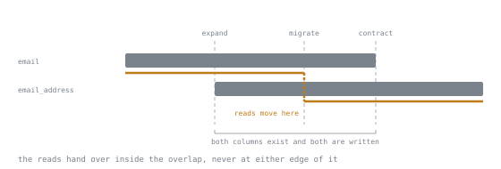

# Lesson 42. Migrations Without Downtime

**Mission link:** A senior engineer is who a team calls when a routine schema change has taken the site down, and the answer is almost never that the change was slow, it is that it queued behind something else, and everything queued behind it.
**Primary source:** [PostgreSQL, ALTER TABLE](https://www.postgresql.org/docs/current/sql-altertable.html)
**Prerequisites:** [Lesson 32](0032-locks.md), [Lesson 38](0038-choosing-an-index.md)

## Warm-up

1. ▢ Lesson 32 showed that a wait for a lock is unbounded by default, and `ALTER TABLE` takes the strongest lock a table can hold. If an `ALTER TABLE` statement is waiting behind an older transaction that has not finished, predict what happens to an ordinary `SELECT` that arrives on the same table after the `ALTER TABLE` is already waiting.

<details markdown="1"><summary>Check</summary>

It waits too, behind the `ALTER TABLE` rather than behind the older transaction. Since the original wait had no deadline, the `SELECT` now has none either, so one long transaction plus one schema change stops every later read until the first transaction lets go.

</details>

## Know this

### The lock queue, which is the whole subject

A migration is rarely slow to run; what it does is take a lock that every other statement on that table needs too, and a reader reproduces the following with three client sessions open at once. A opens a transaction and reads a row, keeping the transaction open. B then runs an ordinary `ALTER TABLE ... ADD COLUMN`. C then runs an ordinary `SELECT` on the same table.

```text
A: begin;                                              -- ok
A: select * from accounts where id = 1;                -- id=1, note='hello'
B: alter table accounts add column extra text;         -- blocking, waits on A's open transaction
C: select * from accounts where id = 1;                -- blocking, waits on B, not on A
A: commit;                                              -- ok, releases A's lock
                                                          -- B now completes, then C completes
```

C is waiting on B, not on A, so C's wait is the sum of however long A takes to finish plus however long B takes once it gets the lock. The `ALTER TABLE` here was `ADD COLUMN`, about as cheap a schema change as exists, and it still stopped every read on the table for as long as A's transaction stayed open. The migration was never slow. The queue behind it was the outage.

### Making that safe: fail fast instead of queueing

The fix is not a faster migration, it is refusing to let the migration queue at all. Setting `lock_timeout` before the DDL statement tells the session to give up rather than wait indefinitely for the lock:

```text
A: begin;                                                -- ok
A: select * from accounts where id = 1;                  -- id=1, note='hello'
B: set lock_timeout = '2s';                               -- ok
B: alter table accounts add column extra2 text;           -- ERROR: canceling statement due to lock timeout, SQLSTATE 55P03
A: commit;                                                 -- ok
```

B fails with `55P03` after two seconds instead of sitting in the queue, and because B never acquired its lock, nothing else ever queued behind it. The retry is simple: run the migration again, later, with the same `lock_timeout` set. If it keeps failing at every attempt, the thing to fix is not the migration but whatever transaction keeps holding a lock on that table too long, found the way lesson 32 already showed.

### Which statements rewrite the table

A lock held for a moment and a lock held while the whole table is copied are different problems wearing the same statement. `pg_relation_filenode` changes when a table is rewritten and stays the same when it is not, and running each of the following against its own table settled the question:

| Statement | Rewrite? |
|---|---|
| `ADD COLUMN note text`, nullable | No |
| `ADD COLUMN flag boolean NOT NULL DEFAULT false`, constant default | No |
| `ADD COLUMN stamp timestamptz NOT NULL DEFAULT clock_timestamp()`, volatile default | Yes |
| `ALTER COLUMN ... TYPE bigint`, from `int` | Yes |
| `ALTER COLUMN ... TYPE varchar(60)`, from `text` | Yes |
| `ALTER COLUMN ... TYPE varchar(80)`, from `varchar(60)` | No |
| `ALTER COLUMN ... TYPE text`, from `varchar` | No |
| `ALTER COLUMN ... TYPE numeric`, from `bigint` | Yes |

A nullable column and a constant default both only add metadata, which is why neither moved. Release 11 is the reason the constant default is on that list at all; its release notes describe the change plainly: "Allow `ALTER TABLE` to add a column with a non-null default without doing a table rewrite... This is enabled when the default value is a constant." A volatile default has to be computed once per existing row, which is a rewrite by another name. Widening a `varchar` or converting one to `text` only relaxes a length check stored separately from the data, so neither moved, while every genuine type change did, because the bytes on disk for an `int`, a `bigint` and a `numeric` differ. A rewrite means the whole table is copied while the statement still holds its lock, so the rewrite is the risk to avoid, not the `ALTER TABLE` itself.

### `CREATE INDEX CONCURRENTLY`, and the trap every migration tool hits

An index built the ordinary way locks the table against writes for the whole build. `CREATE INDEX CONCURRENTLY` does not: it scans the table twice and waits out any transaction that could still touch it, but writers are never blocked, and a completed one reports `indisvalid` and `indisready` both true in `pg_index`. `DROP INDEX CONCURRENTLY` exists for the same reason, to remove an index without the lock a plain `DROP INDEX` would take. The trap: `CREATE INDEX CONCURRENTLY` refuses to run inside a transaction block, failing immediately with `CREATE INDEX CONCURRENTLY cannot run inside a transaction block`, `SQLSTATE 25001`. That is the single most common migration-tool problem there is, because most frameworks wrap every migration in a transaction by default, and the one statement built to avoid blocking writes cannot tolerate that wrapper. Building a `UNIQUE` index concurrently on a column that already holds a duplicate value shows what a failed build leaves behind: both scans run, the duplicate surfaces only at the end as a uniqueness violation, `SQLSTATE 23505`, and the index remains in `pg_index` with `indisvalid` and `indisready` both false, still occupying space and still maintained on every write until it is dropped.

### Expand, migrate, contract

The rest of this stage assumes a shape for changing what a column means without a moment where the old and the new both have to be right at once: add the new thing, write to both, backfill, read from the new, remove the old, each a separate deploy with the application running old and new code together in between. Renaming a column from `email` to `email_address` is small enough to see the whole shape:

1. Deploy 1, expand: `ALTER TABLE accounts ADD COLUMN email_address text;`, nullable, no rewrite. The same deploy changes the application to write both columns on every insert and update, so code from before and after the deploy can run side by side.
2. A one-off backfill, once the new column exists: `UPDATE accounts SET email_address = email WHERE email_address IS NULL;`. Not itself a deploy; doing it safely on a live table is the next lesson's subject.
3. Deploy 2, migrate: the application switches its reads to `email_address`. Both columns still exist and are both written, so code from either deploy still gets a correct answer.
4. Deploy 3, contract: `ALTER TABLE accounts DROP COLUMN email;`, once nothing reads or writes it.



The four steps are what you type; the overlap is what they are for. Notice where the read line steps down: not at either edge of the overlap but in the middle of it, with room on both sides. That margin is the whole safety property, and it is why the expand deploy has to write both columns rather than merely create the second one.

What the pattern buys is that no single step ever depends on both the old and the new schema being correct at once: at every step exactly one of "the old column matters" or "the new column matters" is true, and the overlap deploy exists only so that whichever version of the application code happens to be running gets a correct answer.

### What a reviewer should ask

A migration earns at least four questions before its SQL matters at all: what lock does it take, does it rewrite the table, how long could that lock be held before traffic notices, and what is the rollback if it fails partway through. Turning those into a repeatable review is lesson 45's job, and it adds two more that this lesson has no vocabulary for yet; here they are only the questions this lesson gives you the means to answer.

## Practice

1. ▢ Predict which of these two changes to an `active boolean` column rewrites the table: `ADD COLUMN active boolean NOT NULL DEFAULT true`, or `ALTER COLUMN active TYPE integer`.

<details markdown="1"><summary>Check</summary>

The type change rewrites; the boolean addition does not. A constant default only adds metadata since release 11, while converting a `boolean` to an `integer` changes every row's on-disk representation.

</details>

2. ▢ Session A holds an open transaction that has already read from table `t`. Session B starts `CREATE INDEX CONCURRENTLY` on `t`. Predict whether an `INSERT` into `t` from a third session blocks while B's build is running.

<details markdown="1"><summary>Hint</summary>

The whole point of `CONCURRENTLY` is what it does not lock; ask what an ordinary `CREATE INDEX` would have blocked that this one does not.

</details>

<details markdown="1"><summary>Check</summary>

No. `CREATE INDEX CONCURRENTLY` is built so writers are never locked out, at the cost of two table scans and a longer build than the ordinary form.

</details>

3. ▢ A migration framework wraps every migration in a transaction by default, and one migration in the queue is a `CREATE INDEX CONCURRENTLY`. Predict the SQLSTATE it fails with.

<details markdown="1"><summary>Check</summary>

The error is `25001`, because `CREATE INDEX CONCURRENTLY` refuses to run inside a transaction block, so the framework's own wrapper is what breaks it, not anything wrong with the index.

</details>

4. ▢ A migration sets `lock_timeout` and still fails every time it runs, at every hour it is tried. Predict what to fix.

<details markdown="1"><summary>Hint</summary>

`lock_timeout` makes the migration fail fast rather than queue; it does not make the lock available any sooner.

</details>

<details markdown="1"><summary>Check</summary>

The long-running transaction holding the lock, not the migration. A timeout firing on every attempt, regardless of time of day, points at something holding the lock continuously rather than at ordinary passing traffic.

</details>

5. ▢ A deploy adds a new column and, in the same deploy, starts reading exclusively from it while the old column is dropped. Say in one sentence what breaks and why the expand, migrate and contract steps are usually kept separate.

<details markdown="1"><summary>Check</summary>

Any server still running the previous code, which still reads or writes the old column, now fails, because a deploy is never instantaneous across every running instance, which is exactly why each step is its own deploy with both versions of the code able to run at once.

</details>

6. ▢ A migration under review adds a `NOT NULL` column with `DEFAULT clock_timestamp()`. Say what you would ask the author, in one sentence.

<details markdown="1"><summary>Check</summary>

Whether they have checked that this rewrites the table, since a volatile default cannot use the constant-default optimisation, and how long that rewrite is expected to hold the table's lock at its current size.

</details>

## Real-world reps

- [ ] Find a schema change your team has run in the last few months and work out which lock it took and whether it rewrote the table.
- [ ] Before your next migration against a table with real traffic, set `lock_timeout` first and confirm it fails fast rather than queues, by holding a transaction open against the same table while it runs.
- [ ] Tomorrow: take one migration sitting in your backlog and decide whether it needs the expand, migrate, contract treatment or is safe to run as a single step, and say why.

## Going further

- [ALTER TABLE](https://www.postgresql.org/docs/current/sql-altertable.html): the full set of subcommands and which ones rewrite
- [CREATE INDEX](https://www.postgresql.org/docs/current/sql-createindex.html): the `CONCURRENTLY` option and its restrictions
- [E.23. Release 11](https://www.postgresql.org/docs/11/release-11.html): the constant-default rewrite optimisation this lesson relies on
- [Strong Migrations](https://github.com/ankane/strong_migrations): a maintained catalogue of unsafe migrations across several engines, a Ruby library's documentation rather than a standard
- [Operating](../reference/operating.md): the stage 7 reference sheet
- [Resources](../RESOURCES.md)

---

Not landing? Reread the primary source at the top, since this lesson compresses it and compression is where understanding leaks. Check the [glossary](../GLOSSARY.md) for any term that felt slippery.

If the lesson itself is unclear rather than the material, that is a defect: [open an issue](https://github.com/TokenCemetery/teach/issues).
